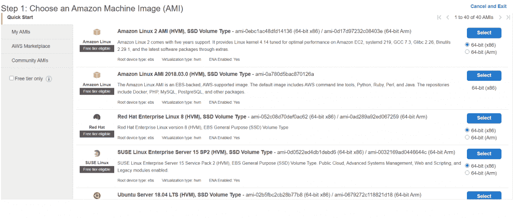
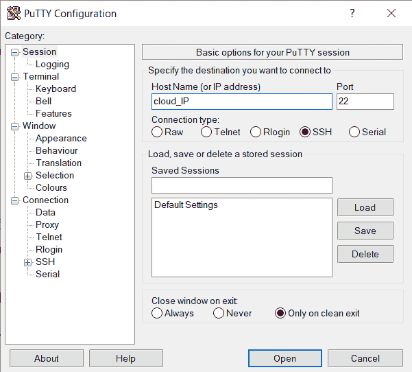
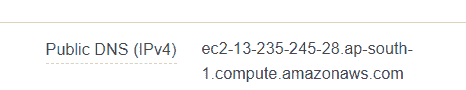
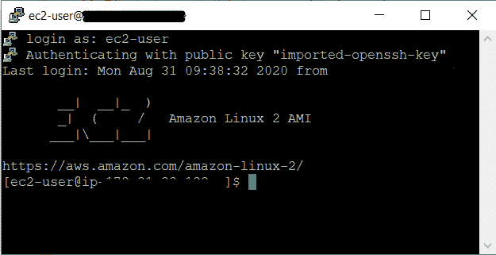
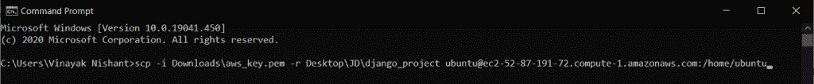
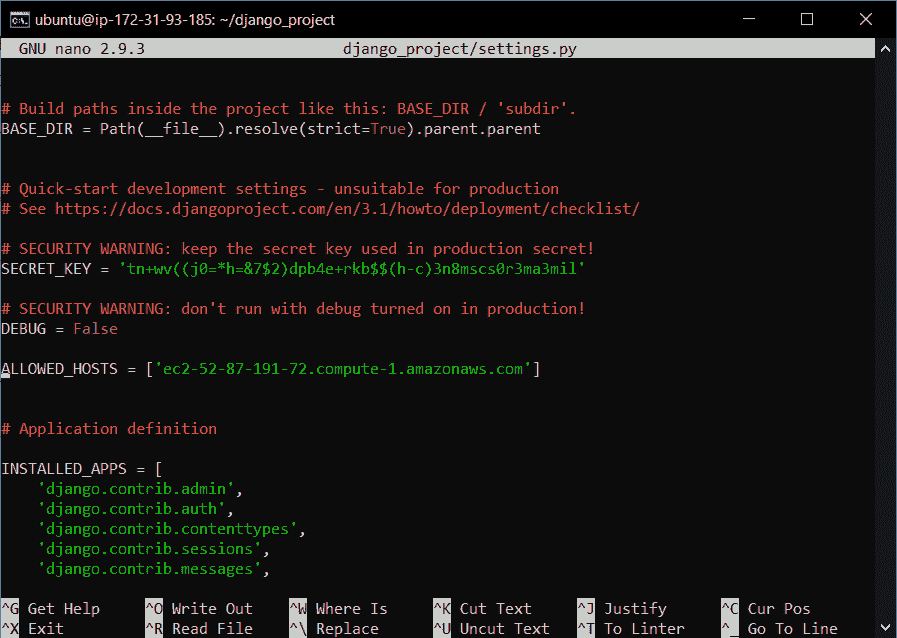
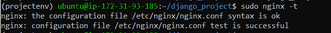
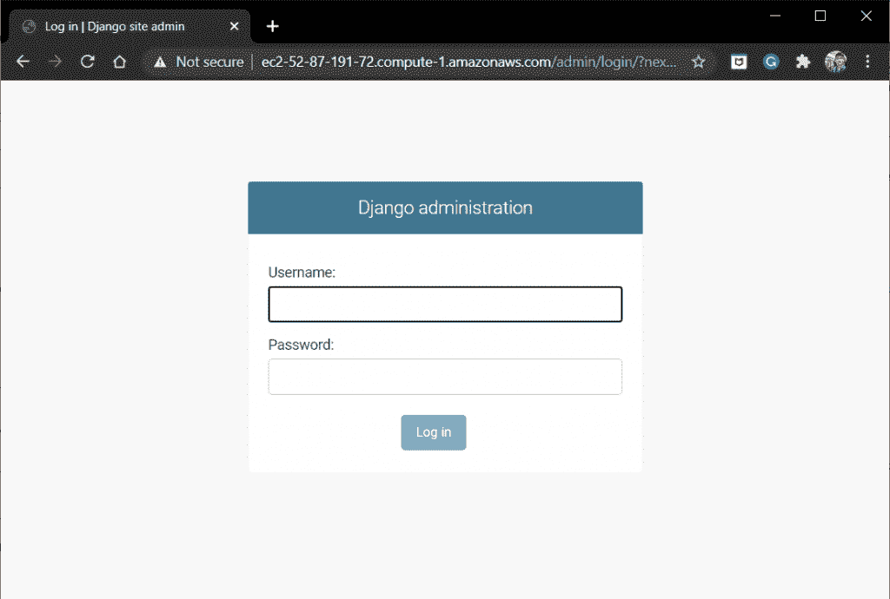
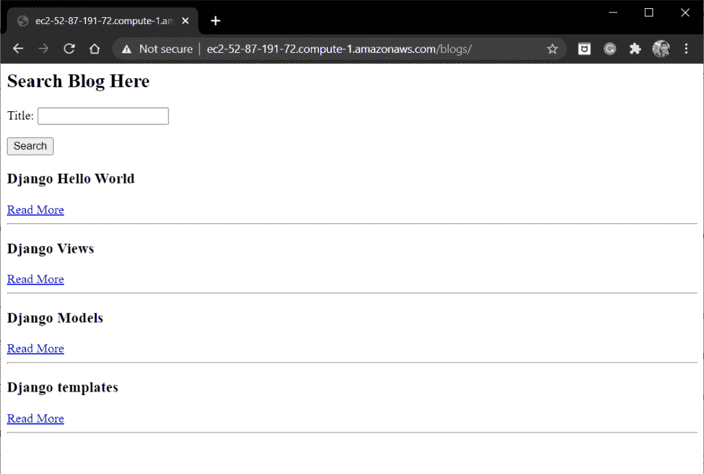

# 在 VPS 上部署 Django 项目的全面指南

> 原文：<https://www.askpython.com/django/deploying-django-project-on-vps>

在本文中，我们将学习如何使用 **Gunicorn 和 Ngnix Web 服务器软件**在虚拟专用服务器(VPS)上部署 Django

**注意:**在本文中，我将部署我们在[上一篇文章中构建的博客应用程序项目。](https://www.askpython.com/django/django-blog-app)如果你有自己的项目，你也可以使用它。

## **什么是 VPS？**

VPS 代表虚拟专用服务器，是由各种托管公司作为服务出售的虚拟机。可以把它想象成独立的笔记本电脑 CPU 硬件，但是是原始形式。

像谷歌、亚马逊等各种公司提供云服务器(GCP、AWS 等)，这些服务器基本上位于不同的位置，你可以借它们来运行你部署的应用程序。

云服务器的优势:

*   **服务器 24 小时运行**–在本地主机(您的笔记本电脑)的情况下，您需要让它 24 小时运行，这是不切实际的。
*   **可扩展性**–如果您的存储空间已满，您可以在云端扩展存储空间
*   **更安全**–硬件盗窃是不可能的
*   **可从任何电脑/笔记本电脑访问**

在本教程中，我使用的是 AWS(亚马逊网络服务-云服务器)。你可以选择任何一家 VPS 提供商。

* * *

现在，部署在 VPS 上的 [Django 应用程序](https://www.askpython.com/django/django-app-structure-project-structure)必须完成以下工作:

*   宿主静态文件
*   处理 Http 请求
*   从崩溃中恢复
*   需要时扩大规模

为了执行所有这些任务，我们需要不同的软件:

1.  一个网络服务器**(像 Nginx)**
2.  一个 WSGI 应用服务器**(像 Gunicorn)**
3.  您实际的 Web 应用程序**(使用 Django 框架、flask 框架等编写)**

这里**像 Nginx 这样的 web 服务器**处理域逻辑并接受 HTTP 请求。然后，适当的请求被发送到像 Gunicorn 一样的**应用服务器**。

Gunicorn ，将请求转换成 python 兼容的格式，以及负载平衡等其他特性。这些请求被发送到**应用代码(在 Django)** ，它执行网站的必要功能。

我们现在将分别研究它们

* * *

## **什么是 Web 服务器应用？**

网络服务器软件用于托管互联网上的网站。它充当服务器和客户机之间的中间人。这些软件应用程序访问服务器上的物理文件，并将它们显示给客户端。

Web 服务器软件的例子有 **Apache、NGINX** 等。

在本文中，我们将使用 **Nginx 服务器**，它越来越多地被互联网上的大多数 web 应用程序使用

## 什么是 Gunicorn？

Gunicorn (G-unicorn)是一个 Python WSGI ( Web 服务器网关接口)服务器，充当 Web 服务器和 Web 应用程序之间的接口。Gunicorn 与我们的应用程序的 WSGI 文件进行交互。

Gunicorn 负责 web 服务器和我们的 Django 应用程序之间发生的一切。它执行各种任务:

*   可以与多个 web 服务器交互
*   平衡网站的负载流量
*   保持我们的 Web 应用程序的多个进程运行

## 在 VPS 上部署 Django 项目

首先，我们需要从 VPS 提供商那里选择一台服务器。他们有各种运行在不同操作系统上的服务器，如下所示:



Servers

在选择了所需的之后，您将需要经历一些步骤(对于不同的提供商是不同的)来运行和连接云服务器。

一旦设置好服务器，你将获得服务器的 **IP** 地址或**公共 DNS** ，稍后需要连接到云服务器。

### 1.连接到云服务器

我们使用 **ssh** 命令连接到服务器。现在，我们将从本地计算机连接到服务器操作系统。

*   使用 **Mac** 或 **Linux** :

在 shell 中，只需运行代码:

```py
ssh [email protected]<server_IP>

```

*   使用**窗口**

对于 windows 操作系统，我们使用一款名为 **PuTTY** 的软件，你可以[直接从互联网上下载](https://www.putty.org/)。下载完成后，进入**的云 IP** ，点击**打开**。



PuTTY

我将用来访问我的服务器的**云 IP/公共 DNS** 是:



Public DNS

对于 AWS，我们也需要使用私有安全密钥。因此，根据 VPS 提供商的不同，您可能需要使用更多的命令来连接。

完成后，您将登录到云服务器操作系统。



Cloud Server

### 2.设置必要的设备

一旦服务器连接上，它就像你的新笔记本电脑。我们需要设置和安装必要的软件包。

因此，运行以下命令:

**安装升级**

```py
sudo apt-get update
sudo apt-get upgrade

```

启动服务器后，务必更新系统。

**安装 python-pip**

然后，我们需要在系统上安装 python

```py
sudo apt-get install python3-pip

```

之后，使用以下命令更新 [pip](https://www.askpython.com/python-modules/python-pip)

```py
python3 -m pip install --upgrade pip

```

**安装 Django**

现在我们也必须安装 Django。

```py
pip3 install django

```

**部署 Django 项目**

现在，在云服务器本身中，您可以使用以下代码创建和编码整个 django 项目:

```py
django-admin startproject <project_name>

```

或者，您可以将计算机中的本地 Django 文件传输到云服务器。

为了传输文件，我们使用代码

```py
scp -i <path/to/key> -r <path/to/file> [email protected]<public_DNS>:<path/to/destination>

```



Transfer Files

在像 AWS 这样的服务中，我们也需要插入一个安全密钥。如果您的 VPS 不需要密钥，那么只需在那里添加文件夹的路径。

**修改 settings.py 文件**

一旦 Django 项目被发送到服务器，我们需要在 settings.py 文件中做一些修改。因此，将目录更改到项目中，并使用以下命令打开 **settings.py 文件**:

```py
cd <project_name>
nano <project_name>/settings.py

```

现在将 **DEBUG** 设置为 False，并在 **ALLOWED_HOSTS** 中添加服务器的公共 DNS。



Settings.py

另外，为静态文件添加以下代码:

```py
STATIC_ROOT = os.path.join(BASE_DIR,'static/')

```

还要运行父项目文件夹中的命令，以收集所有静态文件

```py
python3 manage.py collectstatic

```

这是我们用来将所有静态文件收集到项目文件夹中的过程。有关静态文件的更多信息，请查看 Django 静态文件文章。

### 4.安装 Gunicorn

现在我们将把 gunicorn 安装到我们的云服务器中:

```py
pip3 install gunicorn

```

这是古尼龙目前的情况。我们现在将转移到 Nginx，看看如何将它与 Gunicorn 连接起来

### 4.安装 Nginx

使用以下命令在服务器上安装 nginx:

```py
sudo apt-get install nginx

```

现在在目录**/etc/nginx/sites-available/<下创建一个文件 project_name >** 。因此编写代码:

```py
sudo nano /etc/nginx/sites-available/<project_name>

```

**在文件中添加以下代码:**

```py
server {
    listen 80;
    server_name 0.0.0.0;

    location = /favicon.ico { access_log off; log_not_found off; }

    location /static/ {
            root /path_to_project/<project_folder_name>;
    }

    location / {
            include proxy_params;
            proxy_pass http://unix:/path_to_project/<project_name>/<project_name>.sock;
    }
}

```

保存并退出。

**启用上面创建的文件**

要启用上述文件，请运行代码:

```py
sudo ln -s /etc/nginx/sites-available/myproject /etc/nginx/sites-enabled

```

**检查配置文件**

现在，要检查上面的配置文件是否编写正确，请运行命令:

```py
sudo nginx -t

```

如果一切都是正确的，您将得到以下消息



Configuration File

## 使用 Gunicorn 和 Nginx 运行网站

首先启动 Nginx web 服务器:

```py
sudo service nginx restart

```

现在要运行我们的应用程序，我们需要用 Nginx 绑定 Gunicorn。

我们使用一个 UNIX 套接字将 Nginx 和 Gunicorn 绑定在一起。在上面的代码中，我们做了同样的事情:使用套接字绑定 Gunicorn 和 Nginx。

所以运行命令:

```py
gunicorn --daemon --workers 3 --bind unix:/home/ubuntu/<project_name>/<project_name>.sock <project_name>.wsgi

```

就是这样！！现在，通过您的本地计算机浏览器，到您的 VPS 的公共 DNS 进行检查。服务器将启动并运行。



Admin Site

由于数据库数据不在服务器上，您需要再次创建超级用户。因此，使用 **ctrl + c** 停止 Gunicorn，然后进行必要的更改。

一旦完成，使用与上面相同的命令运行 Gunicorn，您就可以开始了！！



Blog App

请看我们的 Django 博客应用程序现在运行在 **AWS** 云服务器上。

## 通过 GitHub 导入项目

您还可以使用 **GitHub** 将 Django 项目导入到云服务器上。通过这种方式，你可以在本地电脑上完成你的项目，然后简单地使用 **GitHub** 将整个项目安装到 loud 服务器上。

*   **引用:** [上传已有项目到 GitHub](https://docs.github.com/en/get-started/importing-your-projects-to-github/importing-source-code-to-github/adding-locally-hosted-code-to-github)
*   **引用:** [使用命令行从 GitHub 导入项目](https://docs.github.com/en/enterprise/2.17/user/github/importing-your-projects-to-github/importing-a-git-repository-using-the-command-line)

## **结论**

就这样，伙计们！您的 Django 应用程序成功地部署到了 VPS 上。我希望你从这篇文章中获得了足够的知识。

在下一篇文章中，我们将看到 Django 框架提供的扩展