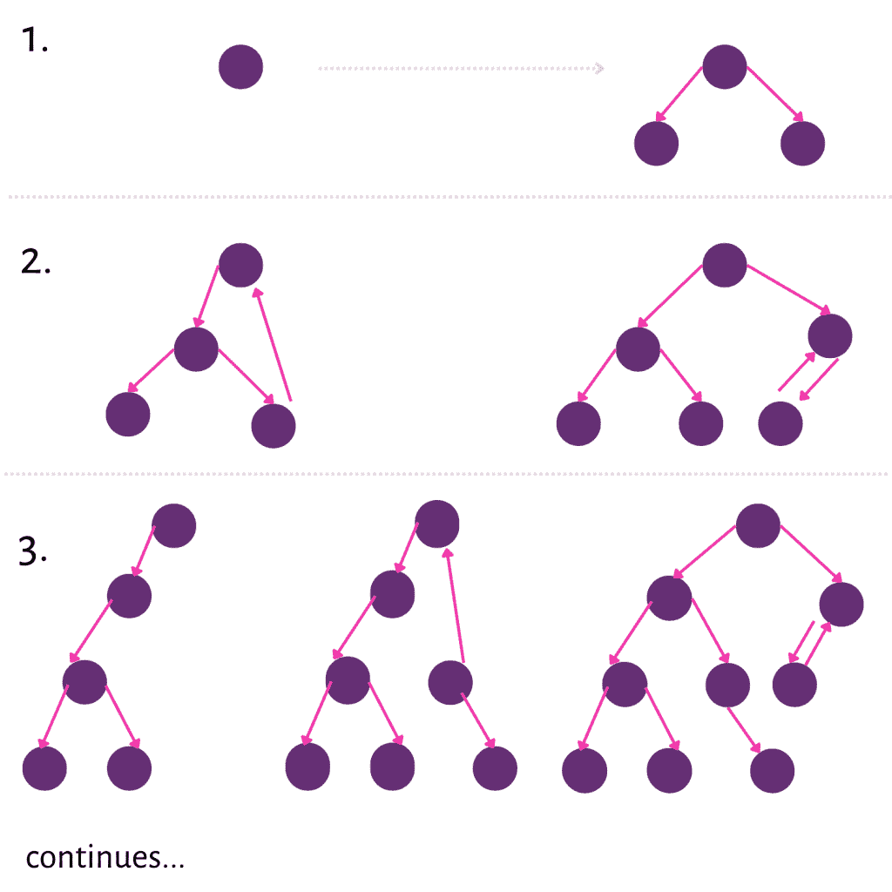

# Python 中的深度优先迭代深化(DFID)算法

> 原文：<https://www.askpython.com/python/examples/depth-first-iterative-deepening-dfid>

你好读者，这篇文章让我们了解了到底什么是深度优先迭代深化(DFID)也称为迭代深化搜索(IDS)。它的优点、应用和 python 实现。

## 什么是深度优先迭代深化搜索？

深度优先迭代深化是一种迭代搜索技术，结合了[深度优先搜索](https://www.askpython.com/python/examples/depth-first-search-algorithm) (DFS)和[广度优先搜索](https://www.askpython.com/python/examples/breadth-first-search-graph) (BFS)的优点。

当搜索图形表示中的特定节点时，广度优先搜索需要大量空间，因此增加了空间复杂度，深度优先搜索花费更多的时间，因此这种搜索策略具有更多的时间复杂度，并且深度优先搜索不总是找到最便宜的路径。为了克服深度优先搜索和宽度优先搜索的所有这些缺点，实现了深度优先迭代深化搜索。

## DFIDS 是如何工作的？

DFID 会先扩展给定深度的所有节点，然后再扩展更深的任何节点。这样就保证了找到从起点到目标状态的最短路径或最优解。DFID 算法的工作原理如图所示



Dfid

在任何给定时间，它都在执行 DFS，并且从不搜索深度超过“d”的内容。因此，它使用的空间是 O(d)。DFID 的缺点是它在到达目标深度之前执行了浪费的合成。

## rfid 算法

*   输入:开始和目标状态
*   局部变量:找到
*   方法
    *   初始化 d = 1，发现=假
    *   while (FOUND = False) do
        *   从起点到深度 d 执行 DFS。
        *   如果获得了目标状态，则发现=真，否则丢弃在深度 d 的搜索中生成的节点。
        *   d = d + 1
    *   如果 FOUND = true，则返回深度。
    *   停止

## 深度优先迭代深化在 Python 中的实现

实施图

```py
class Node:
    def __init__(self, val=None):
        self.val = val
        self.left = None
        self.right = None

def get_root():
    values = iter([3, 8, 6, 9, None, None, 11, 10, None, None,
              12, None, None, 7, None, None, 4, 5, None, None, 13, None, None])

    def tree_recur(itr):
        val = next(itr)
        if val is not None:
            node = Node(val)
            node.left = tree_recur(itr)
            node.right = tree_recur(itr)
            return node

    return tree_recur(values)

```

DFIDS 的功能

```py
def dfids():
    root = get_root()
    res = float("inf")

    def dfids_search(node, depth, limit):
        if depth <= limit and node is not None:
            val = node.val
            if val == 12:
                nonlocal res
                res = min(res, depth)
            else:
                dfids_search(node.left, depth + 1, limit)
                dfids_search(node.right, depth + 1, limit)

    for limit in range(1,5):
        dfids_search(root, 0, limit)
        if res < float("inf"):
            return res
    return -1

if __name__ == "__main__":
   print("\nShortest Depth: ", dfids())

```

## 深度优先迭代深化的应用

深度优先迭代深化搜索用于为给定的问题陈述寻找最优解或最适合的路径。当提供大的状态空间并且没有提及关于解的深度的信息时，优选使用这种搜索策略。以下是 DFIDS 的一些应用

*   人工智能和数据科学-分析网络
*   用独特的解决方案解谜(例如:数独)
*   检测图中的圈。
*   排序有向无环图
*   n 皇后问题

## 摘要

在本文中，我们深入研究了深度优先迭代深化搜索，它的重要性和它的实现。