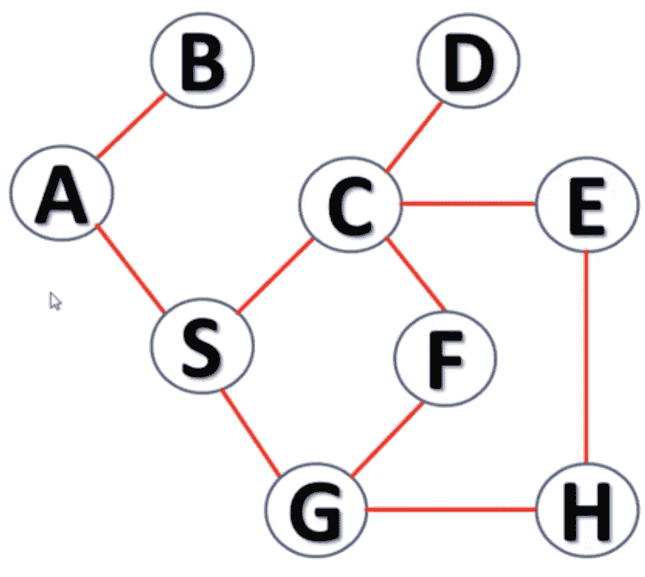

# 使用 Python 的深度优先搜索算法

> 原文：<https://www.askpython.com/python/examples/depth-first-search-algorithm>

亲爱的读者，在本文中，我将带你了解深度优先搜索(DFS)的概念。这是一个图的概念，是很多竞争性编码考试中常见的问题。因此，让我们看看如何使用 Python 创建一个 DFS 遍历。

## 什么是深度优先搜索？

深度优先搜索是一种利用[堆栈数据结构](https://www.askpython.com/python/python-stack)遍历图形和树的算法。深度优先搜索的概念来源于“深度”这个词。该树遍历到一个分支的深度，然后返回到其余的节点。

考虑一个空的“堆栈”,它包含每次迭代访问的节点。我们在这里的任务如下:

1.  从根节点开始，将其推送到堆栈上。
2.  检查树的任何相邻节点，并选择一个节点。
3.  遍历所选节点的整个分支，并将所有节点推入堆栈。
4.  在到达分支的末端(没有更多相邻节点)即第 n 个叶节点时，向后移动一步并寻找第 n-1 个节点的相邻节点。
5.  如果第 n-1 个节点有相邻的节点，则遍历这些分支并将节点推送到堆栈上。

## 深度优先搜索的概念说明

让我们看看下面的示例图:



Example Graph

是根节点。既然 A 被访问了，我们就把它推到堆栈上。

```py
Stack : A

```

我们转到分支 A-B，B 没有被访问，所以我们转到 B，把 B 推送到栈上。

```py
Stack : A B

```

现在，我们已经到达 A-B 分支的末尾，我们移动到第 n-1 个节点 A。我们现在将查看 A 的相邻节点 S。访问 S 并将其推送到堆栈上。现在，您必须遍历 S-C-D 分支，直到深度*即*到达 D，并将 S、C、D 标记为已访问。

```py
Stack: A B S C D

```

因为 D 没有其他相邻节点，所以移回 C，遍历其相邻分支 E-H-G 到深度，并将它们推送到堆栈上。

```py
Stack : A B S C D E H G

```

到达 D 时，只有一个相邻节点 ie F 没有被访问。把 F 也推到堆栈上。

```py
Stack : A B S C D E H G F

```

这个堆栈本身就是 DFS 的遍历。

## Python 中编码深度优先搜索算法

你一定知道，有很多方法来表示一个图，也就是邻接表和邻接矩阵。

所以在下面的例子中，我为图中的每个节点定义了一个邻接表。

```py
graph1 = {
    'A' : ['B','S'],
    'B' : ['A'],
    'C' : ['D','E','F','S'],
    'D' : ['C'],
    'E' : ['C','H'],
    'F' : ['C','G'],
    'G' : ['F','S'],
    'H' : ['E','G'],
    'S' : ['A','C','G']
}

```

**注意:**这个邻接表可以由用户输入，不需要硬编码。

现在，我们将定义我们的 DFS 函数，它接受 3 个参数作为输入——图(邻接表)、一个节点和一个被访问节点的列表。

如果当前节点未被访问，即不在已访问列表中，将其标记为已访问，并将其添加到已访问列表中。

移动到下一个节点，然后递归地将这个节点传递给 DFS 函数。这样，每个节点移动到一定深度，并将其打印为 DFS 输出。

```py
def dfs(graph, node, visited):
    if node not in visited:
        visited.append(node)
        for k in graph[node]:
            dfs(graph,k, visited)
    return visited

visited = dfs(graph1,'A', [])
print(visited)

```

## 完整的代码和输出

```py
graph1 = {
    'A' : ['B','S'],
    'B' : ['A'],
    'C' : ['D','E','F','S'],
    'D' : ['C'],
    'E' : ['C','H'],
    'F' : ['C','G'],
    'G' : ['F','S'],
    'H' : ['E','G'],
    'S' : ['A','C','G']
}

def dfs(graph, node, visited):
    if node not in visited:
        visited.append(node)
        for k in graph[node]:
            dfs(graph,k, visited)
    return visited

visited = dfs(graph1,'A', [])
print(visited)

```

上述代码的输出如下:

```py
['A', 'B', 'S', 'C', 'D', 'E', 'H', 'G', 'F']

```

## 结论

我希望你已经学习了这篇关于 DFS 算法的教程，并且能够理解代码和例子。一定要用你身边的纸和笔来尝试，以便更好地理解这些遍历。