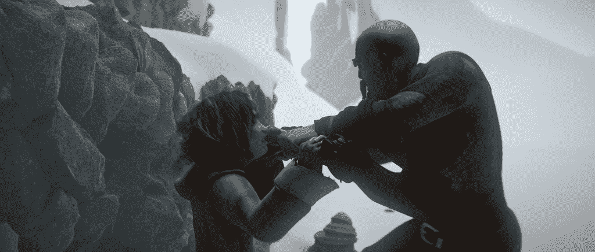
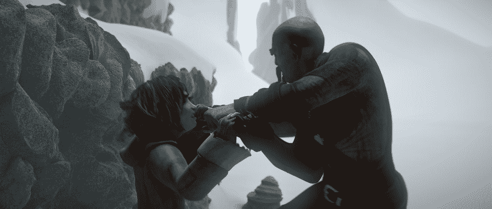
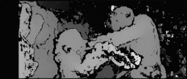

# Python 中立体图像的深度图

> 原文：<https://www.askpython.com/python/examples/depth-map-stereo-images>

在本教程中，我们将看看如何使用 OpenCV 包在 Python 中从立体图片制作深度图。但首先，让我们掌握一下立体图片和图像深度的概念。

当我们走路或跑步时，我们观察到离我们近的物体比离我们远的物体移动得快。这种潜在的效应被称为“视差”

这种现象可以用来从任何景象获得几何信息。我们可以从不同的角度，从同一个竞技场的许多照片中估计各种各样的事情，其中之一是组件的空隙。

这个距离被称为图像的深度，这些图片被称为立体图像。我们现在可以通过研究这些渲染图之间的点的跨度来确定这些区域与相机的距离。

* * *

## 导入库/模块

让我们从导入用例所需的库开始。我们将使用 [numpy 库](https://www.askpython.com/python-modules/numpy/python-numpy-arrays)、 [OpenCV](https://www.askpython.com/python/examples/filters-to-images) 和 [matplotlib](https://www.askpython.com/python-modules/matplotlib/python-matplotlib) 进行绘图。

```py
import numpy as np
import cv2
from matplotlib import pyplot as plt

```

* * *

## 加载立体图像

现在让我们加载立体图像。

```py
imgL = cv2.imread('input_images/Stereo_Image_1.jpg',0)
imgR = cv2.imread('input_images/Stereo_Image_2.jpg',0)

```



Stereo Image 1



Stereo Image 2

* * *

## 创建深度图

将使用`StereoBM_create()`方法来生成深度图。我们可以根据需要调整设置。numDisparities 接受最大为 255(可被 16 整除)的数字，但 blockSize 接受最大为 25 的值。

```py
stereo = cv2.StereoBM_create(numDisparities=96, blockSize=15)
disparity = stereo.compute(imgL,imgR)
plt.figure(figsize = (20,10))
plt.imshow(disparity,'disparity')
plt.xticks([])
plt.yticks([])

```



Depthmap Image Output

我们可以使用深度图来计算深度。这包括相机安排和他们与图片差异的相互作用。这超出了本教程的范围，因此我们不能继续下去。

这就完成了关于如何使用 OpenCV 在 Python 中从立体图片构建深度图的教程。由于您必须通过分析选择适当的地图参数，因此大部分工作仍由您来完成。

* * *

## 结论

恭喜你！您刚刚学习了如何使用 OpenCV 包在 Python 中从立体图片制作深度图。希望你喜欢它！😇

喜欢这个教程吗？无论如何，我建议你看一下下面提到的教程:

1.  [使用直方图可视化图像中的颜色–Python OpenCV](https://www.askpython.com/python/visualizing-colors-in-images)
2.  [使用 OpenCV 绘制形状——完整的操作指南](https://www.askpython.com/python/examples/draw-shapes-using-opencv)
3.  [使用网络摄像头和 Python OpenCV[简易指南]进行实时素描](https://www.askpython.com/python/examples/sketch-using-webcam)
4.  [使用 OpenCV 的 Python 信用卡读卡器](https://www.askpython.com/python/examples/opencv-credit-card-reader)

感谢您抽出时间！希望你学到了新的东西！！😄

* * *