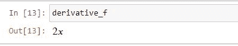
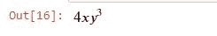

# Python 中使用 SymPy 的衍生工具

> 原文：<https://www.askpython.com/python/examples/derivatives-in-python-sympy>

Python 中如何计算导数？在本文中，我们将使用 Python SymPy 库来研究衍生品。

## 什么是衍生品？

导数是微积分的基本工具。这对于优化带有[梯度下降的损失函数非常有用](https://www.askpython.com/python/examples/gradient-boosting)在机器学习中仅仅因为导数才成为可能。

假设我们有一个依赖于 x 的函数 y = f(x ),那么这个函数的求导意味着函数值 y 随着 *x* 的变化而变化的速率。

这绝不是一篇关于衍生品基本面的文章，不可能。微积分是一种不同的野兽，需要特别注意。我想你对微积分有一定的了解。本文旨在演示如何使用 Sympy 库来区分函数。

## 使用 SymPy 在 Python 中求解导数

Python SymPy 库是为符号数学而创建的。SymPy 项目旨在成为一个全功能的计算机代数系统(CAS)，同时保持代码简单易懂。让我们看看如何使用 SymPy 在 Python 中计算导数。

### 1.使用 PIP 安装 SymPy

SymPy 的用途不仅仅是计算导数，但现在，我们将专注于导数。让我们使用 [PIP](https://www.askpython.com/python-modules/python-pip) 来安装 SymPy 模块。

```py
# pip install sympy

```

### 2.用 SymPy diff()求解微分

对于微分，SymPy 为我们提供了`diff`方法来输出函数的导数。

*   假设我们有一个函数: *f* ( *x* ) = *x*
*   函数 w.r.t x 的导数: *f'(x)* = *2x*

让我们看看如何使用 SymPy diff()函数来实现这一点。

```py
#Importing sympy

from sympy import *

# create a "symbol" called x
x = Symbol('x')

#Define function
f = x**2

#Calculating Derivative
derivative_f = f.diff(x)

derivative_f

```



声明一个符号类似于说我们的函数有一个变量' x '或者简单地说函数依赖于 x。

### 3.用 Python 求解导数

SymPy 有`lambdify`函数来计算接受符号和函数作为参数的函数的导数。让我们看一个用辛比函数计算导数的例子。

```py
from sympy import *

# create a "symbol" called x
x = Symbol('x')

#Define function
f = x**2

f1 = lambdify(x, f)
#passing x=2 to the function
f1(2)

```

输出:4

## Python SymPy 中的基本衍生规则

我们可以用某些规则来计算可微函数的导数。

**一些最常见的规则是:**

*   权力规则
*   乘积规则
*   链式法则
*   商数法则

让我们深入研究如何实际使用 sympy 来计算一般微分规则所隐含的导数。

### 1.权力规则

一般情况下:f'(x^n ) = nx^((n-1))

举个例子，我们有这样一个函数:f(x) = x⁵

它的导数将是:f '(x)= 5x^((5-1))= 5x⁴

```py
import sympy as sym

#Power rule
x = sym.Symbol('x')
f = x**5
derivative_f = f.diff(x)
derivative_f

```


Power Rule Output

### 2.乘积规则

设 u(x)和 v(x)是可微函数。那么函数 u(x)v(x)的乘积也是可微的。

```py
 (uv)′ = u′v + uv′

```

例如:f(x) = exp(x)*cos(x)

```py
import sympy as sym
#Product Rule
x = sym.Symbol('x')
f = sym.exp(x)*sym.cos(x)
derivative_f = f.diff(x)
derivative_f

```


Product Rule Output

### 3.链式法则

链式法则计算函数合成的导数。

*   比方说，我们有一个函数 h(x) = f( g(x))
*   然后根据链式法则:h′(x)= f′(g(x))g′(x)
*   例如:f(x) = cos(x**2)

这个过程也可以推广到商法则。现在很明显，只有函数发生了变化，而应用程序流程保持不变，剩下的由库自己处理。

```py
import sympy as sym
#Chain Rule
x = sym.Symbol('x')
f = sym.cos(x**2)
derivative_f = f.diff(x)
derivative_f

```


Chain Rule Output

## 使用 SymPy 的 Python 偏导数

我们上面看到的例子只有一个变量。但是我们更有可能遇到不止一个变量的函数。这种导数通常被称为偏导数。

多变量函数的偏导数是在所有其他变量保持不变的情况下对一个变量的导数。

举例: `x**4+x*y**4`

我们来部分区分一下 Python w.r.t x 中的上述导数。

```py
import sympy as sym

#Derivatives of multivariable function

x , y = sym.symbols('x y')
f = x**4+x*y**4

#Differentiating partially w.r.t x
derivative_f = f.diff(x)
derivative_f

```


Partial Differentiation w.r.t X

当变量个数大于 1 时，我们使用`symbols`方法。现在，对 Python 中的导数进行部分 w . r . t . y .微分

```py
import sympy as sym

#Derivatives of multivariable function

x , y = sym.symbols('x y')
f = x**4+x*y**4

#Differentiating partially w.r.t y
derivative_f = f.diff(y)
derivative_f

```



Partial Differentiation w.r.t Y

代码完全相似，但是现在 y 作为输入参数被传递到`diff`方法中。

我们可以选择先对函数 w . r . t . x，再对 y，进行部分求导。

```py
import sympy as sym

#Derivatives of multivariable function

x , y = sym.symbols('x y')
f = x**4+x*y**4

#Differentiating partially w.r.t x and y
derivative_f = f.diff(x,y)
derivative_f

```


Partial Differentiation w.r.t X And Y

## 摘要

这篇文章绝不是一门关于导数或如何用 Python 求解导数的课程，而是一篇关于如何利用 python SymPy 包对函数进行微分的文章。衍生品是令人敬畏的，你肯定应该得到它背后的想法，因为它们在机器学习和其他领域发挥着至关重要的作用。

## 下一步是什么？

*   [Python 中的微积分](https://www.askpython.com/python/examples/calculus-in-python)
*   [NumPy 线性代数](https://www.askpython.com/python/numpy-linear-algebraic-functions)
*   [Python 线性回归](https://www.askpython.com/python/examples/linear-regression-in-python)
*   [Python 中的 3D 绘图](https://www.askpython.com/python-modules/matplotlib/3-dimensional-plots-in-python)
*   [Python 熊猫教程](https://www.askpython.com/python-modules/pandas/python-pandas-module-tutorial)

## 资源

*   [SymPy 官方页面](https://www.sympy.org/en/index.html)
*   [衍生品维基百科页面](https://en.wikipedia.org/wiki/Derivative)