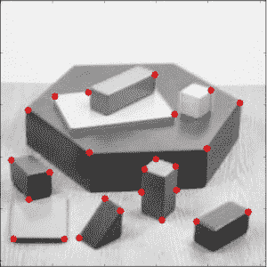
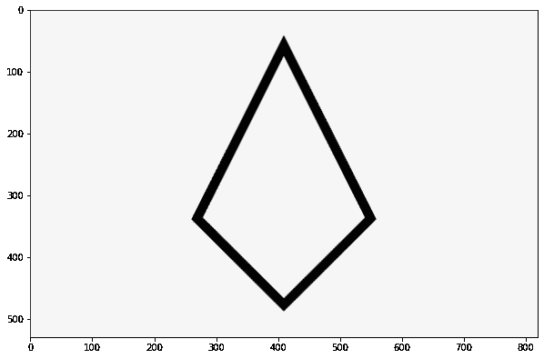
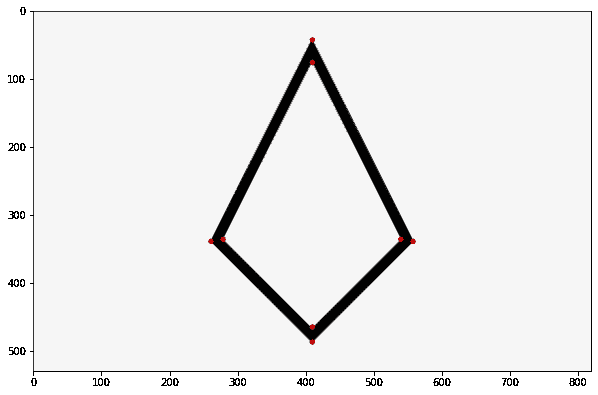
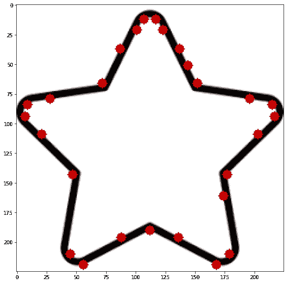

# 在 Python OpenCV 中检测形状的拐角

> 原文：<https://www.askpython.com/python-modules/detecting-corners-in-python-opencv>

嘿伙计们！在本教程中，我们将教你如何使用 Python 的 OpenCV 包来识别图像中的角点。OpenCV 中的算法可用于检测图像中的角点。

* * *

## 角点检测简介

拐角是在其局部附近具有两个主导的和相对的边缘方向的位置。换句话说，角可以定义为两条边的交点，其中一条边代表图像亮度的急剧变化。



CornerDetect Demo

角点是图像中最重要的部分，它们有时被称为兴趣点，因为它们对平移、旋转和光照不敏感。

* * *

## 用 Python 实现角点检测

### 步骤 1:导入所有必需的模块/库

```py
import numpy as np
import cv2
from matplotlib import pyplot as plt

```

### 步骤 2:加载图像并转换成灰度图像

下一步涉及使用 **cv2.imread** 函数加载图像，该函数将采用需要加载的图像的**路径。为了使处理更容易，我们将使用 **cv2.cvtColor** 函数将图像转换为**灰度图像**。**

我们将借助 matplotlib 库的 **plt.imshow** 方法来显示图像。

```py
img = cv2.imread('sample_shape1.png')
gray = cv2.cvtColor(img, cv2.COLOR_BGR2GRAY)
plt.figure(figsize=(10,10))
plt.imshow(img)
plt.show()

```



Sample Shape CornerDetection

### 步骤 3:检测图像的角点

**Shi-Tomasi 方法**被**cv2 . goodfeaturestotrack()**函数用来确定图像中 N 个最强的角。

```py
corners = cv2.goodFeaturesToTrack(gray, 27, 0.01, 10)
corners = np.int0(corners)

```

### 步骤 4:绘制角点

在每个角落，我们的目标是使用下面提到的代码片段绘制一个简单的红点。并在最后部分绘制最终的角点检测图像。

```py
for i in corners:
	x, y = i.ravel()
	cv2.circle(img, (x, y), 4, 200, -1)

plt.figure(figsize=(10,10))
plt.imshow(img)
plt.show()

```



Detect Cornes Output 1

* * *

## 样本输出 2



Detect Cornes Output 2

* * *

## 结论

恭喜你！您刚刚学习了如何使用 OpenCV 构建 python 程序来检测图像的角点。希望你喜欢它！😇

喜欢这个教程吗？无论如何，我建议你看一下下面提到的教程:

1.  [Python 中的球体特征检测](https://www.askpython.com/python/examples/orb-feature-detection)
2.  [使用 Python 进行颜色检测–初学者参考](https://www.askpython.com/python/examples/color-detection)
3.  [Python:检测轮廓](https://www.askpython.com/python/examples/python-detecting-contours)
4.  [使用 Python 进行图像边缘检测](https://www.askpython.com/python/examples/edge-detection-in-images)

感谢您抽出时间！希望你学到了新的东西！！😄

* * *