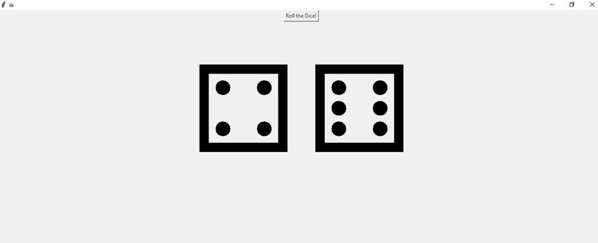

# 使用 Python 的 GUI 骰子滚动模拟

> 原文：<https://www.askpython.com/python/examples/dice-roll-simulation>

让我们使用 Python tkinter 库创建一个骰子滚动模拟代码。我们都喜欢玩像蛇和梯子这样的棋盘游戏，卢多是我们最喜欢的一个。但是如果你没有骰子或者你把它丢在什么地方了呢？对于每个兴奋地想一起玩的人来说，这是一个重要的心情放松。但是，如果您已经掌握了 python 编程技能，那该怎么办呢？

* * *

## 使用 Python 中的 Tkinter 库绘制骰子

Python 提供了各种包来设计图形用户界面。Tkinter 是用于构建 GUI 应用程序的最流行、最常见、最快速、最易于使用的 Python 包。

它提供了一个强大的面向对象的接口，并且易于使用。同样，你开发一个应用程序；您可以在任何平台上使用它，这减少了在 Windows、Mac 或 Linux 上使用应用程序所需的修改。

这个框架为 Python 用户提供了一种使用 Tk 工具包中的小部件创建 GUI 元素的简单方法。

Tk 小部件可以**用于**构建按钮、菜单、数据字段等。在 Python 应用程序中。

为了让掷骰子模拟程序成功运行并构建 GUI，您必须导入 [python tkinter 库。](https://www.askpython.com/python-modules/tkinter/tkinter-canvas)

如果尚未使用 [pip 软件包管理器](https://www.askpython.com/python-modules/python-pip)安装在您的系统上:

```py
pip install tk

```

* * *

## 用 Python 编写掷骰子模拟代码

这是程序的完整代码。我们将在下面分解各个部分，以帮助您更好地理解代码。

```py
#import the required libraries
#tkinter library to create GUI
#random library because we're randomly selecting numbers
from tkinter import *
import random

#create tkinter instance
root=Tk()
#define geometry
root.geometry("400x400")

#GUI will have two basic components
#1.Button which will trigger the rolling of dice
#2.Dice label
l1=Label(root,font=("Helvetica",260))

def roll():
    #create a number variable in which the list of all the ASCII characters of the string will be stored
    #Use backslash because unicode must have a backslash 
    dice=['\u2680','\u2681','\u2682','\u2683','\u2684','\u2685']
    #configure the label
    l1.config(text=f'{random.choice(dice)}{random.choice(dice)}')
    l1.pack()

b1=Button(root,text="Roll the Dice!",foreground='blue',command=roll)
b1.place(x=300,y=0)
b1.pack()

root.mainloop()

```

* * *

## 理解代码

```py
#import the required libraries
#tkinter library to create GUI
#random library because we're randomly selecting numbers
from tkinter import *
import random

```

最初，我们用 python 导入必要的库。为了访问[随机模块](https://www.askpython.com/python-modules/python-random-module-generate-random-numbers-sequences)，我们将`from random import *`添加到我们程序的顶部。`from Tkinter import *`将 Tkinter 中所有公开的对象导入到您当前的名称空间中。

```py
#create tkinter instance
root=Tk()
#define geometry
root.geometry("400x400")

```

*   **root = Tk( ) :** 根窗口被创建。根窗口是我们程序中的一个主要应用程序窗口。它有一个标题栏和边框。这些是由窗口管理器提供的。它必须在创建任何其他小部件之前创建。
*   **root . geometry(" 400×400 "):**`geometry`方法设置窗口的大小并将其定位在屏幕上。这两个参数是窗口的宽度和高度。

```py
def roll():
    #unicodes must have a backslash
    dice=['\u2680','\u2681','\u2682','\u2683','\u2684','\u2685']
    l1.config(text=f'{random.choice(dice)}{random.choice(dice)}')
    l1.pack()

```

我们现在将定义函数 **roll( )** 来创建骰子滚动模拟。现在我们将创建一个**骰子**变量，在其中我们将存储该字符串的所有 [ASCII 字符](https://www.askpython.com/python/built-in-methods/python-ascii-function)的列表。

然后，我们将收集标签。

**`choices()`** 方法返回一个从指定序列中随机选择元素的列表。l1.pack()是一个几何管理器，它在将部件放入父部件之前将部件组织成块。

**root.mainloop( )** :最后，我们进入主循环。事件处理从这一点开始。主循环从窗口系统接收事件，并将它们分派给应用程序小部件。当我们点击标题栏的关闭按钮时，它被终止。

## **结果**



## 结论

我们希望您喜欢今天与我们一起构建掷骰子模拟应用程序。更多类似这样有趣的教程，继续关注 AskPython。