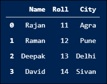
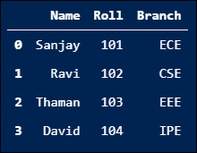
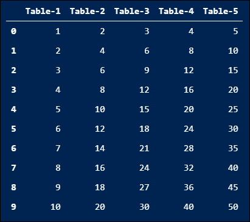
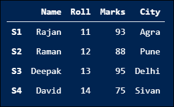

# 如何用 Python 从字典创建 DataFrame？

> 原文：<https://www.askpython.com/python-modules/pandas/dictionary-to-dataframe>

你好。在本教程中，我们将讨论从 Python 中的字典创建一个 [Pandas DataFrame](https://www.askpython.com/python-modules/pandas/dataframes-in-python) 对象的不同方法。那么，我们开始吧。

* * *

## 从列表字典创建数据框架

在 Python 中，我们可以很容易地从 Python 字典中创建 Pandas DataFrame 对象。让我们一个接一个地从列表字典中学习创建熊猫数据框架的不同方法。

### 1.使用 pd。DataFrame()函数

在这个方法中，我们将首先创建一个 Python 列表字典，并将其传递给`pd.DataFrame()`函数。最后，`pd.DataFrame()`函数返回一个 pandas DataFrame 对象，其中包含来自列表字典的数据。让我们通过 Python 代码来实现这一点。

```py
# Import pandas module
import pandas as pd 

# Create a Python dictionary of lists
data = {'Name': ['Rajan', 'Raman', 'Deepak', 'David'],
      'Roll': [11, 12, 13, 14],
      'City': ['Agra', 'Pune', 'Delhi', 'Sivan']}

# Create a pandas DataFrame dictionary of lists
# using pd.DataFrame() function
df = pd.DataFrame(data)
print(df)

```

**输出:**



### 2.使用 DataFrame.from_dict()函数

像前面的方法一样，这里我们也将首先创建一个列表的 [Python 字典](https://www.askpython.com/python/dictionary/python-dictionary-dict-tutorial)，但是将它传递给`DataFrame.from_dict()`函数。最后，`DataFrame.from_dict()`函数返回一个 Pandas DataFrame 对象，其中包含来自列表字典的数据。让我们看看如何通过 Python 代码实现这一点。

```py
# Import pandas module
import pandas as pd 

# Create a Python dictionary of lists
data = {'Name': ['Rajan', 'Raman', 'Deepak', 'David'],
      'Roll': [11, 12, 13, 14],
      'Marks': [93, 88, 95, 75],
      'City': ['Agra', 'Pune', 'Delhi', 'Sivan']}

# Create a DataFrame from dictionary of lists
# using from_dict() function
df = pd.DataFrame.from_dict(data)
print(df)

```

**输出:**


## 从字典列表创建一个数据框架

在 Python 中，我们还可以从字典列表中创建一个熊猫 DataFrame 对象。在这个方法中，我们首先创建一个 Python 字典列表，并将其传递给`pd.DataFrame()`函数。然后，`pd.DataFrame()`函数返回一个 Pandas DataFrame 对象，其中包含字典列表中的数据。让我们看看如何通过 Python 代码从字典列表创建一个 DataFrame。

```py
# Import pandas module
import pandas as pd 

# Create a Python list of dictionaries
data = [{'Name': "Sanjay", 'Roll': 101, 'Branch': 'ECE'},
        {'Name': "Ravi", 'Roll': 102, 'Branch': 'CSE'},
        {'Name': "Thaman", 'Roll': 103, 'Branch': 'EEE'},
        {'Name': "David", 'Roll': 104, 'Branch': 'IPE'},]

# Create a DataFrame from list of dictionaries
# using pd.DataFrame() function
df = pd.DataFrame(data)
print(df)

```

**输出:**



## 根据 Python 范围字典创建数据框架

在 Python 中，我们甚至可以从 Python 范围的字典中创建 Pandas DataFrame 对象。在这个方法中，我们首先使用 Python 中的`range()`函数创建一个范围字典，并将其传递给`pd.DataFrame()`函数。然后`pd.DataFrame()`函数返回一个熊猫 DataFrame 对象，其中包含来自范围字典的数据。让我们看看如何通过 Python 代码从 Python 范围的字典创建数据帧。

```py
# Import pandas module
import pandas as pd 

# Create a dictionary of
# Python ranges
data = {'Table-1': range(1, 11, 1),
        'Table-2': range(2, 21, 2),
        'Table-3': range(3, 31, 3),
        'Table-4': range(4, 41, 4),
        'Table-5': range(5, 51, 5)}

# Create a DataFrame from a dictionary
# of Python ranges
# using pd.DataFrame() function
df = pd.DataFrame(data)
print(df)

```

**输出:**



## 使用用户定义的索引从字典创建数据帧

在 Python 中，我们可以从带有用户定义索引的字典中创建 Pandas DataFrame 对象。在这个方法中，我们首先创建一个 Python 字典，并将其与索引列表一起传递给`pd.DataFrame()`函数。然后，`pd.DataFrame()`函数返回一个 Pandas DataFrame 对象，其中包含来自字典的数据和来自传递的索引列表的索引。我们来看看如何通过 Python 代码实现。

```py
# Import pandas module
import pandas as pd 

# Create a Python dictionary of lists
data = {'Name': ['Rajan', 'Raman', 'Deepak', 'David'],
      'Roll': [11, 12, 13, 14],
      'Marks': [93, 88, 95, 75],
      'City': ['Agra', 'Pune', 'Delhi', 'Sivan']}

# Create a DataFrame from dictionary of lists
# using pd.DataFrame() function with user-defined indexes
df = pd.DataFrame(data, index = ['S1', 'S2', 'S3', 'S4'])
print(df)

```

**输出:**



## 结论

在本教程中，我们学习了从 Python 字典创建熊猫 DataFrame 对象的不同方法。希望你已经理解了上面讨论的东西，并准备探索和学习更多关于熊猫数据框对象。敬请关注我们！