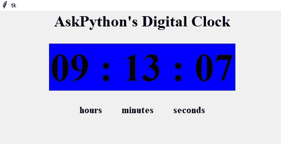

# 使用 2 个简单模块的 Python 数字时钟

> 原文：<https://www.askpython.com/python/examples/digital-clock-in-python>

今天我们将学习如何使用 Python 用几行代码创建一个简单的数字时钟。为了建立这个时钟，我们需要 **tkinter** 和**时间模块。**

* * *

## 用 Python 构建数字时钟的要求

首先，我们需要安装[t inter 模块](https://www.askpython.com/python-modules/tkinter/tkinter-buttons)。如果您的系统中尚未安装该模块，您可以使用 [pip 软件包管理器](https://www.askpython.com/python-modules/python-pip)安装该模块:

```py
C:\Users\Admin>pip install tkinter

```

一旦 tkinter 模块成功安装到您的系统上，您就可以开始工作了。

* * *

## 用 Python 编写数字时钟

今天我们将使用 tkinter 模块和 time 模块来构建我们的时钟。

### 1.Tkinter 模块

Tkinter 是 Python 的标准 GUI 库。Tkinter 从 Tk 接口获得它的名字。当 python 与 Tkinter 相结合时，它提供了一种快速简单的方法来创建 GUI 应用程序。Tkinter 为 Tk GUI 工具包提供了一个强大的面向对象的接口。Tkinter 是一个绑定到 Tk GUI 工具包的 Python。

### 2.时间模块

时间模块提供了多种获取时间的方式，在本文中，我们将使用 **strftime()** 将当前时间解析成小时:分钟:秒的格式。

### 3.实现数字时钟

在这段代码中，我们将使用 **geometry()** 来指定显示窗口的尺寸，并使用 **mainloop()** 来防止可显示窗口快速退出。

```py
#import all the required libraries first
import sys
from tkinter import *
#import time library to obtain current time
import time

#create a function timing and variable current_time
def timing():
    #display current hour,minute,seconds
    current_time = time.strftime("%H : %M : %S")
    #configure the clock
    clock.config(text=current_time)
    #clock will change after every 200 microseconds
    clock.after(200,timing)

#Create a variable that will store our tkinter window
root=Tk()
#define size of the window
root.geometry("600x300")
#create a variable clock and store label
#First label will show time, second label will show hour:minute:second, third label will show the top digital clock
clock=Label(root,font=("times",60,"bold"),bg="blue")
clock.grid(row=2,column=2,pady=25,padx=100)
timing()

#create a variable for digital clock
digital=Label(root,text="AskPython's Digital Clock",font="times 24 bold")
digital.grid(row=0,column=2)

nota=Label(root,text="hours        minutes        seconds",font="times 15 bold")
nota.grid(row=3,column=2)

root.mainloop()

```

**输出:**



## 最后的话…

这就是如何用 Python 编程创建一个简单的数字时钟！你还在等什么？通过自己尝试代码来创建您自己的代码！