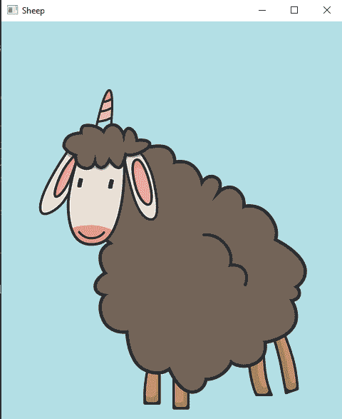
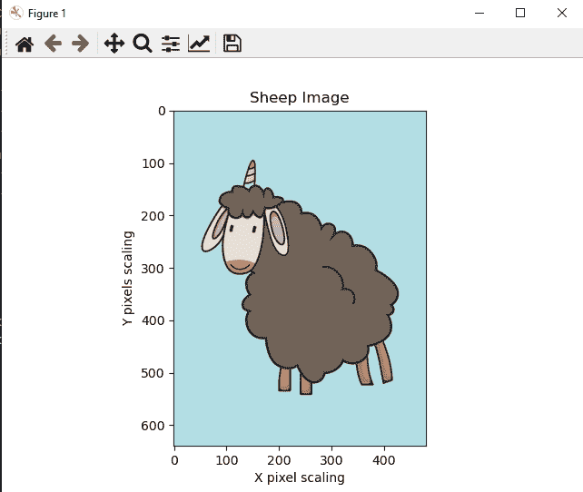
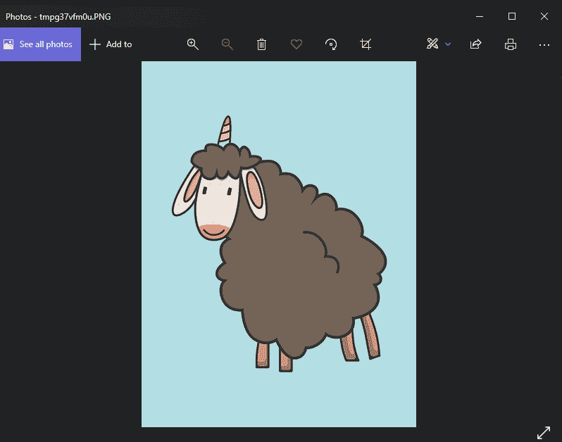
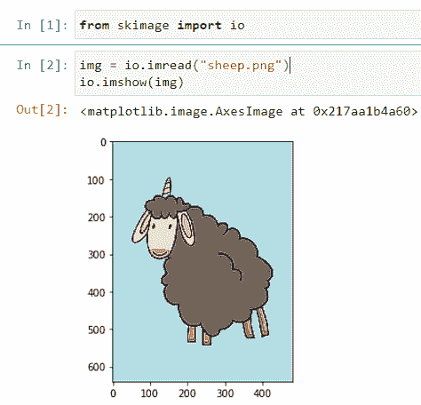
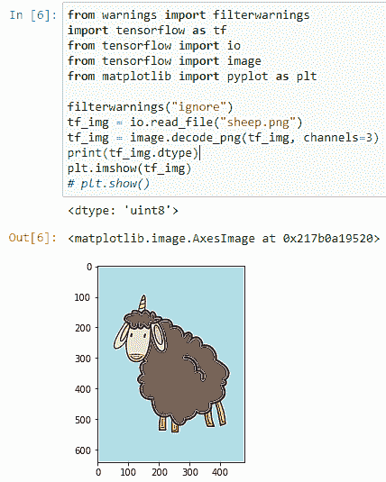

# 用 Python 显示图像的 5 种方式

> 原文：<https://www.askpython.com/python/examples/display-images-using-python>

在本文中，我们将研究如何用 Python 阅读和显示图像的不同方式**。我们可以通过多种方式实现这一目标。原因在于丰富的库支持。我们还将探索如何利用它们在**和**之间进行杂交。**

## 使用 Python 显示图像的方法

以下是 Python 库的列表，这些库使我们能够处理图像并执行相应的任务。

1.  **OpenCV**
2.  **Matplotlib**
3.  **枕头**
4.  **Scikit-Image**
5.  **Tensorflow**

现在让我们看看如何在 Python GUI 窗口中轻松显示图像。可能还有许多其他模块和/或黑客来查看图像，所以不要只局限于这 5 个模块！

### 1.OpenCV 用 Python 显示图像

这是一个非常著名的、初学者友好的、开源的、功能强大的负责图像处理的包。通过一小组命令，我们可以将我们的**计算机视觉之旅推进到下一个阶段。**OpenCV 提供了两个主要的**函数** **来读取和显示图像。**

1.  **cv2.imread()**
2.  **cv2.imshow()**

**代码:**

```py
import sys # to access the system
import cv2
img = cv2.imread("sheep.png", cv2.IMREAD_ANYCOLOR)

while True:
    cv2.imshow("Sheep", img)
    cv2.waitKey(0)
    sys.exit() # to exit from all the processes

cv2.destroyAllWindows() # destroy all windows

```

**输出:**



Displaying the image through OpenCV

**说明:**

1.  导入 **OpenCV** 包来访问函数。另外，导入**系统**模块以获得额外的软件包。
2.  创建一个变量作为保存我们图像的 img。调用 **cv2.imread()** 函数，并将**图像路径/图像**名称作为第一个参数。然后设置 **cv2。IMREAD_ANYCOLOR** 是读取图像每种颜色的下一个参数。
3.  然后设置一个 **while 循环**，这将帮助我们无限次渲染图像，直到我们退出系统。
4.  然后在 while 循环中使用 **cv2.imshow()** 函数。它有两个参数，图像标题和图像路径变量 **img** 。
5.  **cv2.waitkey()** 方法一直等到我们退出或者点击关闭按钮。
6.  然后调用 sys.exit()方法安全地退出该技术。
7.  最后，我们使用 **cv2.destroyAllWindows()** 销毁所有创建的窗口。

* * *

### 2\. Matplotlib

这个包主要用于数据可视化。但是，通过绘图技术，我们可以以一种**图形格式查看图像，其中每个像素位于 2D x-y 轴上。**

蒂耶图书馆也具有与 open cv 相当的功能。只是包名变了。

1.  **matplotlib . image . imread()**
2.  **matplotlib . py plot . im show()**

**代码:**

```py
from matplotlib import pyplot as plt
from matplotlib import image as mpimg

plt.title("Sheep Image")
plt.xlabel("X pixel scaling")
plt.ylabel("Y pixels scaling")

image = mpimg.imread("sheep.png")
plt.imshow(image)
plt.show()

```

**输出:**



Displaying image through Matplotlib

**说明:**

1.  导入**Matplotlib**packages**pylot**和 **image** 模块。
2.  使用 **plt.title()** 方法将图像的标题设置为**绵羊图像**。
3.  matplotlib 读取 **x-y 平面**中的图像。我们需要标签 **xlabel()** 和 **ylabel()** 函数来提到轴和像素。
4.  创建一个变量作为保存我们图像的图像。调用 **mpimg.imread()** 函数，给**图像路径/图像** **名称**作为第一个参数。
5.  然后设置一个 **while 循环**，这将帮助我们无限次渲染图像，直到我们退出系统。
6.  然后使用带有图像变量 **img** 的 **plt.imshow()** 函数。但是它会在**后台**显示出来。
7.  要在屏幕上查看它，使用 **plt.show()** 方法，我们就可以在屏幕上看到带有适当缩放参数的图像。

* * *

## 3.枕头

该库通常提供简单的图像处理方法。因为它的简单性和适应性，我们可以说它是一个纯图像库。我们将要使用的函数是 PILLOW 的**图像**模块中的 **open()** 和 **show()** 。这个动作只有三行代码。

**代码:**

```py
from PIL import Image
img = Image.open("sheep.png")
img.show()

```

**输出:**



Displaying image through PILLOW

**说明:**

1.  从 **PIL** 导入模块**镜像**。
2.  创建一个变量 **img** 然后在其中调用函数 open()。给出包含图像文件的路径。
3.  通过**点运算符，联合 **img** 变量调用 **show()** 函数**。
4.  它通过各自操作系统中的内置照片应用程序显示图像。

### 4\. Scikit-Image

Scikit-Image 是 **Scikit-Learn** 的子模块。它建立在 Python 和支持库 **Matplotlib** 的基础上，因此它派生了一些功能。方法与我们之前看到的前几个包类似。

**代码:**

```py
from skimage import io

img = io.imread("sheep.png")
io.imshow(img)

```

**输出:**



Displaying image through Skimage

### 5\. Tensorflow

这是一个强大的**机器学习**库，特别是来自**谷歌。Inc** 。它致力于机器学习、深度学习和相关概念的不同方面。它还内置了数据集，可以开始数据科学和 ML 工程的无忧之旅。它专门在计算机的 GPU CUDA 核心上工作。这使得模型训练更有效，并且给 **CPU** 更少的压力。

我们将结合 Matplotlib 模块使用这个库。因为这使得图像绘制和显示更加容易。

**代码:**

```py
from warnings import filterwarnings
import tensorflow as tf
from tensorflow import io
from tensorflow import image
from matplotlib import pyplot as plt

filterwarnings("ignore") 
tf_img = io.read_file("sheep.png")
tf_img = image.decode_png(tf_img, channels=3)
print(tf_img.dtype)
plt.imshow(tf_img)
# plt.show()

```

**说明:**

1.  **导入 TensorFlow。然后从 TensorFlow** **也导入木卫一和图像。**
2.  导入 **matplotlib 的** pyplot 模块用于绘图目的。
3.  **(可选)**同样，使用警告包来避免不必要的警告。
4.  **创建一个 TensorFlow 图像变量“tf_img”并调用 io.read_file()方法。给出里面的图像路径。**
5.  它被读取为默认的**文件**。要将其视为图像，我们需要使用来自**图像**的 **decode_png()** 函数，以便被系统识别。确保使用正确的决策函数。对于每种图像类型，它们是不同的。**使用通道= 3。用于默认的 GPU 使用。**
6.  最后，通过 **plt.imshow()** 方法显示捕获的图像。

**输出:**



Displaying Image through Tensorflow and Matplotlib

## 结论

所以，这些是我们可以用来进行图像处理的各种方法。Python 为每个独特的任务提供了大量的选项。请写下您最喜欢我们在本文中实现的哪个方法和库。