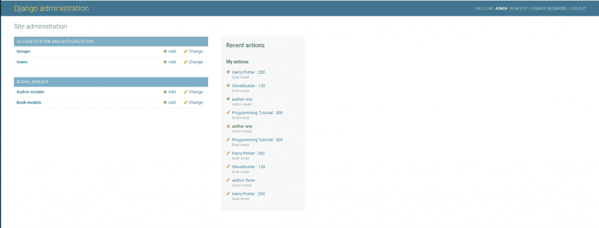
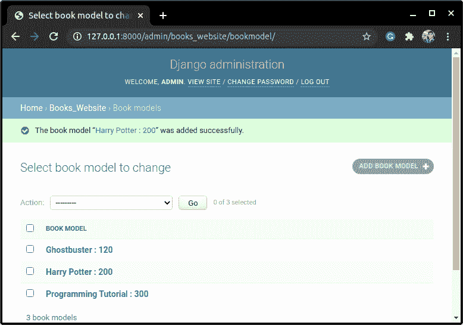
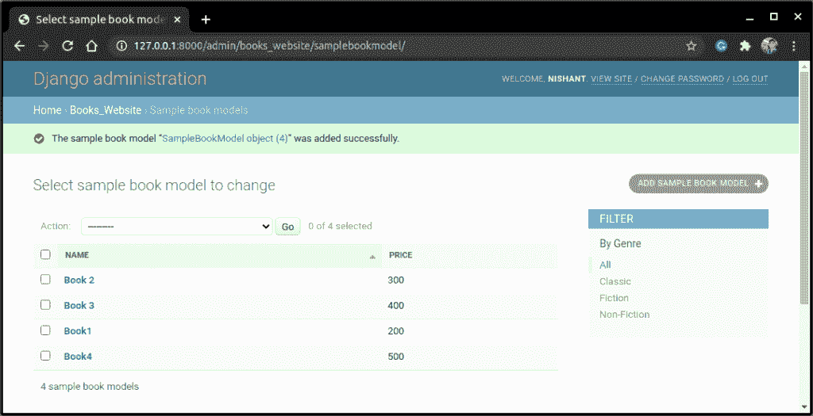
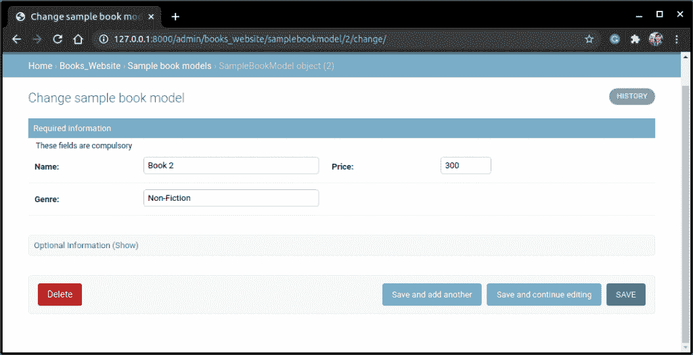
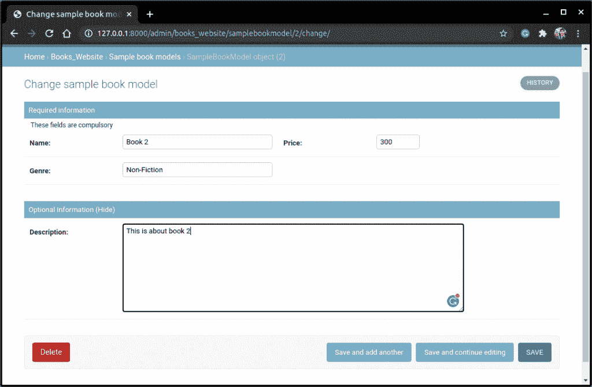

# Django 管理模板–修改 Django 管理界面

> 原文：<https://www.askpython.com/django/django-admin-template>

在本文中，我们将了解管理站点接口，以及如何使用 Django 管理模板来修改它。

## Django 默认管理界面

如您所见，默认的 [Django 管理站点](https://www.askpython.com/django/django-admin-site)如下所示:



Admin Site

默认界面的功能很少，对用户也不友好。但是 Django 确实提供了一种方法来制作我们自己的管理站点界面；那就是通过使用 Django ModelAdmin 库。

我们现在将与 ModelAdmin 一起工作，看看如何根据我们的需要修改管理页面。

## 用 ModelAdmin 库定制 Django 管理界面

要使用 Model Admin，我们需要一些模型表。这里有一个简单的模型:

```py
class SampleBookModel(models.Model):
    Name = models.CharField(max_length = 80)
    Price = models.IntegerField()
    Genre = models.CharField(max_length = 80)
    Description = models.TextField()

```

在随后的部分中，我们将修改这个模型本身的显示页面。

## 编辑模型管理类

模型管理是 Django 的**管理**库的一部分。要使用它，我们必须导入 admin:

```py
from django.contrib import admin

```

模型管理类的基本语法如下所示:

```py
#Decorator
@admin.register(BookModel)
class BookModelAdmin(admin.ModelAdmin):
    #Fields
    fields =('<model_field_names>')

    #List Display
    list_display = ('<model_field_names>')

    #List_filter
    list_filter = ('<model_field_names>')

    #ordering
    ordering = ('<model_field_names>')

    #fieldsets
    fieldsets =(
                ('Required information',{
                    'description' : '<'description_sentence>',
                    'fields':('<model_fields'>)
                }), 
                ('Optional Information',{
                    'classes' : ('<class_options',),
                    'fields': ('<model_fields>')
                })
        )

```

**我们现在将逐个查看它们**

### 1.装修工

Python 提供了一个令人兴奋的特性装饰器，用于向现有代码添加功能。它与一个 **@** 符号一起使用。

你可以在 [Python decorators](https://www.askpython.com/python/built-in-methods/python-property-decorator) 文章中了解更多。管理站点注册表装饰器的基本语法是:

```py
@admin.register(<Model_Name>)

```

**注意:**这里它的作用和线的作用一样:

```py
admin.site.register(<Model_Name>, <Model_admin_class>)

```

使用 decorators 只是在管理站点中注册模型的另一种方式。在这种情况下，唯一的区别是添加了**模型管理类**和**模型**作为参数。

### **2。字段**

字段指定网页上模型字段的顺序和位置。

**注意:**输入(字段)应该以**元组的形式给出。**

```py
fields =(('field1','field2'),'field3','field4')

```

要在同一级别显示两个字段，请将它们作为一个元组添加到元组中。

**例如:**在上面的代码中:**字段 1** 和**字段 2**会同级显示——字段**比它们低 3**，最后是**字段 4** 。

### **3。列表 _ 显示**



Books

在上面的例子中，网页只显示了一个标题**“图书型号”**为了添加更多这样的列标题，我们使用了 **list_display** 属性。

**注:**输入(列标题)应给出为 **[元组](https://www.askpython.com/python/tuple/python-tuple)** 。

list_display 的语法:

```py
list_display = ('<Heading1','Heading2')

```

### 4.列表 _ 过滤器

默认界面不提供 **Filter-by** 选项。但是我们可以使用**列表 _ 过滤器**选项来添加它。

有了 **Filter_by** 选项，我们可以更快地搜索表格元素。

**注意:**输入应该以**元组的形式给出。**

```py
list_filter = ('<filter-by:Field_Name>',)

```

### 5.排序

排序属性指定表格元素在网页上显示的顺序。

**注意:****输入**应该作为**元组给出。**

```py
ordering = ('<Field_Name>',)

```

### 6.字段集

**字段集**属性只是显示字段的另一种方式，就像**字段**属性一样。

在很多网站上，信息经常显示在**可选信息**标签下，我们按下**点击查看**选项后就可以看到。

字段集正是这样做的！！语法类似于**元组**中的 **Python 字典**。

字段集的语法如下所示:

```py
fieldsets =(
            ('Required information',{
                'description' : '<'description_to_display>',
                'fields':('<Field_Names'>)
            }),
            ('Optional Information',{
                'classes' : ('<display_options>',),
                'fields': ('<Field_Names>')
            })
    )

```

**以下是一些不常用的模型管理属性:**

*   空值显示
*   排除
*   列表 _ 可编辑
*   只读字段

## 使用 Admin 类定制 Django 管理模板中的字段

清楚了解变量后，我们现在可以开始修改管理模板上的前端字段。

我们将改变先决条件部分提到的 **SampleModel** Django 管理模板的外观

在 admins.py 中添加代码:

```py
@admin.register(SampleBookModel)
class SampleAdminModel(admin.ModelAdmin):
    fieldsets =(
            ('Required information',{
                'description' : 'These fields are compulsory',
                'fields':(('Name','Price'),'Genre')
            }),
            ('Optional Information',{
                'classes' : ('collapse',),
                'fields': ('Description',)
            })
    )
    list_display =('Name','Price')
    list_filter = ('Genre',)
    ordering =('Name',)

```

从代码中，试着猜测每个元素将显示在哪里。我们将在下一节看到你的猜测是否正确！

## 模型管理类的实现

你猜对了吗？看一下输出。



Admin Interface



Admin Template



Admin Template (Optional Information)

## 结论

就这样，编码员们！！这就是关于 Django 管理模板以及如何使用模型管理类的全部内容。请务必查看 Django 管理站点的文章，以获得更多关于管理站点的信息。

下一篇文章再见！！继续编码！！