# Python Django 应用程序结构和项目结构

> 原文：<https://www.askpython.com/django/django-app-structure-project-structure>

Django 使用目录结构来安排 web 应用程序的不同部分。现在，我们将在这里更详细地了解 Django 应用程序结构和项目结构。

## Django **项目结构**

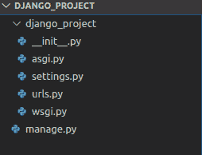

Django Project Structure

这是默认 Django 项目结构的样子。让我们来理解上图中显示的文件的功能，以帮助您了解项目文件夹的内容。

### **1。Manage.py**

该文件主要用作命令行实用工具，用于部署、调试或运行我们的 web 应用程序。

该文件包含用于运行服务器、进行迁移或迁移等的代码。我们在外壳中使用的。**无论如何，我们不需要对文件做任何修改。**

*   **runserver:** 这个命令用于为我们的 web 应用程序运行服务器。

*   **迁移:**这用于将对我们的模型所做的更改应用到数据库中。也就是说，如果我们对数据库进行任何更改，那么我们使用 **migrate** 命令。这是我们第一次创建数据库时使用的。

*   **Makemigration:** 这样做是为了应用由于数据库中的更改而执行的新迁移。

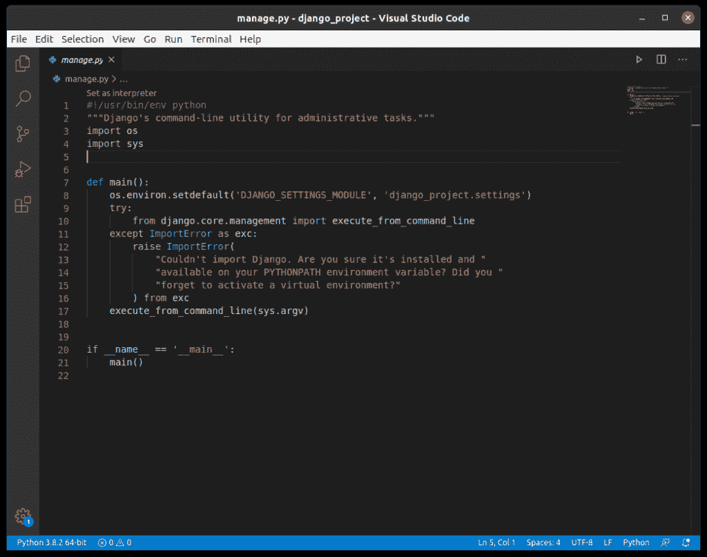

manage.py

此图仅供大家参考。你不必理解这里写的代码，因为我们在这里没有改变任何东西。

### **2。_init_。py**

这个文件仍然是空的，它的存在只是为了告诉我们这个特定的**目录**(在这个例子中是 django_project)是一个**包**。

我们也不会对此文件进行任何更改。

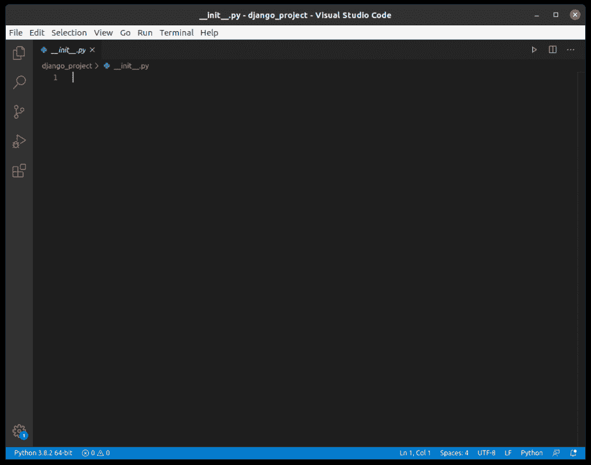

_init_.py

### **3。setting.py**

该文件用于添加所有存在的**应用程序**和**中间件** **应用程序**。此外，它还有关于模板和数据库的信息。总的来说，这是我们 Django web 应用程序的主文件。

### **4\. urls.py**

这个文件处理我们的 web 应用程序的所有 URL。这个文件包含了我们网站的所有端点的列表。

URL:通用资源定位器用于提供互联网上的资源(如图片、网站等)的地址。

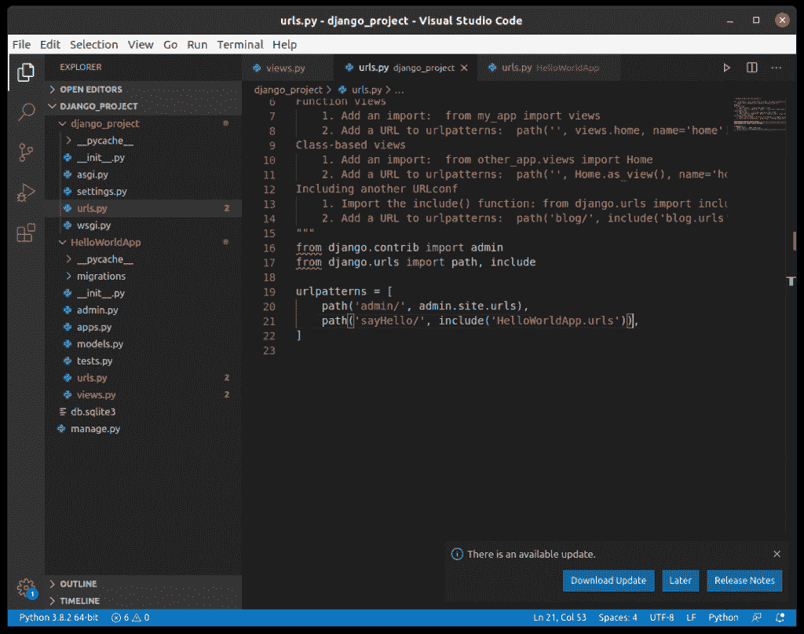

Urls Pydjango Project 1

### 5. **wsgi.py**

这个文件主要涉及到 WSGI 服务器，用于将我们的应用程序部署到 Apache 等服务器上。

WSGI，web 服务器网关接口的缩写可以被认为是描述服务器如何与 Web 应用交互的规范。

**同样，我们不会对此文件进行任何更改。**

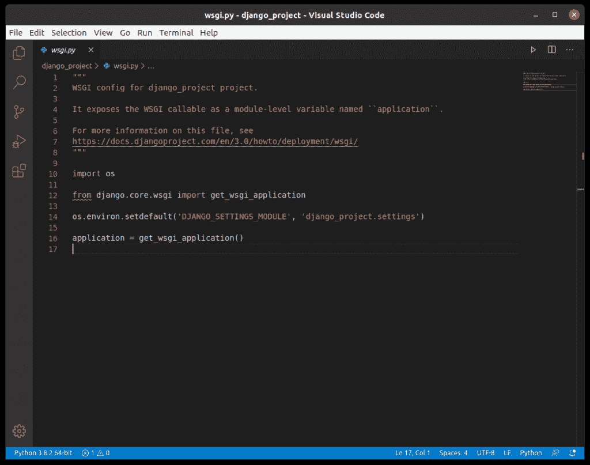

wsgi.py

你不必理解这里写的代码**，因为我们在这里没有改变任何东西**。

### 6. **asgi.py**

在 Django 的新版本中，除了 **wsgi.py** 之外，你还会发现一个名为 **asgi.py** 的文件。 **ASGI** 可以被认为是 **WSGI** 的后续接口。

ASGI，异步服务器网关接口的缩写也有类似于 WSGI 的工作，但这比前一个更好，因为它在 Django 开发中提供了更好的自由度。这就是为什么 WSGI 现在越来越多地被 **ASGI 所取代。**

**同样，我们不会对此文件进行任何更改。**

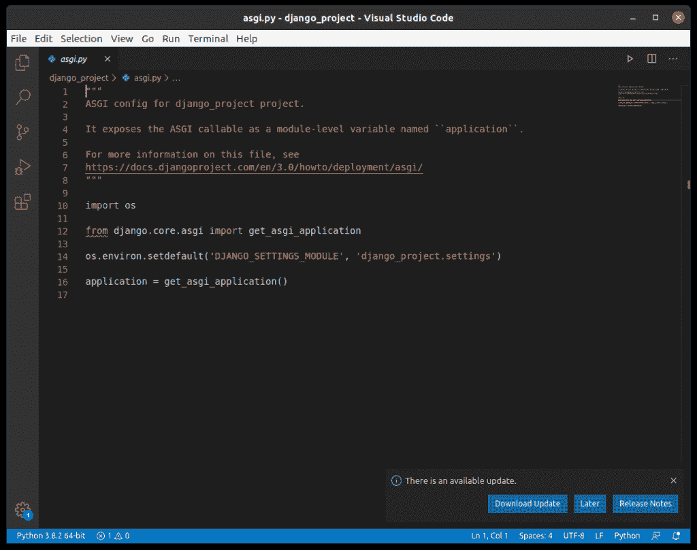

Asgi

### **7。应用程序**

除了上面的文件，我们的项目包含所有的应用程序目录。现在我们将详细研究 Django 应用程序的结构

* * *

## Django 应用程序结构

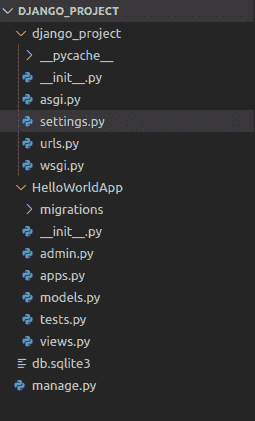

Django App structure – Basic Hello world app

上图是我们最近关于 [Django hello world](https://www.askpython.com/django/django-hello-world-app) 应用的文章中的应用结构。让我们检查一下应用程序目录中的文件，了解它们的用途。

### **1。_init_。py**

这个文件的功能与 _init_ 中的相同。Django 项目结构中的 py 文件。它仍然是空的，它的存在只是为了表明特定的应用程序目录是一个包。

**无需手动更改文件。**

Init file

### 2\. **admin.py**

顾名思义，这个文件用于将模型注册到 Django 管理中。

展示的模型有一个超级用户/管理员，可以控制存储的信息。

这个管理界面是预先构建的，我们不需要创建它。

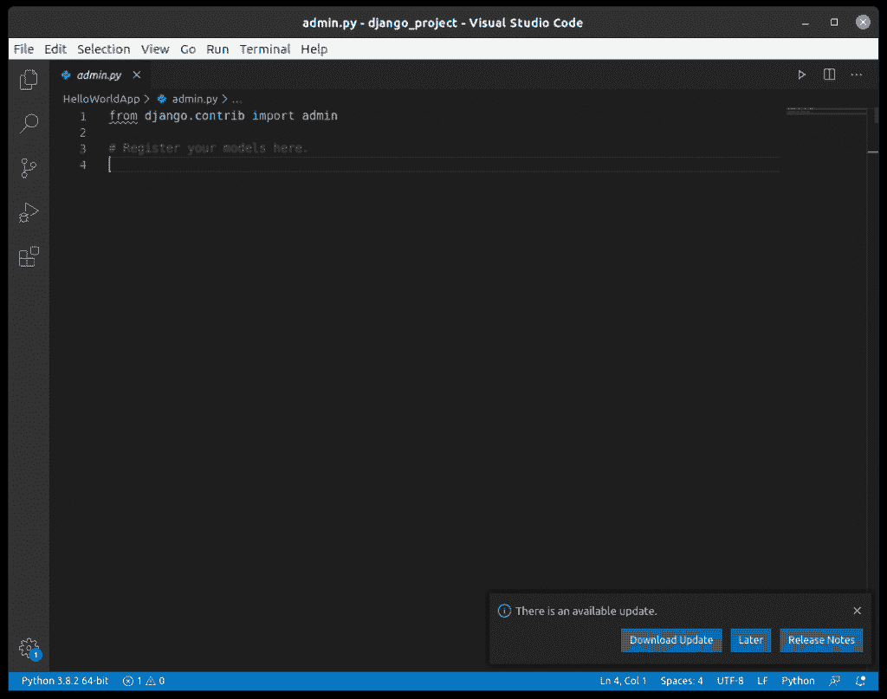

Admin

### 3. **apps.py**

该文件处理应用程序的应用程序配置。默认配置在大多数情况下足够了，因此**开始时我们不会在这里** **做任何事情。**

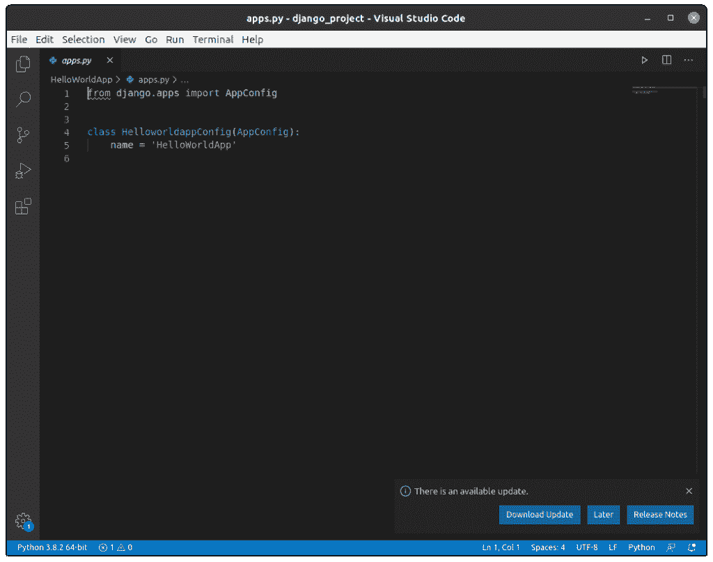

Apps

### 4. **models.py**

这个文件包含我们的 web 应用程序的模型(通常作为类)。

模型基本上是我们正在使用的数据库的蓝图，因此包含关于数据库的属性和字段等的信息。

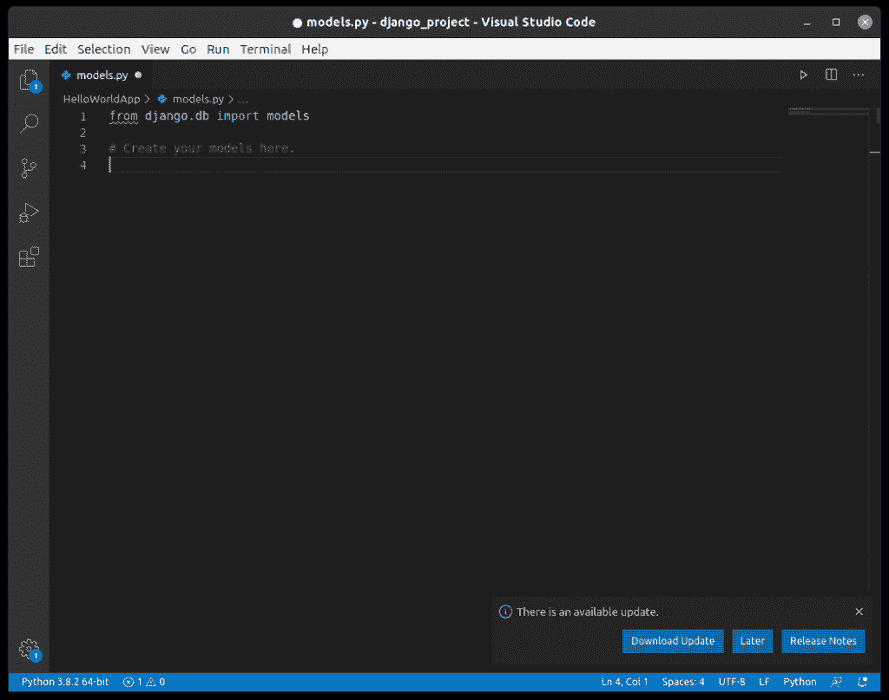

Models

### 5. **views.py**

这个文件非常重要，它包含了所有的视图(通常是类)。Views.py 可以被认为是一个与客户端交互的文件**。视图是我们呈现 Django Web 应用程序时所看到的用户界面。**

在接下来的章节中，我们将使用 **Django Rest_Framework** 中的序列化程序的概念来创建不同类型的视图。

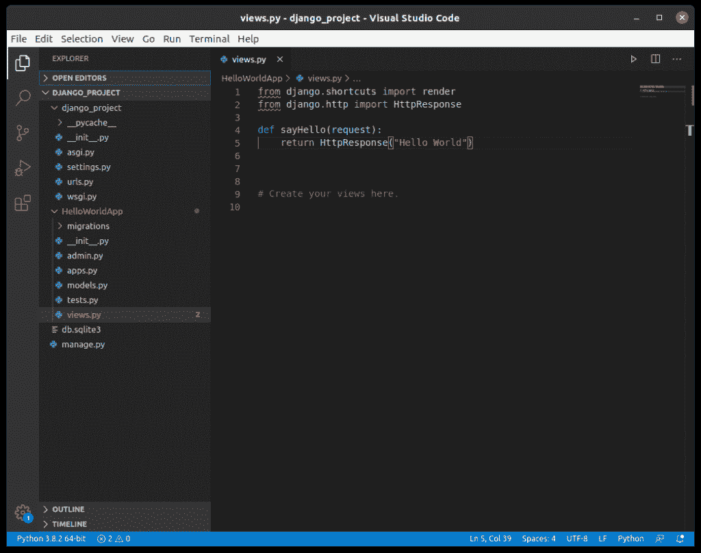

views.py

### 6\. urls.py

就像 project **urls.py** 文件一样，这个文件处理我们的 web 应用程序的所有 URL。这个文件只是将应用程序中的视图与主机 web URL 链接起来。设置 **urls.py** 具有对应于视图的端点。

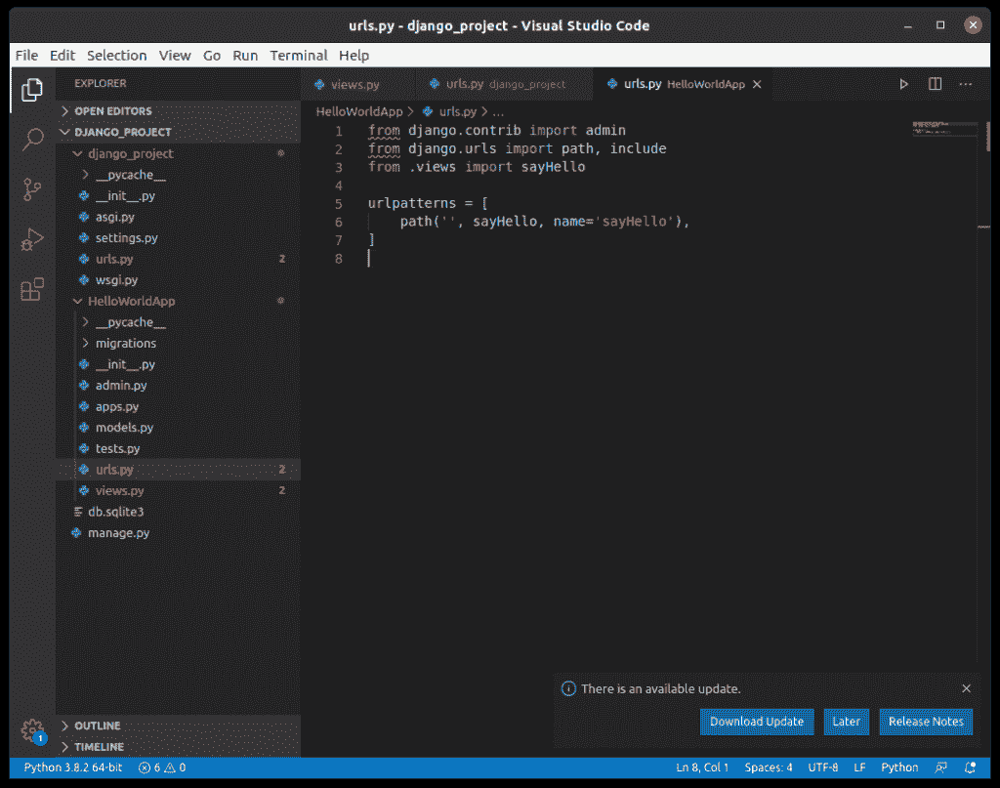

urls.py

### **7。tests.py**

该文件包含的代码包含应用程序的不同测试用例。它用于测试应用程序的工作情况。

**我们不会在一开始就处理这个文件**，因此它现在是空的。

## 结论

这就是我们的结局。如果你不明白本教程的任何部分，不要烦恼。我们会在 Django 上发布更多的教程，慢慢地让你对这些结构有更全面的了解。因为您将亲自操作这些文件，所以您将很容易理解 Django 应用程序结构和项目结构。

现在，是我们下一篇讨论 Django URL 结构的文章的时候了。未来几天敬请关注更多关于 **[Python Django](https://www.askpython.com/django)** 和 **Flask** 的文章！