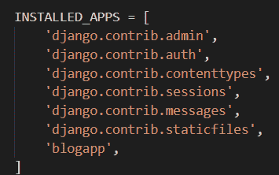
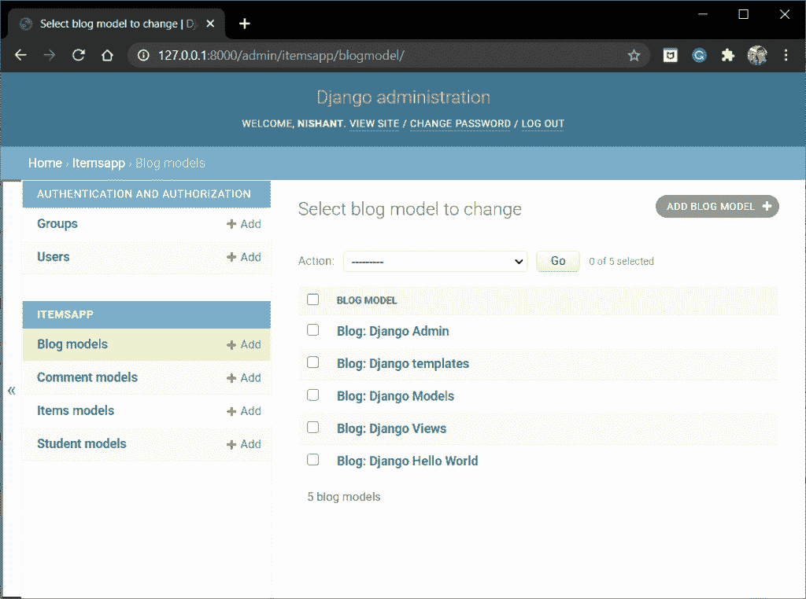
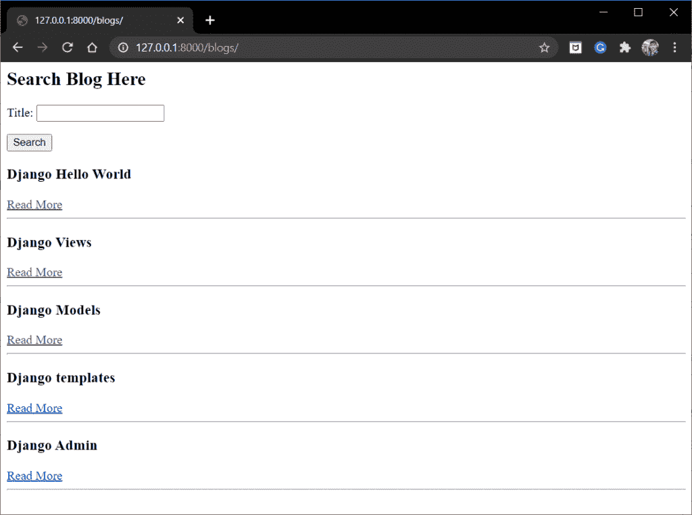
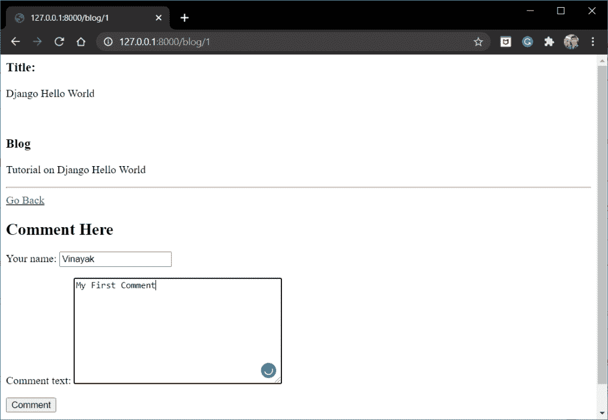
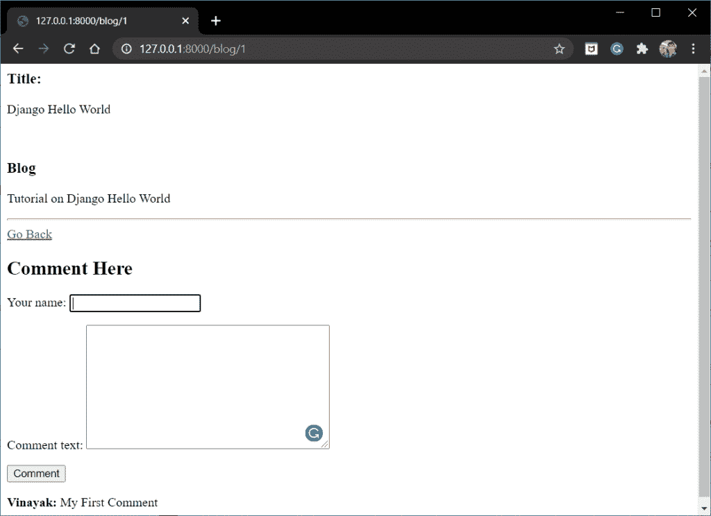
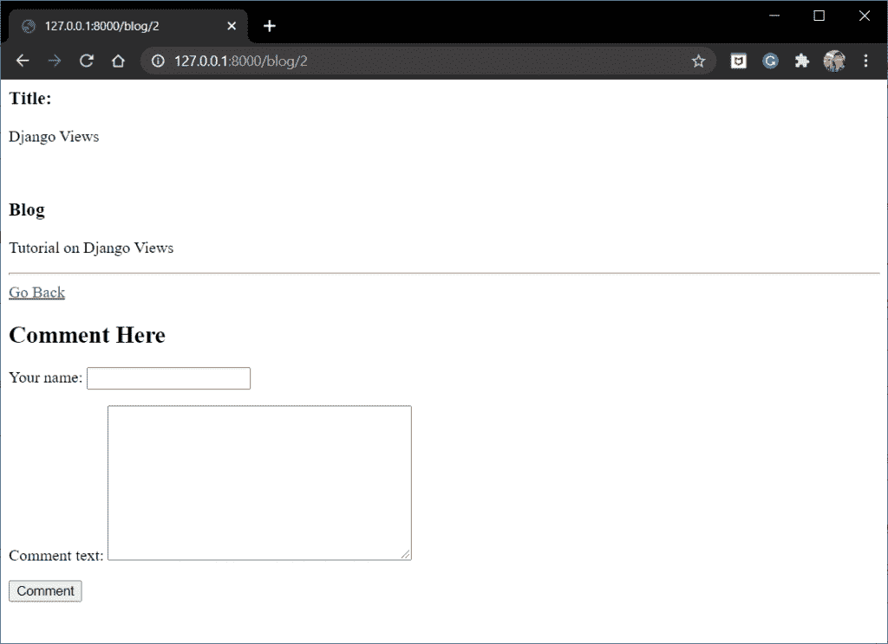

# Django 博客应用——给你的 Django 应用添加博客和评论

> 原文：<https://www.askpython.com/django/django-blog-app>

在本文中，我们将创建一个 Django 博客应用程序。对于门外汉来说，在开始用 Django 构建自己的博客应用程序之前，让我们先快速了解一下什么是博客。

## 什么是博客？

博客网站是一个在线平台，其中以离散和信息丰富的文本形式条目(帖子)发布所有信息。此外，人们还可以在每个博客的评论区分享问题和讨论观点。

博客应用程序是实践 Django 框架的一个很好的方式。我们现在将创建一个博客应用程序，浏览者可以:

*   查看所有博客的列表
*   查看每篇博客文章
*   在每个博客文章的评论区发表评论
*   搜索特定的博客文章

## **建立 Django 博客的先决条件**

在此应用中，我们需要以下知识:

*   **[Django 车型](https://www.askpython.com/django/django-models)**
*   **[姜戈观点](https://www.askpython.com/django/django-views)**
*   **[姜戈网址](https://www.askpython.com/django/django-url-mapping)**
*   **[Django 模板](https://www.askpython.com/django/django-templates)**
*   **[姜戈形态](https://www.askpython.com/django/django-forms)**

如果你对其中任何一部分感到不熟悉，请务必先浏览一遍。

## **打造我们自己的 Django 博客应用**

现在我们已经具备了所需的知识，让我们今天就开始构建你的第一个 Django 博客应用程序。

### 1.**创建 Django 项目和应用**

第一步是为应用程序建立一个新的 **[Django 项目](https://www.askpython.com/django/django-app-structure-project-structure)** 。因此，在终端运行中:

```py
django-admin startproject <project_name>

```

现在，**进入项目**，运行下面的代码行创建一个 Django 应用程序:

```py
django-admin startapp blogapp

```

就是这样，现在在 **settings.py** 中注册 Django app



INSTALLED_APPS

### 2.**包括项目 URL 文件的应用程序 URL**

在应用程序中创建新的 urls.py 文件，然后将其链接到项目 urls.py 文件。因此，在**项目/urls.py** 中，添加代码:

```py
from django.contrib import admin
from django.urls import path,include

urlpatterns = [
    path('admin/', admin.site.urls),
    path('', include('blogapp.urls')),
]

```

同时在 **admin.py 文件**中注册模型。在 admins.py 文件中添加代码:

```py
from .models import BlogModel, CommentModel
admin.site.register(BlogModel)
admin.site.register(CommentModel)

```

### 3.**编码 Django 模型**

在我们的 BlogApp 中，我们需要一个模型来存储博客，一个模型来存储每个博客的评论。

因此，在 **blogapp/models.py 中，**用以下字段创建两个模型——blog model 和 CommentModel

```py
from django.db import models
class BlogModel(models.Model):
    id = models.IntegerField(primary_key=True)
    blog_title = models.CharField(max_length=20)
    blog = models.TextField()

    def __str__(self):
        return f"Blog: {self.blog_title}"

class CommentModel(models.Model):
    your_name = models.CharField(max_length=20)
    comment_text = models.TextField()
    blog = models.ForeignKey('BlogModel', on_delete=models.CASCADE)

    def __str__(self):
        return f"Comment by Name: {self.your_name}"

```

请注意，CommentModel 中的 blog 字段链接到 BlogModel，因为每个单独的博客页面将只显示该博客上的评论。

### 4.**编码 Django 表格**

我们还需要两种形式:

1.  用于写评论的评论表单
2.  用于搜索博客的搜索表单

因此，在 **blogapp** 中创建一个 **forms.py** 文件，并在其中添加以下代码:

```py
from django import forms
class CommentForm(forms.Form):
    your_name =forms.CharField(max_length=20)
    comment_text =forms.CharField(widget=forms.Textarea)

    def __str__(self):
        return f"{self.comment_text} by {self.your_name}"

class SearchForm(forms.Form):
    title = forms.CharField(max_length=20)

```

### 5.**编码 Django 视图**

同样，我们需要两个视图:

1.  **ListView** :显示博客列表和搜索表单
2.  **详细视图:**显示个人博客、评论表单和之前提交的评论

因此，将下面的列表视图和详细视图添加到 **blogapp/views.py** 中:

```py
from .models import BlogModel,CommentModel
from .forms import SearchForm,CommentForm
from django.shortcuts import render,redirect

def BlogListView(request):
    dataset = BlogModel.objects.all()
    if request.method == 'POST':
        form = SearchForm(request.POST)
        if form.is_valid():
            title = form.cleaned_data['title']
            blog = BlogModel.objects.get(blog_title=title)
            return redirect(f'/blog/{blog.id}')
    else:
        form = SearchForm()
        context = {
            'dataset':dataset,
            'form':form,
        }
    return render(request,'blogapp/listview.html',context)

def BlogDetailView(request,_id):
    try:
        data =BlogModel.objects.get(id =_id)
        comments = CommentModel.objects.filter(blog = data)
    except BlogModel.DoesNotExist:
        raise Http404('Data does not exist')

    if request.method == 'POST':
        form = CommentForm(request.POST)
        if form.is_valid():
            Comment = CommentModel(your_name= form.cleaned_data['your_name'],
            comment_text=form.cleaned_data['comment_text'],
            blog=data)
            Comment.save()
            return redirect(f'/blog/{_id}')
    else:
        form = CommentForm()

    context = {
            'data':data,
            'form':form,
            'comments':comments,
        }
    return render(request,'blogapp/detailview.html',context)

```

视图的 URL 路径将是:

```py
path('blogs/', BlogListView, name='blogs'),
path('blog/<int:_id>', BlogDetailView, name='blog'),

```

将上述代码添加到 **blogapp/urls.py** 中

### **6。编码 Django 模板**

为了显示内容，我们再次需要两个模板，每个视图一个。因此:

1.  在应用程序中创建一个模板文件夹。
2.  在模板文件夹中，创建一个名为 blogapp 的文件夹

现在，在 **templates/blogapp** 文件夹中，添加以下两个文件:listview.html 和 detailview.html**的**文件。****

1.  **listview.html 文件**

```py
<form method="post">
    
    <H2> Search Blog Here</H2>
    {{form.as_p}}
    <input type ="submit" value="Search">
</form>


<h3>{{data.blog_title}}</h3>
<a href = "">Read More</a>
<hr/>


```

2.**detailview.html 文件**

```py
<h3>Title:</h3><p>{{data.blog_title}}</p><br>
<h3>Blog</h3>
<p>{{data.blog}}</p>
<hr/>

<a href = "">Go Back</a>

<form method="post">
    
    <H2> Comment Here</H2>
    {{form.as_p}}
    <input type ="submit" value="Comment">
</form>


<p><strong>{{comment.your_name}}:</strong> {{comment.comment_text}}</p>


```

就是这样！！这是博客应用程序所需的全部内容。

## **项目的最终代码**

所有文件的最终组合代码如下所示:

1.  **models.py**

```py
from django.db import models
class BlogModel(models.Model):
    id = models.IntegerField(primary_key=True)
    blog_title = models.CharField(max_length=20)
    blog = models.TextField()

    def __str__(self):
        return f"Blog: {self.blog_title}"

class CommentModel(models.Model):
    your_name = models.CharField(max_length=20)
    comment_text = models.TextField()
    blog = models.ForeignKey('BlogModel', on_delete=models.CASCADE)

    def __str__(self):
        return f"Comment by Name: {self.your_name}"

```

2. **forms.py**

```py
from django import forms

class CommentForm(forms.Form):
    your_name =forms.CharField(max_length=20)
    comment_text =forms.CharField(widget=forms.Textarea)

    def __str__(self):
        return f"{self.comment_text} by {self.your_name}"

class SearchForm(forms.Form):
    title = forms.CharField(max_length=20)

```

3. **views.py**

```py
from .models import BlogModel,CommentModel
from .forms import SearchForm,CommentForm
from django.shortcuts import render,redirect

def BlogListView(request):
    dataset = BlogModel.objects.all()
    if request.method == 'POST':
        form = SearchForm(request.POST)
        if form.is_valid():
            title = form.cleaned_data['title']
            blog = BlogModel.objects.get(blog_title=title)
            return redirect(f'/blog/{blog.id}')
    else:
        form = SearchForm()
        context = {
            'dataset':dataset,
            'form':form,
        }
    return render(request,'blogapp/listview.html',context)

def BlogDetailView(request,_id):
    try:
        data =BlogModel.objects.get(id =_id)
        comments = CommentModel.objects.filter(blog = data)
    except BlogModel.DoesNotExist:
        raise Http404('Data does not exist')

    if request.method == 'POST':
        form = CommentForm(request.POST)
        if form.is_valid():
            Comment = CommentModel(your_name= form.cleaned_data['your_name'],
            comment_text=form.cleaned_data['comment_text'],
            blog=data)
            Comment.save()
            return redirect(f'/blog/{_id}')
    else:
        form = CommentForm()

    context = {
            'data':data,
            'form':form,
            'comments':comments,
        }
    return render(request,'blogapp/detailview.html',context)

```

4.**listview.html**

```py
<html>
<body>
<form method="post">
    
    <H2> Search Blog Here</H2>
    {{form.as_p}}
    <input type ="submit" value="Search">
</form>


<h3>{{data.blog_title}}</h3>
<a href = "">Read More</a>
<hr/>

</html>
</body>

```

4.**listview.html**

```py
<html>
<body>
<h3>Title:</h3><p>{{data.blog_title}}</p><br>
<h3>Blog</h3>
<p>{{data.blog}}</p>
<hr/>

<a href = "">Go Back</a>

<form method="post">
    
    <H2> Comment Here</H2>
    {{form.as_p}}
    <input type ="submit" value="Comment">
</form>


<p><strong>{{comment.your_name}}:</strong> {{comment.comment_text}}</p>

</html>
</body>

```

5\. **blogapp/urls.py**

```py
from django.contrib import admin
from django.urls import path
from .views import *

urlpatterns = [
    path('blogs/', BlogListView, name='blogs'),
    path('blog/<int:_id>', BlogDetailView, name='blog'),
]

```

## **项目实施**

这就是它的编码员，让我们现在实现代码。首先，我们需要应用迁移来创建 DB 模型表。因此，在 shell 中运行以下代码:

```py
python manage.py migrate
python manage.py makemigrations
python manage.py migrate

```

现在使用终端运行服务器:

```py
python manage.py runserver

```

现在通过管理站点(" **/admin** ")添加一些博客



Blog Admin

现在转到“**/博客**”端点



Blogs

现在去任何一个博客，说 **Django Hello World**



Blog 1

添加评论并点击提交，评论将出现在下面



Blog 1 With Comment

请注意，当你去任何其他博客，比如说 Django Views one，你不会看到上面的评论，因为它只针对 Django Hello World 博客。



Blog 2

## **结论**

就是这样，编码员们，这都是关于 Django 博客应用程序的。尝试创建您自己的博客应用程序，并添加用户身份验证等附加功能。请务必查看 Django 用户认证文章以获得帮助。

在下一篇文章中，我们将把我们的项目部署到一个 **VPS(虚拟专用服务器)**上。