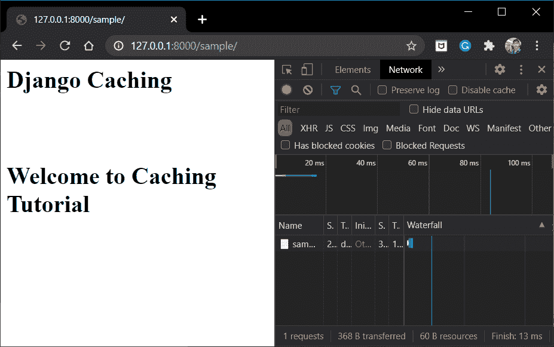
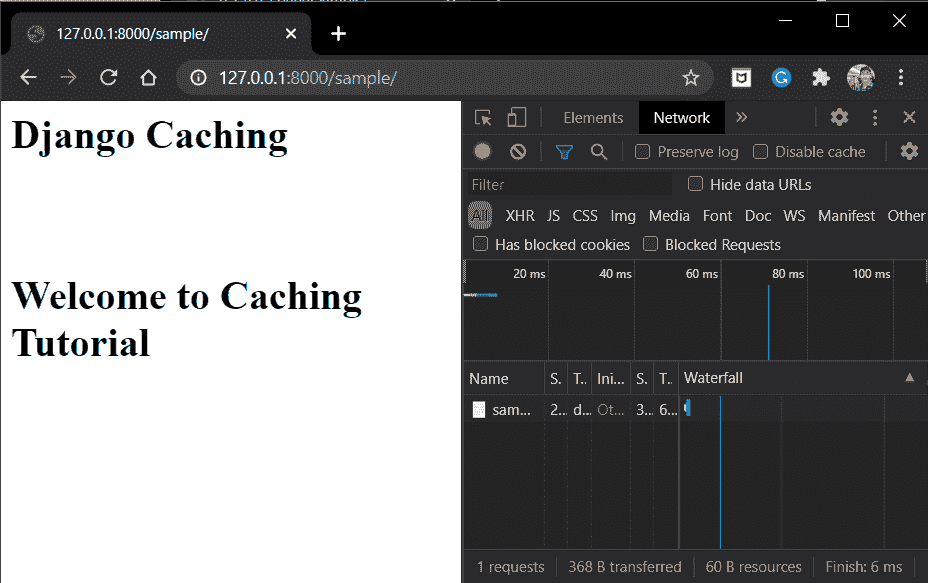
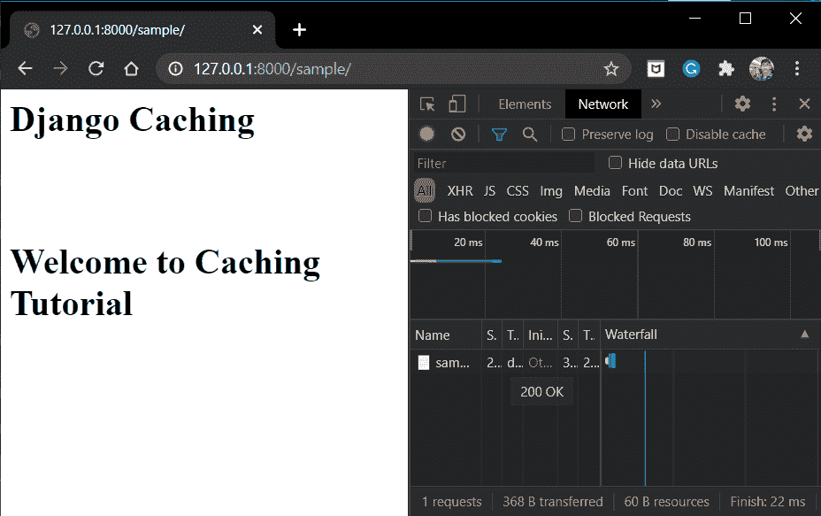
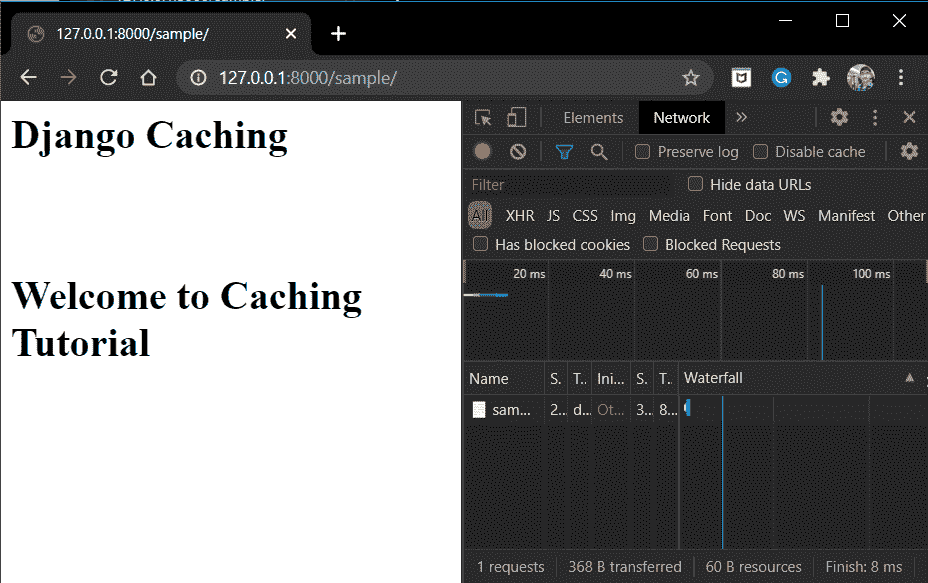

# Django 缓存——通过缓存加快 Django WebApp 的速度

> 原文：<https://www.askpython.com/django/django-caching>

在本文中，我们将实现 Django 缓存。我们将学习什么是缓存，为什么要使用缓存，最后，我们将在 Web 应用程序中编码和实现缓存。

所以让我们开始吧！！

## **什么是缓存**？

缓存是保存耗时计算的结果的过程，以便将来下次需要时，您可以随时准备好结果。

甚至计算机 CPU 也在内存中存储缓存文件，以便下次可以更快地显示这些文件，从而节省大量处理时间。大多数像 FB，WhatsApp 这样的网站也使用缓存来提高网站速度。

Django Framework 有一套预置的选项，可以用来缓存网站。

## **需要缓存**

每次访问动态网站(包含动态元素的网站，如[模板](https://www.askpython.com/django/django-templates)、[视图](https://www.askpython.com/django/django-views)、服务器中的数据等。)，服务器需要在显示之前加载模板、查看和从服务器检索数据。所有这些过程都需要时间。

但是在今天这个时代，每个用户都希望自己的请求能够得到快速响应，哪怕是毫秒级的延迟都是承受不起的。因此，为了让网站运行得更快，我们可以采取以下措施:

*   改进 CPU 硬件
*   改进服务器软件
*   改进数据库

或者我们可以简单地使用**缓存**的方法！！

## **存储缓存信息**

Django 缓存框架还提供了不同的方式来存储缓存信息:

*   将缓存存储在数据库中
*   将缓存存储在文件中
*   在内存中存储缓存

我们现在将分别研究它们

### **1)在数据库中存储缓存**

这里所有的缓存数据都存储在数据库中的一个单独的表中，就像模型表一样。

因此，我们需要告诉 Django 将缓存存储在 DB 中。为此，在 **settings.py** 中添加以下代码

```py
CACHES = {
    'default':{
        'BACKEND': 'django.core.cache.backends.db.DatabaseCache',
        'LOCATION': 'my_cache_table',
    }
}

```

为了在表中存储缓存，我们还需要创建一个表。因此，在控制台中，运行代码

```py
python manage.py createcachetable

```

Django 现在使用 settings.py 中给定的名称在 DB 中创建缓存表—**“my _ cache _ table”**

这种方法是最常用的，这里缓存速度取决于数据库的类型。如果您有快速 DBs，那么这个选项是最可行的。

### 2)将高速缓存存储在文件中

在这里，我们将缓存作为文件存储在系统中。要将缓存存储为文件，请在 **settings.py** 中添加以下代码:

```py
CACHES = {
    'default': {
        'BACKEND': 'django.core.cache.backends.filebased.FileBasedCache',
        'LOCATION': 'Absolute_path_to_the_directory',
    }
}

```

这里所有的缓存文件都存储在**位置**属性中设置的文件夹/目录中。

注意:

*   服务器应该可以访问该目录
*   该位置应该提前存在。
*   应该只提到文件夹/目录的绝对路径。

这种方法是所有选项中最慢的。但是这里您不需要升级您的硬件，因为它正在使用系统中已经存在的存储。

### **3)将缓存存储在内存中** y

在这里，我们将所有缓存文件存储在内存中。Django 有一个本地内存缓存形式的默认缓存系统。

要在本地内存中添加缓存，请添加代码

```py
CACHES = {
    'default': {
        'BACKEND': 'django.core.cache.backends.locmem.LocMemCache',
        'LOCATION': ('Location1','Location2',...),
    }
}

```

在这里，我们可以将缓存文件保存在不同的部分。在**位置**属性中添加所有部分的位置作为**元组**。

到目前为止，这种方法是上述所有选项中最强大、最快的。

## Django 缓存的先决条件

现在要缓存网站，首先要有一个视图和对应的 URL 路径。因此，将以下示例视图添加到您的 views.py 中:

```py
def SampleView(request):
    Html = '<h1>Django Caching<h1><br><p>Welcome to Caching Tutorial</p>'
    return HttpResponse(html)

```

代码的 URL 路径将是:

```py
path('sample/', SampleView),

```

现在，对于下一部分，您可以以上面显示的任何形式存储缓存:

## **将网站的不同部分存储为缓存**

在姜戈，我们可以:

1.  仅缓存特定视图
2.  或者缓存整个网站

我们现在将分别研究它们。

### **1。每个站点的缓存存储**

为了缓存整个站点，在 **settings.py** 的**中间件**部分添加以下代码

```py
'django.middleware.cache.UpdateCacheMiddleware',
'django.middleware.common.CommonMiddleware',
'django.middleware.cache.FetchFromCacheMiddleware',

```

**注意:**上面给出的代码顺序很重要。确保它们以相同的顺序出现。

#### **实施每个站点的存储缓存**

运行服务器并转到 URL 路径 **"/sample"**



Per-Site Cache

请注意，网站第一次加载网站用了**13 毫秒**。现在点击重新加载并再次检查。



Per-Site Cache 2

请注意，现在页面重新加载只需要**6 毫秒**。时间已经缩减到一半以上。

### **2。** **每视图缓存存储** e

要缓存特定的视图，使用的语法是:

```py
#Method1: Cach_page syntax in views.py
from django.views.decorators.cache import cache_page

@cache_page(200)
def SampleView(request):
    html = '<h1>Django Caching<h1><br><p>Welcome to Caching Tutorial</p>'
    return HttpResponse(html)

#Method2: Cache_page syntax in urls.py
from django.views.decorators.cache import cache_page
urlpatterns = [
    path('sample/', cache_page(200)SampleView),
]

```

**cache_page()** 属性只接受**一个参数——以秒为单位的缓存过期时间**。我们可以使用上面显示的两种方法中的任何一种。

#### **实施每视图存储缓存**

运行服务器，点击网址



Per-View

耗时**22 ms**现在重装检查。



Per-View Cache 2

现在，所用的时间已经减少到仅**8 毫秒**

## **结论**

就这样，伙计们！！我希望您已经获得了关于缓存以及如何根据我们的 Web 应用程序需求和要求使用它们的良好知识。务必练习上面给出的所有代码，以提高你对主题的理解。下一篇文章再见！！在那之前，继续编码吧！！