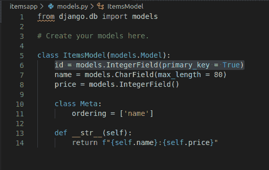
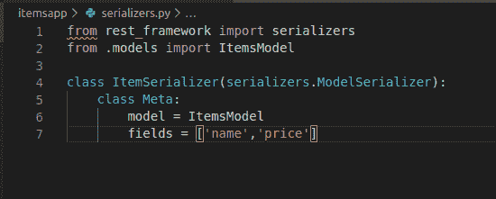
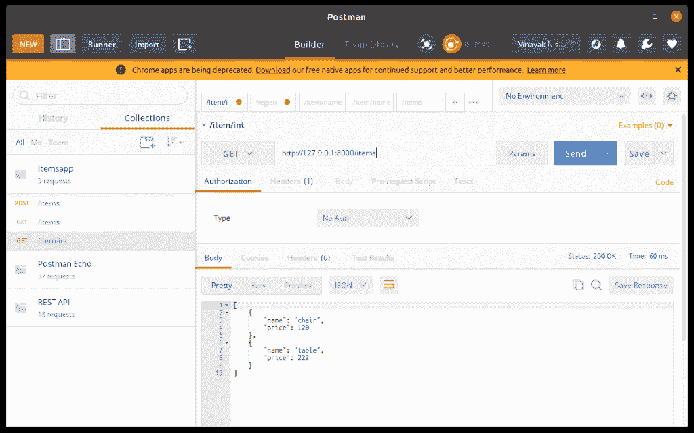
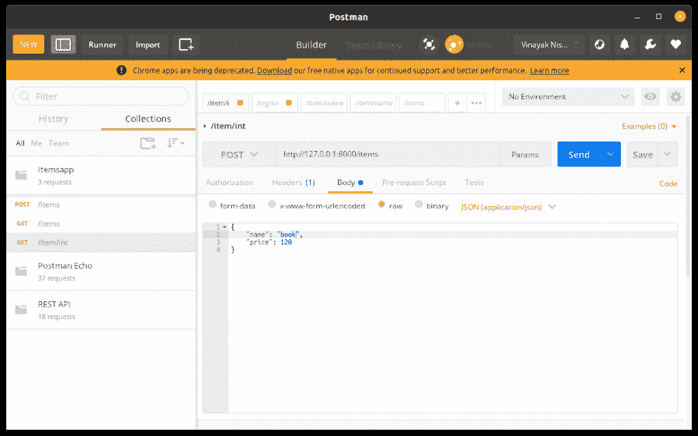
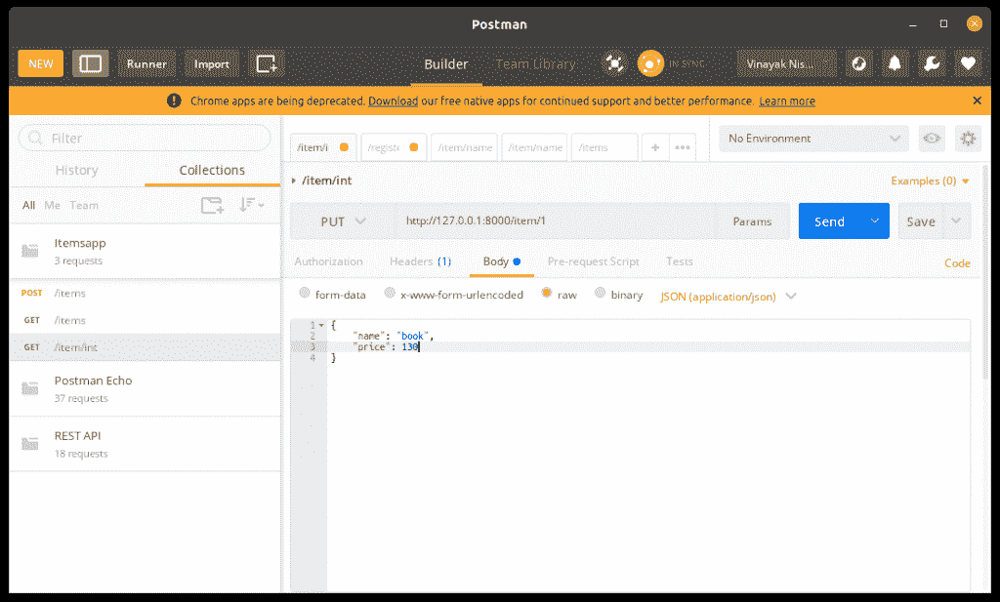

# Django 基于类的视图——如何构建基于类的 Django 视图？

> 原文：<https://www.askpython.com/django/django-class-based-views>

在本文中，我们将学习如何使用 Django 基于类的视图和我们的 [Django REST API](https://www.askpython.com/django/django-rest-api) ，然后将基于函数的视图改为基于类的视图。

## 基于类的视图与基于函数的视图之间的区别

在之前的文章中，我们使用基于函数的视图制作了整个 Rest API 网页。使用基于功能的视图，我们不能扩展视图的功能。这就是基于类的视图发挥作用的地方。

在本教程中，我们将学习使用这些功能，并使我们的代码比前一篇文章中的代码更简单。

## 在 views.py 中创建基于类的视图

基于类的视图的基本语法如下所示:

```py
class Name(APIView):

    def GET(self,request):
        ''' Code'''
        return response

    def POST(self,request):
        '''code'''
        return response

```

这里所有的 HTTP 方法都将作为特定类中的类方法。如果你学习了 Python 中的[面向对象编程，这很容易理解。](https://www.askpython.com/python/oops/object-oriented-programming-python)

因此，让我们创建能够在网页上显示项目列表的 **ItemsView 类**。此外，我们将通过创建一个 ItemView 来进一步扩展我们的知识，它将允许我们查看、编辑和删除列表中的特定项目。

```py
from rest_framework.views import APIView
from rest_framework import status

```

导入使用基于类的视图所需的上述两个库，然后编写以下代码:

```py
class ItemsView(APIView):
    def get(self,request,format =None):
        items = ItemsModel.objects.all()
        serializer = ItemSerializer(items, many =True)
        return JsonResponse(serializer.data, safe =False)

    def post(self,request,format =None):
        data = JSONParser().parse(request)
        serializer =ItemSerializer(data = data)

        if serializer.is_valid():
            serializer.save()
            return JsonResponse(serializer.data,status = status.HTTP_201_CREATED)
        return JsonResponse(serializer.errors,status = status.HTTP_400_BAD_REQUEST)

```

这里:

*   如果你熟悉基于函数的[视图](https://www.askpython.com/django/django-views)，你会使用 **@csrf_exempt** 令牌来保护你的网页不被伪造。但是使用基于类的视图，它已经包含在 **APIView，**中，因此你不需要单独添加它。
*   这里，我们需要给出一个**请求**作为每个类方法的参数。
*   HTTP 方法被写成类方法。
*   在 **get()** 类方法中，我们将数据库中的所有对象存储到 items 变量中。
*   然后，我们使用序列化程序将特定信息(存储在条目列表中)转换成 JSON 格式。由于我们已经从数据库中取出了所有的对象，所以将 many 设置为 TRUE。
*   一旦信息被转换成 JSON，我们就返回适当的 JSON 响应。
*   在 **post **()**** 类方法中，我们将在请求中从用户处获取< id >。
*   所以我们需要将`<id>`作为参数传递给**后类方法**。
*   由于用户将发送的信息是 JSON 格式的，我们需要将其转换成正确的 Python-Django 可读语法。
*   所以我们使用 **JSONParser** 来解析请求，以获得与新项目相关的数据，然后将其存储到变量数据中。
*   然后，我们使用序列化程序将从请求中获得的经过解析的 JSON 文本转换成 python 可读的语法。
*   现在，如果解析的序列化数据有效，那么我们保存它；否则，我们会显示一条错误消息。
*   Django rest_framework 为我们提供了上面给出的 HTTP 状态。所以我们可以直接使用它们。

### django Rest _ Framework–状态库

Django rest_framework 为我们提供了许多预装的 HTTP 状态，其中一些是:

*   **状态 201** :该属性在创建新对象时使用，我们使用

```py
status = status.HTTP_201_CREATED

```

*   **状态 400:** 当用户发出错误请求时使用该属性=

```py
status = status.HTTP_400_BAD_REQUEST

```

*   **状态 404:** 当用户询问的特定信息不在服务器中时，使用该属性。

```py
status = status.HTTP_404_NOT_FOUND

```

*   **状态 200:** 当一切如预期发生时，使用该属性。那就是过程被**【确定】**。

```py
status =status.HTTP_200_OK

```

类似地，我们也将创建 ItemView。

```py
class ItemView(APIView):

    def get_objects(self,nm):
        try: 
            return ItemsModel.objects.get(id = nm)
        except ItemsModel.DoesNotExist:
            raise Http404('Not found')

    def get(self,request,nm,format =None):
        item = self.get_objects(nm)
        serializer = ItemSerializer(item)
        return JsonResponse(serializer.data)

    def put(self,request,nm,format =None):
        item = self.get_objects(nm)
        data = JSONParser().parse(request)
        serializer = ItemSerializer(item,data = data)

        if serializer.is_valid():
            serializer.save()
            return JsonResponse(serializer.data)
        return JsonResponse(serializer.errors, status = status.HTTP_400_BAD_REQUEST)

    def delete(self,request,nm,format=None):
        item = self.get_objects(nm)
        item.delete()
        return HttpResponse(status =status.HTTP_204_NO_CONTENT)

```

这里:

*   同样， **@csrf_exempt** 不是必需的，因为它已经包含在 APIView 中
*   **try-except** 块用于在单独的类函数下获取用户请求的对象，因为每个类方法都会使用它。
*   在这里的 **[try 中——除了](https://www.askpython.com/python/python-exception-handling)块**，我们将该项目的 **id** 传递给函数，然后我们尝试从数据库中获取该项。如果这个东西存在，那么我们将它存储到一个 **item** 变量中；否则，我们会引发 HTTP 404 错误。
*   HTTP 方法作为类方法出现。
*   同样，在 HTTP class-methods 中，我们为 **GET** 和 **PUT** 方法编写了类似于上面视图的代码。
*   这里，我们添加了一个新的 DELETE 方法来删除特定的项。
*   Django rest_framework 为我们提供了上面给出的 HTTP 状态。所以用这个代替之前的。

就是这样，看看它和基于类的视图是多么简单。

## 基于类的视图的 URL 映射

由于我们的视图不再基于功能，我们将视图链接到 URL 的方式也将改变。

基于类的视图有其内置的功能**。as_view()，**利用它我们可以直接包含视图。

在 urls.py 中，我们使用了**。as_view()** 如下:

```py
urlpatterns = [
    path('items/', ItemsView.as_view()),
    path('item/<int:nm>/', ItemView.as_view()),
]

```

使用**非常容易。as_view()** 功能也一样。

在[上一篇文章](https://www.askpython.com/django/django-rest-api)中，我们详细了解了序列化文件、模型文件，并创建了 ItemModel。如果您没有检查过，请不要担心，我也会在这里发布代码。

**Models.py**



Models

**serializer . py**



Serializers

就是这样；现在重新运行服务器并签入 POSTMAN，我们应该得到与上一篇文章相同的输出。

## 在 POSTMAN 上运行服务器

为了进行检查，我们将需要 POSTMan，这是运行 REST APIs 的一种非常有效和快速的方式。如果想了解更多关于邮差的信息，可以查看[官方页面。](https://www.postman.com/api-platform/meet-postman)

### 1.获取/项目

在搜索按钮中输入端点，然后按发送。在这里，你会看到物品清单



GET Items

### 2.帖子/项目

现在，保持终点不变。将方法更改为 POST。我们得到和以前一样的输出。



POST Items

### 3.GET /item/

现在如上所述更改端点，并选择 GET 方法。然后点击发送。这里也一样，它将像以前一样工作。


GET Item

### 4.PUT /item/

同样，保持端点不变，将 HTTP 方法改为 POST，然后点击 send。



PUT Item

### 5.删除/item/

现在要删除一个特定的对象，在端点中输入 id，选择删除方法，然后点击 send。该项目将像以前一样被删除。


DELETE Item

## **结论**

就这样伙计们！这就是 Django 基于类的视图教程！我们希望您已经掌握了 Django 基于类的视图的所有基础知识，以及如何使用它们。另外，您可以从官方文档中了解更多关于 Django REST 框架的信息。

请继续关注 Django 主题的更多高级教程！