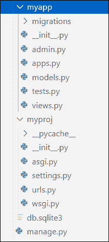

# 你必须知道的 8 个常见 Django 命令

> 原文：<https://www.askpython.com/django/django-commands>

在本 Python 教程中，我们将讨论 Django 初级开发人员应该知道的 8 个 Django 命令。那么让我们开始讨论吧。

***亦读:[姜戈简介](https://www.askpython.com/django/django-forms)***

* * *

## 适用于初学者的 8 大 Django 命令

事不宜迟，让我们从不同的 Django 命令开始，作为初学者，您必须了解这些命令，以便轻松完成工作。虽然你可以一直走传统路线，使用鼠标和键盘，用 GUI 工作，但这不是程序员的方式！这就是为什么我决定编制这个清单。

### 1.创建 Django 项目

如果您熟悉 Django，您会知道 Django 提供了文件、文件夹和设置的初始集合来启动我们的项目。要创建初始的 Django 项目结构，打开您的 OS 终端并`cd`到您想要保存 Django 项目代码的目录或文件夹。然后在选择的终端上运行下面的命令，这将在当前的工作目录中创建一个目录/文件夹，其中包含命令中提供的<项目名称>。

```py
> django-admin startproject <project_name>

```

**输出:**


Django Project Directory Structure

### 2.进行迁移命令

将为[模型类](https://www.askpython.com/django/django-models)(进一步表示数据库中的表)编写的 Python 代码转换成数据库查询。每当我们对数据库类模型进行任何类型的更改时，都有必要运行这个命令。要运行以下命令，移动到包含`manage.py`文件的项目文件夹中，该文件将在主项目目录中创建必要的数据库文件。

```py
> python manage.py makemigrations

```

**输出:**


Django’s Default database SQLite3 File Created

### 3.迁移命令

我们需要运行这个命令，根据定义的 Python 类模型在指定的数据库中创建表。此命令负责应用或取消应用迁移。当我们第一次运行这个命令时，所有与默认应用程序(由 Django 框架提供)相关的迁移都会被应用。

```py
> python manage.py migrate

```

**输出:**

```py
Operations to perform:
  Apply all migrations: admin, auth, contenttypes, sessions
Running migrations:
  Applying contenttypes.0001_initial... OK
  Applying auth.0001_initial... OK
  Applying admin.0001_initial... OK
  Applying admin.0002_logentry_remove_auto_add... OK
  Applying admin.0003_logentry_add_action_flag_choices... OK
  Applying contenttypes.0002_remove_content_type_name... OK
  Applying auth.0002_alter_permission_name_max_length... OK
  Applying auth.0003_alter_user_email_max_length... OK
  Applying auth.0004_alter_user_username_opts... OK
  Applying auth.0005_alter_user_last_login_null... OK
  Applying auth.0006_require_contenttypes_0002... OK
  Applying auth.0007_alter_validators_add_error_messages... OK
  Applying auth.0008_alter_user_username_max_length... OK
  Applying auth.0009_alter_user_last_name_max_length... OK
  Applying auth.0010_alter_group_name_max_length... OK
  Applying auth.0011_update_proxy_permissions... OK
  Applying auth.0012_alter_user_first_name_max_length... OK
  Applying sessions.0001_initial... OK

```

### 4.收集静态文件

在 Django 中，我们以不同的方式处理静态文件。建议创建一个单独的文件夹，并将所有静态文件保存在那里。我们需要这些 Django 命令来让它知道主项目目录中存在的静态文件。

```py
> python manage.py collectstatic 

```

**输出:**

```py
You have requested to collect static files at the destination
location as specified in your settings.

This will overwrite existing files!
Are you sure you want to do this?

Type 'yes' to continue, or 'no' to cancel:

```

### 5.创建 Django 应用程序

Django 项目是一个网站的应用程序和配置的集合。一个项目中可以有多个应用程序，一个应用程序可以包含在几个 Django 项目中。在 Django 项目中创建 Django 应用程序需要这个命令，它将生成 Django 应用程序的基本目录结构。

```py
> python manage.py startapp <app_name>

```

**输出:**



Django App Directory Created

### 6.创建超级用户

这是登录 Django 框架提供的默认管理界面面板必不可少的命令。需要这个命令来为管理界面创建一个超级用户，这个超级用户拥有用户名、密码和所有其他访问和管理 Django 网站的必要权限。

```py
> python manage.py createsuperuser

```

**输出:**

```py
Username (leave blank to use 'inspiron'): Username
Email address: [email protected]
Password: 
Password (again): 
This password is too short. It must contain at least 8 characters.
This password is too common.
This password is entirely numeric.
Bypass password validation and create user anyway? [y/N]: y
Superuser created successfully.

```

### 7.更改密码

有可能，我们忘记了默认管理界面面板的密码。然后，重置它变得非常必要，因为没有密码，我们将无法访问默认的管理界面面板。我们必须提供适当的`<username>`，在运行该命令时必须重置其密码。

```py
> python manage.py changepassword <username>

```

**输出:**

```py
Changing password for user 'Username'
Password: 
Password (again): 
Password changed successfully for user 'Username'

```

### 8.运行服务器

这也是非常重要和最常用的 Django 命令之一。我们需要这个命令通过在本地服务器上运行来验证和测试我们的 Django 应用程序和网站。默认情况下，该命令在端口号为 8000 的内部 IP 上运行 Django 开发服务器。如果需要，我们还可以通过将它们作为命令行参数发送来更改开发服务器的 IP 和端口号。

```py
> python manage.py runserver 

```

**输出:**

```py
Watching for file changes with StatReloader
Performing system checks...

System check identified no issues (0 silenced).
August 30, 2021 - 15:16:23
Django version 3.2.5, using settings 'myproj.settings'
Starting development server at http://127.0.0.1:8000/
Quit the server with CTRL-BREAK.

```

## 结论

在这个 Python 教程中，我们学习了 Django 的 8 个顶级命令，这些命令应该是初级 Django 开发人员都知道的。希望你已经理解了上面讨论的概念，并准备建立自己的 Django 网站或应用程序。感谢阅读！请继续关注我们，获取更多关于 Python 编程的精彩学习资源。别忘了看看我们的 [Django 教程系列](https://www.askpython.com/django/django-forms)。