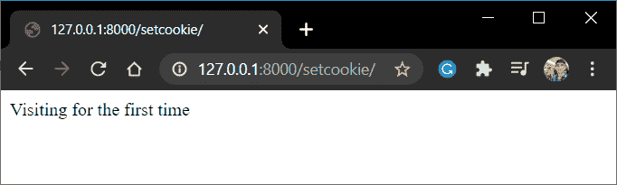
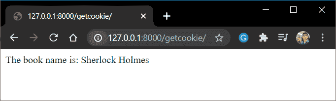

# Django Cookies 在 Django 中设置用户 cookie

> 原文：<https://www.askpython.com/django/django-cookies>

在本文中，我们将讨论如何为我们的 web 应用程序设置 Django cookies。我们将从讨论使用 cookie 背后的理论和原因开始，然后在文章的最后用 Django 实现 cookie。所以让我们开始吧！

## 什么是饼干？

cookie，技术上称为**HTTP cookie**，是存储在客户端浏览器上的一条信息(存储在一个文件中)，在请求时发送到网站服务器。

由于 cookie 保存在客户端，所以它是否能够将这些 cookie 发送到 web 服务器取决于客户端的安全级别。

它可以永久保存，也可以保存一段时间。每个 cookie 都有自己的专家日期和时间，一旦过期，就会自动从客户端的浏览器中删除。

## 饼干是如何工作的？

Http 是一种无状态协议，这意味着 web 服务器无法区分您是第一次访问该页面，还是之前已经访问过该页面。

所以当你第一次访问一个页面的时候，服务器会用 cookies 来响应浏览器，cookies 包含了服务器生成的用户信息等信息。

该 cookie 存储在您的浏览器中。因此，当您再次访问时，先前生成的 cookie 也会随 HTTP 请求一起发送到服务器。然后，服务器可以读取 cookie 并执行适当的任务。

浏览器会一直发送 cookies，直到它们过期，过期后会自动从浏览器中丢弃。

## **为什么要用饼干？**

在任何电子商务或社交媒体网站，如脸书，你可能已经注意到，如果你离开网站没有注销，下次你去该网站，你的帐户继续保持登录状态。这是使用 cookies(包含用户会话信息)完成的

同样，在许多电子商务网站上，你会得到不同产品的推荐。这也是因为 cookies 在你的浏览器中存储了搜索信息。

## **动手制作 Django Cookies**

我们现在将看到 cookies 的一个简单应用，并学习如何使用它们。Django 提供了一个使用 cookies 的内置方法。

## 1) Django Cookie 属性

Django cookie 属性可以执行两种操作之一。它可以在用户的计算机中放一个 cookie(set)然后访问这些 cookie(get)。让我们看看这两种方法。

### **设置 cookie** s

这个 cookie 属性创建一个 cookie，然后由服务器 **发送**到用户浏览器**来存储信息。set_cookie()的语法是:**

```py
set_cookie(cookie_name, value, max_age = None, expires = None) 

```

### **获取饼干**

服务器使用这个属性来取回以前发送的 cookies 并从中读取数据。获取 cookie 的语法是:

```py
request.COOKIES['cookie_Name']

```

## 2) C **修改视图**

现在我们知道了 Django cookies 可以使用的方法，让我们设置视图来设置这些 cookie，然后访问它们。我们将在 Django views 文章的基础上建立 cookies。

### 发送 Cookie 的视图

将以下视图添加到 views.py 文件中

```py
def SetCookie(request):
    response = HttpResponse('Visiting for the first time')
    response.set_cookie('bookname','Sherlock Holmes')
    return response

```

URL 路径将是:

```py
path('setcookie/', SetCookie),

```

### 用于取回 Cookie 的视图

将以下视图添加到您的 views.py 中

```py
def GetCookie(request):
    bookname = request.COOKIES['bookname']
    return HttpResponse(f'The book name is: {bookname}')

```

URL 路径将是:

```py
path('getcookie/', GetCookie),

```

## **cookie 的实现**

既然我们已经讨论了所需的单个视图，下面是 Views.py 的组合脚本(包括上面的代码)

只需在您的 **views.py** 中添加以下代码以及 URL 映射，我们就可以开始了:

```py
from django.shortcuts import HttpResponse

def SetCookie(request):
    response = HttpResponse('Visiting for the first time')
    response.set_cookie('bookname','Sherlock Holmes')
    return response

def GetCookie(request):
    bookname = request.COOKIES['bookname']
    return HttpResponse(f'The book name is: {bookname}')

```

urls.py 文件将类似于:

```py
from django.contrib import admin
from django.urls import path
from .views import SetCookie, GetCookie

urlpatterns = [
    path('setcookie/', SendCookie),
    path('getcookie/', GetCookie),
]

```

就这样，伙计们！！现在让我们运行服务器并进行检查！！



Set Cookie



Get Cookie

## **结论**

就这样，伙计们！！这就是关于 Django cookies 以及如何在项目中使用它们的全部内容。一定要练习上面的代码来增加你对 cookies 的理解。

下一篇文章再见！！在那之前继续编码！！