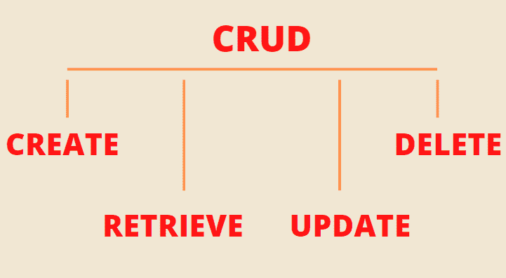
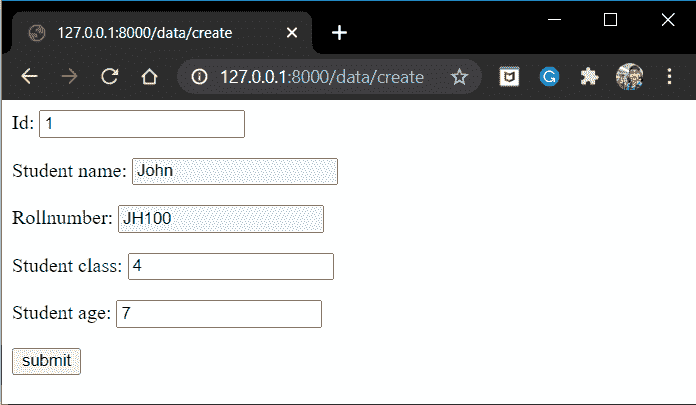
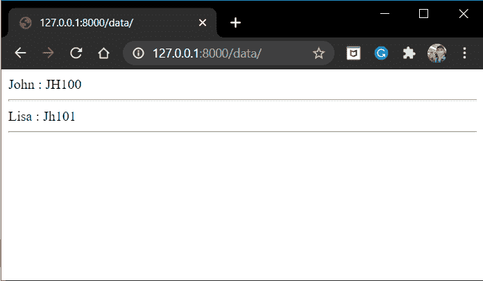
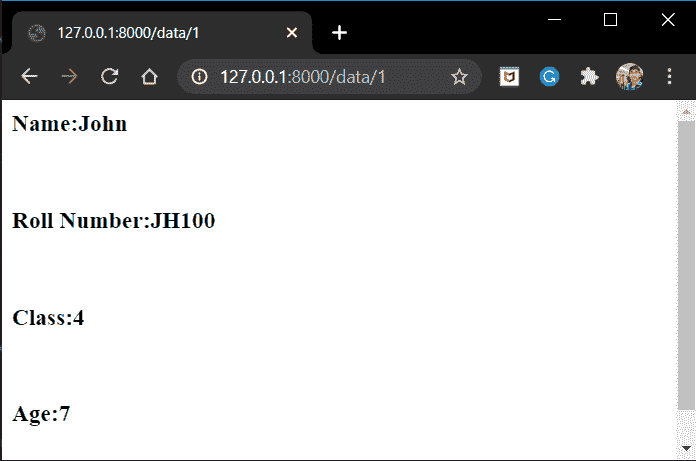
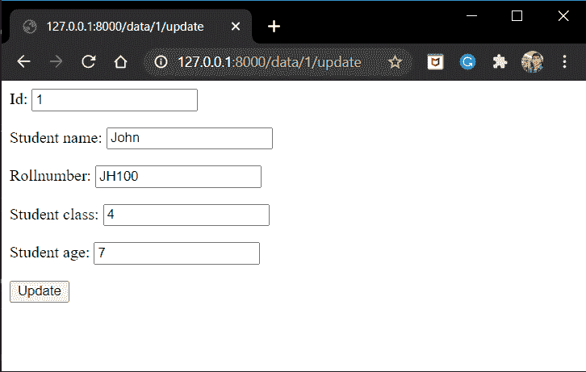
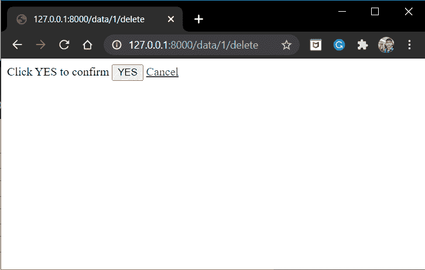

# Django CRUD 应用程序

> 原文：<https://www.askpython.com/django/django-crud-application>

在本文中，我们将了解 Django CRUD 应用程序由什么组成，然后创建我们自己的 CRUD 应用程序。

## 什么是 Django CRUD 应用程序？

CRUD 应用程序是一个处理**CRUD——创建、检索、更新和删除**操作的网站。CRUD 应用程序的一个典型例子是**学生数据**应用程序。在此类应用中，您可以:

*   **添加/创建**新的学生数据
*   **检索**当前学生的数据
*   **更新/编辑**已经是学生的数据
*   **删除**一个学生数据

我们现在将了解这些操作中的每一项



CRUD

*   **创建:**在数据库中创建或添加新条目
*   **检索:**从数据库中获取条目
*   **更新:**更新数据库中的特定条目
*   **删除:**从数据库中删除特定条目

## 在 Django 中创建我们自己的 CRUD 应用程序

现在让我们创建一个简单的**学生数据** CRUD 应用程序。

### 1.创建模型表

为了存储数据，我们需要创建一个 [Django 模型](https://www.askpython.com/django/django-models)。因此，将以下模型添加到您的文件中。

```py
class StudentModel(models.Model):
    id = models.IntegerField(primary_key = True)
    student_name = models.CharField(max_length=80)
    rollnumber = models.CharField(max_length=10)
    student_class = models.IntegerField()
    student_age = models.IntegerField()

    def __str__(self):
        return f"{self.student_name} : {self.rollnumber}"

```

### 2.创建模型表单

我们还需要一个[模型表单](https://www.askpython.com/django/django-model-forms)来向用户显示模型字段。

```py
class StudentForm(forms.ModelForm):
    class Meta:
        model = StudentModel
        fields = ('id','student_name','rollnumber','student_class','student_age')

```

### 3.编写创建视图的代码

在 Views.py 中创建视图**“create View”**并添加以下代码:

```py
from .models import StudentModel
from .forms import StudentForm
from django.shortcuts import render,redirect

def CreateView(request):
    if request.method == 'POST':
        form = StudentForm(request.POST)
        if form.is_valid():
            form.save()
            return redirect('/data')
    else:
        form =StudentForm()
        context = {
            'form':form
        }
        return render(request,'create.html',context)

```

模板**“create . html**”将看起来像:

```py
<form method = "post">
    
    {{form.as_p}}
    <input type = "submit" value = "submit">
</form>

```

视图的 URL 路径将是:

```py
path('data/create', CreateView),

```

### 4.对检索视图进行编码

现在在检索操作中，有两种可能的方法

*   显示所有数据列表 **( [Django 列表视图](https://www.askpython.com/django/django-listview) )**
*   仅显示特定数据 **( [Django 详细视图](https://www.askpython.com/django/django-detailview) )**

因此，将以下两个视图添加到 views.py 文件中

```py
from django.shortcuts import render,redirect
from .models import StudentModel
from .forms import StudentForm

def Retrieve_ListView(request):
    dataset = StudentModel.objects.all()
    return render(request,'listview.html',{'dataset':dataset})

def Retrieve_DetailView(request,_id):
    try:
        data =StudentModel.objects.get(id =_id)
    except StudentModel.DoesNotExist:
        raise Http404('Data does not exist')

    return render(request,'detailview.html',{'data':data})

```

相应的 **ListView** 模板将是:

```py

{{data}}
<hr>


```

相应的**详细视图**模板将是:

```py
<h3>Name:{{data.student_name}}</h3><br>
<h3>Roll Number:{{data.rollnumber}}</h3><br>
<h3>Class:{{data.student_class}}</h3><br>
<h3>Age:{{data.student_age}}</h3><br>
<hr/>

```

视图的 URL 路径将是:

```py
    path('data/', Retrieve_ListView),
    path('data/<int:_id>',Retrieve_DetailView),

```

### 5.更新视图编码

现在将下面的更新视图添加到 views.py 文件中

```py
from django.shortcuts import render,redirect,get_object_or_404
from .models import StudentModel
from .forms import StudentForm

def UpdateView(request,_id):
    try:
        old_data = get_object_or_404(StudentModel,id =_id)
    except Exception:
        raise Http404('Does Not Exist')

    if request.method =='POST':
        form =StudentForm(request.POST, instance =old_data)

        if form.is_valid():
            form.save()
            return redirect(f'/data/{_id}')

    else:

        form = StudentForm(instance = old_data)
        context ={
            'form':form
        }
        return render(request,'update.html',context)

```

相应的**update.html**模板将看起来像这样:

```py
<form method="post">
    
    {{form.as_p}}
    <input type="submit" value = "Update">
</form>

```

视图的 URL 路径将是:

```py
path('data/<int:_id>/update', UpdateView),

```

### 6.对删除视图进行编码

现在将**删除视图**添加到 views.py 文件中

```py
def DeleteView(request,_id):
    try:
        data = get_object_or_404(StudentModel,id =_id)
    except Exception:
        raise Http404('Does Not Exist')

    if request.method == 'POST':
        data.delete()
        return redirect('/data')
    else:
        return render(request, 'delete.html')

```

相应的**delete.html**会是什么样子:

```py
<form method="post">
    
    Click YES to confirm
    <input type = "submit" value="YES">
    <a href='/data'>Cancel</a>
</form>

```

视图的 URL 路径将是:

```py
path('data/<int:_id>/delete', DeleteView),

```

## **实现学生应用**

编码部分就这样了！！现在启动服务器，让我们转到“ **/data/create** ”端点



Create

点击提交，您将到达显示学生列表的 **"/data"** 页面。



Retrieve List View

现在尝试“ **/data/1** ”端点



Retrieve Detail View

好了伙计们。！让我们更新第一个条目。转到“**/数据/1/更新**”



Update

进行一些更改并点击“更新”,您将被重定向到特定学生的详细视图页面。

最后，让我们尝试删除第一个学生。进入**/数据/1/删除**



Delete

点击 **YES** 并检查，特定的学生数据将从数据库中删除。

## **结论**

就这样，编码员们！！这都是关于 **CRUD** 应用程序的。一定要看看 **[Django REST API](https://www.askpython.com/django/django-rest-api)** 教程，这是一个 CRUD 应用程序的 REST API 版本。

下一篇文章再见！！在那之前继续编码！！