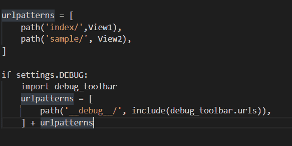
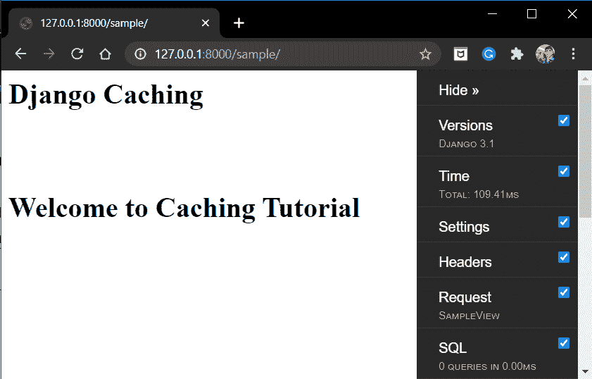

# Django 调试–在你的 Django 网页上添加一个调试栏

> 原文：<https://www.askpython.com/django/django-debugging>

在本文中，我们将讨论如何执行 Django 调试。我们将学习 web 开发中需要的一项重要技术，称为调试，然后进一步学习如何将调试器工具添加到我们的网站中。

所以让我们开始吧！！

## **调试的艺术**

不管有多专业，每个开发人员都会在生命的某个阶段处理错误。此外，调试错误不是一件容易的事情；首先指出错误并消除它需要花费大量时间。因此，每个开发人员都必须了解调试。

但是有了 Django，你猜怎么着，调试过程对你来说变得简单多了。您只需要在您的 web 应用程序上安装 Django 调试器工具，就可以了。

因此，现在我们知道了为什么调试是必不可少的，让我们开始动手吧。

## Django 中调试的先决条件

现在要使用调试工具栏，我们需要一个网站。如果你有你的[项目](https://www.askpython.com/django/django-app-structure-project-structure)，你可以使用它。否则，添加下面的[视图](https://www.askpython.com/django/django-views)和相应的 URL 路径。

```py
def SampleView(request):
    Html = '<body><h1>Django Caching<h1><br><p>Welcome to Caching Tutorial</p></body>'
    return HttpResponse(html)

```

确保 **<体>** 存在；否则，调试器工具将不会显示在网页上，其模板没有 **< body >标签。**

代码的 [URL 路径](https://www.askpython.com/django/django-url-mapping)将是:

```py
path('sample/', SampleView),

```

现在，对于下一部分，您可以以上面显示的任何形式存储缓存:

## Django 调试器工具

调试器工具包括各种调试选项，我们可以在特定的网页上使用。我们现在将研究工具栏提供的各种工具

*   **Version:** 给出了我们正在使用的 Django 的版本。
*   **时间**:显示加载网页所用的时间
*   **设置:**显示网页的设置
*   **请求:**显示所有被请求的元素——视图、cookies 等。
*   **SQL:** 显示 SQL DB 调用的列表
*   **静态文件:**给出关于静态文件的信息
*   **模板:**给出关于模板的信息
*   **高速缓存:**告知关于当前高速缓存的信息
*   **日志:**显示注册的日志数量。(参见 [Django Logging](https://www.askpython.com/django/django-logging) 了解日志信息)

## **安装 Django 调试工具**

在这一节中，我们将安装 Django 调试器工具栏所需的所有需求

### 1)安装 Django 调试器工具栏

为了安装 Django 调试器工具栏，我们使用了 [pip install](https://www.askpython.com/python-modules/python-pip) 命令。在终端/shell 中运行以下代码:

```py
pip install django-debug-toolbar

```

### 2)在 INSTALLED_APPS 中添加调试器工具

在 settings.py 中，在 **INSTALLED_APPS** 部分添加以下行

```py
INSTALLED_APPS = [
    # ...
    'debug_toolbar',
]

```

还要确保 settings.py 文件中存在以下行

```py
STATIC_URL = '/static/'

```

上面的代码应该已经存在，但如果它不存在，那么只需在最后添加上面的代码。

### 3)将调试工具栏导入到 urls.py

要在网页上使用**调试工具栏**，我们必须链接到网页的 URL 路径。

因此，在 urls.py 中，添加代码:

```py
from django.conf import settings
from django.URLS import path,include

if settings.DEBUG:
    import debug_toolbar
    urlpatterns = [
        path('__debug__/', include(debug_toolbar.urls)),
    ] + urlpatterns

```

确保在 settings.py 中将 **DEBUG** 设置为 **TRUE** ，这样才能工作。

这里我们将 debug_toolbar 添加到 URL 模式列表中，所有其他的 URL 都在这里



Debug ToolBar urls.py

### 4)启用中间件

必须将与 Django 调试工具栏相关联的中间件添加到 settings.py 中的**中间件**部分

```py
MIDDLEWARE = [
    # ...
    'debug_toolbar.middleware.DebugToolbarMiddleware',
]

```

### 5)提及 INTERNAL_IPS

只有当 IP 出现在 settings.py 中的 **INTERNAL_IPS** 列表中时，才会显示调试工具栏。出于本地开发的目的，将 IP**127 . 0 . 0 . 1**添加到列表中。

```py
INTERNAL_IPS = [
    '127.0.0.1',
]

```

如果 **INTERNAL_IPS** 列表不存在，则在 settings.py 的最后添加上述列表，并添加 IP“127 . 0 . 0 . 1”

## **Django 调试工具的输出**

添加所有代码后，在您首选的浏览器中访问 **127.0.0.1:8000/sample/** 。

如果您看到下面的输出，您的实现是成功的！如果没有，检查上面的代码是否在您的文件中丢失了。



Debug toolbar

就是这样，工具栏会出现在网页的右侧。

## **结论**

就这样，伙计们！！这也是关于 Django 调试器的。请务必查看 Django 异常处理文章，以了解更多关于调试异常的信息。

下一篇文章再见！！在那之前，继续练习！！