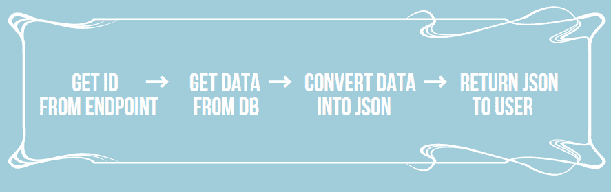
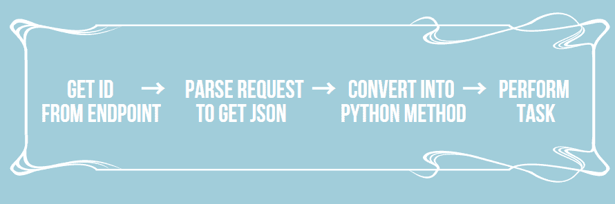
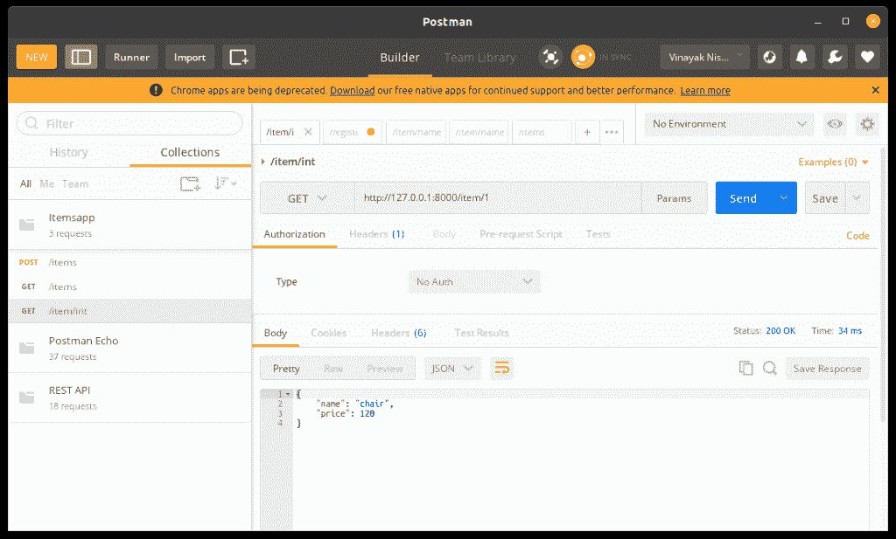
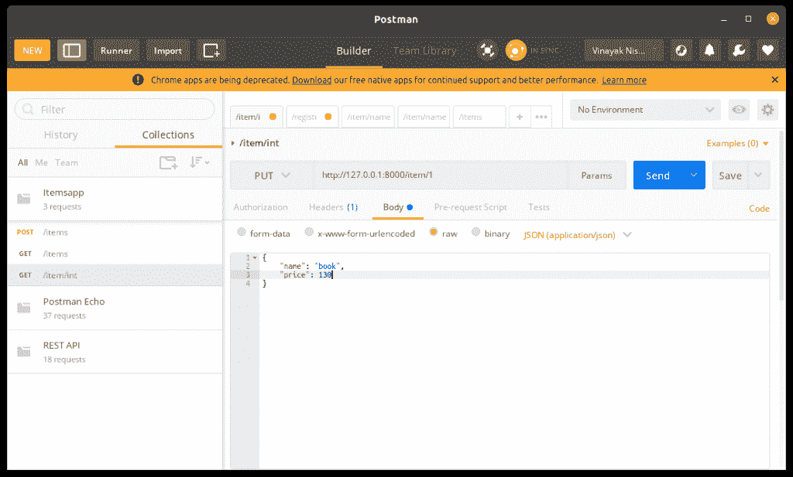
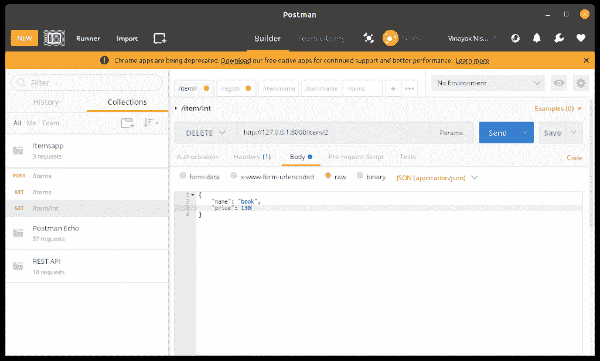

# Django Detail view–如何在 Django 中创建细节视图？

> 原文：<https://www.askpython.com/django/django-detailview>

在本文中，我们将了解 Django DetailView。

## 什么是 Django 详细视图？

Django DetailView 指的是显示模型表中单个实例的视图类型。它用于显示数据库中单个条目的信息，并对该实例执行不同的任务。

## django detailsview 的先决条件

这个主题的先决条件与我们的 ListView 文章中列出的完全相同。先决条件的代码添加在下面，您可以浏览它们。

如果您觉得需要一个解释，请仔细阅读 [ListView 文章](https://www.askpython.com/django/django-listview)中列出的先决条件，然后您可以在这里继续创建 Django 详细视图。

### Models.py 中的项目模型

```py
class ItemModel(models.Model):
    id = models.IntegerField(primary_key = True)
    name = models.CharField(max_length = 80, blank = False)
    price = models.IntegerField

    class Meta:
        ordering = ['name']

    def __str__(self):
        return f"{self.name}:{self.price}"

```

### Serializers.py 中的 ItemSerializer

```py
from rest_framework import serializers
from .models import ItemModel

class ItemSerializer(serializers.ModelSerializer):
    class Meta:
        model = ItemModel
        fields = ['id',name','price']

```

### 详细视图的 URL 端点

此外，端点将简单地为 **/item/ < id >** ，因为详细视图只关注显示数据库中具有特定 **id** 的实例。

Url 映射的代码:

```py
path('item/<id>', ItemView.as_view())

```

就这样，现在我们将学习用两种不同的方法创建一个细节视图。

## 详细视图的代码逻辑

在上一篇文章中，您看到了 ListView 的逻辑。细节视图也有其逻辑，从端点请求获得 **< id >** ，然后进一步执行必要的任务。

这类似于 ListView，但它的基本格式有一些变化，因为我们在这里处理的是**端点数据**。

首先，我们将获取端点数据，这基本上是用户将随请求一起发送的**条目 id** 。

### **服务器与用户交互的代码逻辑**

逻辑很简单，经过下面概述的步骤后就可以理解了:

1.  使用我们之前获得的 **id，**,从 DB 中检索商品信息。
2.  使用序列化程序将信息转换成 JSON 格式。
3.  通过模板或直接作为 JSON 显示给用户。

基本流程图如下所示:



### 用户与服务器交互的代码逻辑

这个逻辑有点像我们在上一节中所做的逆向过程。

1.  将 JSON 数据与请求的其余部分分离(解析)。
2.  来自用户的 JSON 数据必须使用序列化器转换成 Django 可读格式(python-dictionary)
3.  对其 id 在端点请求中发送的项目进行必要的更改(**添加、编辑、删除**)。

基本流程图如下所示:



## **创建 Django 详细视图**

### 1.**基于功能的详细视图**

基于函数的详细视图的示例代码如下:

```py
@csrf_exempt
def ItemView(request,nm):
    try: 
        item = ItemsModel.objects.get(id = nm)
    except ItemsModel.DoesNotExist:
        raise Http404('Not found')

    if request.method == 'GET':
        serializer = ItemSerializer(item)
        return JsonResponse(serializer.data)

    if request.method == 'PUT':
        data = JSONParser().parse(request)
        serializer = ItemSerializer(item,data =data)

        if serializer.is_valid():
            serializer.save()
            return JsonResponse(serializer.data)
        return JsonResponse(serializer.errors, status =400)

    if request.method == "DELETE":
        item.delete()
        return HttpResponse(status =204)

```

请记住上一节中给出的我们用 DetailView API 执行的步骤，并尝试理解代码。

1.  从端点请求中获取 id
2.  **try-except block** :如果该项存在，则从 DB 中获取对象信息并保存在变量 **item** 中。
3.  **def GET** :将**项**变量转换成 JSON(串行器)→显示 JSON 数据
4.  **def PUT:** 解析请求以分离 JSON 数据→转换为 Python 格式→更新 DB 中关于该项的数据
5.  **def DELETE:** 从数据库中删除项目。

### 2.**基于类别的详细视图**

基于类的视图比函数视图更好，因为使用了类，代码变得更加系统化、结构化和可读。

基于类的 DetailView 的示例代码如下:

```py
class ItemView(APIView):

    def get_objects(self,nm):
        try: 
            return ItemsModel.objects.get(id = nm)
        except ItemsModel.DoesNotExist:
            raise Http404('Not found')

    def get(self,request,nm,format =None):
        item = self.get_objects(nm)
        serializer = ItemSerializer(item)
        return JsonResponse(serializer.data)

    def put(self,request,nm,format =None):
        item = self.get_objects(nm)
        data = JSONParser().parse(request)
        serializer = ItemSerializer(item,data = data)

        if serializer.is_valid():
            serializer.save()
            return JsonResponse(serializer.data)
        return JsonResponse(serializer.errors, status = status.HTTP_400_BAD_REQUEST)

    def delete(self,request,nm,format=None):
        item = self.get_objects(nm)
        item.delete()
        return HttpResponse(status =status.HTTP_204_NO_CONTENT)

```

同样，编写代码的方式也发生了变化。我们使用类方法和类内函数(**在本例中，try-except 块在一个单独的类函数中)**来编写代码。但逻辑的关键仍然是一样的。

## **detail view API 的实现**

就是这样。我们已经基本完成了代码，是时候为这个演示运行一些测试了。

让我们尝试运行基于函数和基于类的视图。

我们将使用 POSTMAN 来运行 REST APIs。邮差的[官网](https://www.postman.com/api-platform/meet-postman)讲工具的好处。让我们继续演示吧。



GET Item

在上面的截图中，你可以看到 GET in action。我们显示从数据库中提取的“id 1”数据



PUT Item

上面的截图演示了 PUT。



DELETE Item

看看当我们在它上面运行 DELETE 命令时，命令输出是什么样子。

## **结论**

就这样，伙计们！！Django 中的 DetailView 就是这么做的。基于**请求数据(< id > )** 从模型中取出一个实例，然后显示它，从数据库中添加、编辑或删除项目实例。

更多此类有趣话题敬请期待！！注意安全！！