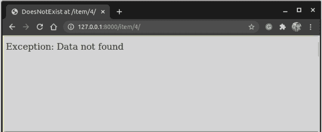

# Django 异常处理——简单的操作方法

> 原文：<https://www.askpython.com/django/django-exception-handling>

在本文中，我们将以非常简洁的方式学习 Django 异常处理，同时涵盖 Django 中的大多数异常和错误消息。

## 为什么我们需要处理异常？

作为一名开发人员，您会在制作 web APIs、模板或编写任何其他代码时遇到各种各样的错误。

处理它们是一个非常耗时的过程，但也是一项必不可少的任务，因此这种异常和错误处理的关键技能就出现了。

## 什么是例外？

编码中的异常是那些导致不良事件的事件类型。这些是由运行时执行程序(如控制台和终端)或操作系统检测的。

它们不一定会停止整个程序，但会导致不希望的输出。

**例如:**

假设客户希望从数据库中看到一个特定的对象。但是由于某种原因，那个特定的对象不在那里。

在这种情况下，服务器不会停止，但是客户机会得到一个错误，因为对象不在 DB 中，这是不希望的。

### **异常和错误的主要区别**

**错误**是指导致整个系统停止运行，程序无法执行的事件。

有错误什么也做不了；我们只能检测，然后做出适当的改变，使它们不会发生。

另一方面，**异常**是开发者可以处理的事情，而不会让系统停止。

## **Django 异常的类型**


Exception Handling

Django 中有很多种例外，其中**五个**是极其重要的**和使用最频繁的**。****

*   Django 异常类
*   Django URL 解析程序异常
*   Django 数据库异常
*   Django Http 异常
*   Django 交易异常

我们将详细了解它们。

### 1) **Django 异常类**

| 身份证明 | 例外 | 描述 |
| --- | --- | --- |
| one | **AppRegistryNotReady** | –当 Django 模型在 Django 应用程序本身之前加载时，就会出现这种情况。
–当您编写自己的脚本而不是使用默认的 Django 应用程序文件时，会出现此异常。 |
| Two | **对象目标神经学家** | 顾名思义，当对象不存在时发生。 |
| three | **经验值结果集** | 当查询返回空集时发生 |
| four | **字段不存在** | 当模型中不存在字段时，会出现这种情况。 |
| five | **返回了多个对象** | 当查询返回多个结果时，会出现这种情况 |
| six | **可疑操作** | 当客户端出于安全原因做了一些可疑的事情时，就会发生这种情况 |
| seven | **权限被拒绝** | 当用户试图执行不允许他执行的任务时发生 |
| eight | **ViewDoesNotExist** | 当视图不存在时发生 |
| nine | **未使用的中间件** | 当 settings.py 的中间件部分没有使用特定的中间件时，就会出现这种情况 |
| Ten | **配置不正确** | 当 Django 配置不正确时，就会出现这种情况。在使用默认的 Django 文件时通常不会发生这种情况。 |
| Eleven | **字段错误** | 当模型字段中有错误时发生 |
| Twelve | **验证错误** | 当表单或模型表单中的数据验证失败时发生。 |

Django Exception classes

### 2) **Django URL 解析器异常**

| 身份证明 | 例外 | 描述 |
| --- | --- | --- |
| one | **解析器 404** | –由 Django.http.Http404 库的一部分函数 **resolve()** 引发。
–当路径()没有可映射的有效视图时出现异常。 |
| Two | **不匹配** | 当用户搜索错误的端点时，会出现这种情况。 |

Django URL Resolver Exceptions

### 3) **Django 数据库异常**

| 身份证明 | 例外 | 描述 |
| --- | --- | --- |
| one | **DatabaseError** | 当数据库不可用时发生 |
| Two | **完整性错误** | –当 DB 需要某个字段的值，但没有从用户处获得该值时，会出现这种情况。
–如果为真， **Django** 将在数据库中将空值存储为 NULL。默认值为 False。 |
| three | **数据错误** | 因数据相关问题而发生 |

Django Database Exceptions

### 4) **Django Http 异常**

这一点我们已经见过很多次了。这些是我们从 **django.http** 库中导入的 HTTP 异常

| 身份证明 | 例外 | 描述 |
| --- | --- | --- |
| one | **UnreadablePostError** | 当用户取消上载时发生。 |

Django Http Exceptions

### 5) **Django 交易异常**

| 身份证明 | 例外 | 描述 |
| --- | --- | --- |
| one | **交易管理错误** | 所有因数据库事务而出现的问题都会引发此问题 |

Django Transaction Exceptions

## **Django 应用中异常处理的简单实现**

我们将在一个应用程序上执行一个简单的 **DoesNotExist** 异常处理，显示服务器中某个特定项目的信息。

该代码是 REST API 文章中构建的 Web 应用程序 **itemsapp** 的一部分。

Itemsapp 是一个简单的 REST API 应用程序，它允许客户端

1.  查看服务器中存在的项目列表(获取端点:`hostwebsite/items`)
2.  向数据库中添加一个新项目(POST 端点:`hostwebsite/items`)
3.  查看特定项目(GET endpoint:`hostwebsite/item/<id>`)
4.  编辑特定项目(PUT endpoint:`host website/item/<id>`)
5.  删除特定项目(删除端点:`hostwebsite/item/<id>`)

要了解如何创建完整的 web 应用程序，请阅读 Rest API 文章。

现在我们将创建一个显示来自**数据库**的特定商品信息的**网页**

*   在 models.py 中创建一个 ItemModel 来存储关于项目的信息:

```py
from django.db import models

# Create your models here.

class ItemsModel(models.Model):
    id = models.IntegerField(primary_key = True)
    name = models.CharField(max_length = 80)
    price = models.IntegerField()

    class Meta:
        ordering = ['name']

    def __str__(self):
        return f"{self.name}:{self.price}"

```

*   如上图所示， **urls.py** 中的 URL 路径将是:

```py
path('/item/<int:nm>',Item)

```

现在只需通过管理网站添加一些项目到数据库中。


Admin

*   现在在 **views.py** 中，显示带有 **id = nm** 的特定项目的代码将是:

```py
def Item(request,nm):
        item = ItemModel.objects.get(id = nm)
        return HttpResponse(item)

```

运行服务器并检查 DB 中不存在的对象，比如说 **id = 4**

您将得到一条错误消息


DoesNotExist

现在我们将使用 Django 异常处理来处理这个错误。编辑 views.py 中的代码，如下所示:

```py
def Item(request,nm):
        try:
            item = ItemsModel.objects.get(id = nm)
        except ItemsModel.DoesNotExist:
            return HttpResponse('Exception: Data Not Found')
        return HttpResponse(item)

```

注意除 ItemsModel 之外的行"**。不存在**”。这是 Python 自动捕获异常的地方。您可以用上面列表中的一个异常替换该异常，并用自定义错误消息处理该异常。

对于第一次进口

```py
from django.core.exceptions import *

```

就这样，现在我们可以继续添加我们想要的异常

```py
def Item(request,nm):
        try:
            item = ItemsModel.objects.get(id = nm)
        except ObjectDoesNotExist:
            print('Data Not Found')
        return HttpResponse(item)

```

现在运行服务器并搜索 **id = 4**



Exception Handling

类似地，我们将处理来自 **django.core.exceptions** 的其他重要且最常用的异常

## 其他一些重要的例外

首先，我们必须导入库

```py
from django.core.exceptions import <error_name>

```

让我们来看看重要的例外情况

### 字段不存在

当模型字段不存在时，会出现这种情况

```py
try:
    Model.objects.get(<field> = '<value>')
except FieldDoesNotExist:
    print('The Field is missing')

```

### 返回了多个对象

当数据库中的多个对象对于某个字段具有相同的值时发生

```py
try:
    Model.objects.get(<name> = '<value>')
except MultipleObjectsReturned:
    print('More than one object with the same name are present in the Database')

```

### 视图不存在

当我们通过 urls.py 中的 **path()** 调用一个视图，但是这个视图并不存在时，就会发生这种情况。

```py
try:
    path('item/', <View>)
except ViewDoesNotExist:
    print('The View does not exist in views.py')

```

### 合法性错误

当表单数据中的某些信息无效时发生

```py
data = form.cleaned_data['name']
if '<field_name>' not in data:
    raise ValidationError('This name does not exist')

```

## **结论**

就这样，伙计们！我真的希望这篇文章有助于增加您对 Django 异常的知识和理解。更多信息请参考[官方文档](https://docs.djangoproject.com/en/3.1/ref/exceptions/)。

注意安全！！继续学习！！