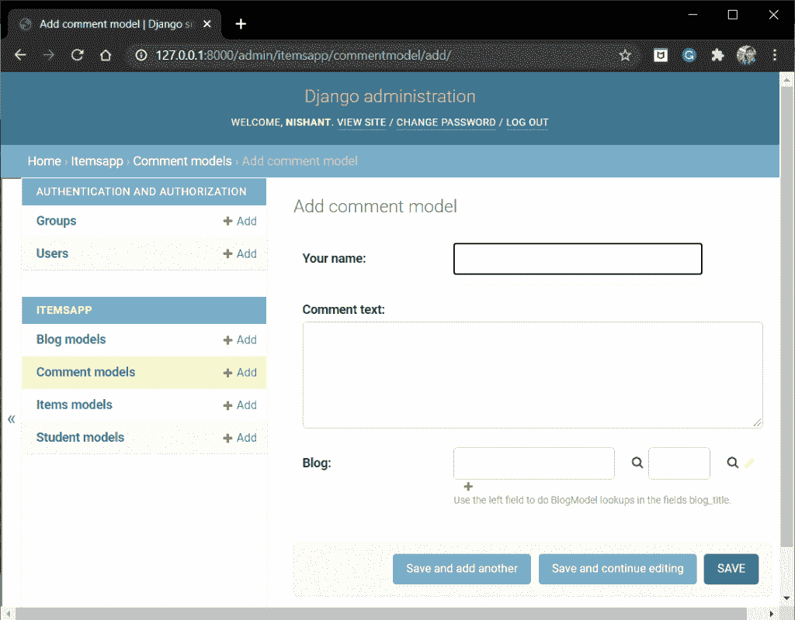
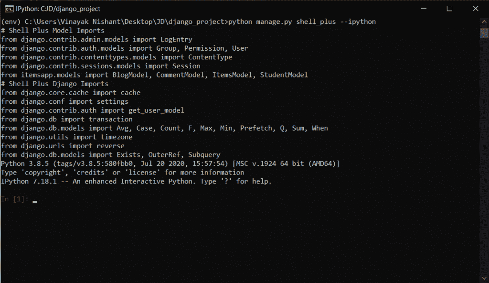

# Django 扩展–安装和实现扩展

> 原文：<https://www.askpython.com/django/django-extensions>

在本文中，我们将看到 Django 扩展功能扩展了 Django 中默认提供的功能。

## **各种重要的 Django 扩展**

提供的各种重要扩展如下:

*   **管理扩展**
*   **命令扩展**
*   **调试器标签**
*   **字段扩展**
*   **模型扩展**
*   **验证器**
*   **Powershell**

下表给出了详细的分析

### 1.管理扩展

一些重要的扩展包括:

| 延长 | 描述 |
| --- | --- |
| ***foreign keyautocompleteadmin*** | 允许管理应用程序显示带有搜索输入字段的外键字段。 |
| ***foreinkeyautocompletestackedinline***
和***foreinkeyautocompletetabularinline*** | 类似于 AutocompleteAd，这两个类为 **AdminInline 类**中的外键字段启用搜索输入字段 |

Admin Extensions

### 2.命令扩展

一些最常用的命令扩展是:

| 延长 | 描述 |
| --- | --- |
| **Shell_plus** | Django shell 的增强版；已经自动加载了所有的模型，因此我们可以马上使用 ORM。 |
| **创建 _ 模板 _ 标签** | 在指定的应用程序中生成模板标记目录结构 |
| **生成 _ 密码** | 它会生成一个可用作用户密码的新密码。 |
| **导出 _ 电子邮件** | 以下列格式之一导出电子邮件地址–Google、Outlook、LinkedIn 和 VCard |
| **图形 _ 模型** | 它为应用程序创建了一个 GraphViz 点文件。它将应用程序的模型(通过)合并成一个单一的模型。输出通常指向一个点文件。 |
| **运行 _ 脚本** | 在姜戈运行一个脚本 |
| **sql_create** | 按照 settings.py 中的指定，生成创建数据库的 SQL。 |

Command Extensions

在后面的章节中，我们将会看到更多关于 shell–**shell _ plus**的内容。

### 3.调试器标记

有了[调试器](https://www.askpython.com/django/django-debugging)标签，我们可以轻松调试 [Django 模板](https://www.askpython.com/django/django-templates)。这些模板标签提供了三个过滤器——**IPDB、PDB 或 WDB**

语法是:

```py



{{object | ipdb/pdb/wdb }}


```

| 过滤器 | 描述 |
| --- | --- |
| IPDB | 它是一个 Ipython 调试器工具，与 Ipython 一起使用来调试模型对象(与它一起使用) |
| 物理数据库 | 调试模型对象是普通的 Python 调试器 |
| WDB | 它是一个 Web 调试器工具，用于通过浏览器本身调试基于 python 的应用程序。 |

Debugger Tags

**注意:**要使用过滤器，我们需要在模板文件的顶部加载调试器标签

```py


```

### 4.字段扩展

一些有用的字段扩展包括:

|  |  |
| --- | --- |
| **随机场** | 创建具有指定长度的唯一随机字符 |
| **日期时间字段** | 当对象首次保存到数据库时，DateTimeField 自动设置其日期 |
| **JSONField** | 这个文本字段整齐地序列化/反序列化 JSON 对象 |

Field Extensions

### 5.模型扩展

这些是重要的模型扩展:

| 延长 | 描述 |
| --- | --- |
| **ActivatorModel** | 这个抽象基类提供了一个**状态、激活日期**和**去激活日期** |
| **TitleDescriptionModel** | 这个抽象基类模型提供了 **title** 字段，它是一个最大长度为 **255** 的**不可空** CharField，以及一个**可空描述**字段。 |

Modle Extensions

### 6.验证器

Django 扩展提供的一些重要的验证器是:

| 延长 | 描述 |
| --- | --- |
| **无控制字符验证计算机** | 该属性确保了像**新行**或**制表符**这样的控制字符是**而不是**所允许的。 |
| **NoWhitespaceValidator** | 这个属性确保了开头和结尾的空格是允许的**而不是**。 |
| **HexValidator** | 确保该字符串是有效的十六进制字符串。也可以选择指定长度、最小长度和最大长度参数 |

Validators

## **安装 Django 扩展**

我们可以使用 [pip](https://www.askpython.com/python-modules/python-pip) 命令本身安装扩展。运行代码

```py
pip install django-extensions

```

我们还需要在 settings.py 中提到 Django 扩展。所以只需在 INSTALLED_APPS 目录中添加以下内容。

```py
INSTALLED_APPS = [
    #......
    #......
    #......
    'django_extensions'
]

```

就这样，Django 扩展已经可以使用了。

## **实现 Django 扩展**

现在我们将看到如何在 Django 项目中使用重要的扩展

### 1.实施管理扩展

考虑我们在[上一篇文章](https://www.askpython.com/django/django-blog-app)中构建的 BlogModel，在 models.py 文件中有以下字段

```py
from django.db import models

class BlogModel(models.Model):
    id = models.IntegerField(primary_key=True)
    blog_title = models.CharField(max_length=20)
    blog = models.TextField()

    def __str__(self):
        return f"Blog: {self.blog_title}"

```

此外，考虑一个 **CommentModel** ，它包含来自 BlogModel 表的特定**博客**的评论。在 models.py 文件中的BlogModel 下添加注释模型:

```py
class CommentModel(models.Model):
    your_name = models.CharField(max_length=20)
    comment_text = models.TextField()
    blog = models.ForeignKey('BlogModel', on_delete=models.CASCADE)

    def __str__(self):
        return f"Comment by Name: {self.your_name}"

```

注意， **blog** 字段是连接 BlogModel 的 FK。现在，在 **admin.py** 文件中，我们将对评论模型模板应用管理扩展。

```py
from .models import *
from django_extensions.admin import ForeignKeyAutocompleteAdmin

@admin.register(CommentModel)
class BookModelAdmin(ForeignKeyAutocompleteAdmin):

    related_search_fields = {
        'blog':('blog_title',)
    }

    #Fields
    fields =('your_name','comment_text','blog')

```

有关管理模板的更多信息，请查看[管理模板](https://www.askpython.com/django/django-admin-template)一文

现在运行服务器并转到[管理站点](https://www.askpython.com/django/django-admin-site)



Admin Extensions

查看搜索选项如何出现在 **FK 博客字段**中。

### 2.用 Ipython 实现 shell_plus

要用 Ipython 运行 shell_plus，我们首先需要安装它。

**Ipython** 是一个为 python 打造的交互式 shell。它使得 shell 环境高效且易于使用。它提供了我们可以使用的有用的环境工具和命令。

要安装 IPython，请运行以下命令:

```py
pip install ipython

```

现在使用下面的命令运行 shell_plus 和 ipython

```py
python manage.py shell_plus --ipython

```



Shell Plus With Ipython

看，项目中的所有模型都自动加载到 shell 中。

## 其他一些重要的扩展

我们现在将在这里看到一些最常用的扩展

### 1.RandomCharField 扩展

您可以使用下面的命令在您的模型中添加该字段:

```py
from django.db import models
from django_extensions.db.fields import RandomCharField

class ModelName(models.Model):
    Field1 = RandomCharField(length=12, unique =True, include_punctuation=True)

```

### 2.验证器

在 **models.py** 中这个扩展的语法是:

```py
from django_extensions.validators import HexValidator

class ModelName(models.Model):
    Field1 = models.CharField(max_length=80, validators=[HexValidator(length=64)])

```

## **结论**

就这样，伙计们！！这都是关于 Django 扩展的。我希望您已经获得了关于这些扩展的良好知识。请务必查看其他 Django 扩展的官方文档。

我们已经结束了 Django 系列教程。一定要看看我们关于 Django 的其他[文章](https://www.askpython.com/django)。继续编码！！