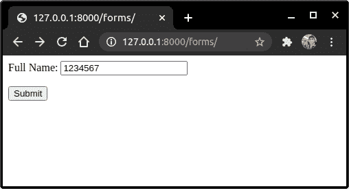

# Django 表单验证

> 原文：<https://www.askpython.com/django/django-form-validation>

在本文中，我们将了解内置的 Django 表单验证以及 Django 自定义表单验证。

## Django 表单验证的先决条件

在进行表单验证之前，您需要知道什么是 Django 表单，以及如何在 Django 中实现它们。

如果您已经熟悉 Django Forms，那么请继续阅读这篇文章，否则请首先阅读 [Django Forms](https://www.askpython.com/django/django-forms) 文章。

## 内置表单验证

Django 框架提供了一系列内置的表单验证器和表单库。我们将在这里了解他们每一个人。

## 设置表单和使用内置验证器

```py
Field = forms.Field_Type(validator = value)

```

所有内置的验证器都遵循上面的语法。

### 本节中使用的表单视图

以下解释代码基于 views.py 中的以下[视图](https://www.askpython.com/django/django-class-based-views)

```py
def EFormView(request):
    if request.method == 'POST':
        form = EForm(request.POST)
        if form.is_valid():
            form.save()
            return HttpResponse('Form saved')
    else:
        form = EForm()
        context = {
            'form':form,
        }
    return render(request, 'books_website/Form.html', context)

```

而[模板](https://www.askpython.com/django/django-templates)是一个简单的 HTML 文件，包括 HTML 的表单属性

```py
<form method ='post'>
    
    {{form.as_p}}
    <input type="submit" value = "Submit">
</form>

```

### **1。initial–带有“Initial”属性的占位符文本**

你可能在网上看到过很多表格都有预先输入的文本，如下所示。


Example

这是使用 Django 表单的**初始**属性完成的。

因此，如果您需要在表单字段中预先输入文本，我们使用**初始**属性。

初始默认值是**空。**

```py
class EForm(forms.Form):
    Name = forms.CharField(initial = "Enter Name")

```


Initial

### **2。标签–向表单字段添加标签**

**标签**属性给表单域一个自定义名称。默认情况下，Django 使用 forms.py 中指定的表单字段名称作为字段名称。但是使用**标签**我们可以将其更改为任何其他自定义名称。

```py
class EForm(forms.Form):
    Name = forms.CharField(label = "Full Name")

```


Label

### 3.max _ Length–限制输入字符的最大长度

**max_length** 属性确保字段中输入的信息不超过指定值。

```py
class EForm(forms.Form):
    username = forms.CharField(max_length = 10)

```


Max Length

请注意，您不能添加超过 **10** 个字符。

### 4.**错误消息**–添加自定义错误消息

**error_message** 属性允许您向字段中添加定制的错误消息。此属性重写默认错误信息，并使您能够编写自己的错误信息。

**错误消息**作为**字典、**传递，如下所示:

```py
class EForm(forms.Form):
    username = forms.CharField(error_message = {'required':'Please Enter your Name',})

```


Error Message

### **5。禁用**–向 Django 表单添加不可编辑的值

在许多表单中，用户无法编辑特定的字段，例如特定公司表单上的公司名称。

**disabled** 属性允许您这样做。使用它，您可以禁用特定的字段，从而使用户无法编辑它。

```py
class ITJobForm(forms.Form):
    Interview domain = forms.CharField(disabled = True, initial = 'Software Engineer')
    Name = forms.CharField(max_length = 80)

```


Disabled

请注意，您无法更改**面试域**字段的值。

### 6.help _ text–建议需要在输入中输入的内容

该属性在字段旁边添加了一个**帮助文本**,以提供关于必须输入的内容的更多信息。

```py
class EForm(forms.Form):
    Name = forms.CharField(help_text ='Please enter your name')

```


Help Text

### 7.**必填**–提交前确保表单域有数据

在许多表格中，某些字段是必填的，如申请人的姓名、号码等。这是通过**必需的**属性完成的。

默认值为**假**

```py
class EForm(forms.Form):
    Name = forms.CharField(required = True)

```


Required

### 8.**widget**–为预定义的目的设置单独的表单字段

Widget 是 Django 对 HTML 输入的表示。每个字段都有其预定义的字段小部件。例如，**数字域**将有一个只接受**数字输入的小部件，电子邮件域**只接受**电子邮件输入**，等等。

我们可以覆盖默认的小部件，并添加我们自己的小部件，如下所示:

```py
class EForm(forms.Form):
    Name = forms.CharField(widget = forms.Textarea)

```


Widget

## 使用 ValidationError 属性的自定义表单验证

正如在 [Django 异常处理](https://www.askpython.com/django/django-exception-handling)文章中看到的，验证错误属性用于验证用户输入的定制表单信息。

**使用验证错误的语法**

```py
ValidationError('text',params = {value : <value>})

```

这里，值变量和文本取决于我们调用属性的位置，也取决于验证的条件。

ValidationError 的完整语法是:

```py
import django.core.exceptions
if cond:
    raise ValidationError('text')

```

### **自定义验证的实现**

让我们创建一个只允许用户名在 10 到 20 个字符之间的表单。form.py 代码将是:

```py
class EForm(forms.Form):
    Name = forms.CharField(label = "Full Name")

```

添加窗体视图代码，如下所示:

```py
from django.core.exceptions import ValidationError
def FormView(request):
    if request.method == 'POST':
        form = EForm(request.POST)
        if form.is_valid():
            Name = form.cleaned_data['Name']
            if len(Name)< 10 or len(Name) > 20:
                raise ValidationError(f'Length of the name:{Name} is not between 10 -20 characters')
            return HttpResponse('Form saved')
    else:
        form = EForm()
        context ={
            'form':form
        }
    return render(request,'books_website/Form.html',context)

```

请注意验证错误是如何引发的。模板和上面看到的是一样的。

让我们运行服务器并输入少于 10 个字符的名称。你也可以尝试超过 10 个字符，因为它仍然无效我们的条件。



Validation Error

当您点击提交时，您将得到如下所示的错误:


Form Error

现在，我们将尝试使用 10 到 20 个字符的名称


Form 11 characters

点击提交并检查


Form Saved

看看表单是如何只接受某些名字的。这就是验证错误的工作方式。

## **结论**

就这样，伙计们！！这都是关于表单验证的。另外，查看官方 Django 表单文档了解更多信息。继续练习！！