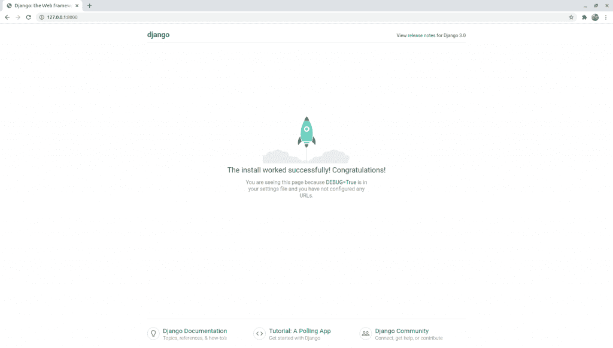

# Django Hello World 应用程序–Django 入门

> 原文：<https://www.askpython.com/django/django-hello-world-app>

本教程将带你开始学习 Django 的基础知识。让我们了解一下如何在 Django 上创建一个 hello world 应用程序。

什么是 Django？Django 是一个基于 python 的 web 框架，用于高效地制作 web 应用程序。

注意: **Django** 只是一个用于 web 应用的**框架**和**而不是**一种**语言。**

* * *

## 1.安装 Django

我们可以使用 **[PIP](https://www.askpython.com/python-modules/python-pip) 在我们的系统中安装 Django。**我们已经列出了在不同操作系统上安装 Django 的步骤。

### Windows 上的 Django

首先，我们必须在你的电脑上保存 **get-pip.py** 。

**第二个**，在保存文件的地方打开 cmd，然后写命令

```py
python get-pip.py

```

**第三，**现在如果你想升级版本你可以写

```py
python -m pip install -U pip

```

### Mac OS 上的 Django

**首先，**使用**简易安装**安装 **pip**

```py
$ sudo easy_install pip

```

第二个，我们现在可以使用下面的命令升级它

```py
$ sudo pip install --upgrade pip

```

### Linux 上的 Django

我们可以使用**终端外壳**中的命令进行安装

```py
$ sudo apt-get update
$ sudo apt-get install python-pip
$ sudo pip install --upgrade pip

```

一旦 Django 安装完毕，我们就可以进入下一部分了。

* * *

## 2.开始你的第一个 Django 项目

现在，在您的计算机中，导航到要启动项目的文件夹，打开命令提示符/shell 并键入以下命令。

```py
$ django-admin startproject <Name_of_project>

```

其中 **<项目名称>** 是您要为项目命名的名称。


Django Startproject

现在，如果您查看目标位置，您将能够看到一个以项目名称命名的新文件夹。在该文件夹中，您将找到另一个同名的文件夹和 **manage.py** 文件。

**注意:manage.py python 文件管理整个项目，并为 Web 应用程序将项目的不同部分组合在一起。**

一个典型的项目会有这样的结构。


Django Project Structure

现在，一旦项目设置完毕，我们就可以尝试运行服务器了。

* * *

## 3.**在本地主机上运行服务器**

现在，项目在您的计算机上，但实际上，web 应用程序的整个项目将被上传到 web 服务器。

现在，由于项目在你的计算机上，服务器将在你的本地主机**上运行。**

现在在**终端 shell/cmd** 中编写以下命令来运行服务器。

```py
$ python manage.py runserver

```


Runserver

服务器将开始运行，你可以去那个网址查看 web app。(我的情况是 http://127.0.0.1:8000)



Website Runserver

因此，我们的 web 应用程序运行良好，让我们继续制作一个应用程序。

* * *

## 3.Django 项目和 Django 应用程序的区别。

在制作我们的第一个 Hello World 应用程序之前，我们需要知道 Django 项目和 T2 Django 应用程序的区别。

### Django 项目

Django 项目用于整个 Web 应用程序。也就是说，将有一个项目来处理一个完整的网站。

在项目内部，可能有许多不同的 Django 应用程序处理各种流程。

### **Django App**

在一个项目中，一个应用程序用于**处理网站的特定部分**。在一个典型的 web 应用中，**一个** app 完全用于**用户认证**，**一个**完全用于**支付**等。


Django Project and App (HelloWorldApp)

* * *

## 4.运行你的 Hello World 应用

在项目文件夹中，打开 shell 并编写命令来设置 Hello World 应用程序。

```py
$ django-admin startapp HelloWorldApp

```

现在你会看到你的 Hello world 应用程序已经形成。


Django Startapp

Django App 内部有不同的 python 文件，我们将在下一篇文章中学习。

**注意:**Django 项目本身不会知道这个应用程序，因此你必须在 **django_project/settings.py 中提及它。**

**您可以在 INSTALLED_APPS** 中添加您的应用，以便更好地管理应用。在 **INSTALLED_APPS** >下添加 **`"<name_of_app>",`** 其中 **< name_of_app >** 是我们想要给我们的应用起的名字。


Installed Apps

* * *

## 5.修改 Django 应用程序文件以显示“Hello World”

在 Django 中，显示一个特定的网页需要 3-4 个文件。顺序如下所示

URL 视图-模型(通常)-模板

因此，当一个客户机访问一个特定的 URL 时，这意味着他向服务器发送一个 web 请求(例如 HTTP 请求), Views.py 有一个对应于该特定 URL 请求的视图，然后数据作为响应(HTTP 响应)连同模板(HTML 文件)一起发送回客户机。

现在让我们在 views.py 中编写一个简单的视图，在浏览器中显示 Hello World。


SayHello views.py

在这里，我们首先从 **django.http** 库导入 **HttpResponse** ，然后创建一个名为 **sayHello** 的视图。

它需要来自用户的**请求**，因此它将**请求**作为输入，然后返回**http response–Hello World**。

```py
from django.http import HttpResponse

def sayHello(request):
    return HttpResponse('Hello World')

```

现在我们还需要在应用程序中创建 **urls.py** 。所以我们可以从项目 **urls.py** 中复制过去，然后删除管理路径行，然后添加下面的行。

```py
from django.contrib import admin
from django.urls import path, include
from .views import sayHello

urlpatterns = [
    path('', sayHello, name='sayHello'),
]

```


UrlsHelloWorldApp

现在我们只需要在【urls.py/django_project】中添加端点 **sayHello/** 。我们将把下面的代码添加到 **urlpatterns** 中。

```py
path('sayHello/', include('HelloWorldApp.urls')),

```


Urls Pydjango Project

* * *

## 6.运行服务器

正如上面第 4 部分所示，我们将运行服务器。


Runserver HelloWorld

现在服务器已经打开，因此我们可以通过将端点 **sayHello/** 添加到 URL 来检查浏览器。


Browser HelloWorld

我们可以看到它正在完美地工作。**因此**我们的第一款 Django 应用**已经准备就绪**。

## 结论

这就是我们的结局。我希望你已经准备好开始你和姜戈的旅程了。所以请在接下来的几天里关注更多关于 Python Django 和 Flask 的文章！