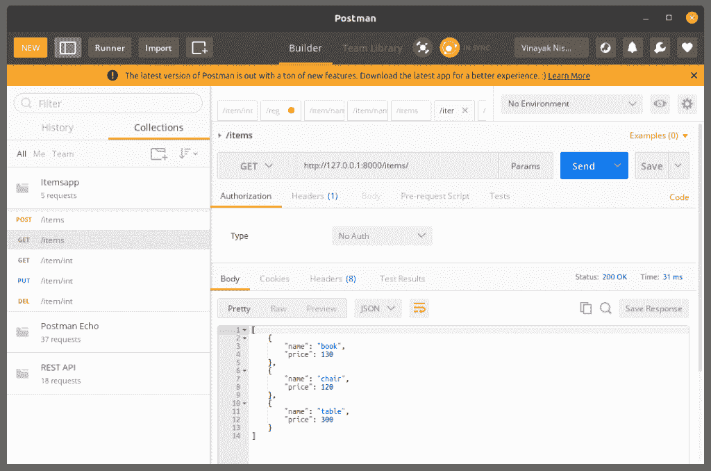

# django ListView——如何创建基于函数和类的 ListView？

> 原文：<https://www.askpython.com/django/django-listview>

在本文中，我们将了解 Django 列表视图。

## 什么是 Django 列表视图？

Django ListView 指的是那种类型的[视图](https://www.askpython.com/django/django-views)，它显示了出现在[模型](https://www.askpython.com/django/django-models)表中的实例/元素。它用于显示数据库中的多个条目，还允许我们添加新数据。

因此，您可以推断 ListView 基于具有 [GET 和 POST](https://www.askpython.com/django/django-rest-api) 选项的 API 接口。

这类似于我们在 Django REST API 系列中创建的 ItemsView。

## 编码列表视图的先决条件

考虑一个 [Django 项目](https://www.askpython.com/django/django-app-structure-project-structure)有一个应用程序 **Itemsapp。**在这里，我们将保存关于椅子、书、桌子等物品的模型信息。

模型的代码:

```py
class ItemModel(models.Model):
    id = models.IntegerField(primary_key = True)
    name = models.CharField(max_length = 80, blank = False)
    price = models.IntegerField

    class Meta:
        ordering = ['name']

    def __str__(self):
        return f"{self.name}:{self.price}"

```

然后，我们将使用终端在预设的数据库 SQLite 中创建表:

```py
python manage.py migrate
python manage.py makemigrations
python manage.py migrate

```

之后，我们将有 serializers.py 文件，其中包含一个 ItemSerializer 类，用于将 DB 实例转换为 JSON。

项目序列化程序的代码:

```py
from rest_framework import serializers
from .models import ItemModel

class ItemSerializer(serializers.ModelSerializer):
    class Meta:
        model = ItemModel
        fields = ['id',name','price']

```

之后，只需通过 Python shell 或管理站点本身向表中添加一些项目。


Admin

此外，端点将仅仅是 **/items** ，因为列表视图关注于显示模型表的整个实例

URL 映射的代码:

*   对于基于函数的列表视图

```py
path ('items/', ItemsView)

```

*   对于基于类的列表视图

```py
path('items/',ItemView.as_view())

```

就这样，现在我们将学习用不同的方法创建一个 ListView。

## Django ListView 背后的逻辑

在 ListView API 中，逻辑非常简单。

### 1.**从服务器到用户的数据显示**

所涉及的步骤将是:

1.  从数据库获取数据
2.  使用序列化器将数据转换成 JSON
3.  按照原样或者通过模板(使用 JS)将 JSON 数据返回给用户


### 2.**从用户处获取数据到服务器**

这里涉及的步骤将是:

1.  将 JSON 数据与请求的其余部分分开(使用 JSON 解析器)
2.  转换成 Django 可读格式(python 方法)
3.  对该数据执行专门的任务(添加、编辑、删除)。

在这种情况下，**专用任务可以只是显示或添加**来自用户的数据到 DB 中。


## 创建 Django 列表视图

现在让我们创建一个 Django Listview。

### **1。基于函数的列表视图**

基于函数的 ListView 的示例代码如下:

```py
@csrf_exempt
def ItemsView(request):

    if request.method == 'GET':
        items = ItemsModel.objects.all()
        serializer = ItemSerializer(items, many =True)
        return JsonResponse(serializer.data, safe =False)

    elif request.method == 'POST':
        data = JSONParser().parse(request)
        serializer =ItemSerializer(data = data)

        if serializer.is_valid():
            serializer.save()
            return JsonResponse(serializer.data,status =201)
        return JsonResponse(serializer.errors,status = 400)

```

请记住上一节中给出的我们用 ListView API 执行的步骤，并尝试理解代码。

1.  **def get:** 来自数据库的数据→转换为 JSON(序列化程序)→显示 JSON 数据
2.  **def post:** 解析请求以分离 JSON 数据→转换为 Python 格式→对数据执行适当的任务

这就是我们在 ItemsView 的代码中所做的。

### 2.**基于类的列表视图**

基于类的视图比函数视图更好，因为使用类代码变得更加系统化、结构化和可读。

基于类的 ListView 的示例代码如下:

```py
class ItemsView(APIView):
    def get(self,request,format =None):
        items = ItemsModel.objects.all()
        serializer = ItemSerializer(items, many =True)
        return JsonResponse(serializer.data, safe =False)

    def post(self,request,format =None):
        data = JSONParser().parse(request)
        serializer =ItemSerializer(data = data)

        if serializer.is_valid():
            serializer.save()
            return JsonResponse(serializer.data,status = status.HTTP_201_CREATED)
        return JsonResponse(serializer.errors,status = status.HTTP_400_BAD_REQUEST)

```

同样，我们编写代码的方式也发生了变化。我们使用类方法和类内函数来编写代码。但逻辑的关键仍然是一样的。

## **ListView API 的实现**

代码已经完成，我们现在运行它。

您可以尝试运行基于函数的视图和基于类的视图，以便更好地理解基于函数和基于类的列表视图

现在为了运行，我们将使用 POSTMAN，这是运行[Django REST API](https://www.askpython.com/django/django-rest-api)的有效方法。这里是邮差的[官方网站](https://www.postman.com/api-platform/meet-postman)，在这里你可以看到它的好处



GET ListView

上面的图片显示了 ListView 的 GET 选项，其中显示了 ItemModel 的所有实例。


POST ListView

这张图片显示了 ListView 的 POST 选项，它允许用户向 ItemModel 中添加新的项目实例。

## **结论**

就这样，伙计们！！Django 中的 ListView 就是这么做的。获取模型的实例并显示它们，同时从用户那里获取新的实例。

在下一篇文章中，我们将学习 Django 细节视图。

更多此类有趣话题敬请期待！！注意安全！！