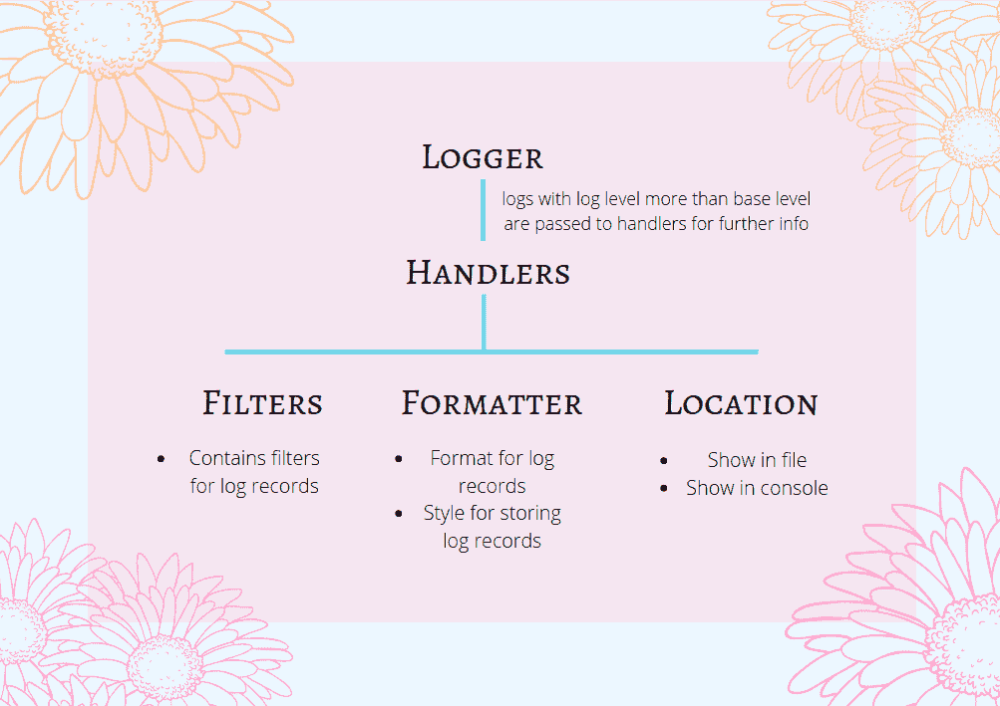
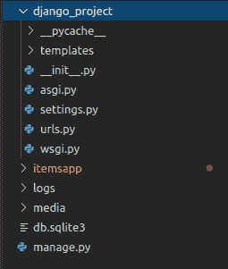
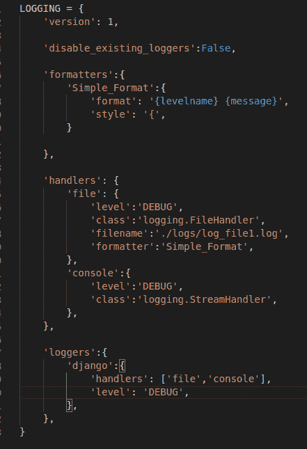
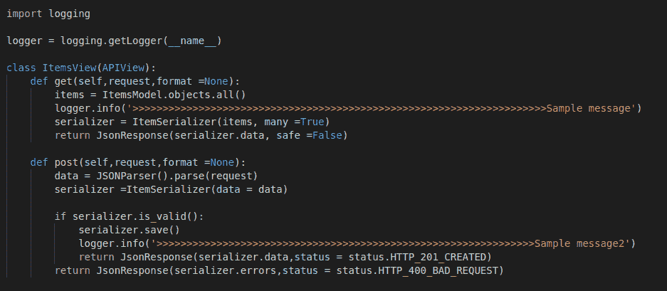
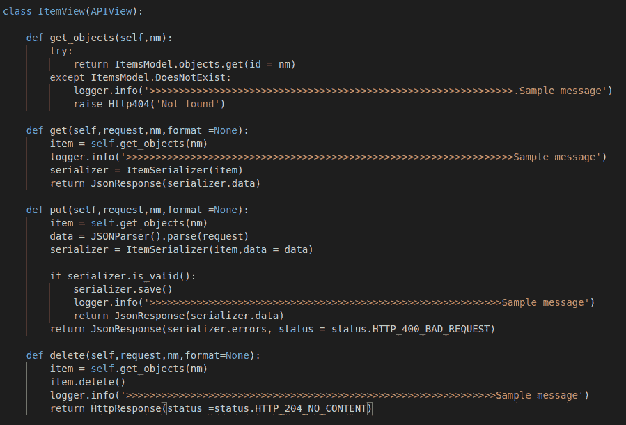
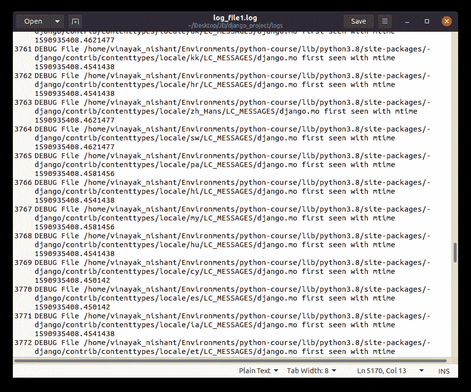

# Django 日志——快速设置指南

> 原文：<https://www.askpython.com/django/django-logging>

在这篇文章中，我们将学习所有关于 Django 日志记录的内容！！

## 为什么日志记录很重要？

作为一名程序员，我们写了很多代码，因此最终也会有很多错误。现在回溯并找到错误的确切位置是非常耗时的。

这就是**测井模块**发挥作用的地方。日志记录为开发人员提供了一个新的视角来快速找到并调试错误。

## Django 的日志是什么？

日志记录是一种技术，它使您能够跟踪代码/系统实时运行时发生的事件。

日志作为一个独立的程序工作。你可以把它想象成一个简单的文件写入器。当系统运行时，它跟踪事件并将其记录到**控制台**或称为**日志的文件中。**

**日志**是带有日志扩展名的简单文件，包含文本格式的所有记录。此外，日志记录还有更多附加功能，如:

*   使多线程执行成为可能
*   通过不同的日志级别对消息进行分类的选项
*   更加灵活和可配置。
*   拥有更加结构化的信息

## 4 Django 伐木的一部分

执行 Django 日志记录有 4 个部分。让我们来看看它们是什么。

### 1.决哥伐木工

这是登录系统的一个条目。记录器是一个部件，当调用日志记录时，它记录事件以供处理。此外，记录器被配置为具有*日志级别*。

日志级别说明了记录器将接受或处理的事件的严重性。

| 日志级别 | 描述 | 严重 |
| --- | --- | --- |
| **调试** | 一切正常时的系统信息。 | Ten |
| **信息** | 类似于 debug。它通常概述了系统正在执行的内容。 | Twenty |
| **警告** | 涉及不会导致系统停止的低级问题。 | Thirty |
| **错误** | 这条信息是严肃的。这表明问题可能已经停止了系统的运行，需要立即引起注意 | Forty |
| **危急** | 最关键的信息。当问题导致系统停止时，会显示此信息。 | Fifty |

写入记录器的每条消息称为一条日志记录。只有那些日志级别高于日志记录器的消息才被接收进行处理，其余的都被忽略。

### 2.姜戈在买卖

这是 Django 日志系统的下一个级别。这有关于记录器中的日志记录发生了什么的进一步信息。也就是说，它有关于位置(控制台或文件等)的信息，日志记录将被写入，应用于日志记录的**过滤器**和**格式化程序**的类型。

像记录器一样，处理程序也有日志级别。如果日志记录的日志级别不等于或高于处理程序的日志级别，则它将被忽略。

### **3。姜戈过滤器**

顾名思义，它提供了对日志记录的进一步过滤，从日志记录器传递到处理程序。例如，通常会处理符合日志级别要求的日志消息。但是您可以安装一个过滤器，只允许来自特定来源的**错误**消息被发出/写入。

### **4。Django 格式器**

最终，日志记录必须以文本形式存储。日志记录通常采用日志框架预定义的日志记录格式。但是要将它存储为文件，我们需要首先将其转换为正确的格式。

因此格式化程序被用来转换它们。默认情况下，格式化程序将其转换为字符串。但是也可以根据我们的需要进行改变和定制。

* * *

流程很简单。



Logging Flow

## **将 Django 日志目录添加到 settings.py**

所有关于记录器、处理程序、过滤器和格式化程序的信息都必须写入 settings.py 本身。

基本语法是:

```py
LOGGING = {
    'version': 1,
    # Version of logging
    'disable_existing_loggers': False,

    'filters':{
        #information regarding filters
    },

    'formatters':{
        '<formatter_name>':{
            'format': '<formatter_info>',
            'style': '{',
        }
    },

    'handlers': {
        'file': {
            'level': '<log_level>',
            'class': '<logging_class>',
            'filename': '<file_name>',
        },

        'console': {
            'class': '<logging_class>',
        },
    },

    'loggers': {
        'django': {
            'handlers': ['file', 'console'],
            'level': '<log_level>',
        },
    },

```

这里:

*   **版本:**这是我们正在使用的日志版本。
*   **disable _ existing _ loggers:**默认情况下，Django 禁用记录器。所以我们需要让他们回来。
*   **过滤器:**提到了我们将在日志中使用的过滤器。
*   **格式器:**所有关于日志记录格式的信息都在这里。
*   **处理程序:**日志记录上所有要进行的过程都写在这里。例如存储位置、要使用的格式化程序、要添加的过滤器等。
*   **Loggers:** 这个有处理者的信息；日志记录将被传递到日志级别等。

因此，让我们在应用程序中添加一个简单的日志目录，它将把日志级别大于或等于 DEBUG 的所有记录保存到日志文件夹中的一个**日志文件**中。

在 Django 项目的文件夹中创建一个日志文件夹



logs

在 settings.py 中添加代码:



LOGGING

只要记住我们在上一节学到的逻辑，努力理解代码就行了！

## **调用 views.py 中的 Django 日志函数**

现在，我们已经在 settings.py 中指定了日志记录，我们必须在 views.py 导入日志记录中的 views.py 文件中的任意位置添加函数调用，然后在开头编写代码

```py
import logging
logger = logging.getLogger(__name__)

```

**__name__** 获取调用该函数的文件的名称。您可以使用它来识别当前文件，并从那里添加日志记录方法。

为了演示，我在 views.py 文件中随机添加了 **logging.info** 函数调用



Views 1

类似地，在项目视图中:



Views 2

## **运行 Django 日志记录**

就这样，伙计们！！我们现在可以运行程序，让日志记录处理所有的日志记录。

```py
python manage.py runserver

```

此后， **log_file1.log** 将被自动创建并开始存储日志记录。



Log File

正如我们在格式化程序中提到的，日志首先存储有**级别名称**，然后是**消息**。

## **结论**

就这样，伙计们！！这都是关于 Django 日志记录的。请务必查看 [Python 日志](https://www.askpython.com/python-modules/python-logging-module)，了解更多关于日志的信息。另外，你可以从[官方文档](https://docs.djangoproject.com/en/3.1/topics/logging/)中了解更多关于 Django 伐木的信息。注意安全！！继续学习！！