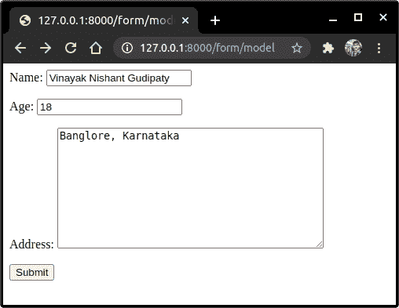
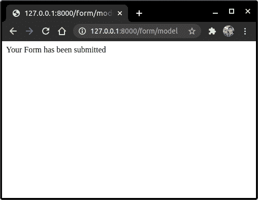
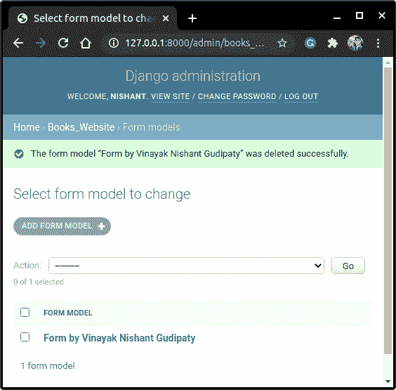

# Django 模型表单——在 Django 中实现模型表单

> 原文：<https://www.askpython.com/django/django-model-forms>

在本文中，我们学习了 Django 模型表单，以及如何将它们与模型的概念联系起来。

## Django 模型表单的先决条件

在深入研究模型表单之前，我们应该熟悉 Django 表单及其用法。因此，如果您是新手，请在继续之前查看我们的 [Django forms](https://www.askpython.com/django/django-forms) 文章。

如果您已经熟悉 Django 表单，那么让我们开始吧！！

## 为什么要模型表单？

只有当我们保存用户提交的表单条目时，表单才有意义。现在要存储它们，我们需要一些数据库。这就是模型表单发挥作用的地方。

Django 模型表单提供了一种方法，将客户端通过**表单**提交的**数据链接到为存储条目而创建的**数据模型**。**

使用 ModelForm，我们可以高效地执行上述任务，而无需编写太多代码。

## Django 模型表单实践

在本节中，我们将学习编写创建模型表单所需的所有部分的代码。

### 1.在 models.py 中编码模型

在 models.py 中，创建一个模型 **FormModel** 并向其中添加以下字段。

```py
class FormModel(models.Model):
    name = models.CharField(max_length = 80)
    age = models.IntegerField()
    address = models.TextField()

    class Meta:
        ordering = ['name'] 

    def __str__(self):
        return f"Form by {self.name}"

```

这里，我们使用 **Textfield，**因为地址可以足够长。为了更好地理解模型，请查看 [Django Models](https://www.askpython.com/django/django-models) 的文章。

添加模型表单后，运行如下所示的迁移来创建 DB 表

```py
python manage.py migrate
python manage.py makemigrations

```

### 2.在 forms.py 中编写模型表单

现在，在 forms.py 中创建一个表单，如下所示:

从导入**表单模型。型号**

```py
from .models import FormModel

```

然后在表单中添加**的代码。**

```py
class Form(forms.ModelForm):
    class Meta:
        model = FormModel
        fields =('name','age','address',)

```

*   类元将上面的**表单**链接到我们为存储表单数据而创建的**模型**。
*   提及将在表单中向用户显示的模型字段。

### 3.在 views.py 中编写 FormView 代码

在 Views.py 中，为 FormView 添加以下代码。

```py
def FormView(request):
    if request.method == 'POST':
        form = Form(request.POST)
        if form.is_valid():
            form.save()
            return HttpResponse('Your review has been taken')

    else:
        form = Form()
        context = {
            'form':form,
        }
    return render(request, 'app_name/form.html<path to template>', context)

```

如果表单有效， **form.save()** 直接将表单保存到 DB 本身。

有了模型，姜戈会处理好一切。所有表单条目将自动保存到链接的表单模型数据库。

### 4.对表单模板文件编码。

现在剩下的唯一一件事就是创建一个表单模板来向用户显示表单。

在**命名空间** **模板文件夹中，**创建一个 **form.py** 模板文件。

```py
<form method='post'>
    
    {{form.as_p}}
    <input type="submit" value = "submit">
</form>

```

就这样，我们的 HTML 文件做好了！现在，我们只需要在 urls.py 中创建一个到**表单视图**的新路径

```py
path('form/model', FormView, name='FormView'),

```

就这样伙计们！！编码部分已经完成，现在让我们启动服务器。

## 模型表单的实现

从**终端/cmd** 启动服务器。



Form

填写字段并点击**提交。**



Form Submission

现在让我们检查表单是否已保存。转到管理网站。



Form Model

哇！！就这样，词条保存了。看看实现 Django 模型表单有多简单。

## 结论

就这样，编码员们！这都是关于 Django 模型表单以及如何用 Django 模型实现它们。

为了更好地理解表单，请查看 Django 表单教程。下一篇文章再见！继续练习！