# Django 模型——完全的初学者指南

> 原文：<https://www.askpython.com/django/django-models>

Django 模型是表示数据库中的一个表或集合的类。它包含关于表的所有信息。这些模型一起存储在 Django 的一个文件 models.py 中，该文件位于我们的 [Django 应用程序](https://www.askpython.com/django/django-app-structure-project-structure)中。

不同的数据库可能有许多不同的模型，包含不同的信息，如用户数据库、图书数据库或 web 应用程序所需的任何其他表。

## Django 模型的基本结构

```py
class Modelname(models.Model):
	'''A class representing a model derived from Model class'''
    #Fields
    Field_name = models.CharField(max_length = , hepl_text = , choices = , Null etc)

    #Metadata
    class Meta:
        Ordering = [‘field_name’]

    #Methods
    def __str__(self):
	    return '<readable_name>'

```

### 1.模型中的字段

一个特定的模型可以有任意数量的字段，这些字段代表数据库表的各种属性。

可以有许多不同类型的字段

*   卡菲尔德
*   积分值
*   电子邮件

这些字段还可以接受如下参数

1.  **max _ length**–可能的最大字符数。
2.  **主键**–这告诉 Django 这个字段对于所有条目都是唯一的。
3.  **外键**–用于连接一个模型和另一个模型。
4.  **NULL**-如果为真，将空字段转换为空值， **char 字段将它们作为空字符串**
5.  **选择**–如果字段必须是给定选项中的一个(如选项框)
6.  **空白**–如果为真，该字段可以允许为空，否则必须填写。

### 2.模型元数据

该元数据具有各种特征；其中最重要的是**排序**。当您发出请求时，它允许您在数据库中以特定的顺序显示响应。

**语法如下**

```py
ordering ['<Name>']

```

这告诉模型按照 **<名称>** 的顺序排列 DB 中的元素，即如果 **<名称>** 是 **CharField** 则可以是字母顺序，或者如果其**是跨域**则可以是**数字**升序**顺序**等等。

如果语法与 **"-"** 符号一起使用，这意味着排序应该是相反的顺序

```py
ordering [-'<name>']

```

### 3.**Django 模型中的方法**

这些用于更好的客户端界面，也就是更好的呈现等。

例如， **__str__** 告诉您在**管理站点**中为数据库中的每个特定元素显示什么**(像一个简称)**。(而不是显示全部信息)

现在让我们制作一个图书项目，包含以下信息:

*   一个包含所有书籍信息的主页
*   包含每本书信息的网页。(**我们在 [Django URL 映射](https://www.askpython.com/django/django-url-mapping) )** 中看到

为此，使用前几篇文章**中获得的知识制作一个名为 books 的应用程序。**

## 1.**创建我们的第一个 Django 模型**

在 books/models.py 中，让我们创建一个模型 DB，将标题、价格和流派作为属性，并对标题进行元数据排序。

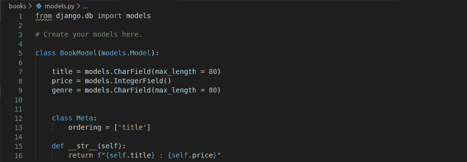

BookModel

现在，我们需要在数据库中创建这个表。默认情况下，Django 使用 SQLite 数据库引擎。现在，我们将使用这个数据库本身。

你可以从**数据库**下的 **settings.py** 文件中查看你正在使用的数据库

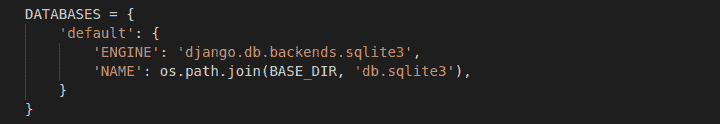

Settings.py

## 2.在数据库中创建表

为了首先创建表，我们需要应用迁移。在 shell 中编写下面的代码

```py
python manage.py migrate
python manage.py makemigrations <app_name>
Python manage.py sqlmigrate <app_name> 0001

```

**再次运行:**

```py
Python manage.py migrate

```

输出将表明数据库创建成功。

您的模型表已经在 **SQLite 中准备好了。**注意每当我们对模型进行更改时，我们需要重复上述的步骤，以便对数据库中的表格进行更改。

现在，我们将学习获取/添加数据到**数据库**

## 从数据库中检索信息

现在，首先我们需要在目录中打开 python shell，使用命令:

```py
python manage.py shell

```

因此，现在我们将让 python 控制台出现在 shell 中。我们需要导入模型表，以便从中添加/检索信息。

导入表的语法是:

```py
from <app_name>.models import <model_name>

```

我的情况是这样的

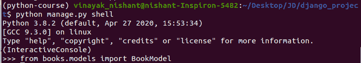

Python Shell

### 1.从一个表中获取所有对象

为此，我们使用以下语法

```py
<model_name>.objects.all()

```

因此，我的代码将是:

```py
BookModel.objects.all()

```

### 2.将信息添加到表格中

为了添加信息，语法类似于面向对象的 python 语法。这里，我们首先创建一个具有模型名称的类对象，然后添加所需的属性。

**创建一个对象，语法是:**

```py
A = <model_name>()

```

**举例:**

```py
A.Title = "Harry Potter"
A.Price = 120
A.Genre = "Fantasy Fiction" 
A.save()

```

这样我们就输入了第一本书的信息。同样的，我再补充几个。

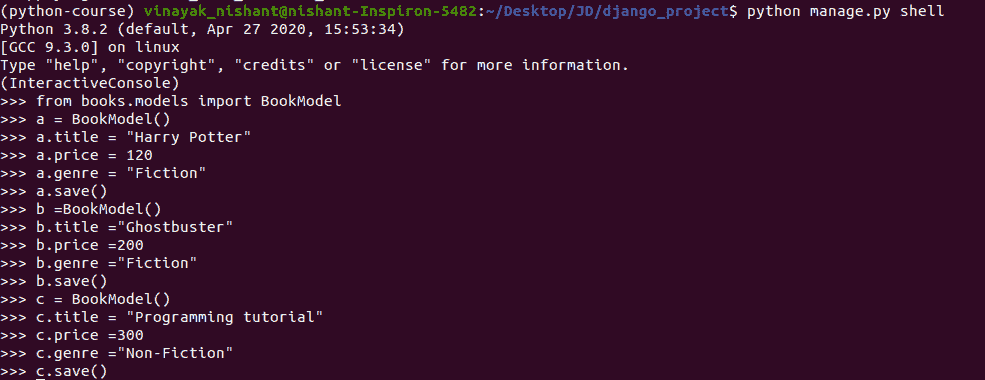

Addition To DB

### 3.从数据库中过滤记录

为了过滤 Django 模型数据库中的记录，我们运行:

```py
<Model_name>.objects.filter(Title =”<Title_Element>”)

```

因此，举例来说，如果我过滤掉所有类型的书籍，比如小说，那么

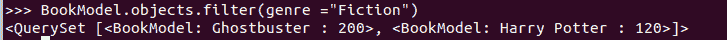

Filter

### 4.获取元素的完整信息

**注意:**当我们使用过滤器时，我们以简短的形式获得元素(以一种由 **def __str__** 描述的方式)，但是如果我们想要关于一个元素的完整信息，我们使用这个方法

```py
<model_name>.objects.get(Title = <"title_element">)

```

在这里我们可以得到包括标题在内的所有信息。价格，流派。

这就是我们使用 T1 的时候

```py
a = BookModel.objects.get(title = "Ghostbuster")

```

然后所有的信息都被存储为一个对象，所以如果我们实现了下面的代码，它就会打印出相应的值。

```py
a.title()
a.price()
a.genre()

```

### 5.从数据库中删除行元素

为了删除一个特定的元素，我们使用语法**。删除()**

```py
from books.models import BookModel
a =BookModel.objects.get(title="<book_name">)
a.delete()

```

## **通过 views.py 连接到模型数据库**

现在我们将学习如何从数据库获取信息，然后在我们的网页上显示它。

在 [Views.py](https://www.askpython.com/django/django-views) 中添加代码:

```py
def BookView(request):
    books = BookModel.objects.all()

    html = ''
    for book in books:
        var = f'<li> {book.title} </li><br>'
        html = html + var
    return HttpResponse(html,status = 200)

```

现在从代码中，你可以理解我们基本上把所有的数据库信息检索到变量 **books** 中，然后**我们开始一个循环，从**数据库**中获取每个元素**，并在网页上显示为 **HTML。**

我们还必须为这个视图提供端点( **Books/** )。**根据从 Django-URL 映射文章中获得的知识，自己尝试一下**

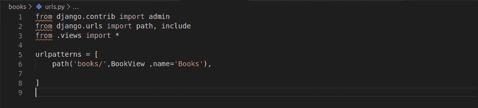

URL mapping

现在为网页**(书籍/ <标题 _ 名称> )** 。看看下面的代码可以更好的理解。

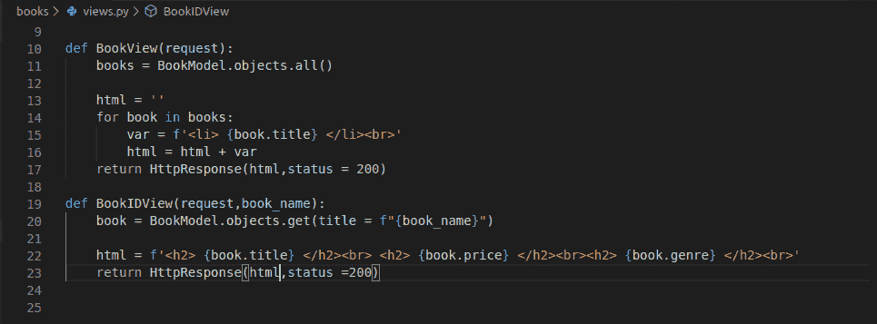

BookIDView

代码很简单；我们只是使用 **Get** 获取关于 **book_name** 的所有信息，然后在网页上显示为 **HTML**

这里，我们从数据库中检索了特定的信息，然后将其显示在 Web 页面上。让我们看看这个视图中的 urls.py 文件是什么样子的。

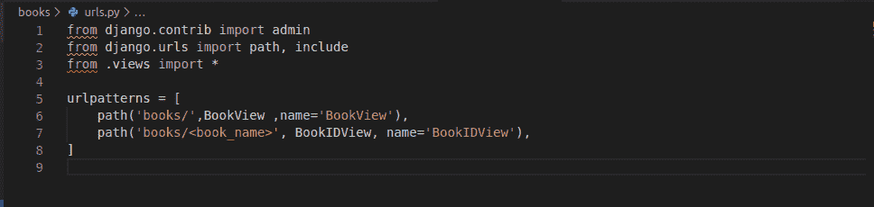

URL mapping – BookIDView

现在我们将运行服务器，看看它是否工作


Runserver

**书籍/** 网页的浏览器页面

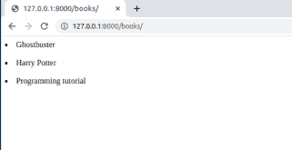

Browser (books/)

**书籍/ <书名 _ 名称>** 网页的浏览器页面

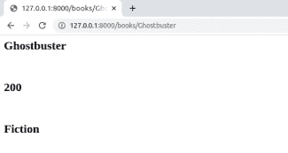

Browser **(books/Ghostbuster)**

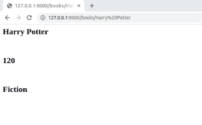

Browser **(books/Harry Potter)**

## **使用外键连接到其他型号**

一个**外键** (FK)用于**链接两个使用一些公共信息的数据库**。这有助于保持我们的**数据库整洁**，也确保我们不必一次又一次地输入相同的信息。

现在，在我们的图书应用程序中，让我们制作一个**作者模型**表，并在图书模型中添加 Author_id 字段。现在注意几本书可能有相同的作者，所以 **Author_id 将作为我们的 BookModel 中的外键。**

使用 FK，我们可以搜索特定作者写的各种书籍。此外，如果作者删除了他的帐户，那么他的所有书籍也将被自动删除，从而减少了从 BookModel 中手动删除它们的工作。

开始时你可能会有点困惑，但经过反复练习，它会开始变得有意义。所以**不用担心！！**

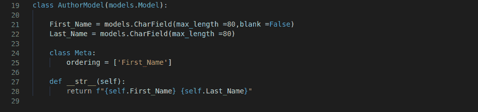

AuthorModel

现在我们可以在 **BookModel 中添加 Author 字段。**

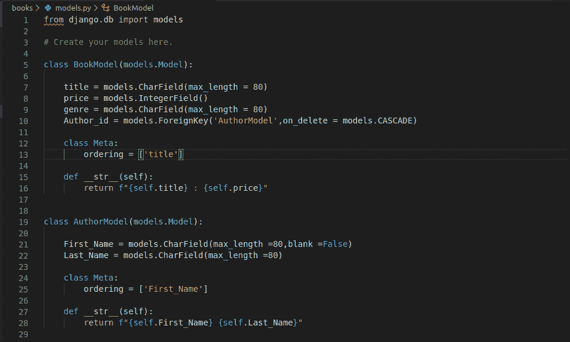

Author_id Field

我们必须为新的 AuthorModel 运行迁移。还要注意:由于我们改变了我们的 **BookModel** DB，我们必须运行前面提到的外壳代码**(迁移)**。

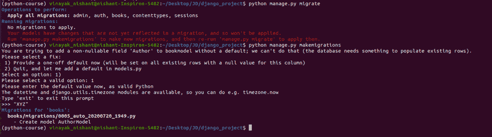

Migrations

我们在数据库中已经有了一些没有**作者字段**的信息。所以 Django 要求在 author_id 字段中为他们输入一个**默认值**。

最好在使用**应用迁移**(改变表格)**之前删除所有早期的元素。删除()**

我们现在可以像添加图书信息一样向 Author DB 添加信息。

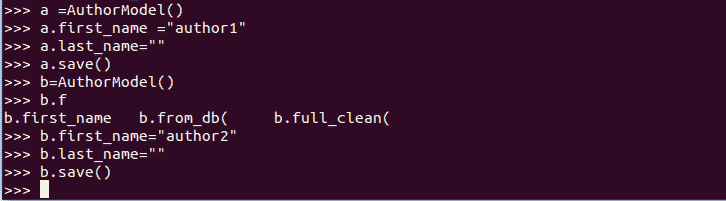

Author DB

同样作为练习，试着自己创建一个类似于图书视图的**作者视图**。

我们现在已经学会了通过 **shell** 向表中输入数据，但这并不是添加数据的最有效方式。最简单的方法是通过**管理站点**添加数据。我们将在下一篇文章中学习如何做到这一点。

同样从管理网站，你会得到更多关于这整个 **FK** 的工作信息，以及作者数据库和模型数据库如何通过 **FK 相互链接。**

## 结论

就这样，我们已经到了文章的结尾。在下一篇文章中，我们将学习**管理站点接口**，然后以一种更好的方式看到 **FK** 的效用。**继续编码！！**