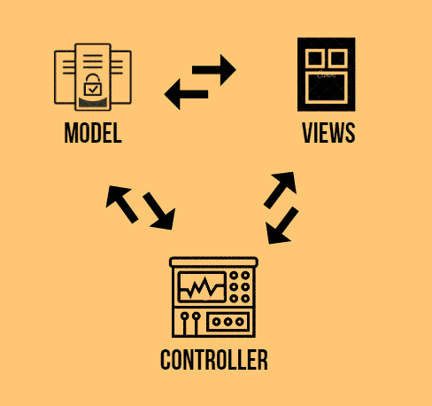
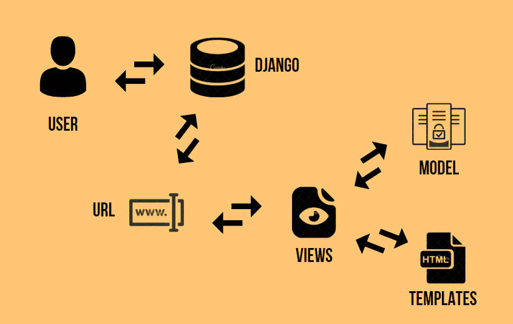

# 姜戈·MVT 建筑公司

> 原文：<https://www.askpython.com/django/django-mvt-architecture>

在本文中，我们将讨论 Django MVT 架构，以及它与长期存在的 MVC 架构有何不同。所以让我们进入正题，了解姜戈 MVT 建筑。

但在此之前，我们将简要回顾一下 MVC 架构。

## **什么是 MVC 架构？**

MVC 架构在软件行业已经存在很长时间了。几乎所有的语言都使用 MVC，只是略有不同，但是概念是一样的。

MVC 代表**模型-视图-控制器**

*   **模型**–模型为存储在数据库中的数据提供接口。它负责维护数据并处理整个 web 应用程序的逻辑数据结构。
*   **视图**–MVC 中的视图是一个用户界面。它负责向用户显示模型数据，并从用户那里获取信息。MVC 中的视图和 Django 中的视图不一样。我们将在本文的后面了解两者的区别。
*   **控制器**–MVC 中的控制器负责 web 应用程序背后的整个逻辑。也就是说，当用户使用视图并发出 Http 请求时，控制器会看到用户请求并发回适当的响应。

MVC

Django 喜欢在它的 web 应用中使用自己的逻辑实现，因此它的框架自己处理所有的控制器部分。

因此 Django 实现了一种不同的架构，叫做 MVT(模型-视图-模板)架构。

## 什么是姜戈 **MVT 建筑**？

MVT 架构是 Django web 框架使用的软件设计模式。

MVT 代表**模型-视图-模板。**

### 1) **型号**

就像 MVC 中的[模型](https://www.askpython.com/django/django-models)一样，这里它也有同样的功能，为存储在数据库**中的数据提供接口。**

### 2) **模板**

就像 MVC 中的 **[视图](https://www.askpython.com/django/django-class-based-views)** 一样，Django 在其框架中使用模板。模板完全负责整个用户界面。它处理网页的所有静态部分以及 HTML，访问网页的用户会感觉到。

### 3) **视图**

在 Django 中，视图充当了**模型数据**和 **[模板](https://www.askpython.com/django/django-templates)之间的链接。**

注意:就像 MVC 中的控制器一样，Django MVT 中的视图负责处理 web 应用程序背后的所有业务逻辑。它充当模型和模板之间的桥梁

它看到用户请求，从数据库[中检索适当的数据](https://www.askpython.com/django/django-mysql)，然后连同检索到的数据一起返回模板。

因此，在姜戈 MVT 架构中没有单独的控制器，一切都基于**模型-视图-模板**本身，因此得名 **MVT** 。

## **控制 MVT 的流量**

Control Flow

这里如上图所示

1.  用户向 Django 发送一个对资源的 URL 请求。
2.  Django 框架然后搜索 URL 资源。
3.  如果 URL 路径链接到一个视图，那么这个特定的视图被调用。
4.  然后，视图将与模型进行交互，并从数据库中检索适当的数据。
5.  然后，视图将适当的模板和检索到的数据一起呈现给用户。

## 结论

就这样，伙计们！！这都是关于姜戈 **MVT** 的建筑。要了解更多关于它们的信息，请查看 [Django 模型](https://www.askpython.com/django/django-models)、[视图](https://www.askpython.com/django/django-views)和[模板](https://www.askpython.com/django/django-templates)文章。继续编码！！