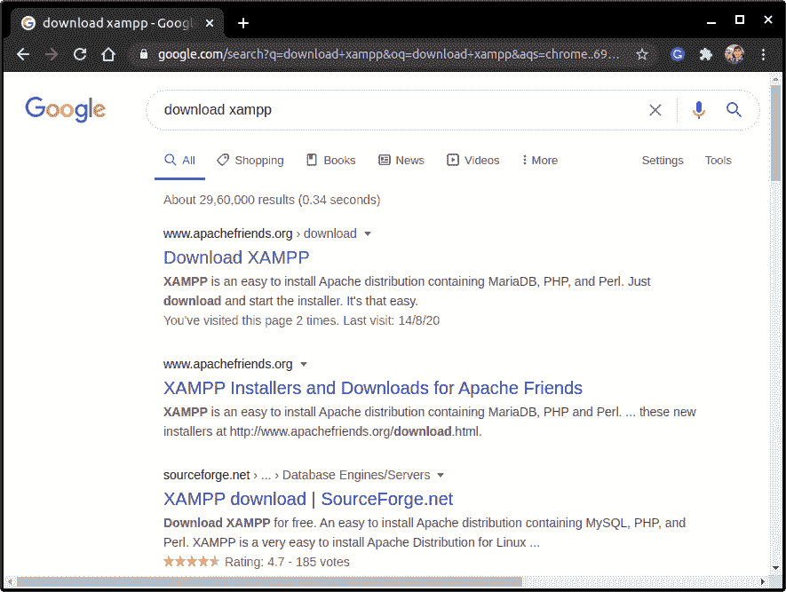
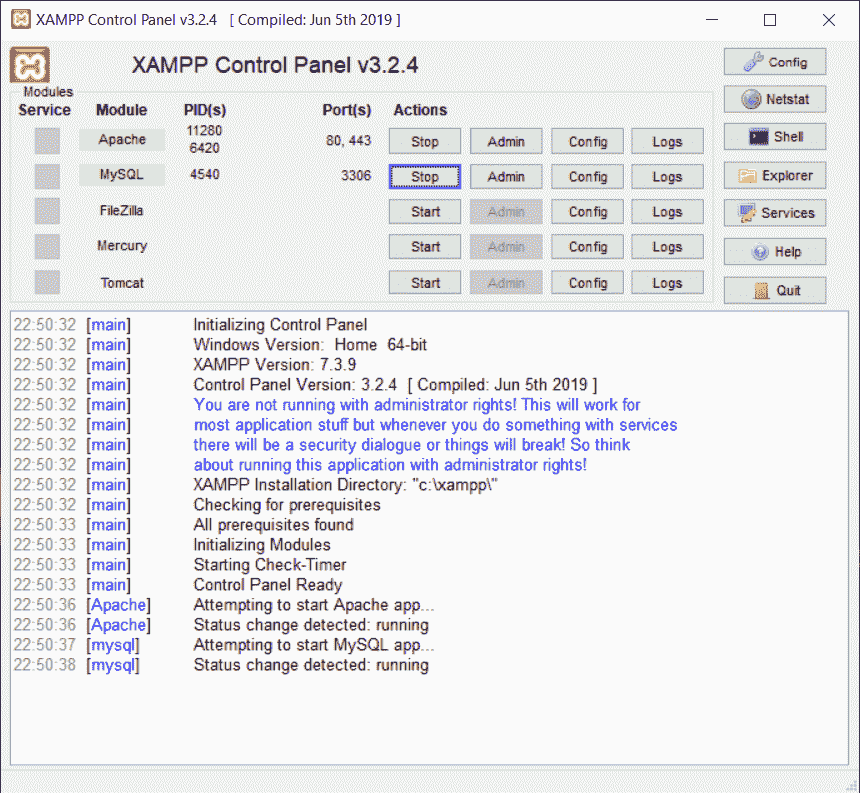
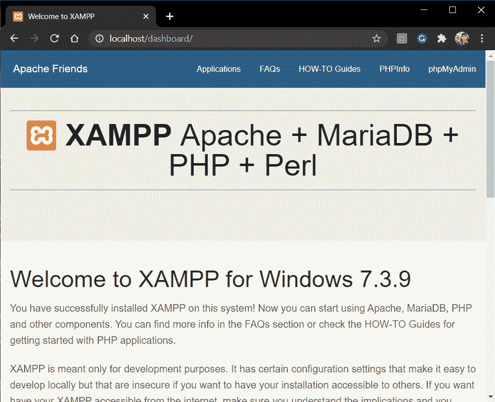
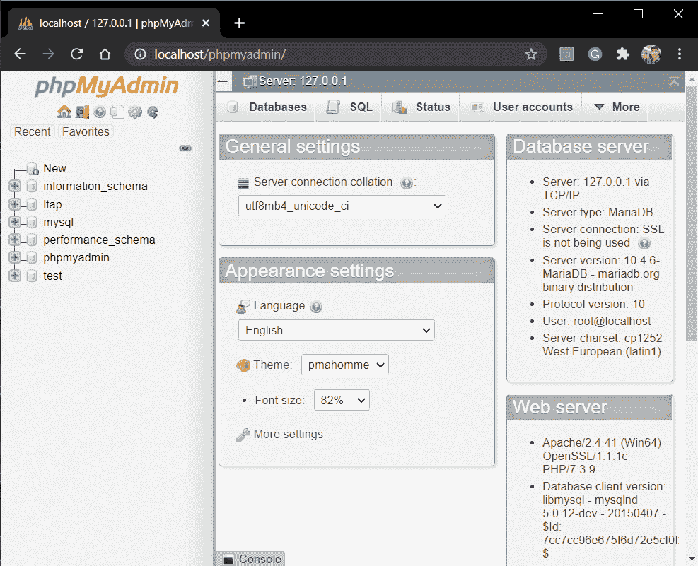
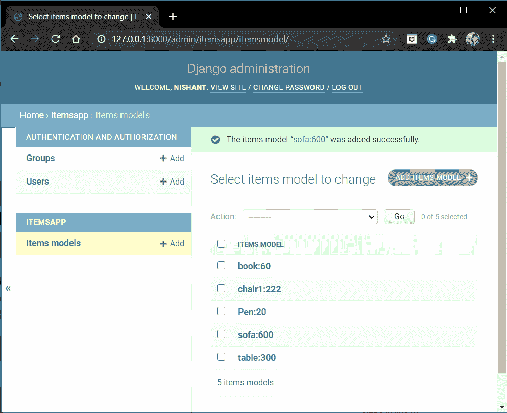
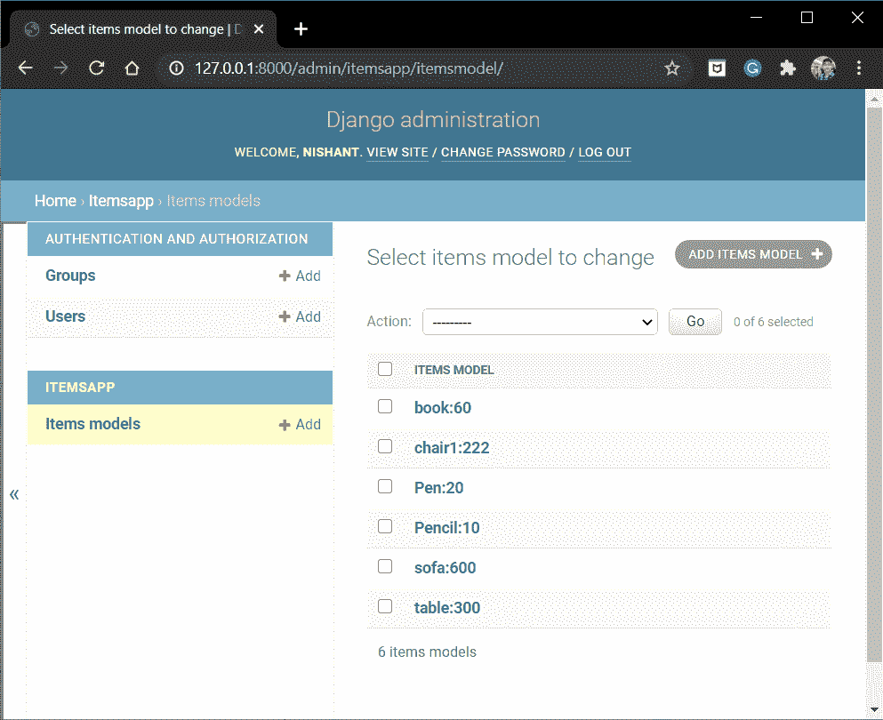

# Django MySQL——如何设置 Django 使用数据库？

> 原文：<https://www.askpython.com/django/django-mysql>

在本文中，我们将学习如何结合我们的 web 框架使用 Django MySQL。

## **为什么 MySQL 胜过 SQLite** ？

与默认的 SQLite 相比，MySQL 更安全，也更先进。它甚至可以处理大量数据，因此可以大规模使用。如果我们谈论速度，MySQL 的工作效率更高。

## 结构化查询语言

SQL 允许我们访问和操作数据库。使用它，我们可以执行各种任务，例如

*   向数据库添加记录
*   创建表格
*   执行 CRUD(创建、读取、更新、删除)操作

SQL 是一种由数据库系统使用的语言。为了应用和建立数据库，我们需要一个 **RDBMS** ，如 MySQL、PostgreSQL、Oracle 等。

**建议:**关于 Journaldev 的 SQL 教程

## 在 Django 开发中使用 Django MySQL

有了基础知识，现在让我们开始了解如何开始 Django MySQL 开发。

**建议:** [Django REST API 教程](https://www.askpython.com/django/django-rest-api)

### 1.演示 MySQL 数据库

下面是我们将在演示中使用的演示表。

| 身份 | 名字 | 城市 | 国家 |
| --- | --- | --- | --- |
| one | 留宿（remain overnight 的缩写） | 纽约州 | 美利坚合众国 |
| Two | 雄鸭 | 在那里 | 美利坚合众国 |
| three | 理查德 | 巴伐利亚州 | 德国 |
| four | 圣诞节 | 维加斯 | 美利坚合众国 |
| five | 琼斯 | 慕尼黑 | 德国 |
| six | 凯恩 | 纽约州 | 美利坚合众国 |

DB Table

这里有 **4 个字段**和 **6 个记录**。

**基本 SQL 语句**:

*   **SELECT FROM-**该语句**从** a 表中选择 s 字段(全部或部分)**。**
*   **其中**–这是通常与其他语句一起使用的条件语句。选择使用满足该语句设置的条件的这些记录。
*   **UPDATE**–该语句更新一个表格
*   **编辑**–该语句编辑一个/多个记录的字段
*   **DELETE**–该语句删除一个/多个记录字段

### 2.在您的服务器上安装 XAMPP

现在要使用 MySQL，我们必须使用一个软件工具来处理 MySQL 在网络上的管理。

外面有许多工具；在本文中，我们将使用 **phpMyAdmin** ，因为它的工作环境非常简单高效。

Xampp 软件为我们提供了 PHPMyAdmin web 接口。所以要使用 phpMyAdmin，我们会先下载 Xampp。

点击这里[下载 XAMPP](https://www.apachefriends.org/download.html) 。下载适合您的操作系统和体系结构的正确版本。



Xampp

### 3.启动 Apache 和 MySQL

一旦你按照步骤安装 XAMPP，然后开始以下两个过程:

*   **Apache web 服务器**–服务 HTTP 请求
*   **MySQL 服务器**–用于数据库



Xampp

请注意 MySQL 的默认端口是 **3306。**之后在浏览器中，进入 **https://localhost** 。您将看到主机网页。



Xampp Host Webpage

然后点击右上方的 **phpMyAdmin** ，你将登陆 phpMyAdmin web 界面。



Phpmyadmin

现在，

*   点击左栏中的 **new** 创建一个新的数据库。
*   给数据库起一个合适名字。我保留了**姜戈**作为名字。


Django Database

### 4.**为 Python 安装 MySQL 客户端**包

Mysqlclient 是 MySQL 数据库系统的 Python 接口。要用 MySQL 连接 Django 或任何其他可用的 python 接口，我们需要 Mysqlclient。

我们将使用 [pip 命令](https://www.askpython.com/python-modules/python-pip)来安装 mysqlclient 包:

```py
pip install mysqlclient

```

现在，一旦安装了连接器驱动程序，我们需要在 **settings.py** 中更改数据库信息

### 5.在 Django settings.py 中设置数据库设置

在 settings.py 中，我们需要设置数据库连接详细信息，包括表、数据库引擎、用户凭证、主机和端口，如下所示:

```py
DATABASES = {
    'default': {
        'ENGINE': 'django.db.backends.mysql',
        'NAME': <Database_name>,
        'USER':'root',
        'PASSWORD':'',
        'HOST':'localhost',
        'PORT': '3306',
    }
}

```

这里:

*   **引擎**:Django . db . backends . MySQL——因为我们在这里使用的是 Django MySQL。
*   **名称:**在此输入数据库的名称。
*   **用户:**Xampp 软件的默认用户为“**root”**
*   **密码:****root**的默认密码为空。
*   **主机:**主机将只是本地主机
*   **端口:**这是我们之前提到的 MySQL 端口 **(3306)**


DATABASES

### 6.实现 Django MySQL

现在我们必须开始在 Django 使用 MySQL 数据库。让我们设置我们的服务器。

```py
python manage.py makemigrations
python manage.py migrate

```

就这样，修改已经保存了。您现在可以运行服务器并检查。一旦迁移完成，您将看到所有的迁移都被添加到 PHPMyAdmin 站点的 **Django** 数据库中


Database

现在我们将运行 Django 应用服务器。

```py
python manage.py runserver

```

现在，如果你尝试去管理站点，Django 会显示一个关于超级用户的错误信息。这是因为超级用户的详细信息(模型表中的条目)都在早期的 DB SQLite 中，而不在 MySQL 中。

因此，我们需要在终端中再次创建一个超级用户，然后将条目添加回表中

```py
python manage.py createsuperuser

```

就这样，我们成功地连接了 MySQL 数据库和 Django

## 将项目添加到数据库中

我们可以通过两种方式做到这一点:通过管理站点或通过 PHPMyAdmin 站点。

### 1)通过管理站点进行 CRUD 操作

这是我们一直使用的老方法。我们可以通过[管理站点](https://www.askpython.com/django/django-admin-site)添加、编辑或删除 ItemModel 中的项目。

由于我们更改了数据库，表中的所有项目都将丢失。因此，使用管理网站本身添加一些项目。



ItemModel via admin site

所有上述信息将自动添加到 MySQL 数据库中。

转到 **phpMyAdmin** 站点并在 Django DB 中选择 ItemModel。您还会看到表中的所有项目。


ItemModel table via PHPMyAdmin

### 2)通过 phpMyAdmin 站点的 CRUD 操作

在上面的 phpMyAdmin 站点中，有添加、编辑和删除项目的选项。

**编辑/删除:**除了物品信息外，还有**编辑、删除选项。因此使用它们我们可以从 phpMyAdmin 站点编辑和删除。**

**添加项目:**在顶部，您会看到一个**插入**选项。转到那里并添加项目信息。


Add

输入信息，然后单击开始。就是这样！！已添加铅笔项目。

您可以在**浏览选项**以及管理站点中查看它。


MySQL

重新加载管理站点，您也会在那里看到新的项目



Admin site

看看在 Django 中使用 MySQL 有多简单。

## **结论**

就这样，伙计们！！这都是关于 MySQL 以及如何将它与 Django 连接起来。作为实践，请尝试使用 MySQL 作为数据库来制作一个 web 应用程序。

我们将在下一篇文章中看到 PostgreSQL，以及如何在 Django 中使用它。在那之前，你可以从官方网站了解更多关于 MySQL 的信息。

注意安全！！继续学习！！