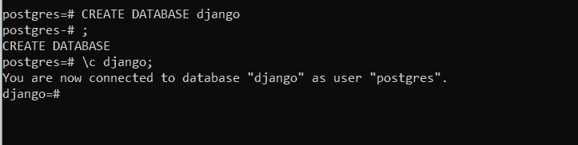

# Django PostgreSQL——如何用 Django 设置和使用 PostgreSQL 数据库？

> 原文：<https://www.askpython.com/django/django-postgresql>

在本文中，我们将了解 Django PostgreSQL 数据库系统。在这里，我们执行与前面对 Django MySQL 类似的操作。本文将帮助那些对使用 PostgreSQL 而不是 MySQL 感兴趣的人。

## PostgreSQL 是什么？

类似于 MySQL 数据库管理系统，PostgreSQL 是另一种类型的 RDBMS，用于访问、存储和处理数据库表形式的数据。

**SQL–结构化查询语言**在 PostgreSQL 中使用，用于访问、执行各种任务、处理 PostgreSQL 中的数据库。

## PostgreSQL 的基本结构

数据作为称为表的数据库对象存储在 PostgreSQL 数据库中。

就像任何 **RDBMS** 一样，PostgreSQL 中的表是包含用户输入信息的名为**记录**的行和名为**字段**的列的集合，这些列包含表中每条记录的具体信息

例如:

| 身份 | 名字 | 班级 | 级别 |
| --- | --- | --- | --- |
| one | 女子名 | X | A |
| Two | 索菲娅 | 离子交换 | A |
| three | 丽雅 | 罗马数字 7 | B |
| four | 回飞镖 | 八 | C |
| five | 克莱尔 | 希腊字母的第 14 个字母 | A |
| six | 莉莉 | 罗马数字 12 | D |

PostgreSQL Table

这里有 4 个字段和 6 条记录。

## 【MySQL 和 Postgre 的区别 SQL

虽然 MySQL 和 PostgreSQL 都属于 RDBMS，但是两者之间有一些关键的区别。

*   MySQL 和 PostgreSQL 的核心区别在于 PostgreSQL 是一个 ORDBMS(对象关系数据库管理系统)，而 MySQL 是一个社区驱动的 RDBM 系统。

*   另一个关键特性是 PostgreSQL 支持现代应用特性，如 JSON、XML 等。而 MySQL 只支持 JSON。

## 将 PostgreSQL 安装到系统中

要安装 PostgreSQL，请访问此处的链接—[https://www.postgresql.org/download/](https://www.postgresql.org/download/)

一旦从上面的链接安装了 PostgreSQL，打开 SQL shell 并按照提示进行操作。您将被要求输入数据库连接的密码。


SQL shell

您当前位于 PostgreSQL 数据库中。现在，我们将添加一个名为 Django 的新数据库，在 SQL Shell 中存储我们所有的[模型](https://www.askpython.com/django/django-models)并编写代码

```py
CREATE DATABASE <db_name>;

```

使用的语法是基本的 SQL 语法。要将当前数据库更改为 django，请使用另一个代码:

```py
\c <db_name>;

```

就这样，现在你在新的 django 数据库中。



Django DB

### 在系统中安装 psycopg2 连接驱动程序

就像 **MySQL 客户端**， **psycopg2** 是 PostgreSQL 的连接驱动，我们需要安装它来连接 Django 和 PostgreSQL

在您的终端中编写以下代码:

```py
pip install psycopg2

```

### 在 settings.py 中设置 Django PostgreSQL 连接

在 settings.py 中，将数据库从默认的 SQLite 更改为 PostgreSQL。

```py
DATABASES = {

    'default': {

        'ENGINE': 'django.db.backends.postgresql_psycopg2',

        'NAME': ‘<db_name>’,

        'USER': '<db_username>',

        'PASSWORD': '<password>',

        'HOST': '<db_hostname>',

        'PORT': '<db_port>',

    }

}

```

这里，

*   **引擎**:将引擎从 **.db.sqlite** 改为 **.postgresql.psycopg2**
*   **Name:** 使用我们之前在 shell 中看到的 DB 名称**(在我的例子中是 Postgres)**
*   **用户:**这是我们之前看到的用户名( **Postgres**
*   **密码:**输入我们之前输入的 PostgreSQL 用户名的密码
*   **主机**:数据库主机名**(本地主机)**
*   **Port:** 这是我们之前看到的 DB 端口号(在我的例子中是**5433**)。


DATABASES

### Django PostgreSQL 的实现

就这样伙计们！！我们现在只需要进行迁移，让 Django 知道我们所做的更改，然后我们就可以开始了！！

```py
python manage.py makemigrations
python manage.py migrate

```

您也可以从 shell 中检查这一点。在 Django 数据库中，SQLshell 编写代码来显示数据库中的所有信息

```py
\d;

```


django DB

最后一个条目是我们的模型

就这样伙计们！！现在我们可以运行服务器了。

```py
python manage.py runserver

```

就像在 Django MySQL 文章中一样，如果你去管理站点，Django 会显示一个关于超级用户的错误信息。

这是因为关于超级用户的信息以及条目记录都在以前的 DB SQLite 中，而不在新的 PostgreSQL 中。

因此，在终端中，我们需要再次创建超级用户

```py
python manage.py createsuperuser

```

就这样，伙计们！！现在我们已经成功地将 PostgreSQL 与 Django web 框架连接起来。

## 在 Django PostgreSQL 数据库设置上执行操作

类似于 MySQL 教程，我们可以通过两种方式添加/编辑/删除条目:通过管理站点或 PHPMyAdmin 站点。

### 1)通过管理站点进行 CRUD 操作

这就是我们一直使用的众所周知的方法。我们通过管理站点添加、编辑或删除 ItemModel 中的项目。

现在，由于我们将数据库更改为 Django PostgreSQL，表中的所有项目都将丢失。因此，我们必须添加一些项目。


ItemModel via admin site

所有上述信息将自动添加到 Postgres 数据库中。

我们可以通过 SQL shell 检查这一点。在外壳中，写下

```py
SELECT * FROM <model_name>

```


Django Table

### 2)通过 SQL Shell 的 CRUD 操作

**要在 SQL shell 中添加项目:**,请编写

```py
INSERT INTO <model_name>(<fields>) VALUES <values>

```

该项目将被添加。


Insert

**编辑:**编写代码

```py
UPDATE <model_name>
set column1 = value1 , column2 = value2 ....
where condition;

```


Edit

**删除:**编写代码

```py
DELETE FROM <model_name> where <condition>

```


Delete

您也可以在管理站点中查看它。

重新加载管理站点，您也会在那里看到新的项目


Admin site

看看使用 Django PostgreSQL 有多简单！！

## **结论**

就这样，伙计们！！我们学习了所有关于 PostgreSQL 的知识，以及如何将它与 Django 连接起来。作为实践，请尝试使用 PostgreSQL 作为数据库制作一个 web 应用程序。可以从[官网](https://www.postgresql.org/)了解更多关于 PostgreSQL 的内容

注意安全！！继续练习！！