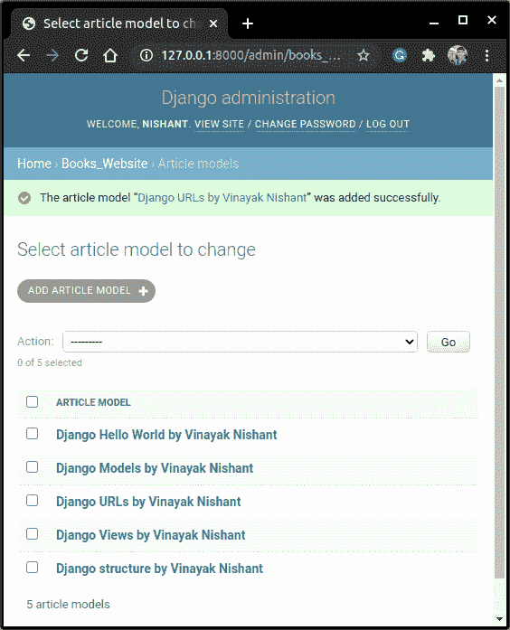
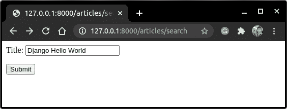
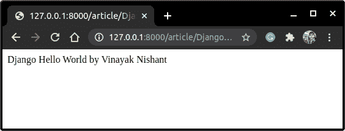
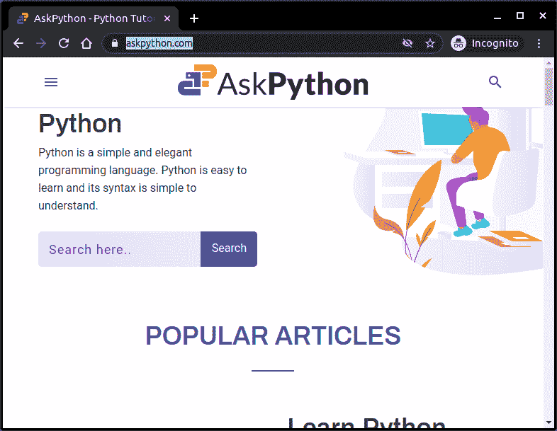

# Django 重定向——如何给你的 Django 页面添加重定向？

> 原文：<https://www.askpython.com/django/django-redirects>

在本文中，我们将学习使用 Django Http 库的 Django 重定向。我们将简要讨论重定向方法的用例及应用。

## 为什么我们需要在姜戈重定向？

**重定向**到另一个站点是 web 应用程序的重要组成部分。它提高了网页的效率。

*   让我们以**脸书、**为例，如果你还没有登录，那么只要你点击 **FB URL** ，你就会被重定向到登录认证站点。这就是重定向发挥作用的地方。

*   同样，一旦付款被确认，当您进行在线交易时，您将被重定向到确认页面。

*   重定向的另一个好处是它有助于 **URL 缩短**——例如， [https://bit.ly](https://bitly.com/) 。在这里你输入一个短网址，然后被重定向到原来的长网址。

因此重定向在 web 开发中扮演着重要的角色。现在我们知道了重定向的用途，让我们开始深入研究吧！！

## **Django redirect()函数**

可以通过三种方式使用 redirect()函数重定向网页:

1.  使用**视图**作为它的参数
2.  直接使用 URL 作为参数

我们现在将详细了解其中的每一项。

让我们创建一个网页，它需要一个 [**模型表**](https://www.askpython.com/django/django-model-forms) 来存储文章和函数 [**视图**](https://www.askpython.com/django/django-views) 来链接它们。

## 处理重定向的先决条件()

创建第一个重定向需要一些底层代码。我在这里补充一下基本要求。

### 1.构建 Django 模型

创建一个模型 **ArticleModel** 并添加以下字段

```py
class ArticleModel(models.Model):
    author = models.CharField(max_length = 80)
    article_title = models.CharField(max_length = 80)
    article = models.TextField()

    class Meta:
        ordering = [ 'article_title']

    def __str__(self):
        return f"{self.article_title} by {self.author}"

```

运行迁移以在数据库中创建一个表。

```py
python manage.py migrate
python manage.py makemigrations

```

让我们也将一些对象添加到 ArticleModel DB 中，



Article Model

### 2.创建 Django 视图

创建一个**文章视图**并添加以下代码:

```py
def ArticleView(request,title):
    article = ArticleModel.objects.get(article_title = title)
    return HttpResponse(article)

```

这里，视图显示用户搜索的文章。此视图的 URL 路径:

```py
path('article/<article_name>', ArticleView, name=ArticleView),

```

### 3.对搜索表单进行编码

我们将需要一个搜索表单，通过它用户可以重定向到一个特定的文章。

如果您不熟悉表单，也不用担心，只需将下面的代码复制粘贴到项目中的 forms.py 文件中。

```py
class ArticleForm(forms.Form):
    title = forms.CharField(max_length =80)

```

如果你愿意，你可以看看 Django Forms 的文章

### 4.制作展示模板

这里我们将使用一个模板来显示 SearchForm。

如果您不熟悉[表单](https://www.askpython.com/django/django-forms)或[模板](https://www.askpython.com/django/django-templates)，也不用担心，只需在 Templates 文件夹中添加以下 HTML 代码。

```py
<form method ='post'>
    
    {{form.as_p}}
    <input type="submit" value = "Submit">
</form>

```

好了，现在让我们回去编写 **redirect()** 函数。

## 添加 Django redirect()方法

让我们在这里用重定向方法构建我们的第一个 Django 重定向。

### 1.使用视图作为参数

在这种情况下，Django redirect()方法的语法如下所示:

```py
redirect('<view_name>',<view_arguments>)

```

我们将使用**搜索表单**，用户将通过它被重定向到文章网页。

现在将下面的视图添加到 views.py 中

```py
from django.shortcuts import redirect

def SearchView(request):

    if request.method == 'POST':
        form = ArticleForm(request.POST)

        if form.is_valid():
            title = form.cleaned_data['title']
            return redirect('ArticleView', title = title)

    else:
        form = ArticleForm()
        context ={
            'form':form,
        }
    return render(request, '<app_name>/Form.html(path to the template)', context)

```

在这里，我们将这个视图重定向到上面的文章视图。此视图的 URL 路径:

```py
path('articles/search', SearchView)

```

### 2.使用直接 URL 作为参数

在本例中，redirect()的语法如下所示:

```py
redirect('URL')

```

将以下视图添加到 **views.py** 中。让我们将这个视图重定向到，比如说 **askpython** 主页。

```py
def URLView(request):
    return redirect('https://wwww.askpython.com')

```

此视图的 URL 路径:

```py
path('redirect/', URLView)

```

就是这样；编码部分做好了。让我们现在实施它。

## 实现视图

启动服务器，进入**“文章/搜索/”**



Search Form

点击提交，浏览器将被重定向到**文章视图**



Article View

现在我们将运行第二个代码。

在您的本地浏览器上输入**" 127 . 0 . 0 . 1:8000/redirect/"**，然后点击 Enter。你将被重定向到 **AskPython** 网站



Ask python

使用 redirect()函数查看网页的效率。

## **结论**

就这样，伙计们！

作为一种实践，你可以尝试使用 **Django 重定向**作为 **URL 缩写。一定要试一试。**

希望你们对 Django 重定向有很好的理解，以及如何使用它们来使你的网站更快更有效。继续练习！