# django REST API——从基础到实现

> 原文：<https://www.askpython.com/django/django-rest-api>

在本文中，我们将了解 API、Django REST APIs、HTTP 方法，最后，创建我们自己的第一个 REST API 应用程序。

## 什么是 API？

API 是应用程序编程接口的缩写，它允许您与其他应用程序交互，并在需要时拉/处理/推数据和值。

简单来说，在 API 中，我们从客户端接收一些数据作为请求，对其进行处理，然后向客户端发回一些数据。

例如:脸书搜索，这里的客户端，即用户发送一个配置文件请求，然后服务器浏览其数据库中的配置文件，并返回他们的配置文件列表(与该名称)。

## CRUD 操作符和 HTTP 方法

使用 API 时，可以根据需要以多种不同的方式向服务器发送请求。这些不同的类型被称为 CRUD( **创建-检索-更新-删除)**

对于每个操作，我们都有相应的 HTTP 方法。我们了解了 POST 和 GET in[Django Forms](https://www.askpython.com/django/django-forms)；我们现在将了解其他人。

*   **GET–**从网络服务器获取特定信息(只是为了查看)。
*   **POST–**向服务器中的数据库添加新信息。
*   **PUT–**编辑已有信息，如果还没有，则添加新信息。
*   **DELETE—**从服务器中的数据库中删除信息。

我们将通过下面的例子来理解这一点:

假设我们有一个包含各种物品的 **DB，比如椅子、桌子、**等等

*   使用 **GET:** 给我们的只是要查看的项目的**列表**
*   使用 **POST** :(以及关于新项目的信息)将该项目添加到 DB 中。
*   使用 **PUT:** (连同关于椅子的信息)，将更新已经存在的椅子的信息。如果它以前不存在，那么它将创建一个。
*   使用 **DELETE:** 只会删除我们想要的特定项目。

## 什么是 REST API？

REST ( *具象状态转移* ) API 类似于标准 API。我们向服务器发送一个请求。但是服务器不会用数据来响应，而是用**资源来响应。**

*   资源是数据，但这里对数据的思考方式发生了变化。
*   资源类似于[面向对象编程。](https://www.askpython.com/python/oops/object-oriented-programming-python)

也就是说，例如:

考虑一个 URL **端点项目/椅子**

在这里，我们可以用同一个端点实现四种不同的功能。

*   获取**物品/椅子:**获取物品列表
*   发布**物品/椅子**:创建一个新的物品椅子
*   放置**物品/椅子**:更新/编辑椅子信息
*   删除**物品/椅子:**从物品中删除椅子

因此，这可以被认为是一个**项目资源。**

因此，现在我们可以认为我们与服务器的交互不是与单个端点请求的交互，而是与资源的交互(具有不同功能的相同端点)

还有，**Rest API 的另一个特点是无状态**。我将用一个例子来解释这一点。

如果我们发布一个新的物品椅子的数据，服务器将把这个信息添加到数据库中。一旦添加，服务器就会忘记它。

现在，如果我向服务器发送一个针对那把椅子的 **GET 请求**，服务器将不会记得我们刚刚在之前的交互中保存了它。它将再次返回数据库，搜索名为 chair 的条目，然后返回信息。

返回信息后，它会再次忘记它

## JSON 在客户机-服务器 API 交互中的应用

**API 使用 JSON 文本**来表示**接受**和**返回请求**。这意味着，当您在 Twitter 上搜索特定的 tweet 时，您会将请求作为 JSON 发送给服务器。在处理它之后，服务器再次以 JSON 文本的形式发回响应。

这个 **JSON 响应**被转换成用户可读的格式。

API 中前端和后端服务器之间真正的信息交换是使用 **JSON 文本进行的。**

**JSON 文本**看起来就像 [python 字典](https://www.askpython.com/python/dictionary/python-dictionary-dict-tutorial)。

```py
{“item”:
	{ “chair”: {
		“Price”:120,
		“Color”: 'red',
		},
	}
}

```

## 安装 DRF-姜戈 Rest API 框架

现在要使用 Django REST API，我们有一个完整的框架，叫做 **Django Rest 框架。**

我们需要使用 [pip 命令](https://www.askpython.com/python-modules/python-pip)将它安装到我们的环境中，就像我们如何安装 Django 一样。

因此，在您的 shell 类型中:

```py
pip install djangorestframework

```

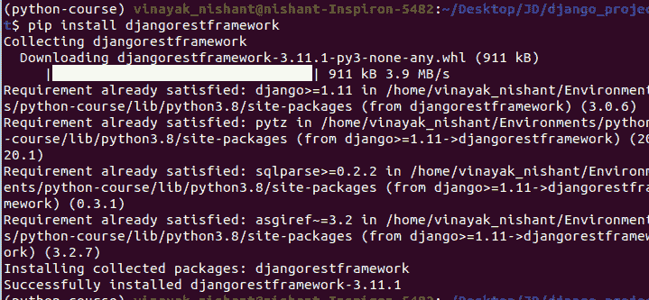

DRF Installation

就是这样；现在安装好了。

## **安装邮递员**

POSTMAN 是一个易于使用的平台 API 开发。Postman 的特性简化了构建 API 的每个步骤，并简化了协作，因此您可以更快地创建更好的 API。

下载邮差，

1.  去浏览器搜索邮差下载。
2.  单击第一个链接
3.  下载免费版的邮差
4.  按照步骤进行安装

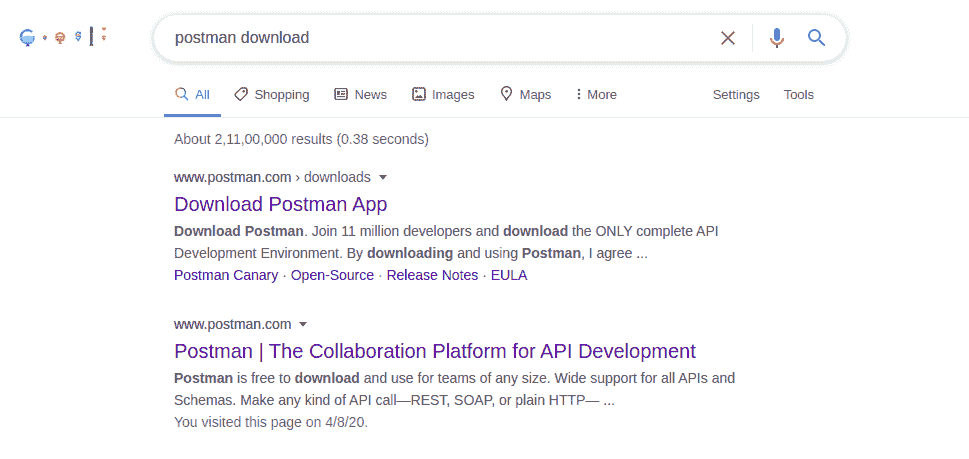

POSTMAN

就是这样。我们准备好出发了。

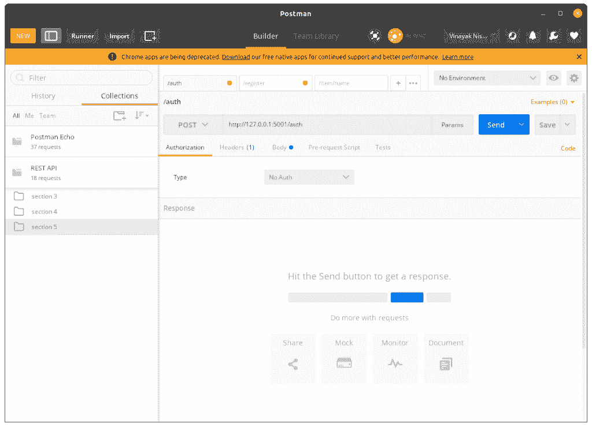

POSTMAN Window

一旦你下载并安装到你的系统中，它看起来就像这样

## 创建新的 Django REST API 应用程序

现在让我们制作一个 Django REST API 应用程序，在其中您可以查看、添加、更新和删除列表中的项目

1.  创建一个名为 ITEM APP 的新应用程序
2.  在 models.py 中创建一个模型
3.  Serializers.py
4.  Views.py
5.  Urls.py
6.  邮递员命中

### 1.创建一个新的 Django 应用程序–items app

使用我们在 [Django Hello World App](https://www.askpython.com/django/django-hello-world-app) 中学到的方法，在我们的项目中创建一个名为“itemsapp”的新 Django app

```py
django-admin startapp itemsapp

```

创建应用程序后，进入第一步执行基本步骤:

*   将项目中的 urls.py 映射到 app 的 URLs . py
*   在 settings.py 中添加应用程序名称
*   等等。遵循 Django app 文章中的步骤

### 2.创建一个包含项目列表的模型 itemModel。

在 models.py 中，创建一个包含项目所需的所有必要信息的模型，如图所示。

```py
class ItemModel(models.Model):
    id = models.IntegerField(primary_key = True)
    name = models.CharField(max_length = 80, blank = False)
    price = models.IntegerField

    class Meta:
        ordering = ['name']

    def __str__(self):
        return f"{self.name}:{self.price}"

```

现在我们的模型已经准备好了，我们将学习一个新的东西，叫做

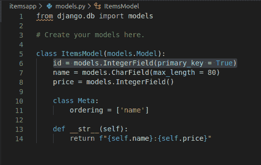

Models

### 3.在我们的应用中创建 Serializers.py 文件

现在，由于 API 处理 JSON 文本，每当我们将数据库中的信息提供给用户时，我们首先需要将其转换成 JSON，反之亦然。

因此，我们需要一个 serializers.py 文件。在您的应用程序中，创建一个新文件"**serializer . py "**，并在其中添加以下信息。

```py
from rest_framework import serializers
from .models import ItemModel

class ItemSerializer(serializers.ModelSerializer):
    class Meta:
        model = ItemModel
        fields = ['id',name','price']

```

这里我们将序列化器链接到模型，因为我们需要在将 DB 数据发送给用户之前将其转换成 JSON。所以基本上，序列化器既可以作为序列化器(将 DB 信息转换成 JSON)也可以作为反序列化器(将用户给定的 JSON 转换成 Django 可读的语法)。

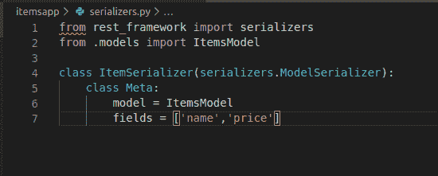

Serializers

在创建视图时，我们将了解更多关于序列化程序如何工作的信息。

### 4.创建用于查看项目列表的 API 视图

现在，在 Views.py 中添加以下代码:

```py
from django.shortcuts import render,HttpResponseRedirect,Http404
from rest_framework.parsers import JSONParser
from django.http import HttpResponse,JsonResponse
from django.views.decorators.csrf import csrf_exempt
from .models import ItemsModel
from .serializers import ItemSerializer
# Create your views here.

```

我们将需要以上所有的导入来编写 API 视图。

现在我们将编写 **ItemsView** ，它将在使用 **GET 方法时向我们显示 DB 中存在的项目列表，并让我们在使用** POST 方法时向列表中添加新项目。(终点:**项/** )

因此，将下面的代码添加到 views.py 文件中

```py
@csrf_exempt
def ItemsView(request):

    if request.method == 'GET':
        items = ItemsModel.objects.all()
        serializer = ItemSerializer(items, many =True)
        return JsonResponse(serializer.data, safe =False)

    elif request.method == 'POST':
        data = JSONParser().parse(request)
        serializer =ItemSerializer(data = data)

        if serializer.is_valid():
            serializer.save()
            return JsonResponse(serializer.data,status =201)
        return JsonResponse(serializer.errors,status = 400)

```

这里

*   **@ csrf _ except**是一个类似于我们在 Django 表单中学到的 **** 的装饰器。这个装饰器确保传递的信息不会发生任何伪造。
*   现在，如果请求是 GET，那么我们将 DB 中的所有对象存储到 items 变量中。
*   然后，我们使用序列化程序将特定信息(存储在 items 中)转换成 JSON 格式。由于我们已经从数据库中取出了所有的对象，所以将 many 设置为 TRUE。
*   一旦信息被转换成 JSON，我们就返回适当的 JSON 响应。
*   在 **POST** 方法中，由于用户将发送的信息是 JSON 格式的，我们需要将其转换成正确的 Python-Django 可读语法。
*   所以我们使用 JSONParser 来解析请求，以获得与新项目相关的数据，然后将其存储到变量 data 中。
*   然后，我们使用序列化程序将从请求中获得的经过解析的 JSON 文本转换成 python 可读的语法。
*   现在，如果经过解析的序列化数据是有效的，那么我们保存它，否则显示一条错误消息。

现在我们将添加另一个 API 视图 item View(endpoint:**item/<int:id>**)，它将向我们显示 GET 请求中的特定项目。我们将能够使用 POST 请求更改信息，并使用 delete 请求删除它。

在相同的 views.py 中，添加以下代码:

```py
@csrf_exempt
def ItemView(request,nm):
    try: 
        item = ItemsModel.objects.get(id = nm)
    except ItemsModel.DoesNotExist:
        raise Http404('Not found')

    if request.method == 'GET':
        serializer = ItemSerializer(item)
        return JsonResponse(serializer.data)

    if request.method == 'PUT':
        data = JSONParser().parse(request)
        serializer = ItemSerializer(item,data =data)

        if serializer.is_valid():
            serializer.save()
            return JsonResponse(serializer.data)
        return JsonResponse(serializer.errors, status =400)

    if request.method == "DELETE":
        item.delete()
        return HttpResponse(status =204)

```

这里，

*   我们再次像以前一样使用了 **@csrf_exempt** ，装饰器。
*   在函数内部，我们将首先尝试获取端点中使用的 id 为的项目(从数据库中获取)。
*   如果不存在这样的条目，我们将引发一个 Http404( **未找到)**错误。
*   如果方法是 **GET** ，我们将使用序列化器将 DB 中的项目信息转换为 JSON 格式，然后将 JSON 响应返回给用户。
*   如果方法是 **PUT，**我们将解析请求以从中获取 JSON 数据，将其发送给序列化程序以将其转换成 python 可读的语法。
*   **注意**在 serializer 中，我们还需要传递项目以及解析的数据，因为 Django 需要知道 DB 中的哪个项目需要更新。
*   如果方法是 **DELETE，**我们将从 DB 中删除特定的项目。

就这样，伙计们！！如果你理解序列化器有困难，不要担心；练习一段时间后，你会找到窍门的。

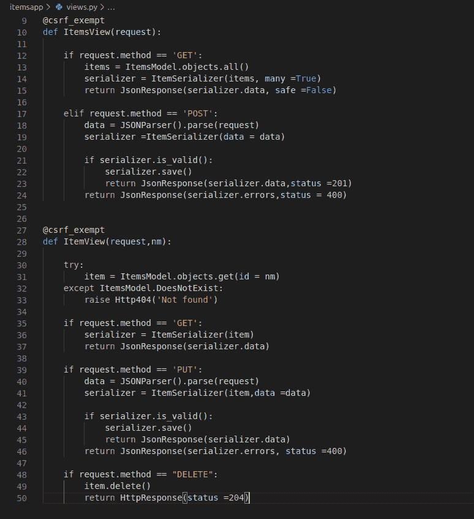

Views

现在我们将修改我们的 urls.py 来适应这两个视图

### 5.为 urls.py 中的两个视图创建 URL 映射

在 urls.py 中添加 path 函数，将两个 API 视图链接到其适当的端点。因此，在 urls.py 中添加

```py
    path ('items/', ItemsView),
    path('item/<int:nm>/', ItemView),

```

我们在 [Django URL 映射](https://www.askpython.com/django/django-url-mapping)中学习了映射 URL。

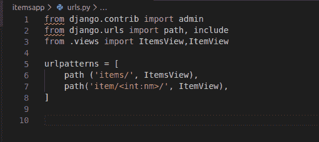

Urls 1

此外，使用下面的代码将模型注册到管理站点，如在 [Django 管理站点](https://www.askpython.com/django/django-admin-site)中所学

```py
admin.site.register(ItemModel)

```

* * *

就是这样。现在，我们需要进行迁移，以便在数据库中创建 ItemModel 表。所以在 Shell 中，输入:

```py
python manage.py makemigrations
python manage.py migrate

```

现在，一旦创建了表，我们就可以运行服务器了

```py
python manage.py runserver

```

转到管理站点，向我们刚刚创建的 ItemModel 添加一些元素。

* * *

## 使用 POSTMAN 查看端点

让我们利用之前下载并安装的 POSTMAN API 开发环境。

### 1.获取项目/

现在在搜索 URL 中，输入 URL“**host website/items”**并在左侧，保留方法 GET。

点击发送并观察以下内容:

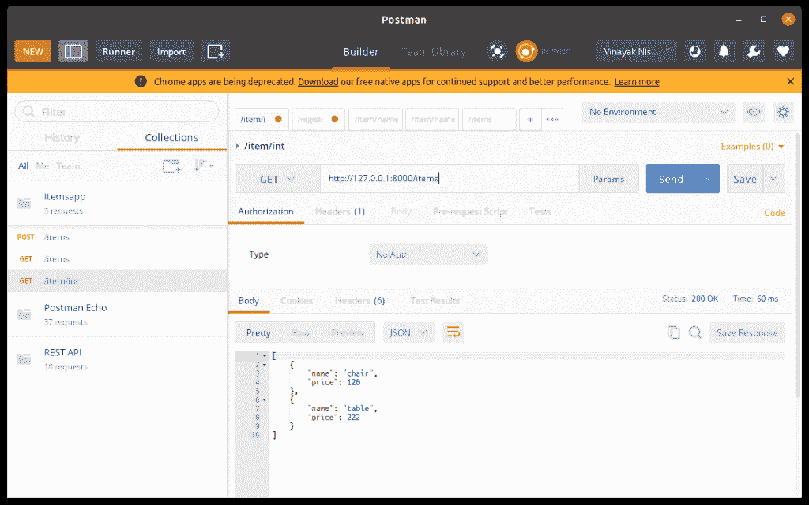

GET Items

我们获得了 DB 中存在的项目列表的信息

### 2.发布项目/

现在在下面，你会看到一个**体**选项。去那里选择**文本**为 **JSON** ，在下面给出的地方，输入你想要添加的物品的信息。

现在将方法从 GET 改为 POST，然后点击 send

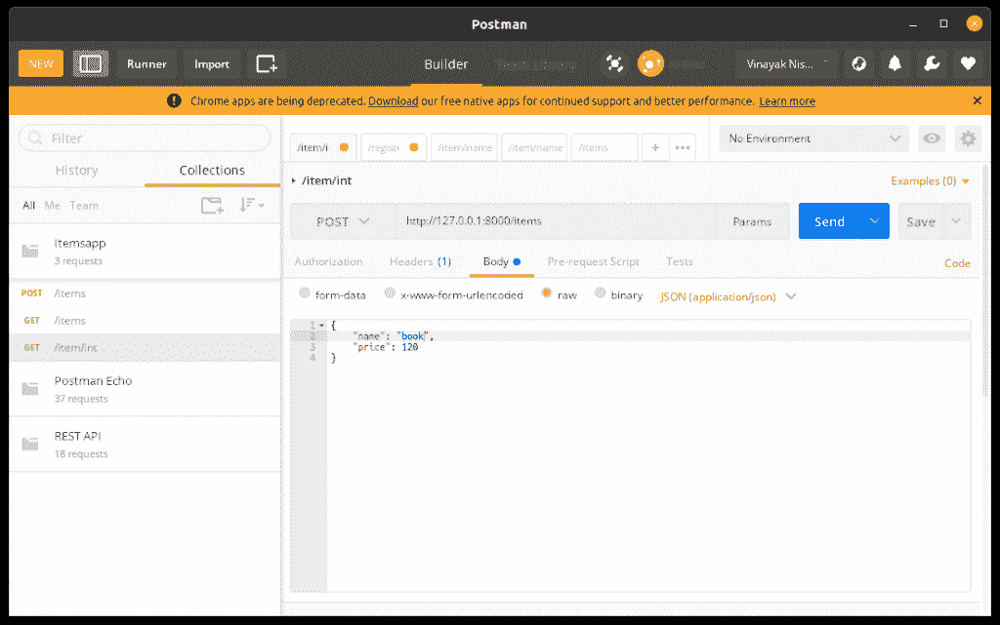

POST Items

该项目现已包含在数据库中。

### 3.获取项目/id

现在，在搜索 URL 中，转到端点**项目/ < id** >并输入您想要的 id。保留 GET 并点击 send 的方法。

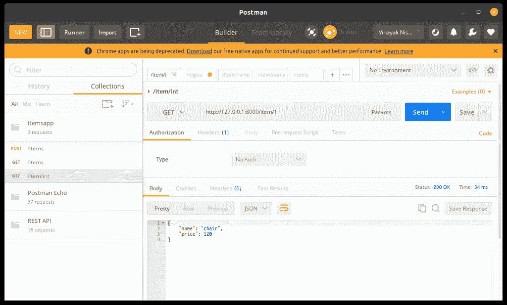

GET Item

你会得到关于那个特定项目的信息。

### 4.放置项目/id

再次像在 POST 选项中一样，写下关于预先存在的项目的信息，然后将方法更改为 PUT 并点击 send。


PUT Item

您将看到信息已经更新

### 4.删除项目/id

现在，将方法改为删除，并点击发送

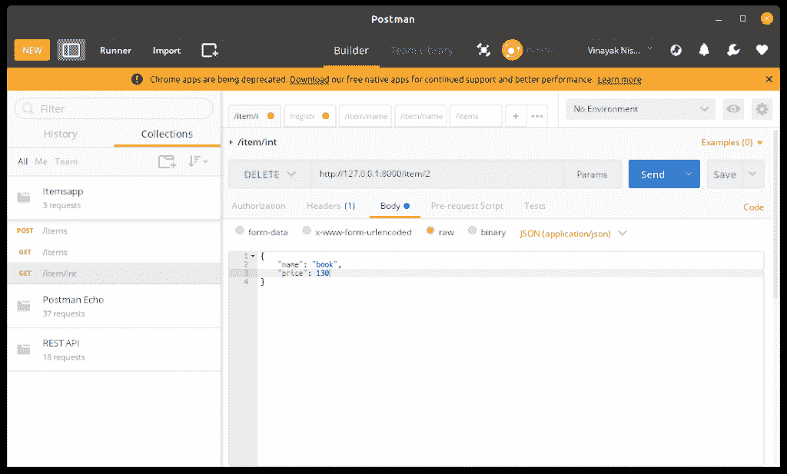

DELETE Item

您将会看到，现在特定的项目已被删除。

## 结论

Django REST API 教程到此为止！我们希望您已经掌握了 Django REST 框架的所有基础知识以及如何使用它们。另外，您可以从官方文档中了解更多关于 Django REST 框架的信息。

请继续关注 Django 主题的更多高级教程！