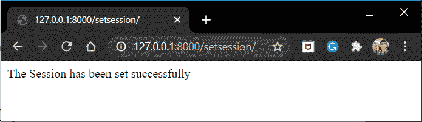
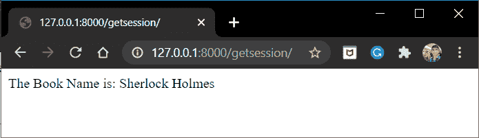

# Django 会话–使用 Django 设置用户会话

> 原文：<https://www.askpython.com/django/django-sessions>

在本文中，我们将讨论 Django 会话。会话的行为和为我们提供的结果与使用 cookies 时相似。但是在客户端保存 cookies 会导致安全威胁。因此，为了使这个过程更加安全，我们使用会话。这正是我们将在本文中学到的——如何使用 Django 会话保护我们的网站免受不安全 cookies 的攻击！！

## 什么是 Django 会话？

从 Django cookies 文章中我们知道，我们可以使用保存在客户端的 cookies 来存储 Web 应用程序的各种有用数据。

但是在客户端存储与 Web App 相关的信息会导致很多安全问题，因此在客户端存储并不是一个好主意。一些可能的威胁包括:

1.  黑客可以修改 cookie 数据，并发送它们来潜在地危害我们的网站。
2.  我们不能存储用户密码等敏感数据。在饼干里。
3.  我们只能在 cookies 中存储有限的数据。大多数浏览器不允许超过 4kb 的数据。

为了解决所有这些问题，我们使用会话，这是一种在服务器端存储 cookies 的机制。因此，所有数据都以 DB 表的形式存储在服务器中，客户端 cookie 只有用于标识的会话 ID。

因此，通过会话，我们可以保存敏感数据，通过会话，我们还可以处理客户端浏览器的**无 cookie 策略**。

Django 在其框架中预建了一个会话框架。现在让我们了解一下吧。

## 如何设置 **Django 会话**？

会话属性作为字典出现在请求数据中。因此，我们用来调用会话的语法是:

```py
request.session.(#other_commands)

```

### **1)设置会话**

建立会话意味着我们:

1.  创建会话
2.  然后将会话 ID 作为 cookie 发送给客户端。

设置会话的语法是:

```py
request.session['session_name'] = 'session_value'

```

### 2)访问会话

为了取回会话信息，我们调用 get session 属性。然后执行以下任务:

1.  从客户端接收 cookie
2.  读取会话 ID 的 cookie
3.  使用会话 ID 检索会话数据

获取会话的语法是:

```py
#method1
session_value = request.session.get('session_name') 

#method2
session_value = request.session['session_name']

```

### 3)其他会话属性

除此之外，还有一些其他的会话功能。其中一些列举如下:

*   **set_expiry(value)** :设置会话的到期时间。
*   **clear)_expired():** 删除过期的会话
*   **get_expiry_age():** 返回会话到期前剩余的秒数
*   **get_expiry_date():** 返回会话的到期日期

读够了吧！！现在让我们把手弄脏吧。

## **Django 课程实践**

我们现在将构建一个简单的 web 应用程序，它使用一个视图设置会话，然后使用另一个视图返回会话。

## **1)对 SetSession 视图进行编码**

在[视图中添加下面的 **SetSession** 视图. py](https://www.askpython.com/django/django-views)

```py
def SetSession(request):
    request.session['book_name'] = 'Sherlock Holmes'
    return HttpResponse('The Session has been successfully set')

```

视图的 URL 路径将是:

```py
path('setsession/',SetSession),

```

## **2)编码 GetSession 视图**

现在在 **SetSession** 下面，在 views.py 中添加下面的 **GetSession** 视图

```py
def GetSession(request):
    book_name = request.session.get('book_name')
    return HttpResponse(f'The Book Name is: {book_name}')

```

视图的 [URL 路径](https://www.askpython.com/django/django-url-mapping)将是:

```py
path('getsession/',GetSession),

```

## **代码的实现**

既然我们已经讨论了所需的单个视图，下面是 Views.py 的组合脚本(包括上面的代码)

只需在您的 **views.py** 中添加以下代码以及 URL 映射，我们就可以开始了:

```py
from django.shortcuts import HttpResponse

def SetSession(request):
    request.session['book_name'] = 'Sherlock Holmes'
    return HttpResponse('The Session has been successfully set')

def GetSession(request):
    book_name = request.session.get('book_name')
    return HttpResponse(f'The Book Name is: {book_name}')

```

最终的 **urls.py** 文件将如下所示:

```py
from django.contrib import admin
from django.urls import path
from .views import SetSession, GetSession

urlpatterns = [
    path('setsession/',SetSession),
    path('getsession/',GetSession),
]

```

好了，现在让我们启动服务器并转到**127 . 0 . 0 . 1:8000/setsession/**



Set Session

我们已经成功设置了会话。

现在让我们通过**127 . 0 . 0 . 1:8000/getsession/**端点取回它。



Get Session

就是这样！！看看使用进程是多么简单。

## **结论**

就这样，伙计们！！这都是关于 Django 会话以及如何在你的项目中使用它们。有关 Cookie 处理的信息，请查看 Django Cookies 文章。

下一篇文章再见！！在那之前，继续编码吧！！