# Django 静态文件简介

> 原文：<https://www.askpython.com/django/django-static-files>

在我们的上一篇文章中，我们讨论了 Django 模板。在本文中，我们将学习 Django **静态文件的另一个类似主题。**

所以现在，如果你去任何一个网站，比如说**facebook.com，**你会在网页上看到各种各样的图片和颜色，而不仅仅是文字。

现在在前端，这个漂亮的视图，组成了完整的网页，通常是使用 CSS(层叠样式表)，JavaScript 文件和图片来实现的。我们将所有这些图片、CSS 文件和 JS 存储在一个名为 **static、**的文件夹中，而这些文件被称为**静态文件。**

## 创建 Django 静态文件文件夹

就像我们在上一篇文章中学习的模板一样，Django 静态文件也保存在一个名为 **static 的单独文件夹中。**

如图所示，在您的 [Django apps](https://www.askpython.com/django/django-app-structure-project-structure) 目录中创建一个静态文件夹。

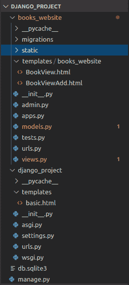

Static

## 命名空间静态文件文件夹

类似于我们的模板教程，静态文件需要**命名空间。**这里，我们也需要在静态目录中添加应用程序名称。

这是因为 Django 使用快捷方式来搜索文件(当它们被导入/加载时)。

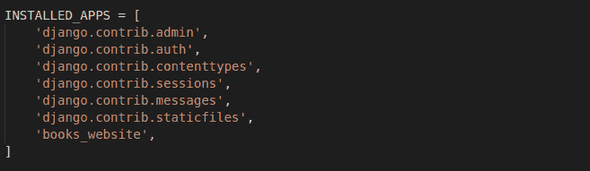

INSTALLED APPS

当您请求一个静态文件时，Django 会连续搜索**INSTALLED _ APPS/settings . py**，并返回第一个结果。

如果在 apps 文件夹中有两个同名的静态文件，Django 可能会返回错误的文件。

因此，就像上一篇文章一样，在**静态文件夹**中添加一个新文件夹( **< apps_name >** )，如下图所示。

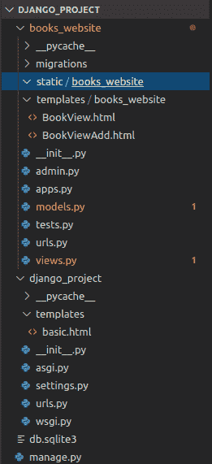

Namespacing Static

## 为网页创建一个简单的 CSS 文件

现在我们将创建一个简单的 **CSS 文件**，看看 Django 如何将它加载到网页上。请注意，我们的主要重点是学习 Django，因此如果您不理解用 CSS 编写的代码，也不用担心。

### 1.向我们的页面添加背景图像

让我们使用 CSS 为我们的网页**(主机网站/书籍)**添加一个背景图片。

最好将所有将在我们网页上使用的图像保存在一个单独的文件夹中，该文件夹为**静态/ <应用名称>文件夹下的**图像】**。**

**注:**单独的文件夹，我指的是在静态文件夹中创建的 **< app_name >** 文件夹内。请看下图，以获得目录结构的视觉透视。

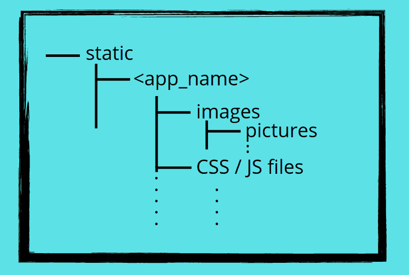

Static directory Structure

让我们创建一个**“images”**文件夹，并将下图保存在其中。


Books

### 2.在静态文件中为“BookView”视图编写 CSS 代码

是时候编写代码将图像显示为背景了。我们将使用 CSS 来显示背景。您可以简单地复制代码，而不用担心它的含义。

确保您更改了下图中提到的文件名。

```py
body{
    background: white url("images/books.jpg") no-repeat;
}

```

CSS 语法很容易理解，如果你试一试，你会得到我们想要的东西。所以基本上在这里:

1.  **目的:**我们正在改变网页的背景
2.  **背景:** **白色**暗示网页应该显示白色背景色，以防图像由于某种错误而无法加载
3.  **URL("images/books.jpg")** 是我们正在使用的图像的路径。
4.  **No-repeat:** 表示当浏览器窗口大于图像尺寸时，图像不应重复出现。

### 3.修改模板文件以合并静态文件

现在在 templates 文件夹中，打开与**“book view”**视图链接的模板。对我来说，是 BookView.html

在上一篇关于 Django 模板的文章中，我们最终的 BookView.html 是:

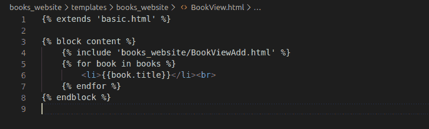

BookView Inclusion 2

这是一个基本的 HTML 文件结构。如果你以前没有使用过 HTML，试一试吧。这是一种非常基础的语言，可以在几个小时内学会。

```py
<html>
    <head>
        <p> Headeer Information </p>
    </head>

    <body>
        <p> Main Text Code </p>
    </body>

</html>

```

让我们修改我们的 HTML 文件，以灌输一个 HTML 文件的正确语法。因此，该文件将如下所示。

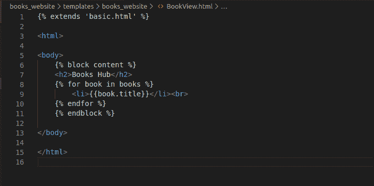

BookView HTML

我已经删除了之前出现在第 4 行**的包含行，并直接替换为标题“**图书中心”**。**

现在要链接 CSS 文件到它，我们使用 HTML **链接**标签中的 **<头>** 。语法看起来像这样。

```py
<head>
   <link rel="stylesheet" type="text/css" href= "">
</head>

```

这里:

*   **目的:**将 CSS 文件链接到 HTML 文件
*   **<链接**:是一个 HTML 属性，我们通过它向其添加 CSS 文件
*   **rel:** 该属性定义了当前文件和链接对象之间的**关系**
*   **类型:**定义我们正在链接的对象的类型。
*   这个属性告诉我们正在链接的文件的路径(在这个例子中是 CSS)

因此，BookView.html 将会是什么样子

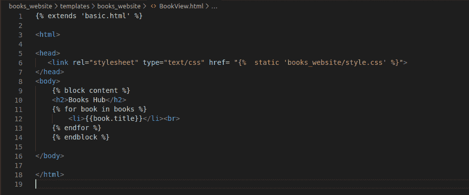

BookView HTML

### 4.**将** 线添加到 H** TML f **线**

如果您现在尝试运行服务器，当您输入以下 url 时会出现错误:http://127.0.0.1:8000/books/。

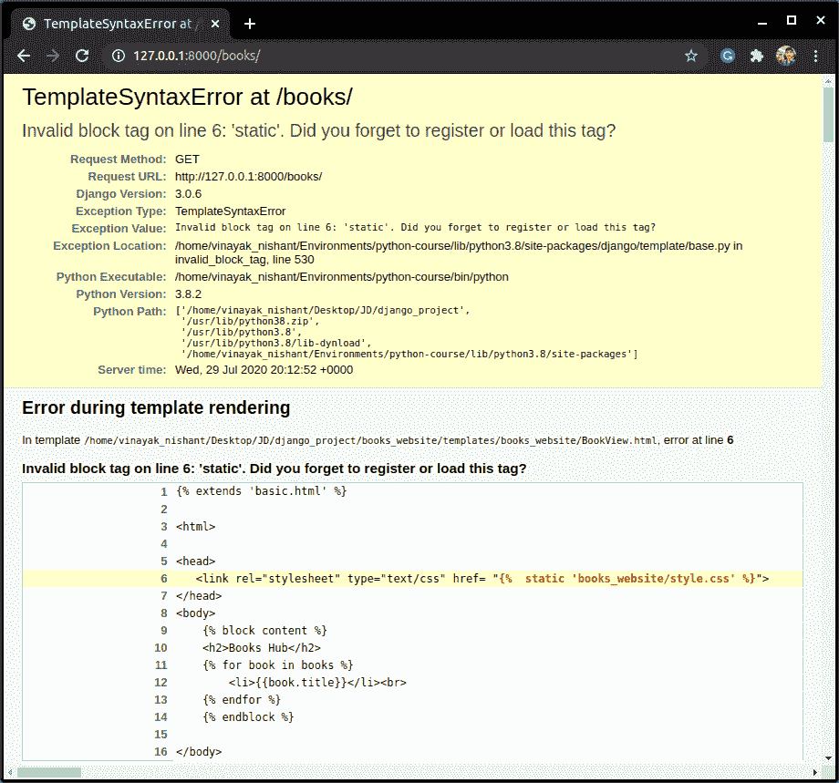

Error

你会注意到，网页无法加载我们在 HTML 文件中添加的 CSS 文件的路径。

这是因为我们没有为静态文件加载静态标签。也就是说，如果我们不加载静态标签，那么 Django 就不会知道下面的单词" **static"** used 是什么意思。

下面一行搜索静态文件夹的路径，然后加载它。

```py
 

```

所以当我们使用下面的代码时，Django 知道单词 static 指的是什么。

```py


```

添加 **** 行后。该文件现在将看起来像这样

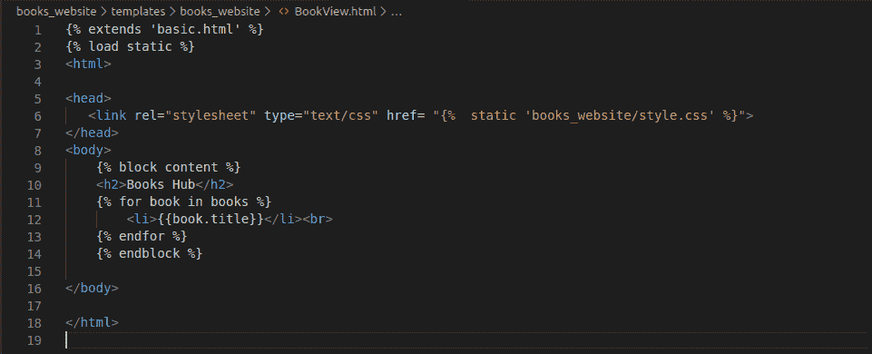

BookView HTML

**注意:**始终保持**模板继承线在顶部。**这是因为 BookView.html 文件是项目目录中基本文件(basic.html)的延伸。

所以在 Django 读取这个文件之前，它应该先读取继承的文件。

现在保存 BookView.html 的文件。服务器应该自己重新加载。如果没有，请在 shell 中使用下面的命令

```py
python manage.py runserver

```

这就对了。我们将背景图片添加到网页中。

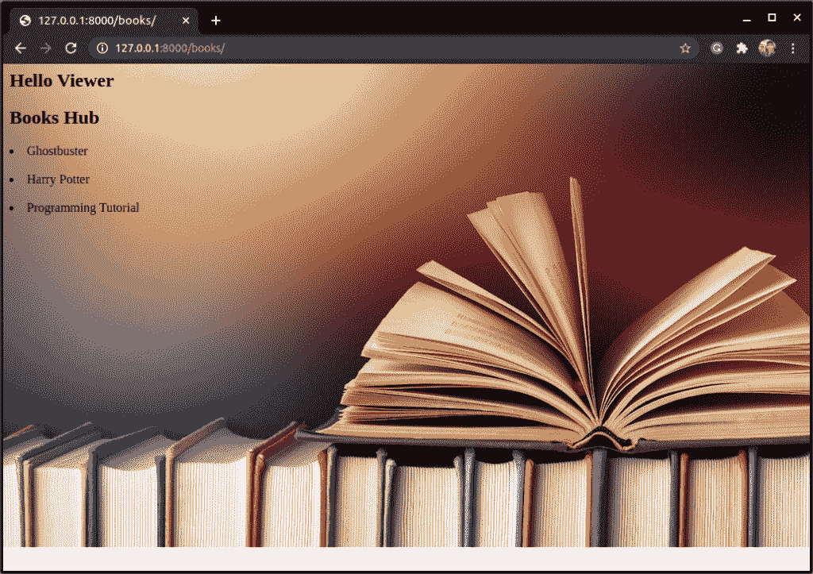

Browser 1

同样，为**127 . 0 . 0 . 1:8000/books/<book _ name>**端点创建一个 BookIDView.html:

```py

<html>

<head>
   <link rel= "stylesheet" type="text/css" href= "">
</head>

<body>
    

    <h3>{{book.title}}</h3>
    <h4>{{book.price}}</h4>
    <h5>{{book.genre}}</h5>

    

</body>

</html>

```

这里我们使用相同的背景图像，因此 CSS 文件的链接属性保持不变。

为了更好地学习，请尝试自己理解，如果您有任何疑问，请访问 [Django Templates 的](https://www.askpython.com/django/django-templates)文章

让我们运行这个网页，并检查

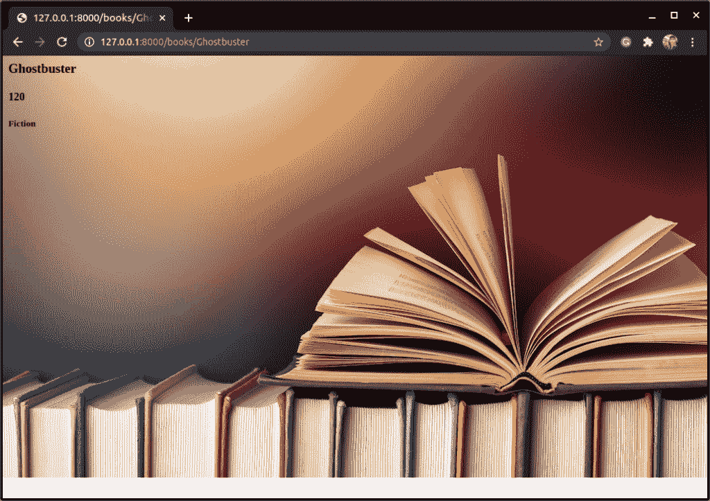

Browser 2

## **结论**

Django 静态文件教程到此结束！我们希望您已经对静态文件及其在 Django 中的使用有了足够的了解。另外，您可以从官方文档中了解更多关于 Django 静态文件的信息。

请继续关注 Django 主题的更多高级教程！