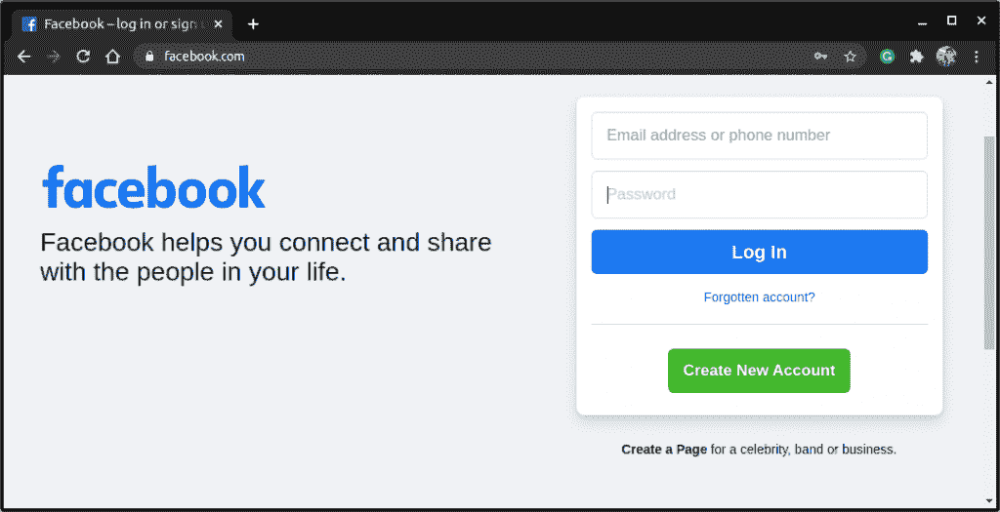
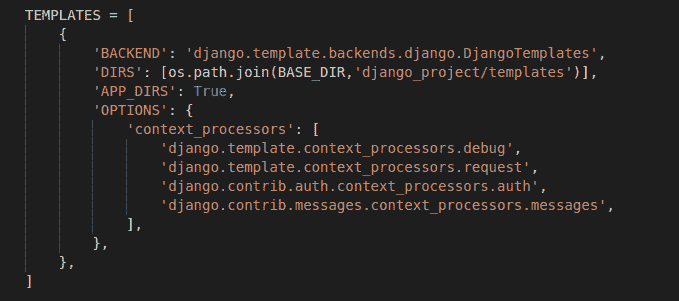
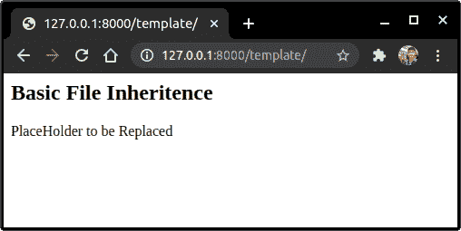

# Django 模板继承——避免冗余代码

> 原文：<https://www.askpython.com/django/django-template-inheritance>

在本文中，我们将了解一个非常重要的主题 Django 模板继承。我们已经了解了 Django 中的[模板是什么。我们将从那里获得知识，并在此基础上不断发展。](https://www.askpython.com/django/django-templates)

## 什么是 Django 模板继承？

模板继承是一种将 HTML 文件中的所有元素添加到另一个文件中的方法，而无需复制粘贴整个代码。例如，考虑脸书主页。



Facebook

这里是网页的基本主题；背景、要素等。，对所有 FB 终点都一样

有两种方法可以实现这一点:

*   将相同的 CSS/JS/HTML 代码添加到所有端点模板中
*   或者，创建一个包含所有公共元素的文件，然后简单地将它包含在其他文件中。

第二种方法是模板继承到底做什么。

## 为什么要继承？

就像脸书一样，大多数应用程序的单个页面都有很长的 HTML 代码。现在，为每一页一遍又一遍地写这些内容是不可能的，而且是一种非常低效的方法。

因此 Django 提供了模板继承的方法来确保更高的效率和更少的代码重复。

模板继承的另一个重要好处是，如果我们修改主文件，它将在继承的所有地方自动改变。因此，我们不需要在所有其他地方修改它

## Django 模板继承实践

让我们在项目级别创建一个基础 HTML 文件，然后让 Django 应用程序模板继承它。

### 1)在 settings.py 中修改模板

为了使基础文件可访问，在**设置. py** 中的**模板**中添加下面一行，如下图所示。

```py
'DIRS': [os.path.join(BASE_DIR,'django_project/templates')],

```

该行执行以下功能:

*   我们使用预定义变量 **BASE_DIR** 获得 Django 项目目录的路径(我们的 Django 项目文件夹)
*   然后用 [os 模块](https://www.askpython.com/python-modules/python-os-module-10-must-know-functions)，我们把它加入到 **django_project/templates** 文件中。

我们基本上是告诉 Django 在应用程序之外搜索模板，也是在项目级别(上面代码指示的路径)。



Base HTML path

### 2)编码父基本 HTML 文件

在所有应用程序之外的 Django 项目目录级别的 Templates 文件夹中创建一个模板**BaseTemplate.html**。

并将以下代码添加到文件中:

```py
<h2>Basic File Inheritence</h2>

    <p> PlaceHolder to be Replaced</p>
 

```

基本文件应该包含 **** 元素。

当**基的。html** 模板将被继承，块内容将被其他模板的内容替换。

## 3)编写应用程序的 HTML 模板文件

现在让我们编写应用程序模板–**“App Template”。HTML "，**将继承**基**文件。将下面的代码添加到 Django 应用程序的模板文件中:

```py


        <h3>Welcome to the App</h3><br>


```

**注意:****{ % extends ' base . html ' % }**行应该总是出现在文件的顶部。

我们需要将模板内容添加到与父文件同名的类似块中。**基本文件**中的块内容将被该文件中相应的块内容替换。

### 4)创建显示模板的应用视图

我们现在只需要一个视图来呈现和显示我们的应用程序模板。视图的代码很简单:

```py
from django.shortcuts import render
def TemplateView(request):
    return render(request,'<app_name>/AppTemplate.html(path to the Template)')

```

视图的 [URL 路径](https://www.askpython.com/django/django-url-mapping):

```py
path('template/', TemplateView)

```

## 实现模板继承

编码部分到此结束，现在让我们在浏览器中实现模板。

运行服务器，点击网址



Template Inheritance

现在，您可以继续使用与主模板相似的格式创建页面。在我们的例子中，那是 base.html。

如果您将所需的 CSS 和 HTML 格式选项添加到 base.html，相同的样式将应用于继承基本文件的所有模板。

## **结论**

模板继承就是这样！！下一篇文章再见！！在那之前继续练习！！