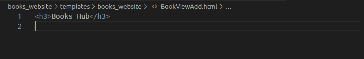

# Django 模板——综合参考指南

> 原文：<https://www.askpython.com/django/django-templates>

继续我们的 [Django 教程系列](https://www.askpython.com/django)，让我们了解 Django 模板。要制作一个 web 应用程序，你需要前端和后端。

如果我们把这两者混在一起会很混乱。Django 为我们提供了一个非常强大的方法来保持 HTML/CSS 前端代码与后端代码完全分离。

* * *

## **DTL–姜戈模板语言**

使用 Django 模板，前端开发人员不需要学习 python，后端程序员也不需要了解 HTML。

前端开发人员可以简单地留下 HTML 注释(任何他想从 Django 得到 DB 和其他信息的地方)。后来，程序员可以简单地用一种模板语言替换它们——被称为 Django 模板语言(DTL)

因此，DTL 是用于在 HTML 文件中嵌入 Django/python 代码的模板语言之一。

DTL 比其他国家有优势，因为它的

*   简单
*   简单易学的语法
*   可扩张的

* * *

## Django 模板语言的基本语法 (DTL)

**DTL** 语法类似于 python，非常易学。它进一步分为 3 种类型

### **1。模板标签**

这些模板标签做一些事情。这句话可能很难理解，但看到例子后你会明白的，所以不要担心！！

**注意:**一个模板标签由 **** 包围。一些例子是:

*   **条件语句/显示逻辑**–>**{ % if % }……{ % endif % }**
*   **循环**–>{ % for x in y % }……{ % end for % }
*   **区块声明**–>{ %区块内容% }……{ % end Block % }
*   **内容导入**–>{ % include " header . html " % }
*   **继承**–>{ % extends " base . html " % }

* * *

### **2。模板变量**

模板变量类似于 **python** 中使用的变量。

**注意:**使用的语法是 **{{** 和 **}}** 一些例子是:

*   **简单变量**–>{ { title } }，{{ x }}
*   **列表属性**–>{ { fruits _ List . 0 } }
*   **对象属性**–>{ { name . title } }
*   **字典属性**–>{ { dict . key } }

**注意**:这里，list.0 与 python 中的 list[0]不同，用于访问 [Python 列表](https://www.askpython.com/python/list/python-list)的第一个元素

* * *

### **3。模板过滤器**

一个**模板过滤器**用于过滤变量/属性。

**注:**符号 **|(管道)**用于表示过滤器。

一些例子是:

1.  **变格**–>{ { name | title } }或{{ characters|upper_case }}

2.  **列表过滤器/切片**–>{ { List | slice = ":5 " } }
    这意味着在列表中，只显示前 5 个元素。

3.  **截断**–>{ { name | truncate words:80 } }
    这意味着从名字中，只显示前 80 个，即把名字截断到前 80 个字符。

4.  **默认值**–>{ { value | Default = " 0 " } }
    这意味着如果变量值为空，则显示默认值 0。

* * *

## 1.创建 Django 模板文件夹

在 Django 中，因为我们将所有的前端文件与后端文件分开，所以这些文本文件(主要是 HTML 文件)也保存在一个单独的文件夹中。


Template settings.py

现在如果我们转到 **settings.py，**会出现一个**模板**选项，如上图所示。现在这里重要的是 **APP_DIRS**

```py
'APP_DIRS':True

```

这一行的意思是 Django 将在名为 **templates** 的文件夹中搜索模板/HTML 文件。

这意味着我们必须在 Django 应用程序中创建一个 templates 文件夹，并将所有 HTML 文件保存在那里。


Templates Folder

## 2.命名空间模板

当我们加载一个特定的**模板文件**时，Django 遍历 settings.py 中的 **INSTALLED_APPS** 中列出的每个应用程序。它按照从上到下的顺序这样做，并加载它获得的第一个同名文件。

我们的项目中可能有不止一个应用程序，而且在不止一个应用程序中可能有两个同名的 HTML 文件。

假设你有一个图书应用和一个钢笔应用。两者的模板文件夹中都有一个**index.html**文件。

如果你试图将 index.html 放入图书应用的 views.py 中，Django 可能会加载错误的 index.html 文件。

这是因为，如前所述，它从 INSTALLED_APPS 列表中加载文件的第一个实例。

这可能会导致问题。为了避免这种情况，我们在模板文件夹中使用**命名空间**。

我的意思是在模板文件夹中添加另一个带有应用程序名称的文件夹。


Namespacing

在我的例子中，应用程序被命名为“ **books _website** ”，所以我将用这个名称命名**模板文件夹**(如上面的截图所示)。

因此，当您将文件包含在您的 **views.py** 中时，您将把包含路径写成

```py
 “ <app_name>/<HTML file>”

```

也就是说，在我的情况下，它将是

```py
‘books_website/index.html’ 

```

**命名约定可以根据需要进行更改，不需要成为应用程序名称。**

然而，为了方便起见，使用应用程序名称是一种标准做法。

## 3.创建基本的 DTL 文件

现在让我们制作一个简单的模板文件，并学习如何将它包含在我们的 **views.py.** 中。在应用程序的 templates/books_website 文件夹中，添加一个 bookView.html 文件**:**


books_website/BookView.html

现在将代码添加到文件中:

```py

    <li>{{book.title}}</li><br>


```


BookView.html

代码是不言自明的，因为它是循环打印图书列表的通用[。](https://www.askpython.com/python/python-for-loop)

## 4.views.py 中的渲染模板

将模型信息发送到模板文件的最有效方式是使用 views.py 中的 render 函数。

```py
render(request,<html file path>,<context>)

```

**render** 方法获取**上下文**(这是模型信息)，使用其路径将其发送给**模板**，然后为浏览器返回适当的响应。

在 **views.py 中，**编写**图书视图**中的代码:

```py
def BookView(request):
    books = BookModel.objects.all()
    context = {
        'books':books
    }
    return render(request,'books_website/BookView.html', context)

```


BookView

这里:

*   我们将模型数据存储到书中
*   **注:**我们创建了一个**上下文作为[字典](https://www.askpython.com/python/dictionary/python-dictionary-dict-tutorial)**
*   我们调用了 render 函数，该函数将请求、模板路径和上下文作为其参数，并返回适当的响应。

现在让我们运行服务器并检查浏览器


Browser

## 5.**模板继承**

现在在**BookView.html，**我们有一个小的 HTML 片段，但实际上，HTML 文件通常很长。

由于一个网站的大多数网页都是一样的，只是在内容上有一些修改，Django 提供了一种叫做**模板继承**的方法。这避免了重复代码和增加不必要的冗余。

模板继承的另一个好处是能够修改代码的主文件，因此 UI/HTML 的变化反映了整个应用程序。

因此，我们创建了基本的 HTML 文件，这些文件拥有所有页面通用的完整代码框架。

我们将这个文件存储在应用程序之外的模板文件夹中(在项目中)，这样每个 [Django **应用程序**](https://www.askpython.com/django/django-app-structure-project-structure) 都可以访问它们。

为了继承其他模板中的代码，将这一行添加到 **settings.py** 中的**模板**中。

```py
'DIRS': [os.path.join(BASE_DIR,'django_project/templates')],

```

这一行很容易理解:

*   我们使用预定义变量 **BASE_DIR** (我们的 Django 项目文件夹)获得基本 Django 目录
*   然后用 [os 模块](https://www.askpython.com/python-modules/python-os-module-10-must-know-functions)，我们把它加入到 **django_project/templates** 行。

仔细阅读以上段落，并反复阅读，以理解我们正在做的事情。


Base HTML path

现在让我们制作一个简单的**basic.html**文件，它将“ **Hello Viewer** ”添加到它的所有网页中。

**用来写文件的语法是**:

```py
<h2>Hello Viewer</h2>

    <p> PlaceHolder to be Replaced</p>
 

```

在基本文件中，我们添加了一个**块**(在我的例子中名称为“content ”),然后添加了一个**默认行**,以防在加载另一个 HTML 文件时出现错误。

该默认行将被替换为应用程序内 HTML 文件中的内容。


Basic.html

现在，让我们更改 BookView.html 文件，以合并**basic.html**文件。

将下面的代码写入文件

```py



    
        <li>{{book.title}}</li><br>
    


```

*   我们在起始继承父文件(basic.html)中添加一行 ****

为了指示 Django，【basic.html】文件中存在的块(**名称-内容)**将被替换，我们**添加了一个具有相同名称**的块(我们在**basic.html**文件中使用的)。

在这个块中，我们编写了替换默认行的代码


BookView.html

现在让我们运行服务器并检查浏览器


Browser Inheritance

## 6.**模板内含物**

与继承类似， **Django 模板文件**也可以包含在其他 HTML 文件中。

让我们制作另一个文件**BookViewAdd.html**，它增加了一个标题“**图书中心**，让我们把它包含到**BookView.html**

在 **books_website/templates 文件夹**中创建另一个名为(BookViewAdd)的 HTML 文件，并添加一行

```py
<h3>Book Hub</h3>

```



BookViewAdd

现在在**BookView.html**，在**块内容**内添加**包含代码行**:

```py



    
    
        <li>{{book.title}}</li><br>
    


```

这里我们使用了**{ % include ' books _ website/bookviewadd . html“% }**，这类似于我们之前使用的继承语法。


BookView Inclusion

现在让我们运行服务器并检查浏览器


Browser

## **结论**

Django 模板教程到此结束！我们希望您对 Django 中的模板功能有一个坚实的理解。另外，您可以从官方文档中了解更多我们在这里使用的 Django 模板语言。

请继续关注 Django 主题的更多高级教程！