# Django URL 映射-操作指南

> 原文：<https://www.askpython.com/django/django-url-mapping>

在本教程中，我们将学习更多关于 Django URL 映射以及如何链接 URL 请求和相应的视图。

我们将理解我们在第一篇文章中是如何在我们在教程最后进入的 sayHello **/** 页面显示 [Django Hello World](https://www.askpython.com/django/django-hello-world-app) 的。

让我们从理解 Django URL 库开始。

* * *

## Django URL 库的基础知识

在这里的 **django.urls** 库中，我们有各种将在我们的 web 应用程序中使用的函数。让我们更多地了解他们。

### 1.路径(路线、视图、路径、名称)

该函数返回一个需要包含在 urlpatterns 中的元素。也就是说，path 充当元素(例如视图)和它的 URL 之间的链接。

**1。路线**

这是特定视图的 URL。例如:`<name>/`是一条路线。

因此，当我们从 URL 请求这个页面时，服务器将返回与之链接的视图。

2.**视图**

这里我们需要写下，我们需要链接的视图名称。或者使用函数“**include”**添加另一个 urls.py 文件。(就像在 project/urls.py 文件中一样)

3. ****kwargs 和*args**

python 中函数定义中的 **args** 是用于变量输入参数列表的语法。

它与一个星号连用。

例如，如果我们需要为一个函数输入任意可变数量的参数，那么我们使用*args。让我们看一个例子

```py
def myFun(*args):
    for arg in args:
        print(arg)

myFun("Hello","There","Hi","There")

```

所以这里我们可以给出任意数量的参数，而*args 将会包含所有的参数。我们可以认为所有的参数都被 arg 保存为某个列表，因此在 args 中使用 arg 的行，我们从列表中取出每个元素。

*将列表分割成元素，因此*args 会分别给出所有元素，args 会将元素作为列表给出。

所以如果你运行上面的代码，你会得到

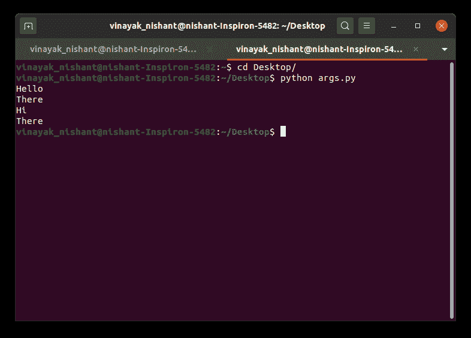

Args

Python 中函数定义中的 **kwargs** 用于关键字变量参数列表。

它与双星号连用。

例如，如果我们需要为一个函数输入任意可变数量的参数(关键字),那么我们使用**kwargs。让我们看一个例子，然后你会更清楚的知道关键词的确切含义

```py
def myFun(**kwargs):
    for item,price in kwargs.items():
        print(f"{item}={price}")

myFun(Book=100,Pen=10,Watch=4000)

```

正如你在上面的例子中看到的，我们能够传递完整的值。使用[赋值操作符](https://www.askpython.com/python/python-operators)的变量名和这些变量保存的值。

我们可以认为参数被 kwargs 保存为一个 **[Python 字典](https://www.askpython.com/python/dictionary/python-dictionary-dict-tutorial)** ，因此通过使用 kwargs.items()中的项目价格行，我们得到了项目(书、笔等)及其相应的价格(100、10 等)。

**将字典拆分成它的元素。因此**kwargs 给你单独的所有关键词元素，而 kwargs 给你作为字典的关键词元素。

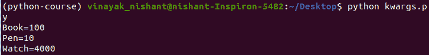

Kwargs

在 Django path()中，如果我们需要向视图发送更多信息以及 URL 路由，我们可以使用 kwargs。

**例如**

```py
path('name/<int:id>',views.name_id,{"foo":"bar"})

```

通过使用 URL name/25，Django 将调用 views.name_id( request，id = 25，foo ='bar ')。

3.**名称**

Name 用于指定 URL 所链接的特定视图的名称。

### 2.包含(模块，名称空间=无)

这个函数获取另一个 URL 配置文件，该文件应该通过使用这个 **include 函数来包含。**即与另一个 **urls.py 文件**形成链接，你应该使用 include 函数。名称空间也可以写在里面，但是我们现在不需要这样做。

* * *

## 如何在 Django 中将 URL 映射到视图？


apps/urls.py

这里我们使用 path()函数，语法如上:

```py
path(‘ ’, sayHello, name = ‘sayHello’)

```

这里 sayHello 是 views.py 中基于函数的视图名称。我们将路径保留为空字符串，这样我们就可以直接访问基目录上的视图-**[http://127 . 0 . 0 . 1:8000/](http://127.0.0.1:8000/)**在我的例子中。

## Django 项目中的 URL 映射


project/urls.py

**path()** 函数将 URL 链接到应用程序中的 **urls.py 文件**。所以我们需要 **include()** 函数，它具有我们在上面学到的语法。

例如，这里我们使用了:

```py
path(‘sayHello/’,include(‘HellpWorldApp.urls’))

```

除了路径和 include 函数，还有 **re.path()和 register_converter()** 函数，我们在 Python-Django 的课程中不会用到它们。

* * *

**注意**:在 project/urls.py 中我们使用了:

```py
path(‘sayHello/’, include(HelloWorldApp.urls)),

```

现在，即使我们在 app/urls.py 中编写 **sayHello/**

这里有一个示例实现:

apps/urls.py:

```py
path(‘sayHello/’, sayHello, name = ‘sayHello’)

```

projects/URL . py:

```py
path(‘ ’, include(HelloWorldApp.urls))

```

对于多个视图，建议使用这种新方式。因此，从现在开始，我们将在 apps/urls.py 中保留端点，在 project/urls.py 中保留' '(主机网站链接)

因此，我们现在可以更改它们，如下图所示。

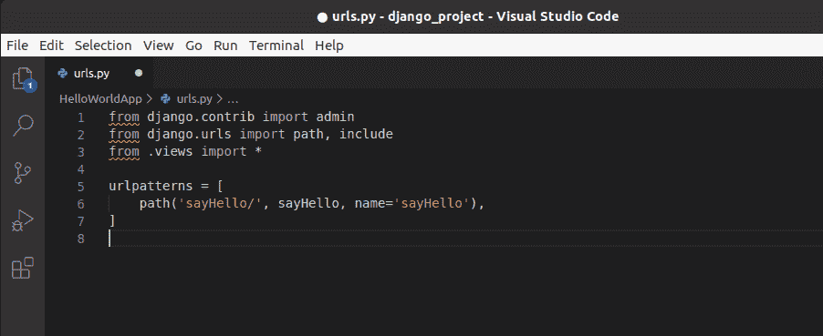

App/urls.py

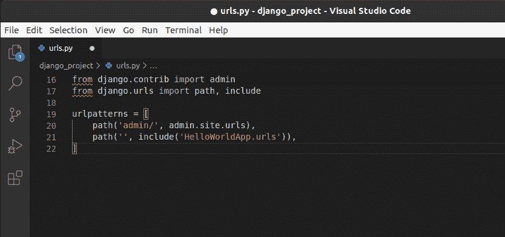

project/urls.py

现在我们知道了路径和包含函数，让我们移动一个来创建多个视图，并将它们链接到不同的端点。

* * *

## 多个视图的 Django URL 映射

正如我们在 [hello world 文章](https://www.askpython.com/django/django-hello-world-app)中所做的一样，我们将在**视图. py.** 中再添加一个**视图**

让我们创建一个 **view Book。**添加代码:

```py
def Books(request):
    return HttpResponse("This is a books webpage")

```

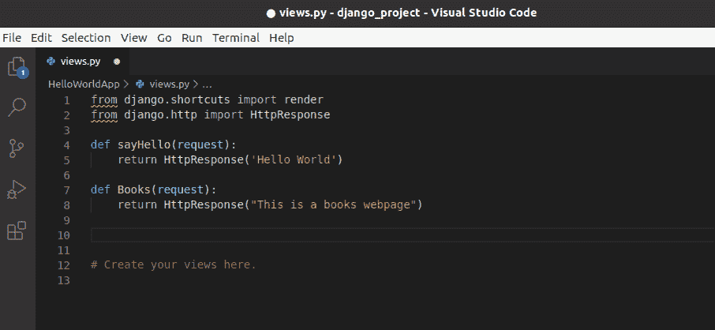

views.py(Books)

对于更新的视图，我们需要创建另一个端点。因此，在 **apps/urls.py** 中，我们必须为端点**‘Books/’**添加另一个路径

```py
path('Books/', Books,name='Books'),

```

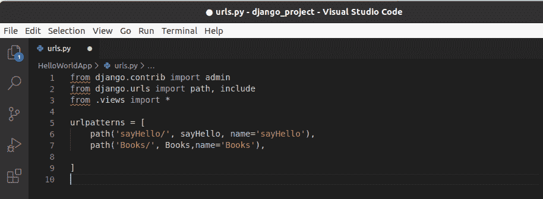

apps/urls.py

现在让我们运行服务器并在浏览器中检查。


Runserver

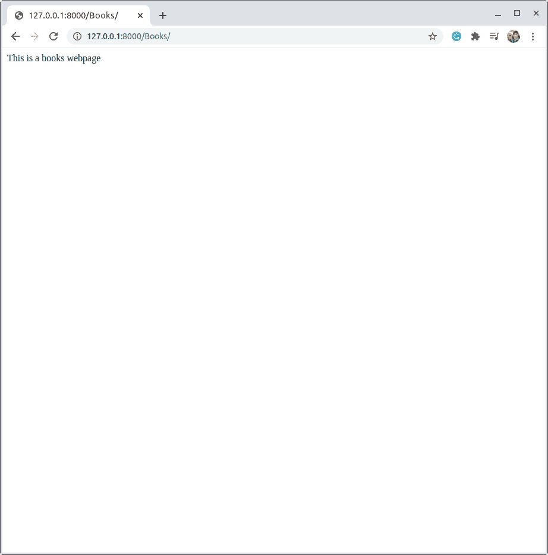

Browser Books/

## **URL 映射-**变量端点****

让我们创建一个**视图**，它将**图书 ID 作为请求**，然后简单地返回一行给我们 ID。

在 views.py 中，让我们创建另一个端点为**‘Books/<number>’**的视图。

```py
def BookID(request,bookid):
    return HttpResponse(f"The book Id is:{bookid}")

```

这里我们只是将图书 ID 与请求一起，然后我们将返回特定于该特定图书的响应。

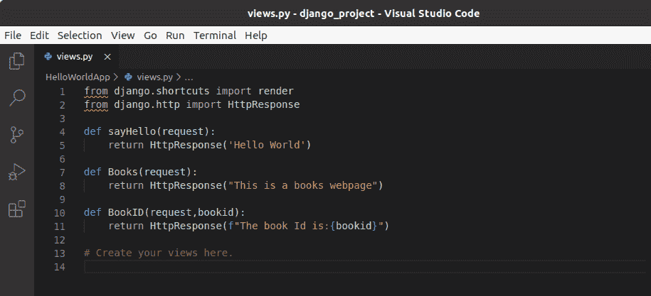

Views.py(BookID)

现在我们必须在 **apps/urls.py.** 中添加端点

```py
path('Books/<int:bookid>', BookID, name='BookID'),

```

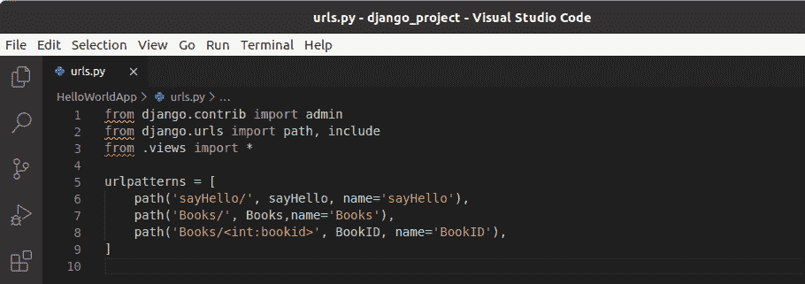

apps/urls.py

这里我们不得不提到使用语法显示的 **< int: bookid >**

让我们运行并检查一下


Runserver

现在让我们运行浏览器并访问 127.0.0.1:8000/Books/1

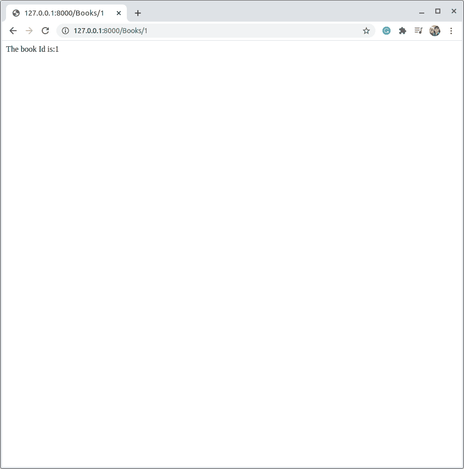

Browser 1

我们还可以检查任何其他随机的图书 ID。

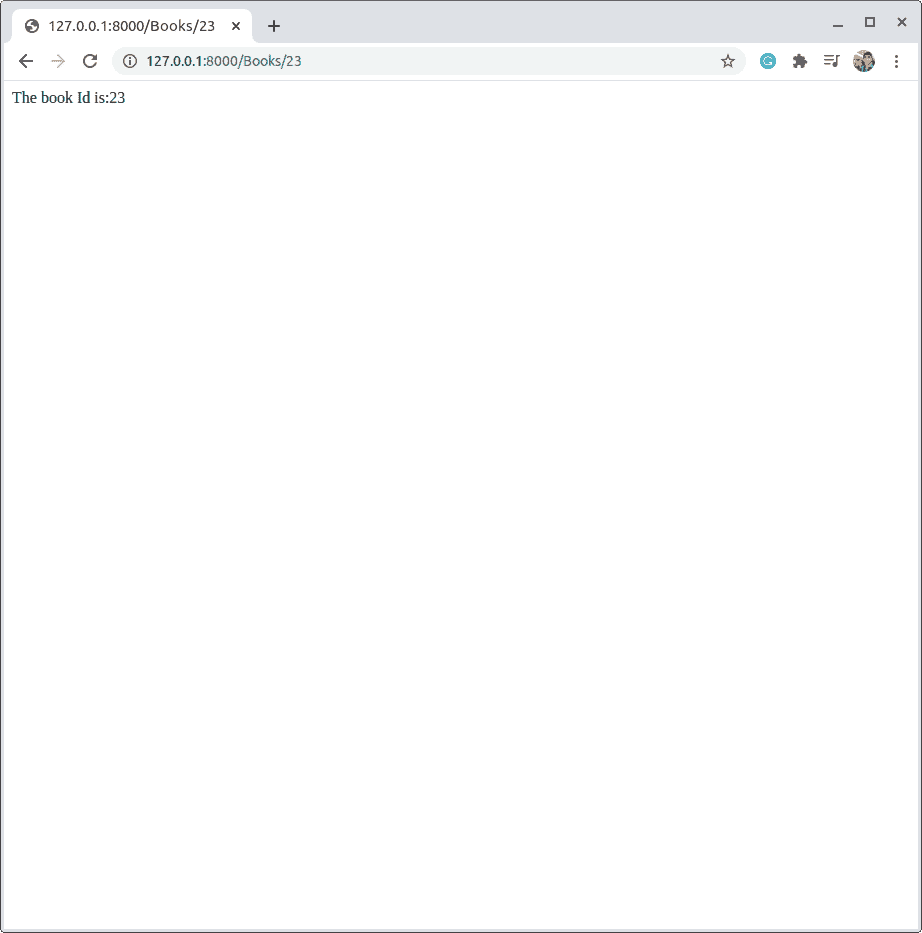

Browser 23

我们可以看到我们的网页正在工作。因此，我们现在可以使用上面的知识将任何**视图**与**URL**进行映射。

## 结论

这就是我们的结局。现在，是我们下一篇讨论 Django 视图和更多我们在这里的 **views.py** 中实际做了什么的时候了。在接下来的几天里，敬请关注更多关于 **[Python Django](https://www.askpython.com/django)** 和 **Flask** 的文章！