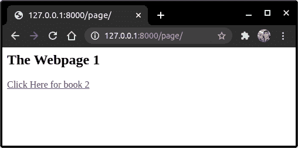
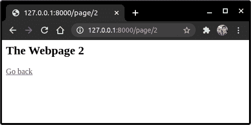

# Django URL 模板

> 原文：<https://www.askpython.com/django/django-url-template>

在本文中，我们将了解一个关键的 [Django 模板语言](https://www.askpython.com/django/django-template-language)标签——**Django URL 模板标签**,并知道如何使用它们。

## **什么**是 URL 模板标签？

URL 模板标签是 Django 模板语言框架中的典型标签类型。这个标签专门用于在模板文件中添加视图 URL。

在 HTML 模板文件中，URL 标签与 HTML 的锚、 **<、href >** 属性一起使用，处理 HTML 中的所有 URL

## 为什么我们需要 Django URL 标签？

当我们可以直接添加**视图** URL 时，Django URL 模板标签的用途是什么？

让我们看一个简单的 HTML a href 标签。

```py
<a href = "/books/book1">Info about book1</a>

```

我们知道它采用静态 URL 并允许我们点击链接。

视图通过 URL 从客户端获取**数据。例如，在以下视图中:**

```py
def View(request,book_id):
    #Code
    return render(request, 'Template.html', {'article_id' : article_id})

```

在这种情况下，URL 路径应该是:

```py
path('book/<int:book_id>' , View, name = 'Books_View')

```

这里的 **book_id** 可以从一本书改变到另一本书。

因此，直接添加这个 URL 是不实际的，它的端点依赖于 book_id。这就是 URL 标签出现的地方。

## **动手使用模板 URL 标签**

要使用模板标签，我们需要正确的视图！！因此，让我们首先创建几个简单的视图。

### URL 模板标记

URL 模板标记语法非常简单:

```py


```

这里的**视图名称**是在 **urls.py** 文件中分配给它的名称。变量 1、变量 2 等。是特定视图的输入参数。

### **1。创建视图**

在 Views.py 中添加以下代码

```py
def View1(request):
    return render(request, 'page1.html')

```

现在，我们还将创建一个简单的视图，也接受用户输入的数据。将下面的 **" "** 也添加到您的文件中。

```py
def View2(request,id):
    return render(request, 'page2.html',{'id':id})

```

两个视图的 URL 路径都是:

```py
    path('page/', View1, name = 'webpage1'),
    path('page/<int:id>', View2, name = 'webpage2'),

```

您可以在 [Django views](https://www.askpython.com/django/django-views) 文章中了解更多关于设置视图的信息。

### **2。创建模板文件**

现在创建一个模板文件 **"page1.html "** ，并将代码添加到该文件中。

```py
<h2> The Webpage 1 </h2>
<a href = ""> Click Here for book 2 </a>

```

让我们也创建 **"page2.html"** 。

```py
<H2> The Webpage2 </H2>
<a href = ""> Go back </a>

```

## **实现 Django URL 标签**

编码到此为止，现在让我们运行程序。因此，请到终端启动您的服务器。

```py
python manage.py runserver

```

转到网址 **"/ page":**



Webpage 1

点击链接并检查



Webpage 2

就是这样，看看使用 URL 模板标签有多简单！！

## **结论**

就这样，伙计们！！这都是关于 URL 模板标签的。请务必查看 Django 模板 的文章以及 **DTL** 的文章，了解更多关于模板的信息。

下一篇文章再见！！在那之前，继续编码吧！！