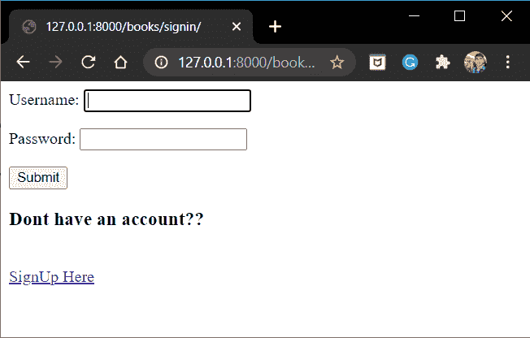
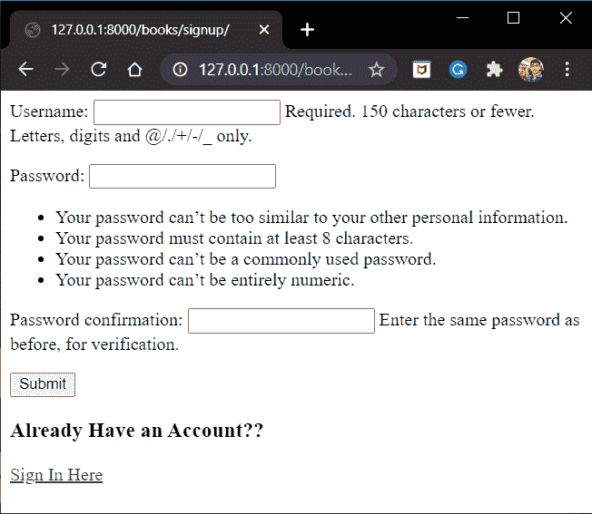
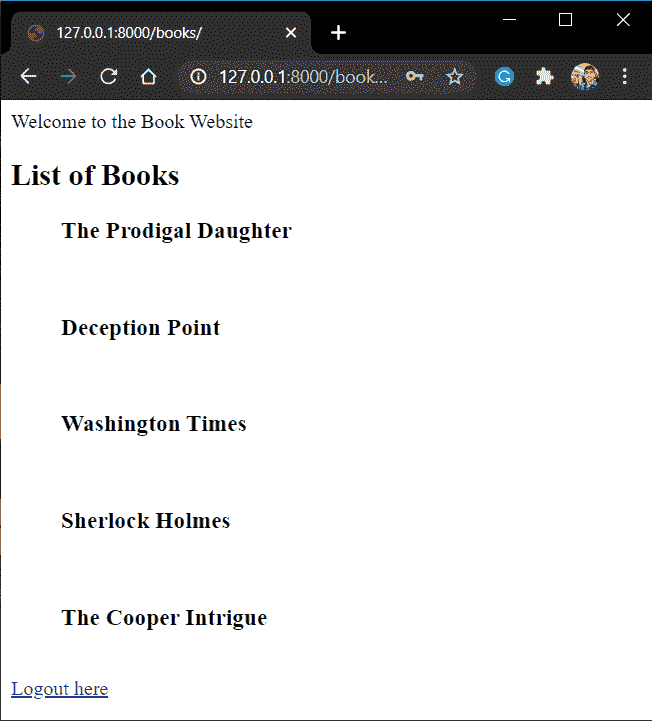

# Django 用户认证——允许使用 Django 注册和登录

> 原文：<https://www.askpython.com/django/django-user-authentication>

在本文中，我们将学习 Django **用户认证**以及相关的所有基础知识。但在此之前，让我们了解一下网站。

## **静态与动态网站**

让我们快速看一下静态和动态网站的区别。

| 静态网站 | 动态网站 |
| --- | --- |
| **静态网站**向用户显示固定信息 | **动态网站**可以根据浏览者显示不同的信息 |
| 没有客户端-服务器交互 | 用户和服务器之间的大量数据交换 |
| 如果您不需要频繁更新数据，则更快、更便宜且易于维护 | 当我们需要用户与网站互动时，这是很重要的。使用正确的 CMS，动态网站可以快速且容易地维护 |
| 通过呈现 HTML、JS 和 CSS 文件直接显示服务器上的内容。 | 基于数据库上为用户存储的可用内容显示前端 |

## **用户认证**

现在几乎所有的网站都有用户认证程序，你可以手动或者通过谷歌/脸书账号创建一个账号。典型的用户验证页面如下所示:


Facebook User Authentication Page

用户身份验证是一个重要的过程，因为它保护所有用户内容的安全，只有特定用户才能访问这些内容。在 Django 中，这是使用 **django.contrib.auth** 库完成的。

此外，根据可能的角色和权限，有不同类型的用户。

## **用户类型**

尽管用户可以分为许多类别和类型，但是有两种主要的用户角色。对网站有编辑权限的用户和没有编辑权限的用户。

### **超级用户**

你在[管理站点](https://www.askpython.com/django/django-admin-site)的文章中遇到过超级用户。超级用户是项目的最高管理者，可以访问管理站点的所有内容。

他还可以删除其他**普通用户。**

### **普通用户**

访问网站的人可以创建这种类型的用户帐户。例如，所有脸书和谷歌账户都属于这一类用户。

他们的权限会根据他们所扮演的角色类型而有所不同。超级用户/管理员决定分配给每个用户的权限。例如，在教室应用程序中，学生将拥有不同的权限，而教师将拥有其他附加权限。

## 使用 **Django.contrib.auth 库**进行认证

Django framework 有一个完整的身份验证库，称为 **django.contrib.auth** 库，内置来提供身份验证框架。

因此在本文中，我们使用内置的**。auth** 库本身。我们现在将研究该库提供的基本属性:

### **1)认证**

基本语法是:

```py
user = authenticate(request=None , credentials)

```

对于**注册**和**登录** [视图](https://www.askpython.com/django/django-views)，authenticate 属性在语法上略有不同。在注册视图中，它只将**请求凭证**作为参数。

```py
user = authenticate(username = "<username>", password = "<pasword>")

```

**注意**:用户名和密码是**从请求**本身获取的凭证。

*   在登录视图中，它需要一个请求凭证(用户名、密码)，以及存储的用户名和密码。

```py
user = authenticate(request, username="<stored_username>",password ="<stored_password>")

```

这里，包含在**“请求”**中的请求凭证与存储在数据库中的**用户名**和**密码**凭证相匹配。只有当 crendentials 匹配时，用户才通过身份验证。

### **2)登录(请求，用户 _ 信息)**

登录功能用于**用户登录**网站。语法:

```py
login(request,user)

```

用户在哪里:

```py
user = authenticate(username,password)

```

### 3) **注销(请求)**

注销属性只是注销当前登录的用户。语法:

```py
logout(request)

```

### 4) **认证表单**

AuthenticatioForm 是预构建的表单，存在于 **django.contrib.auth.forms 中。**该表单显示在 web 应用程序的 django 登录页面上。显示的字段有:

*   用户名
*   密码

### 5) **创建认证表单**

django.contrib.auth.forms 中的预构建表单显示在 django 注册页面上。表格中显示的字段有:

*   用户名
*   密码 **1**
*   密码 **2** (密码确认字段)

现在我们知道了 auth 库包含什么，让我们深入到编码部分！！

## **Django 用户认证实践**

好吧！！阅读部分到此为止，现在让我们把手弄脏吧。

一旦用户正确登录，我们应该有东西显示！！因此，让我们创建一个简单的视图和模板

### **1)样本视图代码**

将简单的 BookView 代码添加到 views.py 文件中

```py
from django.shortcuts import render
def books(request):
    if request.user.is_authenticated:
        return render(request, 'itemsapp/books.html')
    else:
        return redirect('/books/signin')

```

### **2)样本模板代码**

我们将创建一个示例图书[模板](https://www.askpython.com/django/django-templates)来显示图书列表:

```py
<h> Welcome to the Book Website</h>

<h2>List of Books</h2>
<ul><h3> The Prodigal Daughter</h3></ul><br>
<ul><h3> Deception Point</h3></ul><br>
<ul><h3> Washington Times</h3></ul><br>
<ul><h3> Sherlock Holmes</h3></ul><br>
<ul><h3> The Cooper Intrigue</h3></ul><br>

<a href = "">Logout here</a>

```

### 3) **创建注册视图**

在 Views.py 中，添加**注册视图**代码:

```py
from django.contrib.auth import authenticate,login
from django.contrib.auth.forms import UserCreationForm

def signup(request):

    if request.user.is_authenticated:
        return redirect('/books')

    if request.method == 'POST':
        form = UserCreationForm(request.POST)

        if form.is_valid():
            form.save()
            username = form.cleaned_data['username']
            password = form.cleaned_data['password1']
            user = authenticate(username = username,password = password)
            login(request, user)
            return redirect('/books')

        else:
            return render(request,'itemsapp/signup.html',{'form':form})

    else:
        form = UserCreationForm()
        return render(request,'itemsapp/signup.html',{'form':form})

```

网页的注册**模板**将为:

```py
<form method ='post'>
    
    {{form.as_p}}
    <input type="submit" value = "Submit">
</form>

<h3>Already Have an Account??</h3>
<a href = "">Sign In Here</a>

```

### 4) **创建签到视图**

现在在注册视图下面，将下面的**登录视图**添加到您的 views.py 中

```py
from django.contrib.auth import authenticate,login
from django.contrib.auth.forms import AuthenticationForm

def signin(request):
    if request.user.is_authenticated:
        return redirect('/books')

    if request.method == 'POST':
        username = request.POST['username']
        password = request.POST['password']
        user = authenticate(request, username =username, password = password)

        if user is not None:
            login(request,user)
            return redirect('/books')
        else:
            form = AuthenticationForm()
            return render(request,'itemsapp/signin.html',{'form':form})

    else:
        form = AuthenticationForm()
        return render(request, 'itemsapp/signin.html', {'form':form})

```

网页的**登录模板**将是:

```py
<form method = 'post'>
    
    {{form.as_p}}
    <input type = "submit" value = "Submit">
</form>

<h3>Dont have an account??</h3><br>
<a href = "">SignUp Here</a>

```

### 5) **创建注销视图**

最后，我们将把**注销视图**代码添加到**视图. py** 文件中:

```py
from django.contrib.auth import logout

def signout(request):
    logout(request)
    return redirect('/books/signin/')

```

### 6)将 URL 映射到视图

上一节中编码的视图的 [URL 路径](https://www.askpython.com/django/django-url-mapping)将是:

```py
    path('books/signup/', signup, name ='signup'),
    path('books/signin/', signin, name = 'login'),
    path('books/signout/', signout, name = 'logout'),

```

## **代码的实现**

现在我们已经看到了代码的每一个单独的部分，这里是 **views.py** 文件的最终代码。

```py
from django.shortcuts import render,redirect
from django.contrib.auth import authenticate,login,logout
from django.contrib.auth.forms import AuthenticationForm,UserCreationForm

def signup(request):

    if request.user.is_authenticated:
        return redirect('/books')

    if request.method == 'POST':
        form = UserCreationForm(request.POST)

        if form.is_valid():
            form.save()
            username = form.cleaned_data['username']
            password = form.cleaned_data['password1']
            user = authenticate(username = username,password = password)
            login(request, user)
            return redirect('/books')

        else:
            return render(request,'itemsapp/signup.html',{'form':form})

    else:
        form = UserCreationForm()
        return render(request,'itemsapp/signup.html',{'form':form})

def signin(request):
    if request.user.is_authenticated:
        return redirect('/books')

    if request.method == 'POST':
        username = request.POST['username']
        password = request.POST['password']
        user = authenticate(request, username =username, password = password)

        if user is not None:
            login(request,user)
            return redirect('/books')
        else:
            form = AuthenticationForm()
            return render(request,'itemsapp/signin.html',{'form':form})

    else:
        form = AuthenticationForm()
        return render(request, 'itemsapp/signin.html', {'form':form})

def signout(request):
    logout(request)
    return redirect('/books/signin/')

```

而 **urls.py** 的最终代码将是:

```py
from django.contrib import admin
from django.urls import path,include
from .views import signup,signin,signout,books

urlpatterns = [
    path('books/', books),
    path('books/signup/', signup, name ='signup'),
    path('books/signin/', signin, name = 'login'),
    path('books/signout/', signout, name = 'logout'),
]

```

就是这样！！现在启动服务器，进入 **"/books"**

当你转到端点“books/”时，如果你没有被认证，它将首先把你重定向到**登录**网页。



Books Website

现在，如果您没有帐户，请单击下面的链接，您将看到注册网页。



Sign Up

填写详细信息，然后点击回车键，您将被重定向回该书的网页。现在您已经通过了身份验证，将会显示图书列表。



Books Webpage

完成后，您可以按“注销”,您将再次被重定向到登录网页。

瞧啊。！您现在有了自己的用户认证系统！！

## **结论**

就这样，伙计们！！这都是关于用户认证以及如何实现它。我希望这篇文章能帮助您获得关于用户认证的知识。

下一篇文章再见！！在那之前继续练习！！