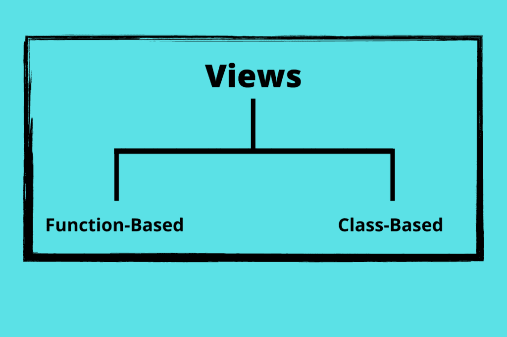
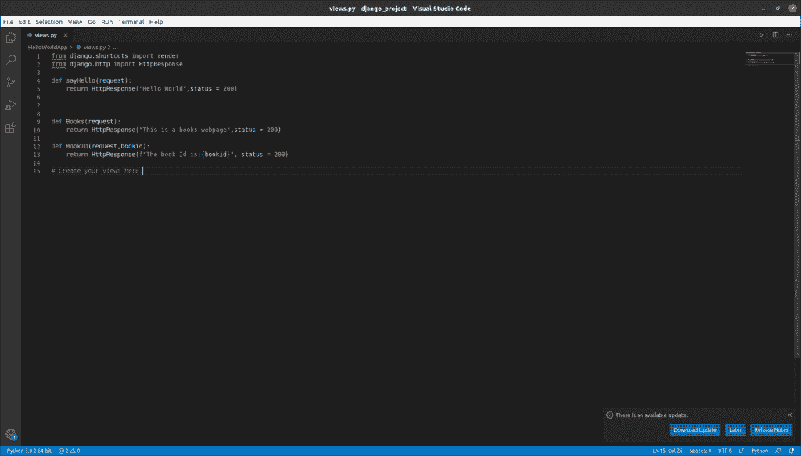
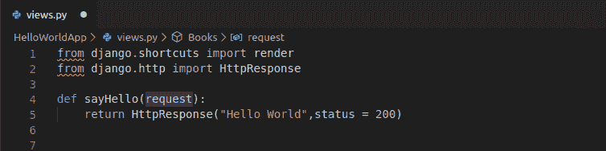
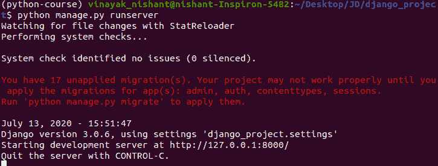
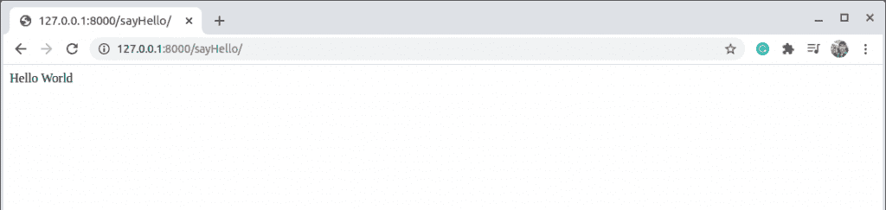
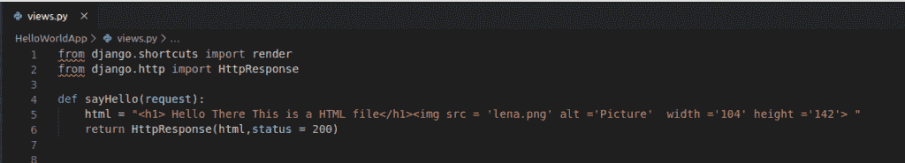
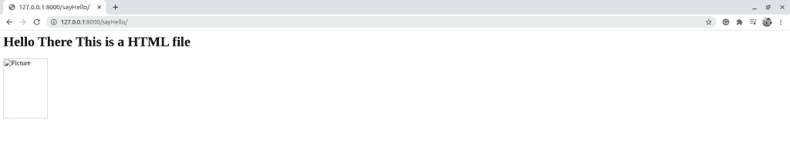

# django Views——初学者指南

> 原文：<https://www.askpython.com/django/django-views>

在本教程中，我们将更多地讨论 Django 视图，以及我们的网页可以有哪些类型的视图。

此外，我们将获得更多关于我们在上一篇关于 [Django URL 映射](https://www.askpython.com/django/django-url-mapping)的文章中在 views.py 中具体做了什么的信息。

* * *

## 究竟什么是视图？

视图函数或简单的视图可以被认为是一个 python 函数，它在接受请求时返回一个特定的响应。响应可以是任何内容，从简单的文本到 HTML 文件，再到图像等。

在典型的 web 应用程序中，我们有如下视图:

1.  主页视图
2.  详细信息/说明视图
3.  帮助页面视图
4.  常见问题视图

诸如此类。

每个视图都有一个可以请求的不同 URL 端点，它链接到 views.py 中的一个特定视图函数

现在我们将研究不同类型的视图。



Views

* * *

## **基于功能的视图**

在这种类型中，视图被编写为 Python 函数，接受请求(HttpRequest)对象作为参数，并返回相应的响应(HttpResponse)。

基于 Django 函数的视图用于进行 CRUD 操作(创建、检索、更新和删除)。稍后你会学到更多。

因此，所有 4 个视图都有不同的视图–**创建视图、检索视图、更新视图、删除视图**

## **基于类的视图**

顾名思义，视图是作为类而不是函数编写的，以返回对特定请求的 HTTP 响应。因此，在这种情况下，我们可以将所有的 CRUD 作为方法，从而将它们全部放在同一个视图中。

此外，基于类的视图被进一步分成许多类型，其中很少是重要的，我们将在接下来的文章中学习。

*   详细视图
*   列表视图
*   混合蛋白

既然我们正在处理响应，主要是 HTTP 响应，我们应该了解它们是什么。

* * *

## HTTP 状态代码

这些 HTTP 属性用于向客户端提供有关 web 服务器响应的更多信息。我们需要学习的最常见和最常用的 HTTP 属性是:

### 1.HTTP 200–状态正常

这意味着状态是 OK 的，这可以被认为是一切都被正确地执行了。

### 2.HTTP 201–状态已创建

这意味着状态是 created，我们可以在 Create/POST 方法下使用它。

### 3.HTTP 400 错误的请求

这意味着服务器不会处理该请求。

### 4.HTTP 404–未找到

这意味着服务器无法找到它需要返回的响应

* * *

## 向视图添加 HTTP 属性

现在我们将在响应中添加 HTTP 属性。为此，我们使用名为 status 的函数。

在函数视图中，添加代码:

```py
return HttpResponse("Hello World",status = 200)

```



HTTP Attributes

现在让我们看看 views.py 并了解我们在那里做什么。

* * *

## **Views.py**

我们将在这里了解不同类型的视图。

### 1.以文本作为响应的视图

这里你可以看到我们使用基于函数的视图来编写 sayHello，Books，BookID 视图。

在这里的视图函数中，我们将请求作为参数，然后返回一个 HttpResponse('Hello World ')。

因此，基本上，我们发送回的响应只是单词 Hello World。



Text Response

就这样，我们现在可以运行服务器并测试代码了。



Runserver



Say Hello

现在让我们发送回一个简单的 HTML 行作为响应。

### 2.将 HTML 行和图像作为响应的视图

这里，我们将 HTML 代码存储在一个名为 HTML 的变量中。然后我们把它作为回应发送回去。在 HTML 代码中，我们发送了一个标题和一张名为**Lena.jpg**的图片

在函数 sayHello 中添加代码:

```py
html = "<h1>Hello There This is a HTML file</h1>

```



HTML Response

就这样，我们现在可以运行服务器并测试代码了。


Runserver



Html Response 1

因此，我们可以看到服务器运行良好。

## 结论

这就把我们带到了本文的结尾。现在，让我们进入下一部分。未来几天敬请关注更多关于 **[Python Django](https://www.askpython.com/django)** 和 **Flask** 的文章！