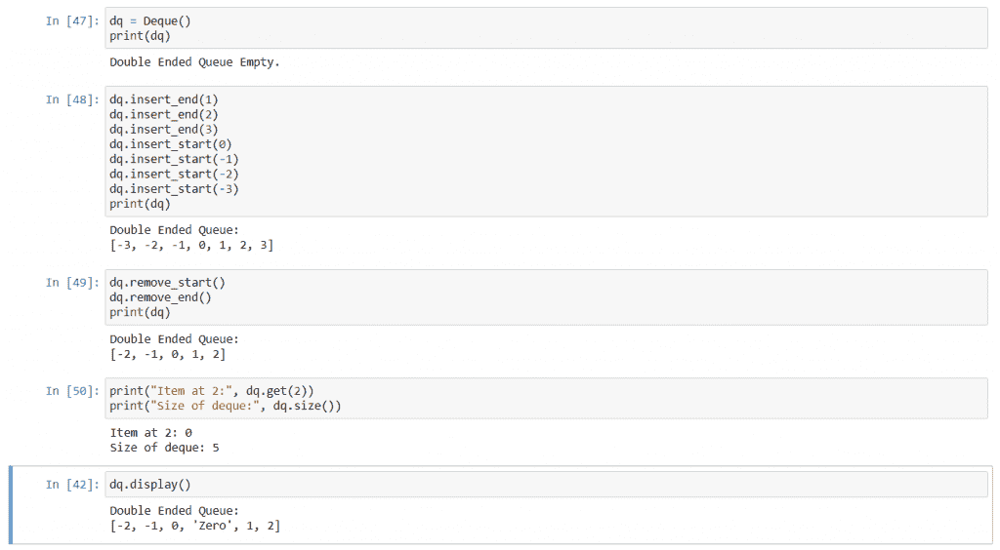

# Python 中的双端队列

> 原文：<https://www.askpython.com/python/examples/double-ended-queue>

双端队列是一种数据结构，用于存储应该在队列中的项目集合。它是队列数据结构的扩展，具有一些额外的特性。

## 先决条件:队列

一个[队列](https://www.askpython.com/python-modules/python-queue)是一个数据结构，用于以真实队列的方式存储一组项目。在真实的队列中，人们通常从后面进入，穿过队列后从前面退出。这被称为先进先出程序。

队列数据结构是一个类似实现的列表，其中所有数据都输入到列表的末尾，所有数据都从列表的开头删除。

***推荐阅读——[Python 中的双循环链表](https://www.askpython.com/python/examples/doubly-circular-linked-list)***

## 在 Python 中实现双端队列

顾名思义，在双端队列中，可以从前端和后端添加和删除数据，但不能在队列中间添加或删除数据。双端队列也称为 deques。

我们现在将看到它在 python 中的实现。我们不会使用内置的`collections`包，相反，我们将自己实现它。

## 类别:德克

```py
class Deque:
    def __init__(self):
        self.queue = []
        self.count = 0

    def __repr__(self):
        str = ""
        if self.count == 0:
            str += "Double Ended Queue Empty."
            return str
        str += "Double Ended Queue:\n" + self.queue.__repr__()
        return str

    def insert_start(self, data):
        if self.count == 0:
            self.queue = [data,]
            self.count = 1
            return

        self.queue.insert(0, data)
        self.count += 1
        return

    def insert_end(self, data):
        if self.count == 0:
            self.queue = [data,]
            self.count = 1
            return

        self.queue.append(data)
        self.count += 1
        return

    def remove_start(self):
        if self.count == 0:
            raise ValueError("Invalid Operation")

        x = self.queue.pop(0)
        self.count -= 1
        return x

    def remove_end(self):
        if self.count == 0:
            raise ValueError("Invalid Operation")

        x = self.queue.pop()
        self.count -= 1
        return x

    def get(self, index):
        if index >= self.count | index < 0:
            raise ValueError("Index out of range.")

        return self.queue[index]

    def size(self):
        return self.count

    def display(self):
        print(self)
        return

```

这是双端队列的代码。有很多方法，让我们一个一个地讨论。

### 1。`__init__`和`__repr__`方法

在`__init__`方法中，我们声明了一个名为`queue`的列表，它将包含 deque，以及一个计数器来计算列表中的项数。

在`__repr__`方法中，我们创建了用于打印双端队列的字符串。

### 2。`insert_start`和`insert_end`方法

在`insert_start`方法中，我们简单地在列表`queue`的索引`0`处插入新元素，并增加列表中的条目数。

在`insert_end`方法中，我们简单地在列表`queue`中添加新的条目，并增加列表中条目的数量。

### 3。`remove_start`和`remove_end`方法

在`remove_start`方法中，我们检查列表是否为空，如果是，那么我们引发一个`ValueError`。之后，我们弹出索引`0`处的项目，递减`count`，并返回弹出的项目。

在`remove_end`方法中，我们也检查列表是否为空，如果是，那么我们引发一个`ValueError`。之后，我们弹出列表末尾的项目，递减`count`，并返回弹出的项目。

### 4。`get`、`size`和`display`方法

在`get`方法中，我们返回指定索引处的项目。如果指定的索引超出范围，那么我们引发一个`ValueError`。

在`size`方法中，我们简单地返回包含列表中项目数量的`count`。

在`display`方法中，我们打印 deque。

## 输出

让我们看看代码的输出:



Double Ended Queue Output

## 结论

在本教程中，我们看到了如何创建一个双端队列，我们用 python 实现了它，并看到了它的输出。希望你学得开心，下次教程再见。