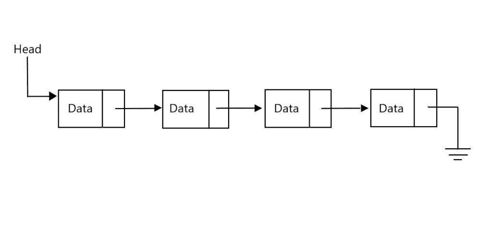
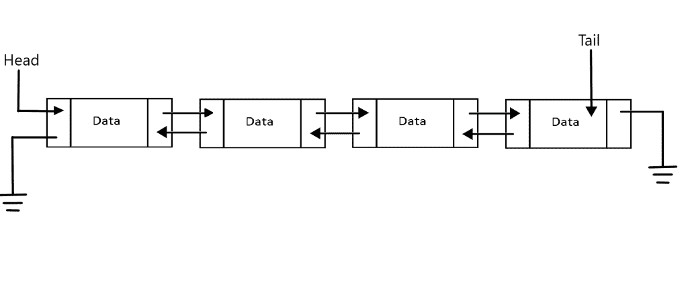
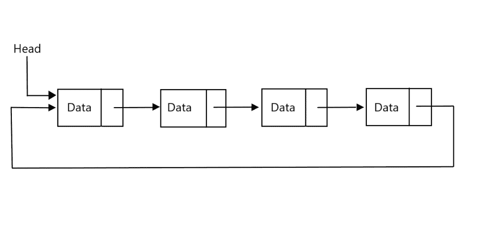
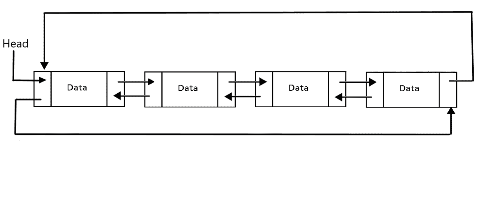
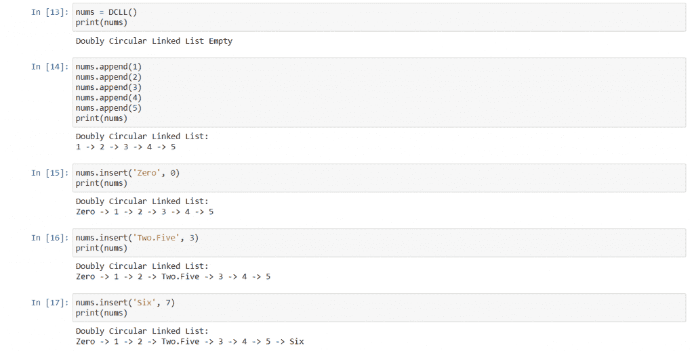
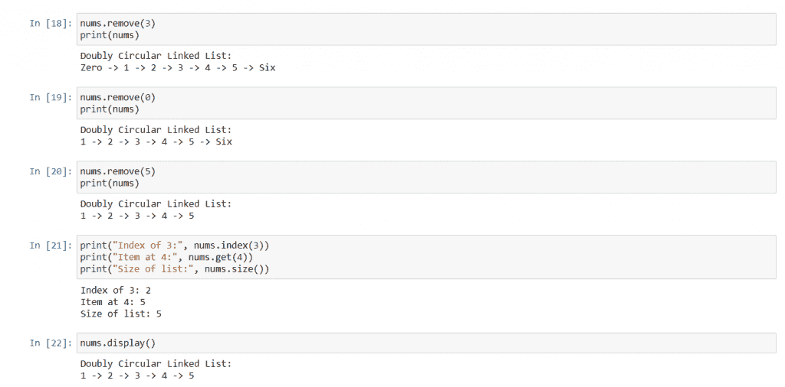

# Python 中的双向循环链表

> 原文：<https://www.askpython.com/python/examples/doubly-circular-linked-list>

双向循环链表是一种用于在列表中存储记录的数据结构。它与链表基本相同，但有一些额外的亮点。在本教程中，我们将看看什么是双向循环链表，如何用 Python 制作一个双向循环链表，以及它的输出是什么。

## 先决条件

在讨论双向循环链表之前，我们应该先讨论一些数据结构。

### 1。链接列表

[链表](https://www.askpython.com/python/examples/linked-lists-in-python)是一个列表，其中的项目以特定的方式链接到其他项目。不同类型的链表有不同的链接方式。

最简单的链表是“单向链表”，或者简称为“链表”。在这种情况下，每个项目都链接到列表中的下一个项目。(但不是反过来)。所以要访问第 n 项，我们需要先访问第(n-1)项。并且访问第 n 项使我们能够访问列表的第(n+1)项。

我们可以直接访问列表中的第一项，使用它我们可以访问第二项，然后是第三项，依此类推，直到不能访问列表中任何其他项的最后一项。

链表中的每一项称为一个节点。每个节点都有一部分存储其数据，另一部分存储到下一个节点的链接/引用。



Singly Linked List Representation

### 2。双向链表

[双向链表](https://www.askpython.com/python/examples/doubly-linked-list)类似于链表，但是在这种情况下，每个节点有两个链接，一个链接到下一个节点，一个链接到前一个节点。

因此，要访问第 n 个节点，我们需要首先访问第(n-1)个节点或第(n+1)个节点。在我们访问了第 n 个节点后，使用它，我们可以访问第(n-1)个节点或第(n+1)个节点。也就是说，遍历可以发生在任一方向上。

每个节点由三部分组成，一部分用于数据，另外两部分用于上一个和下一个链接。它看起来像这样:



Doubly Linked List Representation

### 3。循环链表

[循环链表](https://www.askpython.com/python/examples/circular-linked-lists)也类似于链表，唯一的区别是最后一个节点链接到第一个节点，而不是没有链接。所以它在节点之间形成了一个循环链接，如果我们继续访问下一个节点，它将永远不会结束，并在第一个节点之后回到起点。

它看起来像这样:



Circular Linked List Representation

## 双循环链表

***现在我们知道了双向链表和循环链表是什么样子，就不难理解双向循环链表会是什么样子了。***

这里，每个节点包含三个部分，一个用于数据，另外两个用于链接。每个节点链接到列表的下一个和上一个节点。对于第一个节点，没有前一个节点，所以它进入一个循环，并链接到列表的最后一个节点。类似地，对于最后一个节点，没有下一个节点，所以它进入一个循环，并链接到列表的第一个节点。

要访问任何一个节点，我们要么需要访问它之后的节点，要么需要访问它之前的节点，访问任何一个节点之后，都可以直接访问它之前和之后的节点。但是我们也可以直接从第一个节点访问最后一个节点，反之亦然。

为了形象化，双向循环链表看起来像这样:



Doubly Circular Linked List Representation

在上面的例子中，您可以看到列表中有四个节点，每个节点都连接到它后面的一个节点和它前面的一个节点。最后一个节点指向倒数第二个节点和第一个节点，第一个节点指向最后一个节点和第二个节点。

头部指向列表的开头，现在我们可以向前遍历并到达末尾，也可以向后遍历并到达列表的开头。

## 在 Python 中实现双向循环链表

我们必须创建两个类，一个用于节点，另一个将使用节点来创建链表。

### 类别:节点

```py
class Node:
    def __init__(self, data = None):
        self.data = data
        self.previous = self
        self.next = self

```

最初，在创建一个节点时，它会在两个方向上指向自己，形成一个只有一项的双向循环链表。

### 类:双向循环链表

```py
class DCLL:
    def __init__(self):
        self.head = None
        self.count = 0

    def __repr__(self):
        string = ""

        if(self.head == None):
            string += "Doubly Circular Linked List Empty"
            return string

        string += f"Doubly Circular Linked List:\n{self.head.data}"       
        temp = self.head.next
        while(temp != self.head):
            string += f" -> {temp.data}"
            temp = temp.next
        return string

    def append(self, data):
        self.insert(data, self.count)
        return

    def insert(self, data, index):
        if (index > self.count) | (index < 0):
            raise ValueError(f"Index out of range: {index}, size: {self.count}")

        if self.head == None:
            self.head = Node(data)
            self.count = 1
            return

        temp = self.head
        if(index == 0):
            temp = temp.previous
        else:
            for _ in range(index - 1):
                temp = temp.next

        temp.next.previous = Node(data)
        temp.next.previous.next, temp.next.previous.previous = temp.next, temp
        temp.next = temp.next.previous
        if(index == 0):
            self.head = self.head.previous
        self.count += 1
        return

    def remove(self, index):
        if (index >= self.count) | (index < 0):
            raise ValueError(f"Index out of range: {index}, size: {self.count}")

        if self.count == 1:
            self.head = None
            self.count = 0
            return

        target = self.head
        for _ in range(index):
            target = target.next

        if target is self.head:
            self.head = self.head.next

        target.previous.next, target.next.previous = target.next, target.previous
        self.count -= 1

    def index(self, data):
        temp = self.head
        for i in range(self.count):
            if(temp.data == data):
                return i
            temp = temp.next
        return None

    def get(self, index):
        if (index >= self.count) | (index < 0):
            raise ValueError(f"Index out of range: {index}, size: {self.count}")

        temp = self.head
        for _ in range(index):
            temp = temp.next
        return temp.data

    def size(self):
        return self.count

    def display(self):
        print(self)

```

上面的类包含了很多方法，我们一个一个来讨论。

**`__init__`法**

我们声明两个成员，分别由`None`和`0`初始化的`head`和`count`,因为开始时列表中没有节点。

**`__repr__`法**

`__repr__`方法将返回一个字符串，该字符串将列表的内容适当地打印在屏幕上。

**`append``insert`法**

我们可以在列表中追加或插入节点。创建`append`方法只是为了方便，因为它调用`insert`方法并发送适当的值。

在`insert`方法中，我们首先检查`index`是否在范围内，如果不在，我们引发一个`ValueError`。然后，如果列表是空的，那么我们简单地给`head`分配一个新节点，并使`count`等于 1。现在，我们到达了刚好在`index`之前的节点，在那里新节点将被插入。

此时，我们让指定索引处的节点的`previous`等于新节点。然后，我们使新节点的`next`和`previous`分别等于指定索引处的节点和指定索引之前的节点。现在我们让指定索引之前的节点的`next`等于新节点。最后，如果指定的索引是`0`，那么我们让`head`指向它之前指向的节点。

只需增加`count`和`insert`方法就完成了。

**`remove`法**

在这个方法中，我们首先检查`index`是否超出范围，如果超出，抛出一个`ValueError`。然后，如果只有一个节点，我们简单地将`head`设为`None`，将`count`设为`0`，然后返回。

如果没有，我们到达需要删除的节点，如果目标节点是`head`，我们让`head`指向它后面的节点，这样我们就不会丢失列表。

最后，我们让指定索引之前的节点的`next`指向指定索引之后的节点，我们让指定索引之后的节点的`previous`指向指定索引之前的节点。这将使列表中指定索引处的节点不可达(基本上被跳过)，我们递减计数以完成该方法。

**`index``get``size``display`方法**

`index`方法在列表中进行线性搜索，如果找到条目，则返回索引，否则返回`None`。

`get`方法返回指定索引处的项目，如果索引超出范围，则引发`ValueError`。

`size`方法返回列表中的项目数。

`display`方法打印列表。

## 输出



Output for the initialization, insertion, and append methods



Output for remove, index, get, size, and display methods.

## 结论

在本教程中，我们详细研究了双向循环链表，并用 Python 实现了它。希望你喜欢学习它，并在下一个教程中看到你。