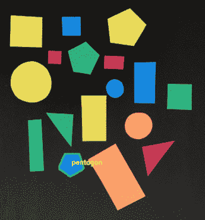
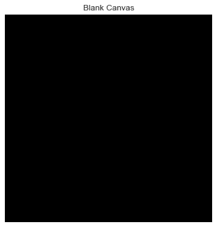
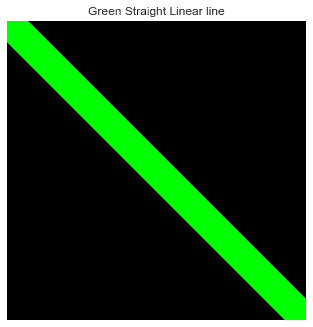
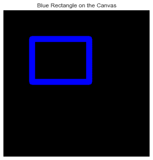
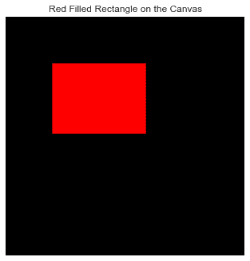
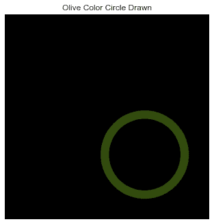
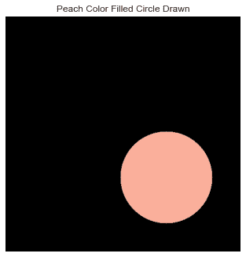
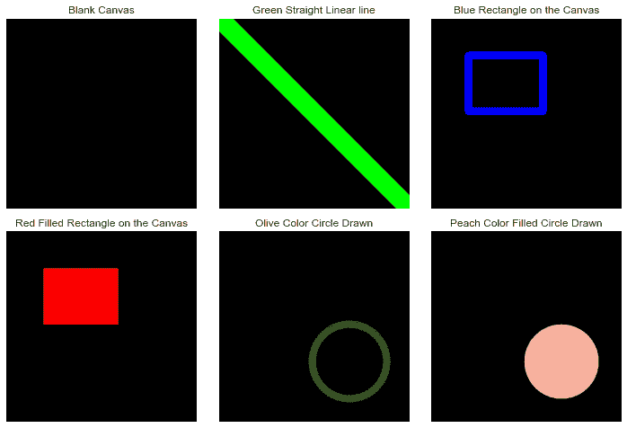

# 使用 OpenCV 绘制形状——一个完整的操作指南

> 原文：<https://www.askpython.com/python/examples/draw-shapes-using-opencv>

你好。你曾经希望在你每隔一天绘制的 matplotlib 图上绘制吗？嗯，这个愿望在这个教程中实现了！今天，我们将学习如何在地块上绘制各种对象。

我们开始吧！

***也读:[用 Python OpenCV【易导】](https://www.askpython.com/python/examples/sketch-using-webcam)*** 用网络摄像头现场素描

* * *

## OpenCV 简介

首先， [OpenCV](https://www.askpython.com/python/examples/filters-to-images) 自带很多画图功能，可以画几何图形，甚至可以在图像上写文字。



Draw On Image Sample

在做任何事情之前，让我们从介绍我们将在教程中使用的绘图函数开始。

这些功能如下所列:

1.  `cv2.line`:该功能用于**在图像上画一条直线**，从指定的(x，y)坐标对开始，到另一个(x，y)坐标对结束。
2.  `cv2.circle`:该功能用于**在由(x，y)坐标给出的中心和半径长度指定的图像上画一个圆**。
3.  `cv2.rectangle`:该功能有助于**在(x，y)坐标形式的左上角和右下角指定的图像上绘制一个矩形**。

* * *

## 用 OpenCV 在 Python 中绘制形状

现在我们已经清楚了在本教程结束时会发生什么样的魔法，让我们继续我们的魔法吧！

### 步骤 1:导入模块/库

在这一步，我们需要导入使用 OpenCV 在图像上绘图所需的所有必要的模块和库。显而易见的模块是`cv2`，与此同时，我们还有两个支持模块，即`numpy`和`matoplotlib`模块。

最后，我们要把剧情风格改成`seaborn`来获得更干净的剧情。

```py
import cv2
import numpy as np
from matplotlib import pyplot as plt
plt.style.use('seaborn')

```

* * *

### 第二步:创建一个黑色的画布

为了画任何东西，我们需要一块画布。在这种情况下，我们将使用一个尺寸为`512 x 512`的图像，用单一的纯色填充(在这种情况下是黑色)。

为了达到这个目的，我们使用了 numpy。置零并将所有像素值设置为零，以使它们全部为黑色。

```py
canvas = np.zeros((512,512,3), np.uint8) 
plt.axis('off')
plt.title("Blank Canvas")
plt.imshow(cv2.cvtColor(canvas, cv2.COLOR_BGR2RGB))
plt.show()

```



Original Blank Canvas

* * *

### 第三步:在画布上画一条线

为了画一条线，我们将使用`cv2.line`函数，它需要一些属性，包括所创建的画布对象的名称、直线的起点和终点坐标、使用 RGB 元组的线的颜色。

看看下面提到的代码，在你的画布上画一条绿色的斜线。

```py
canvas = np.zeros((512,512,3), np.uint8)
cv2.line(canvas, (0,0), (511,511), (0,255,0),50)
plt.imshow(cv2.cvtColor(canvas, cv2.COLOR_BGR2RGB))
plt.title('Green Straight Linear line')
plt.axis('off')
plt.show()

```



Straight Line Canvas OpenCV

* * *

### 步骤 4:在画布上画一个矩形

为了绘制矩形，我们使用了`cv2.rectangle`方法。该方法与`cv2.line`方法相同，并采用矩形的以下属性:

1.  正在其上绘制矩形的画布
2.  矩形的左上角坐标
3.  矩形的右下角坐标
4.  以 RGB 元组的形式提及矩形的颜色
5.  最后一个参数是矩形边框的厚度

同样的代码和输出如下所示。

```py
canvas = np.zeros((512,512,3), np.uint8)
cv2.rectangle(canvas, (100,100), (300,250), (255,0,0), 20)
plt.imshow(cv2.cvtColor(canvas, cv2.COLOR_BGR2RGB))
plt.title('Blue Rectangle on the Canvas')
plt.axis('off')
plt.show()

```



Rectangle Canvas OpenCV

现在，如果我们想要一个完全填充的矩形。为了实现这一点，我们使厚度为负或使用`cv2.FILLED`关键字。

```py
canvas = np.zeros((512,512,3), np.uint8)
cv2.rectangle(canvas, (100,100), (300,250), (0,0,255), -1)
plt.imshow(cv2.cvtColor(canvas, cv2.COLOR_BGR2RGB))
plt.title('Red Filled Rectangle on the Canvas')
plt.axis('off')
plt.show()

```



Filled Rectangle Canvas OpenCV

* * *

### 第五步:在画布上画一个圆

为了画圆，我们使用了`cv2.circle`方法。该方法需要以下属性:

1.  正在其上绘制圆的画布
2.  需要绘制的圆的中心
3.  圆的半径
4.  以 RGB 元组形式提及圆的颜色
5.  最后一个参数是圆的边界的厚度

同样的代码和输出如下所示。

```py
canvas = np.zeros((512,512,3), np.uint8)
cv2.circle(canvas, (350, 350), 100, (15,75,50), 20) 
plt.imshow(cv2.cvtColor(canvas, cv2.COLOR_BGR2RGB))
plt.title('Olive Color Circle Drawn')
plt.axis('off')
plt.show()

```



Circle Canvas OpenCV

绘制实心圆类似于在画布上绘制实心矩形。看看下面的代码和输出。

```py
canvas = np.zeros((512,512,3), np.uint8)
cv2.circle(canvas, (350, 350), 100, (155,175,250), -1) 
plt.imshow(cv2.cvtColor(canvas, cv2.COLOR_BGR2RGB))
plt.title('Peach Color Filled Circle Drawn')
plt.axis('off')
plt.show()

```



Filled Circle Canvas OpenCV

* * *

## 使用 OpenCV 在 Python 中绘制形状的完整代码

既然我们已经学会了在画布上画出基本的形状。让我们用下面提到的代码在**支线剧情**的帮助下可视化所有剧情。

```py
import cv2
import numpy as np
from matplotlib import pyplot as plt
plt.style.use('seaborn')
plt.figure(figsize=(10,10))

canvas = np.zeros((512,512,3), np.uint8) 

plt.subplot(3,3,1)
plt.axis('off')
plt.title("Blank Canvas")
plt.imshow(cv2.cvtColor(canvas, cv2.COLOR_BGR2RGB))

plt.subplot(3,3,2)
canvas = np.zeros((512,512,3), np.uint8)
cv2.line(canvas, (0,0), (511,511), (0,255,0),50)
plt.imshow(cv2.cvtColor(canvas, cv2.COLOR_BGR2RGB))
plt.title('Green Straight Linear line')
plt.axis('off')

plt.subplot(3,3,3)
canvas = np.zeros((512,512,3), np.uint8)
cv2.rectangle(canvas, (100,100), (300,250), (255,0,0), 20)
plt.imshow(cv2.cvtColor(canvas, cv2.COLOR_BGR2RGB))
plt.title('Blue Rectangle on the Canvas')
plt.axis('off')

plt.subplot(3,3,4)
canvas = np.zeros((512,512,3), np.uint8)
cv2.rectangle(canvas, (100,100), (300,250), (0,0,255), -1)
plt.imshow(cv2.cvtColor(canvas, cv2.COLOR_BGR2RGB))
plt.title('Red Filled Rectangle on the Canvas')
plt.axis('off')

plt.subplot(3,3,5)
canvas = np.zeros((512,512,3), np.uint8)
cv2.circle(canvas, (350, 350), 100, (15,75,50), 20) 
plt.imshow(cv2.cvtColor(canvas, cv2.COLOR_BGR2RGB))
plt.title('Olive Color Circle Drawn')
plt.axis('off')

plt.subplot(3,3,6)
canvas = np.zeros((512,512,3), np.uint8)
cv2.circle(canvas, (350, 350), 100, (155,175,250), -1) 
plt.imshow(cv2.cvtColor(canvas, cv2.COLOR_BGR2RGB))
plt.title('Peach Color Filled Circle Drawn')
plt.axis('off')

plt.tight_layout()
plt.show()

```



Final Output Draw On Canvas

* * *

## 结论

我希望你理解这个概念，并喜欢输出。尝试使用相同的基本形状制作风景或卡通人物，并对结果感到惊讶。

编码快乐！😇

想了解更多？查看下面提到的教程:

1.  [Matplotlib 子图–使用 Matplotlib 绘制多个图形](https://www.askpython.com/python-modules/matplotlib/matplotlib-subplots)
2.  [Matplotlib 绘图提示](https://www.askpython.com/python-modules/matplotlib/matplotlib-plotting-tips)
3.  [Pygame:创建互动形状](https://www.askpython.com/python-modules/pygame-creating-interactive-shapes)

* * *