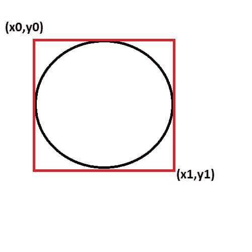
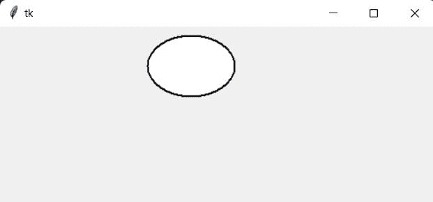
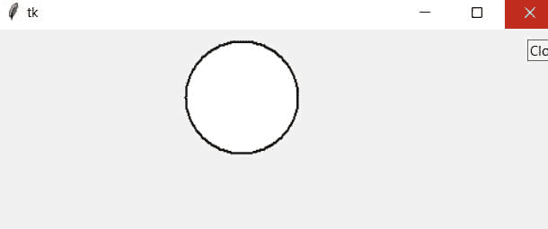
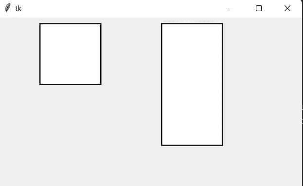
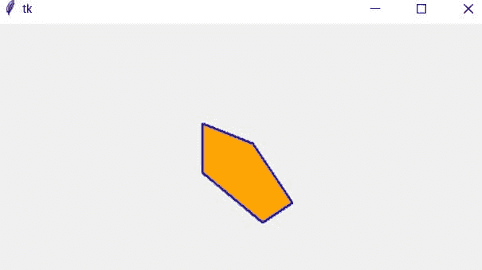
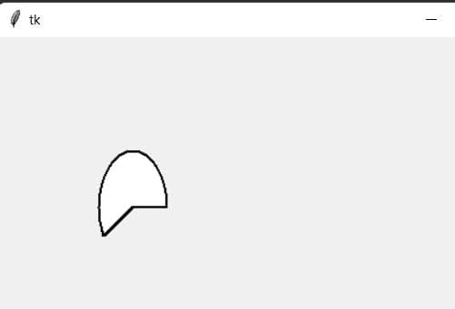

# 如何使用 Tkinter 绘制不同的形状

> 原文：<https://www.askpython.com/python-modules/tkinter/draw-shapes>

在本教程中，我们将学习如何绘制不同的形状，如正方形，圆形，矩形，椭圆形，弧形等。在 Tkinter 中，**画布类**用于在我们的应用程序窗口中绘制不同的形状。绘制形状的函数是在 canvas 类中定义的，所以我们需要首先定义 canvas 类。

按照下面的循序渐进的教程，使用 Tkinter 在 Python GUI 中绘制不同的形状。

***也读:[用 Tkinter 画线——初学者基础知识](https://www.askpython.com/python-modules/tkinter/drawing-lines)***

## 设置 Tkinter

要安装 Tkinter 模块，请在终端中运行以下命令。

```py
pip install tk

```

为了导入已安装的模块，我们使用*导入 Tkinter 库中的所有方法:

```py
from tkinter import *

```

## 在 Python Tkinter 画布中绘制形状

首先，我们需要**初始化**Tkinter 和 canvas 类。 [Tkinter Canvas](https://www.askpython.com/python-modules/tkinter/tkinter-canvas) 类包含了创建不同形状的每一种方法。

```py
root = Tk()
canvas = Canvas()
root.mainloop()

```

初始化 Tkinter 和 canvas 类后，我们开始绘制不同的形状

### 1.卵形的

使用 **create_oval()** 方法可以很容易地画出椭圆形。这个方法需要坐标、颜色、轮廓、宽度等。作为一个参数。所有的形状都是在一个我们提供坐标的盒子里创建的。

```py
create_oval(x0, y0, x1, y1)

```



Circle Inside Square In Tkinter

在上面的代码中，我们设置了盒子的坐标，这样它就成了一个完美的正方形，在这个正方形里面，我们就有了一个完美的圆。

```py
canvas.create_oval(10, 10, 80, 80, outline = "black", fill = "white",width = 2)
canvas.pack()

```



Draw Oval In Tkinter

### 2.圆

没有创建圆的特殊函数，它是使用 create_oval()函数绘制的。我们只需要保持水平长度和垂直长度相同。数学上，意味着形状(圆)的半径等于边界(直径)的所有边。

```py
canvas.create_oval(110,10,210,110,outline = "black",fill = "white",width = 2)
canvas.pack()

```



Draw Cicle In Tkinter

### 3.正方形或长方形

通过使用 create_rectangle 方法，我们绘制了一个矩形和正方形。这里我们通过形状的边/边，因此也可以用同样的方法画一个正方形(所有边相等)。

```py
canvas.create_rectangle(10,10,110,110,outline ="black",fill ="white",width = 2)
canvas.create_rectangle(210,10,310,210,outline ="black",fill ="white",width =2)
canvas.pack()

```



Draw Square Or Rectangle In Tkinter

### 4.多边形

我们可以画任意多的顶点。我们使用 **create_polygon()** 方法，该方法获取边的坐标，并相应地将它们呈现在主窗口上。在下面的代码中，我们创建了一个坐标列表，并将其传递给 create_polygon 方法。

```py
#points for the vertices in x1,y1,x2,y2, and so on

points = [150, 100, 200, 120, 240, 180, 210, 200, 150, 150, 100, 200]

canvas.create_polygon(points, outline = "blue", fill = "orange", width = 2)
canvas.pack()

```



Draw Polygon Using Tkinter

### 5.弧

我们通过使用 **create_arc** 方法创建弧形。

| canvas.create_arc(30，200，90，100，extent =210，outline = "黑色"，fill = "白色"，width =2) |



Draw Arc Using Tkinter

创建方法中使用的不同参数

*   **轮廓:-** 轮廓用于定义形状轮廓的颜色。
*   **填充:-** 填充就像微软画图中的油漆桶工具。它用我们指定的颜色填充形状。
*   **宽度:-** 用于设置轮廓的宽度。

## 结论

这就是使用 Tkinter 创建形状的基本教程。继续探索帮助您在 [Python Tkinter](https://www.askpython.com/python-modules/tkinter/tkinter-font-class) 中绘制不同形状和线条的功能，以创建更高级的形状和图案。