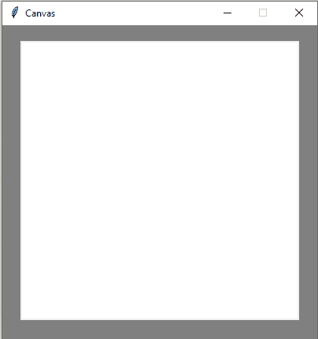
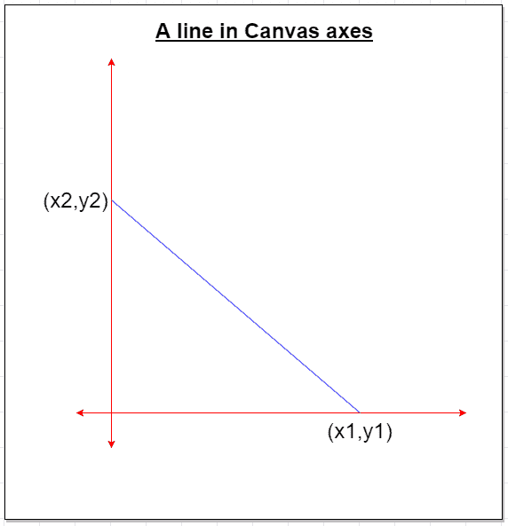
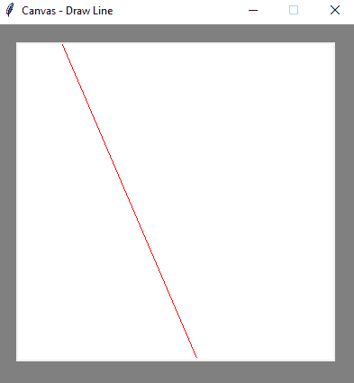
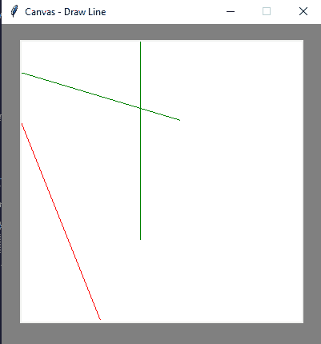
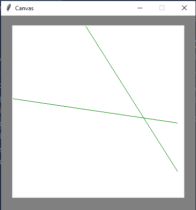

# Tkinter 教程-使用 Tkinter 画布绘制直线

> 原文：<https://www.askpython.com/python-modules/tkinter/drawing-a-line-tkinter-canvas>

大家好！在这个 Tkinter 教程中，我们将学习如何使用内置函数绘制不同的线条。这是学 Tkinter 的学生忘记然后把事情搞得很乱的主要概念之一。所以，让我们保持简单甜蜜，让我们开始吧。

## Tkinter 中的画布是什么？

现在，在画图等不同的绘图应用中，主要的白色屏幕是画布。这个画布是保存我们的形状、笔画、草图和其他东西的主要窗口。同样，使用 Tkinter 在画布上绘制形状。主要的方法是，我们需要先设置它，然后再做进一步的修改。

### 设置 Tkinter 画布的规则

1.  ***背景应设置为白色。***
2.  ***分辨率应小于主窗口的分辨率。***
3.  ***分辨率应足以管理和容纳其自身内的所有形状。***
4.  ***通过内置函数绘制形状时，始终给出合适的坐标点。***

这是四条基本规则，我们将利用它们来实现图形绘制。

### 架起我们的帆布

我们使用 Canvas 类，并赋予它高度、宽度和背景颜色。

**代码:**

```py
from tkinter import Canvas
from tkinter import *

window = Tk()
window.title("Canvas") # giving title to window
window.config(bg = "grey")
window.geometry("400x400") # setting up the geometry
window.resizable(False, False) # disabling the resize option from x-y sides

my_canvas = Canvas(width = 350, height = 350, bg = "white") # canvas object to create canvas
my_canvas.pack(pady = 20) # padding it 20 pixels below from margin of window

window.mainloop()

```

**输出:**



A Canvas Window

**说明:**

*   从 Tkinter 导入 Canvas 类。
*   前五行是我们主窗口的基本设置。
*   在第六和第七行中，我们创建了画布的一个实例。
    *   我们给出的高度和宽度是 350。
    *   将背景颜色设置为白色。
    *   然后通过应用 pack()函数中值为 20 的“pad-y”参数**将窗口移向中心。**
*   然后运行主循环来显示应用程序

使用面向对象的方法，我们将创建一个简单的线抽屉应用程序。目前，上面的代码只是一个示例。

## Tkinter 的 Canvas 类中的 Shape 函数

Tkinter 集成了几个函数，帮助我们绘制形状。它们可以帮助我们画出:

1.  ***圆圈***
2.  ***椭圆形***
3.  ***省略号***
4.  ***线条***
5.  ***方格***
6.  ***三角形*** 等等

### 如何在画布上绘制形状



**Axes of Tkinter’s Canvas**

当我们在画一条线或者一个形状的时候，然后在调用函数的时候，我们需要给 **(x1，y1)和(x2，y2)** 作为参数。这些决定了特定形状在画布上的位置。

**记住给定画布屏幕分辨率内的坐标。因为，如果点消失了，我们就看不到屏幕里面的形状和物体。**

### 使用 create_line()函数绘制直线

这个函数/方法用于在画布上画线。以下是基本参数:

```py
canvas_object.create_line(x1, y1, x2, y2, fill = "color_name")

```

**代码:**

```py
from tkinter import *

window = Tk()
window.geometry("400x400")
window.config(bg = "grey")
window.title("Canvas - Draw Line")
window.resizable(False, False)

# creating Canvas
canvasScreen = Canvas(window, width = 350, height = 350, bg = "white")
canvasScreen.pack(pady = 20)
canvasScreen.create_line(50, 0, 200, 350, fill = "red")
window.mainloop()

```

**输出:**



Drawing a line

**说明:**

1.  我们创建一个 canvasScreen 实例，宽度= 350，高度= 350。
2.  然后使用同一个对象，我们调用 create_line()函数。
3.  然后我们可以给出必要的 x-y 坐标。我们使用填充参数给线条上色。我们把它命名为红色的。
4.  最后使用主循环来显示 GUI 窗口。

我们可以通过多次调用 create_line()函数来绘制尽可能多的线条。 **下面是一组更多的代码来绘制随机线条图案:**

```py
from tkinter import *

window = Tk()
window.geometry("400x400")
window.config(bg = "grey")
window.title("Canvas - Draw Line")
window.resizable(False, False)

# creating Canvas
canvasScreen = Canvas(window, width = 350, height = 350, bg = "white")
canvasScreen.pack(pady = 20)
canvasScreen.create_line(0, 100, 100, 350, fill = "red")
canvasScreen.create_line(150, 0, 150, 250, fill = "green")
canvasScreen.create_line(0, 40, 200, 100, fill = "green")

window.mainloop()

```

**输出:**



Random Lines

### **使用类和对象**

```py
from tkinter import Canvas
from tkinter import *

class window(Tk):
    def __init__(self, width, height):
        self.window = Tk()
        self.window.title("Canvas") # giving title to window
        self.window.config(bg = "grey")
        self.window.geometry(str(width) + "x" + str(height)) # setting up the geometry
        self.window.resizable(False, False) # disabling the resize option from x-y sides

    def create_canvas(self, wd, ht):
        self.my_canvas = Canvas(width = wd, height = ht, bg = "white") # canvas object to create canvas
        self.my_canvas.pack(pady = 20) # padding it 20 pixels below from top margin of window

        return self.my_canvas

    def drawLine(self, x1, y1, x2, y2, color):
        return self.my_canvas.create_line(x1, y1, x2, y2, fill = color)

    def run_app(self):
        self.window.mainloop()

win = window(400, 400)
win.create_canvas(350, 350)
win.drawLine(0, 150, 340, 200, "green")
win.drawLine(150, 0, 340, 300, "green")
win.run_app()

```

**输出:**



Intersecting Lines

## 结论

这就是我们使用 Tkinter 对 Canvas 和 draw line 函数所能做的一切。这是一个有趣的话题，可以在你的 Github 个人资料上了解并展示一些很酷的项目。