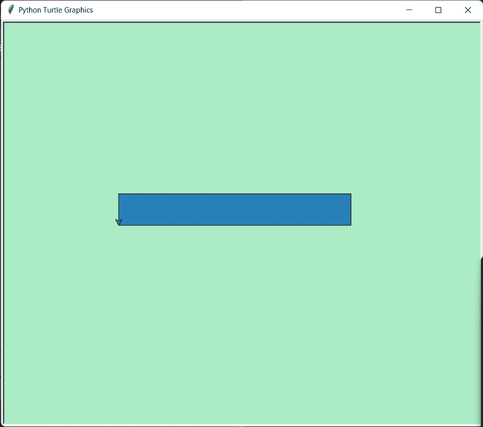
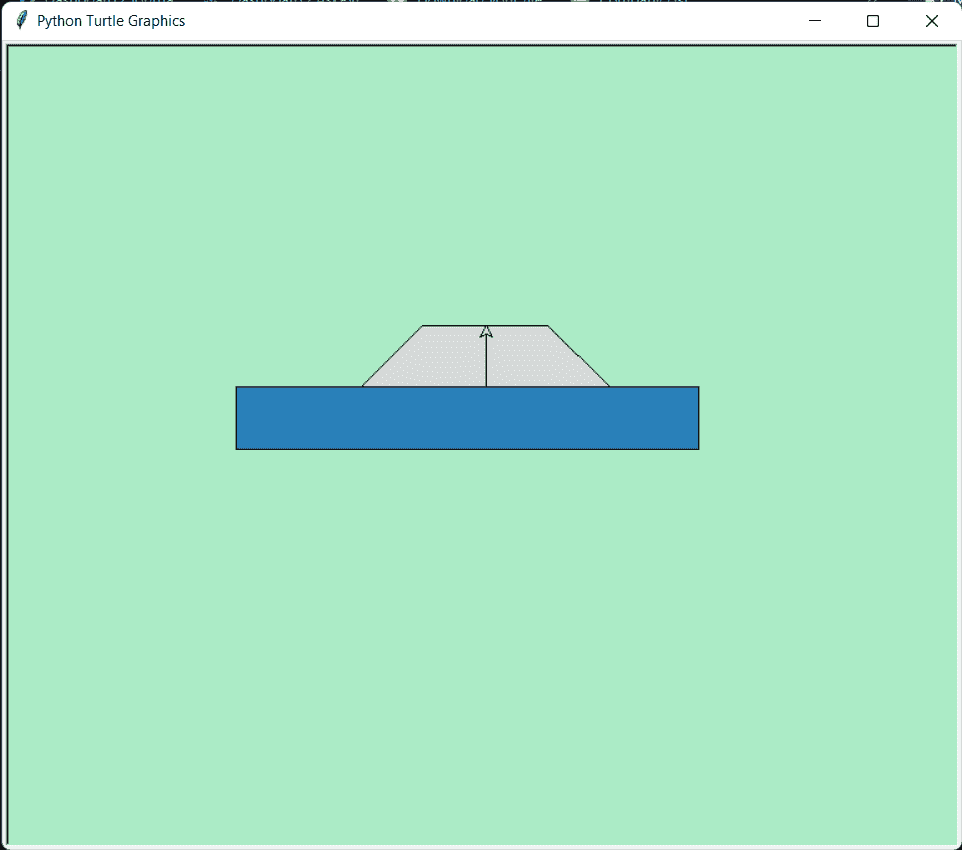
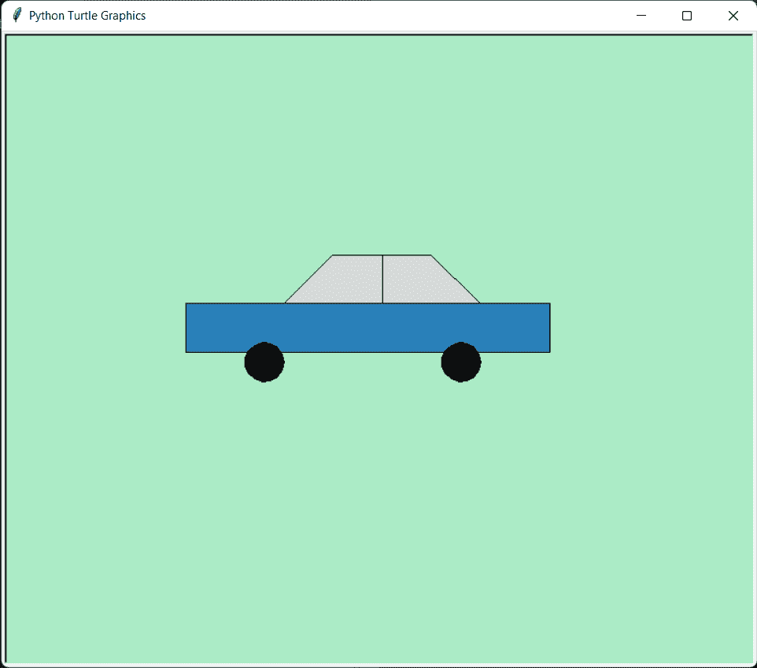

# 用 Python 中的乌龟画汽车

> 原文：<https://www.askpython.com/python/examples/drawing-car-using-turtle-in-python>

嘿编码器！在本教程中，我将教你如何在 python 海龟库的帮助下绘制自己的汽车。如果你不知道`turtle`模块，在查看教程[。](https://www.askpython.com/python-modules/python-turtle)

## 使用 Python Turtle 绘制汽车的步骤

您需要导入 Python 附带的 turtle 库，不需要做任何额外的安装。

```py
import turtle

```

下一步包括创建一个应用程序屏幕来绘制汽车。我们可以随意命名这个窗口。对于本教程，我们将屏幕名称保留为`car_scr`。

下面的代码创建和定制屏幕，包括屏幕和笔的颜色。

```py
import turtle
car_scr = turtle
car_scr.color('black')
car_scr.Screen().bgcolor("#ABEBC6")

```

现在让我们创建一个为我们绘制汽车的函数。这辆汽车有许多不同的部分，如上部车身、车轮和窗户。我们将一个接一个地分别画出它们。

在函数`Draw_Car`内部，我们需要给函数一个起始坐标作为参数。然后`goto`函数将指针指向我们传递给它的位置。

您可能熟悉 Draw_Car 函数中使用的函数。我将在下面介绍它们的工作原理:

1.  `penup`&`pendown`——控制什么时候画，什么时候不画。
2.  `fillcolor`、`begin_fill`和`end_fill`–控制特定图形的颜色
3.  `forward` & `backward`和`left`&`right`——帮助在屏幕上以特定的方向或角度进行绘制。

### 使用 Python Turtle 创建汽车底座

让我们首先使用下面的代码绘制汽车的上部。看看输出结果有多好。

```py
def Draw_Car(i,j):
    # Drawing the Upper Body
    car_scr.fillcolor("#2980B9")
    car_scr.penup()
    car_scr.goto(i,j)
    car_scr.pendown()
    car_scr.begin_fill()
    car_scr.forward(370)
    car_scr.left(90)
    car_scr.forward(50)
    car_scr.left(90)
    car_scr.forward(370)
    car_scr.left(90)
    car_scr.forward(50)
    car_scr.end_fill()

```



Draw Car Upper Body

### 画车窗

我们将调用函数并传递起始的 x 和 y 值。让我们调用`Draw_Car(-200,0)`的函数。现在我们将使用如上所示的非常相似的代码来绘制窗口。看看下面的代码。

```py
def Draw_Car(i,j):
    # Drawing the Upper Body
    car_scr.fillcolor("#2980B9")
    car_scr.penup()
    car_scr.goto(i,j)
    car_scr.pendown()
    car_scr.begin_fill()
    car_scr.forward(370)
    car_scr.left(90)
    car_scr.forward(50)
    car_scr.left(90)
    car_scr.forward(370)
    car_scr.left(90)
    car_scr.forward(50)
    car_scr.end_fill()

    #Draw the Windows
    car_scr.fillcolor("#D5DBDB")
    car_scr.penup()
    car_scr.goto(i+100, 50)
    car_scr.pendown()
    car_scr.begin_fill()
    car_scr.setheading(45)
    car_scr.forward(70)
    car_scr.setheading(0)
    car_scr.forward(100)
    car_scr.setheading(-45)
    car_scr.forward(70)
    car_scr.setheading(90)
    car_scr.end_fill()
    car_scr.penup()
    car_scr.goto(i+200, 50)
    car_scr.pendown()
    car_scr.forward(49.50)

```

当我们执行这段代码时，我们得到下面的屏幕输出。很神奇吧？！



Draw Car Upper Body Window

### 使用 Turtle 添加车轮

最后，我们需要以类似的方式给汽车添加轮子。看看下面的完整功能就知道了。最后我们要把乌龟指针藏起来才能看到干净的汽车图像！

```py
def Draw_Car(i,j):
    # Drawing the Upper Body
    car_scr.fillcolor("#2980B9")
    car_scr.penup()
    car_scr.goto(i,j)
    car_scr.pendown()
    car_scr.begin_fill()
    car_scr.forward(370)
    car_scr.left(90)
    car_scr.forward(50)
    car_scr.left(90)
    car_scr.forward(370)
    car_scr.left(90)
    car_scr.forward(50)
    car_scr.end_fill()

    #Draw the Windows
    car_scr.fillcolor("#D5DBDB")
    car_scr.penup()
    car_scr.goto(i+100, 50)
    car_scr.pendown()
    car_scr.begin_fill()
    car_scr.setheading(45)
    car_scr.forward(70)
    car_scr.setheading(0)
    car_scr.forward(100)
    car_scr.setheading(-45)
    car_scr.forward(70)
    car_scr.setheading(90)
    car_scr.end_fill()
    car_scr.penup()
    car_scr.goto(i+200, 50)
    car_scr.pendown()
    car_scr.forward(49.50)

    # Draw the two wheels
    car_scr.penup()
    car_scr.goto(i+100, -10-j)
    car_scr.pendown()
    car_scr.color('black')
    car_scr.fillcolor('black')
    car_scr.begin_fill()
    car_scr.circle(20)
    car_scr.end_fill()
    car_scr.penup()
    car_scr.goto(i+300, -10-j)
    car_scr.pendown()
    car_scr.color('black')
    car_scr.fillcolor('black')
    car_scr.begin_fill()
    car_scr.circle(20)
    car_scr.end_fill()

    car_scr.hideturtle()

```

### 跑蟒龟

让我们使用下面的代码在屏幕上绘制汽车。画完汽车后，我们将在`done`功能的帮助下关闭应用程序屏幕。

```py
Draw_Car(-200,0)
car_scr.done()

```



Draw Car Whole Car

## 完成巨蟒龟代码画车

```py
import turtle
car_scr = turtle
car_scr.color('black')
car_scr.Screen().bgcolor("#ABEBC6")

def Draw_Car(i,j):
    # Drawing the Upper Body
    car_scr.fillcolor("#2980B9")
    car_scr.penup()
    car_scr.goto(i,j)
    car_scr.pendown()
    car_scr.begin_fill()
    car_scr.forward(370)
    car_scr.left(90)
    car_scr.forward(50)
    car_scr.left(90)
    car_scr.forward(370)
    car_scr.left(90)
    car_scr.forward(50)
    car_scr.end_fill()

    #Draw the Windows
    car_scr.fillcolor("#D5DBDB")
    car_scr.penup()
    car_scr.goto(i+100, 50)
    car_scr.pendown()
    car_scr.begin_fill()
    car_scr.setheading(45)
    car_scr.forward(70)
    car_scr.setheading(0)
    car_scr.forward(100)
    car_scr.setheading(-45)
    car_scr.forward(70)
    car_scr.setheading(90)
    car_scr.end_fill()
    car_scr.penup()
    car_scr.goto(i+200, 50)
    car_scr.pendown()
    car_scr.forward(49.50)

    # Draw the two wheels
    car_scr.penup()
    car_scr.goto(i+100, -10-j)
    car_scr.pendown()
    car_scr.color('black')
    car_scr.fillcolor('black')
    car_scr.begin_fill()
    car_scr.circle(20)
    car_scr.end_fill()
    car_scr.penup()
    car_scr.goto(i+300, -10-j)
    car_scr.pendown()
    car_scr.color('black')
    car_scr.fillcolor('black')
    car_scr.begin_fill()
    car_scr.circle(20)
    car_scr.end_fill()

Draw_Car(-200,0)

car_scr.done()

```

当我们执行上面的代码时，一个新的屏幕出现在系统屏幕上，汽车开始在应用程序的屏幕上绘制。

## 结论

恭喜你！现在你知道如何使用 Python 编程语言中的 Turtle 库在屏幕上画一辆汽车了。感谢您的阅读！

如果您喜欢本教程，我建议您也阅读以下教程:

*   [如何使用 Tkinter 绘制不同的形状](https://www.askpython.com/python-modules/tkinter/draw-shapes)
*   [使用 Tkinter 绘制线条——初学者基础知识](https://www.askpython.com/python-modules/tkinter/drawing-lines)
*   [使用 OpenCV 绘制形状——完整的操作指南](https://www.askpython.com/python/examples/draw-shapes-using-opencv)

继续阅读，了解更多！编码快乐！😄