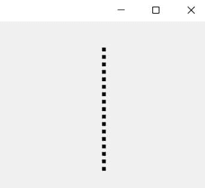

# 使用 Tkinter 画线——初学者基础

> 原文：<https://www.askpython.com/python-modules/tkinter/drawing-lines>

在这篇文章中，我们将看到如何在 Tkinter 中绘制不同类型的线条。绘制任何形状或线条的所有方法都在 canvas 类中，所以我们将首先初始化 Tkinter 和 canvas 类。

***也读作:[Tkinter GUI Widgets——完整参考](https://www.askpython.com/python/tkinter-gui-widgets)***

## 导入和初始化模块

让我们从导入所需的库并设置基本窗口开始。这将作为下面演示的空间。

```py
from tkinter import *
root = Tk()
canvas = Canvas()

root.geometry("500x500")
root.mainloop()

```

## 如何用 Tkinter 画线？

为了在我们的主 Tkinter 窗口上创建线条，我们将使用 **create_line()** 方法，该方法获取窗口上线条放置的坐标。这些坐标决定了直线的**长度**和**方向**。

### 1.直线

在 Tkinter 中创建任何类型的线条都非常容易。为了画一条直线，我们将使用 create_line()方法。

```py
canvas.create_line(15, 25, 200, 25, width=5)
canvas.pack()

```


Straight Line In Tkinter

### 2.点线

创建虚线的过程与创建直线的过程相同。同样，我们将使用 create_line()方法并传递线坐标，唯一的变化是我们还将添加另一个参数 **dash。**

```py
canvas.create_line(300, 35, 300, 200, dash=(10), width=5)
canvas.pack()

```



Dotted Line In Tkinter

## 3.用多条线绘制形状

正如我们已经讨论过的，我们还可以**控制线条的方向**，这使我们能够通过创建多条线条来绘制不同的形状。在给定的代码中，我们用三条线的三个坐标形成了一个三角形。

```py
canvas.create_line(55, 85, 155, 85, 105, 180, 55, 85, width=5)
canvas.pack()

```


Shapes Using Lines In Tkinter

## 结论

[Python Tkinter](https://www.askpython.com/python-modules/tkinter/tkinter-canvas) 画线基础到此为止。要了解绘制直线的更多信息，请研究 create_line()函数及其接受的参数。一旦你弄清楚了这个函数，使用它来玩和创建任何类型的绘图都不会很困难！