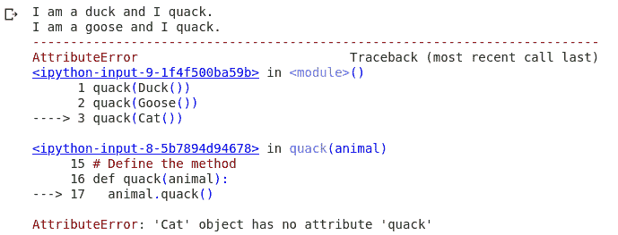

# Python 中的鸭子打字

> 原文：<https://www.askpython.com/python/oops/duck-typing>

Duck typing 是动态编程的一种变体，它使用一种溯因推理的形式进行[类型检查](https://www.askpython.com/python/built-in-methods/python-type-function)。在本文中，我们将重点关注 duck 类型化的主要直觉和 python 中 duck 类型化的例子。

## Python 中的鸭子打字是什么？–溯因推理

鸭子这个词可以说来自一个流行短语:

“如果它走路像鸭子，叫起来像鸭子，那它很可能是只鸭子。”

这个短语最重要的方面是，我们实际上不知道这个物体是不是一只鸭子，我们从一系列行为中推断/推断这个物体是一只鸭子。重要的是要注意，我们不是在内部检查两个对象是否相同，而是使用已知的外部行为来匹配这两个对象。

这种推理可以转移到计算机科学领域。在动态语言中，没有显式的类型检查。但是对于某些用例来说，为了确保函数正确运行，必须验证输入类型变得很重要。这可能会导致动态类型方面的各种限制和设计问题，因此引入了 Duck 类型。

Duck typing 更重视对象内部定义的方法(行为)，而不是对象本身。如果对象具有所需的方法，则允许对象通过。让我们看一个例子来理解这个概念。

## 鸭子打字的例子

我们定义了三个代表不同动物的类，一只鸭子，一只鹅和一只猫。它们都发出不同的声音。鸭子和鹅嘎嘎叫，而猫发出喵喵的声音。然后我们定义一个函数*quak()*，它接收一只动物，并用叫声打印出描述。很明显，一个没有*嘎嘎()*方法的动物，在通过函数时会给出一个错误，表示变量类型错误(表示它没有通过鸭子测试)。

```py
# Define the three classes

class Duck:
  def quack(self):
    print("I am a duck and I quack.")

class Goose:
  def quack(self):
    print("I am a goose and I quack.")

class Cat:
  def meow(self):
    print("I am a dog and I meow.")

# Define the method
def quack(animal):
  animal.quack()

```

我们经过这三只动物，让它们都呱呱地叫起来。当鸭子和鹅嘎嘎叫时，猫不会嘎嘎叫，因此抛出一个错误。

```py
quack(Duck())
quack(Goose())
quack(Cat())

```



Quack Error

因此，我们看到，即使没有对象类型的外部检查，python 也通过检查方法兼容性知道该对象不支持该函数。

## 鸭子打字的实际例子

鸭子类型最常用的例子之一是 python 中的迭代。你有没有想过如何在 python 中用每一个 iterable 写一个 [for 循环](https://www.askpython.com/python/python-for-loop)？或者事实上是什么使得一个对象是可迭代的？循环可以用于列表、 [numpy 数组](https://www.askpython.com/python-modules/numpy/python-numpy-arrays)、[生成器函数](https://www.askpython.com/python/examples/generators-in-python)、Tensorflow/PyTorch 数据加载器等。

鸭子打字在这里发挥了作用。无论这些对象在应用方面有多么不同，都因为鸭式打字而被一视同仁。

对于迭代，该类必须有 *[__iter__()](https://www.askpython.com/python/python-iter-function)* 和 __next__()函数，这使它有资格进行迭代。Python 没有对这些类进行强类型检查，这使得它越来越灵活。

我们甚至可以定义自己的迭代器来打印平方数，这里我们定义了方法 *__iter__()* 和 *__next__()* ，这是 python 迭代期间调用的两个方法。

```py
class Squares:
  def __init__(self, l=0, u=-1):
    self.u = u
    self.n = l
  def __iter__(self):
    return self
  def __next__(self):
    if self.n < self.u:
      s = self.n ** 2
      self.n += 1
      return s
    else:
      raise StopIteration

```

```py
for i in Squares(1, 4):
  print(i)

```

```py
1
4
9

```

## 结论

python 中对 duck typing 的支持实现了基本 Python 函数与用户定义的类的无缝集成。这也允许两个不同类之间的交互和集成。我们已经看到了 python 中迭代器的一个例子，这个概念可以应用到 [len()](https://www.askpython.com/python/string/find-string-length-in-python) 中，它检查对象内部是否定义了 __len__()方法。您可以在 python 中尝试各种其他方法，探索 python 到底有多灵活。

### 参考

*   [崔永的中型文章](https://medium.com/swlh/duck-typing-in-python-3-practical-examples-a40d8113266c)
*   [开源文章](https://opensource.com/article/20/5/duck-typing-python)