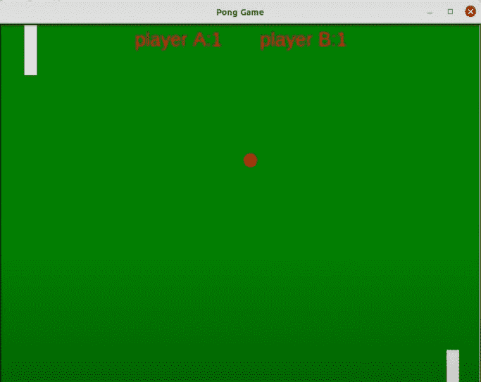
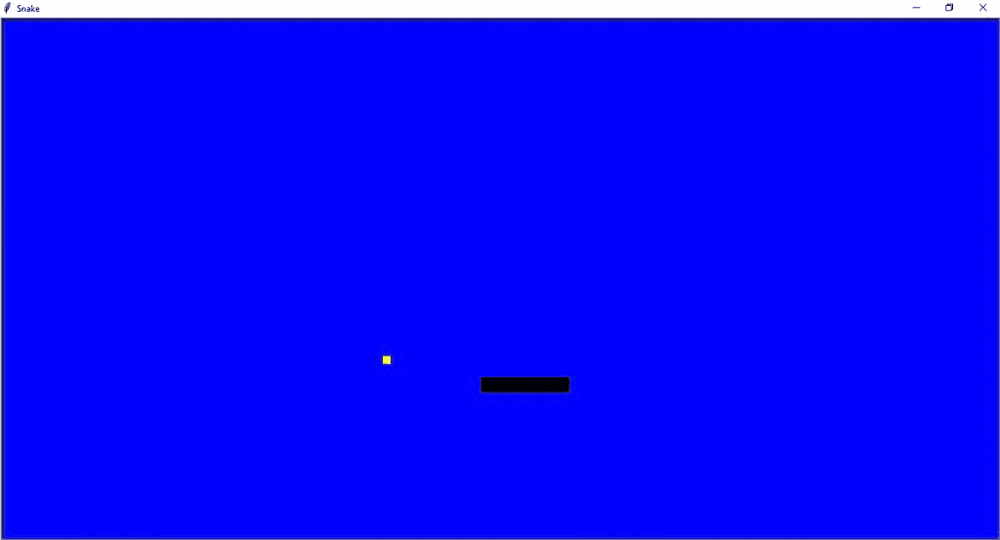

# Python 中的简单游戏

> 原文：<https://www.askpython.com/python/examples/easy-games-in-python>

今天我们将学习如何使用一些常见的 Python 模块用 Python 编写一些简单的游戏。

我们为什么要使用 Python？

Python 是一种众所周知的编程语言。Python 非常容易理解和编码。它被认为是开发者友好的。任何初学者都可以在短时间内学会用 python 编码。

这种语言的一些最有趣的特性如下:

*   Python 是开源和免费的
*   便携式和动态
*   超级容易理解等。

* * *

## 用 Python 创建简单的游戏

现在，让我们用 Python 实现一些简单的游戏，作为初学者，您可以构建这些游戏，以便在您的学习曲线中占得先机！

### 1.Python 中的一个问答游戏

这是一个非常简单的基于文本的 python 游戏。这是一个小测验，你可以为自己也可以为你的朋友做。我们不需要为这个游戏导入任何模块，这使它更容易！你自己试试😉

以下是用途:

*   [if-else 语句](https://www.askpython.com/python/python-if-else-elif-statement)–用于检查答案
*   [打印声明](https://www.askpython.com/python/built-in-methods/python-print-function)–用于打印输出

```py
print('Welcome to AskPython Quiz')
answer=input('Are you ready to play the Quiz ? (yes/no) :')
score=0
total_questions=3

if answer.lower()=='yes':
    answer=input('Question 1: What is your Favourite programming language?')
    if answer.lower()=='python':
        score += 1
        print('correct')
    else:
        print('Wrong Answer :(')

    answer=input('Question 2: Do you follow any author on AskPython? ')
    if answer.lower()=='yes':
        score += 1
        print('correct')
    else:
        print('Wrong Answer :(')

    answer=input('Question 3: What is the name of your favourite website for learning Python?')
    if answer.lower()=='askpython':
        score += 1
        print('correct')
    else:
        print('Wrong Answer :(')

print('Thankyou for Playing this small quiz game, you attempted',score,"questions correctly!")
mark=(score/total_questions)*100
print('Marks obtained:',mark)
print('BYE!')

```

输出:

```py
Welcome to AskPython Quiz
Are you ready to play the Quiz ? (yes/no) :yes
Question 1: What is your Favourite programming language?python
correct
Question 2: Do you follow any author on AskPython? yes
correct
Question 3: What is the name of your favourite website for learning Python?askpython
correct
Thankyou for Playing this small quiz game, you attempted 3 questions correctly!
Marks obtained: 100.0
BYE!

```

* * *

### 2.Python 中的乒乓游戏

我们大多数人都听说过著名的乒乓球比赛。我们很多人都喜欢玩它。今天让我们学习如何使用 python 编程语言编写这个经典游戏的代码！

在开始编码之前，我们首先需要安装 turtle 模块。 **turtle** 模块是一个 Python 库，它使用户能够通过提供给他们一个虚拟画布来创建图片和形状。

如果您还没有这个库，您可以使用 [pip](https://www.askpython.com/python-modules/python-pip) 来安装它。

```py
C:\Users\Admin>pip install turtle

```

在官方文档中阅读更多关于海龟库的信息。

自己试代码！

```py
import turtle as t
playerAscore=0
playerBscore=0

#create a window and declare a variable called window and call the screen()
window=t.Screen()
window.title("The Pong Game")
window.bgcolor("green")
window.setup(width=800,height=600)
window.tracer(0)

#Creating the left paddle
leftpaddle=t.Turtle()
leftpaddle.speed(0)
leftpaddle.shape("square")
leftpaddle.color("white")
leftpaddle.shapesize(stretch_wid=5,stretch_len=1)
leftpaddle.penup()
leftpaddle.goto(-350,0)

#Creating the right paddle
rightpaddle=t.Turtle()
rightpaddle.speed(0)
rightpaddle.shape("square")
rightpaddle.color("white")
rightpaddle.shapesize(stretch_wid=5,stretch_len=1)
rightpaddle.penup()
rightpaddle.goto(-350,0)

#Code for creating the ball
ball=t.Turtle()
ball.speed(0)
ball.shape("circle")
ball.color("red")
ball.penup()
ball.goto(5,5)
ballxdirection=0.2
ballydirection=0.2

#Code for creating pen for scorecard update
pen=t.Turtle()
pen.speed(0)
pen.color("Blue")
pen.penup()
pen.hideturtle()
pen.goto(0,260)
pen.write("score",align="center",font=('Arial',24,'normal'))

#code for moving the leftpaddle
def leftpaddleup():
    y=leftpaddle.ycor()
    y=y+90
    leftpaddle.sety(y)

def leftpaddledown():
    y=leftpaddle.ycor()
    y=y+90
    leftpaddle.sety(y)

#code for moving the rightpaddle
def rightpaddleup():
    y=rightpaddle.ycor()
    y=y+90
    rightpaddle.sety(y)

def rightpaddledown():
    y=rightpaddle.ycor()
    y=y+90
    rightpaddle.sety(y)

#Assign keys to play
window.listen()
window.onkeypress(leftpaddleup,'w')
window.onkeypress(leftpaddledown,'s')
window.onkeypress(rightpaddleup,'Up')
window.onkeypress(rightpaddledown,'Down')

while True:
    window.update()

    #moving the ball
    ball.setx(ball.xcor()+ballxdirection)
    ball.sety(ball.ycor()+ballxdirection)

    #border set up
    if ball.ycor()>290:
        ball.sety(290)
        ballydirection=ballydirection*-1
    if ball.ycor()<-290:
        ball.sety(-290)
        ballydirection=ballydirection*-1

    if ball.xcor() > 390:
        ball.goto(0,0)
        ball_dx = ball_dx * -1
        player_a_score = player_a_score + 1
        pen.clear()
        pen.write("Player A: {}                    Player B: {} ".format(player_a_score,player_b_score),align="center",font=('Monaco',24,"normal"))
        os.system("afplay wallhit.wav&")

    if(ball.xcor()) < -390: # Left width paddle Border
        ball.goto(0,0)
        ball_dx = ball_dx * -1
        player_b_score = player_b_score + 1
        pen.clear()
        pen.write("Player A: {}                    Player B: {} ".format(player_a_score,player_b_score),align="center",font=('Monaco',24,"normal"))
        os.system("afplay wallhit.wav&")

     # Handling the collisions with paddles.

    if(ball.xcor() > 340) and (ball.xcor() < 350) and (ball.ycor() < rightpaddle.ycor() + 40 and ball.ycor() > rightpaddle.ycor() - 40):
        ball.setx(340)
        ball_dx = ball_dx * -1
        os.system("afplay paddle.wav&")

    if(ball.xcor() < -340) and (ball.xcor() > -350) and (ball.ycor() < leftpaddle.ycor() + 40 and ball.ycor() > leftpaddle.ycor() - 40):
        ball.setx(-340)
        ball_dx = ball_dx * -1
        os.system("afplay paddle.wav&")

```

输出:



Pong Game

* * *

### 3.Python 中的饿蛇游戏

这是我们小时候最喜欢的游戏。我们实际上可以通过导入两个模块来用 python 编写这个游戏！多酷啊！

我们开始吧！

首先，我们需要安装 turtle。如果您还没有安装它，请打开 cmd 并键入以下命令。

```py
C:\Users\Admin>pip install turtle

```

现在我们将安装[随机模块](https://www.askpython.com/python-modules/python-random-module-generate-random-numbers-sequences)。随机模块用于生成随机数。在您的 cmd 中键入以下命令。

```py
C:\Users\Admin>pip install random2

```

编码并亲自尝试，享受游戏！

```py
import turtle
import random

w = 500
h = 500
food_size = 10
delay = 100 

offsets = {
    "up": (0, 20),
    "down": (0, -20),
    "left": (-20, 0),
    "right": (20, 0)
}

def reset():
    global snake, snake_dir, food_position, pen
    snake = [[0, 0], [0, 20], [0, 40], [0, 60], [0, 80]]
    snake_dir = "up"
    food_position = get_random_food_position()
    food.goto(food_position)
    move_snake()

def move_snake():
    global snake_dir

    new_head = snake[-1].copy()
    new_head[0] = snake[-1][0] + offsets[snake_dir][0]
    new_head[1] = snake[-1][1] + offsets[snake_dir][1]

    if new_head in snake[:-1]:
        reset()
    else:
        snake.append(new_head)

        if not food_collision():
            snake.pop(0)

        if snake[-1][0] > w / 2:
            snake[-1][0] -= w
        elif snake[-1][0] < - w / 2:
            snake[-1][0] += w
        elif snake[-1][1] > h / 2:
            snake[-1][1] -= h
        elif snake[-1][1] < -h / 2:
            snake[-1][1] += h

        pen.clearstamps()

        for segment in snake:
            pen.goto(segment[0], segment[1])
            pen.stamp()

        screen.update()

        turtle.ontimer(move_snake, delay)

def food_collision():
    global food_position
    if get_distance(snake[-1], food_position) < 20:
        food_position = get_random_food_position()
        food.goto(food_position)
        return True
    return False

def get_random_food_position():
    x = random.randint(- w / 2 + food_size, w / 2 - food_size)
    y = random.randint(- h / 2 + food_size, h / 2 - food_size)
    return (x, y)

def get_distance(pos1, pos2):
    x1, y1 = pos1
    x2, y2 = pos2
    distance = ((y2 - y1) ** 2 + (x2 - x1) ** 2) ** 0.5
    return distance
def go_up():
    global snake_dir
    if snake_dir != "down":
        snake_dir = "up"

def go_right():
    global snake_dir
    if snake_dir != "left":
        snake_dir = "right"

def go_down():
    global snake_dir
    if snake_dir!= "up":
        snake_dir = "down"

def go_left():
    global snake_dir
    if snake_dir != "right":
        snake_dir = "left"

screen = turtle.Screen()
screen.setup(w, h)
screen.title("Snake")
screen.bgcolor("blue")
screen.setup(500, 500)
screen.tracer(0)

pen = turtle.Turtle("square")
pen.penup()

food = turtle.Turtle()
food.shape("square")
food.color("yellow")
food.shapesize(food_size / 20)
food.penup()

screen.listen()
screen.onkey(go_up, "Up")
screen.onkey(go_right, "Right")
screen.onkey(go_down, "Down")
screen.onkey(go_left, "Left")

reset()
turtle.done()

```

输出:



## 结论

就是这样！这些是 Python 中的一些简单游戏，你可以作为初学者创建并从中获得乐趣！我们喜欢建设这些项目，我们希望你也一样！